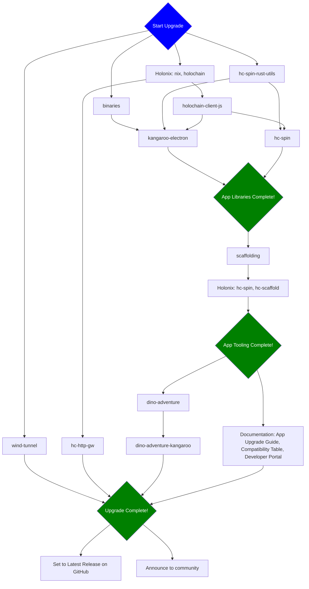

## Task Assignments

Assign people to be responsible for each stage in the release flow by replacing `@` with GitHub handles.

Assign one person to be responsible for the process overall, by assigning them to the ticket.

In the steps below the new holochain version number is referred to as 'X'.

### Stage 1

Assigned to @

- [ ] `binaries`
  - Update to the new holochain version.
  - Run the `Build` workflow with the option "Upload the build artifacts to the release" enabled.

- [ ] `wind-tunnel`
  - Update to use new holochain version.
  - Create new branch `main-X`.

- [ ] `hc-http-gw`
  - Update to use new holochain version.
  - Bump version and update README with compatibility info.
  - Create new branch `main-X`.

- [ ] Holonix
  - Update nix.
  - Bump `holochain`.
  - Create new branch `main-X`.

- [ ] `hc-spin-rust-utils`
  - Update to use new holochain version.
  - Bump version to `X00`.
  - Create new branch `holochain-X`.

### Stage 2

Assigned to @

- [ ] `holochain-client-js`
  - Update nix flake.
  - Update to use new holochain version.
  - Bump version and update README with compatibility info.
  - Create new branch `main-X`.
  - Manually publish to npm.
  - Manually create github release with changelog description.

### Stage 3

Assigned to @

- [ ] `hc-spin`
  - Update nix flake.
  - Update to use new holochain version.
  - Bump version to `0.Y00.0` mirroring holochain version `0.Y.0`.
  - Create new branch `main-X`.
  - Add tag `v0.Y00.0` matching bumped version.
  - Manually create github release at new tag with changelog description.
  - Manually publish to npm.

- [ ] `kangaroo-electron`
  - Update to use new holochain version.
  - Create new branch `main-X`.

**App Libraries Complete**

### Stage 4

Assigned to @

- [ ] `scaffolding`
  - Update crates to use new holochain version.
  - Update app templates to use new hdk & hdi versions.
  - Update project nix flake and app template nix flakes to use `holochain/holonix?ref=main-X` where `main-X` is the newly created holonix version branch.

### Stage 5

Assigned to @

- [ ] `holonix`
  - Pin `hc-scaffold` to new release tag.

**App Tooling Complete**

### Stage 6

Assigned to @

- [ ] `dino-adventure`
  - Update nix flake.
  - Update to use new holochain version.
  - Bump version.
  - Create new branch `main-X`.
  - Add tag `vY` for new version Y.
  - Manually create a github release at tag with changelog.

- [ ] Documentation
  - Write App Upgrade Guide for new holochain version.
  - Update Compatibility Table to add new tool versions compatible with new holochain version.
  - Update Developer Portal to use code examples and explanations for new holochain version.

### Stage 7

Assigned to @

- [ ] `dino-adventure-kangaroo`
  - Selectively merge changes from upstream repo, to use version compatible with holochain version.
  - Create new branch `main-X`.
  - Add tag `vY` for new version Y.

- [ ] Set to latest release on Github.

- [ ] Announce new release to community.

**Upgrade Complete**
