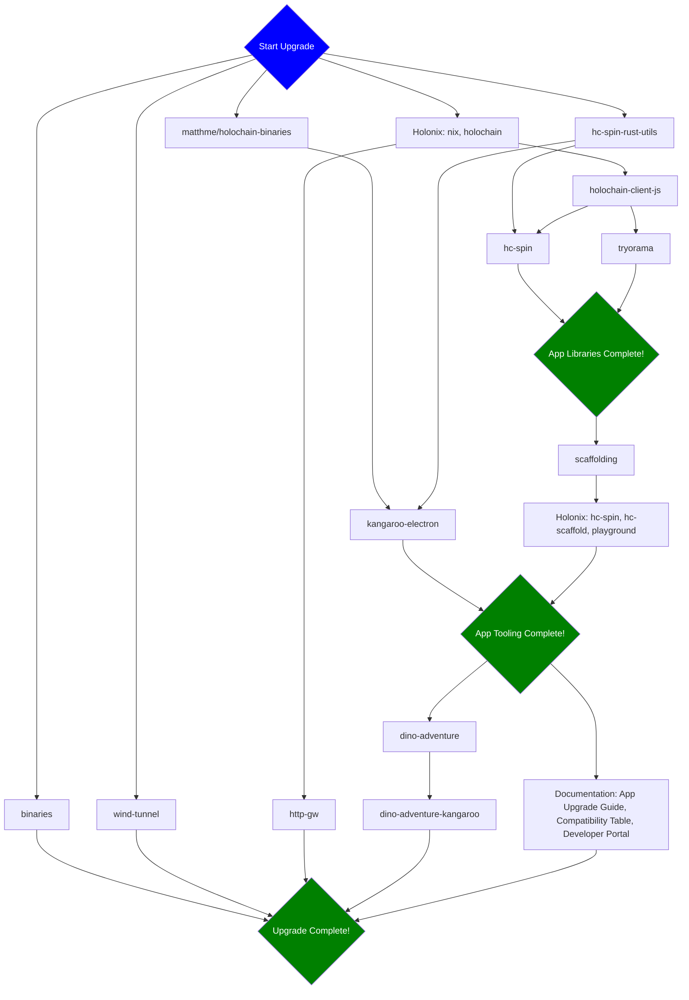

## Task Assignments

Assign people to be responsible for each stage in the release flow by replacing `@` with GitHub handles.

Assign one person to be responsible for the process overall, by assigning them to the ticket.

### Stage 1

Assigned to @

- [ ] binaries
- [ ] wind-tunnel
- [ ] matthme/holochain-binaries
- [ ] Holonix: nix, holochain
- [ ] hc-spin-rust-utils

### Stage 2

Assigned to @

- [ ] kangaroo-electron
- [ ] holochain-client-js 

### Stage 3

Assigned to @

- [ ] hc-spin
- [ ] tryorama

**App Libraries Complete**

### Stage 4

Assigned to @

- [ ] scaffolding

### Stage 5

Assigned to @

- [ ] holonix

**App Tooling Complete**

### Stage 6

Assigned to @

- [ ] dino-adventure
- [ ] Documentation: App Upgrade Guide, Compatibility Table, Developer Portal

### Stage 7

Assigned to @

- [ ] dino-adventure-kangaroo

**Upgrade Complete**
