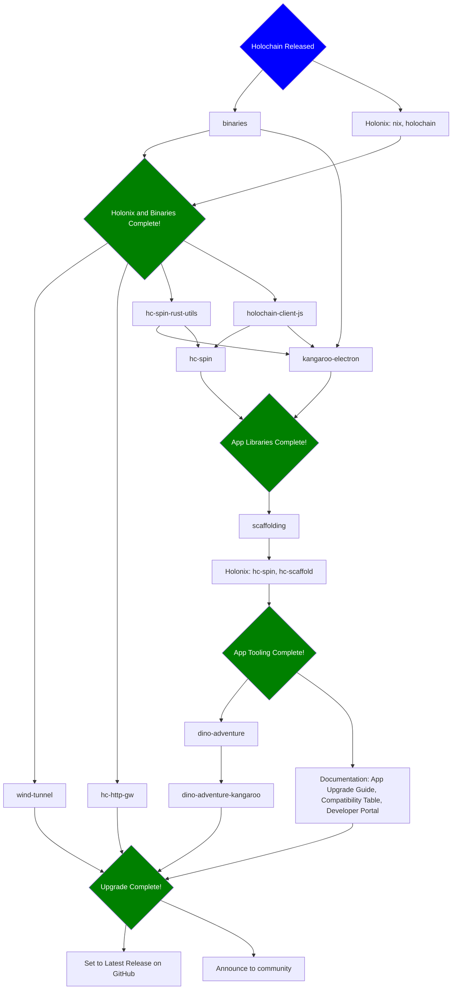

## Before you start

This issue can be created ahead of the Holochain release to plan the work
into a sprint. The downstream steps below assume the Holochain release has
already been done.

- [ ] Release Holochain by following the
      [release guide](https://github.com/holochain/holochain/blob/develop/docs/release/release.md).

In the steps below the new holochain version number is referred to as 'X'.
Steps marked `[optional]` are only needed when starting a new release
series (e.g. moving from `0.7.0-rc.5` to `0.7.0`), not for every release.
When creating a new `main-X` branch, also update `main` to point at the
upcoming version (e.g. `0.8.0-dev.0`).

```mermaid
flowchart TB
    %% Start flow
    Start{Holochain Released}

    Start --> Binaries[binaries]
    Start --> Holonix1[Holonix: nix, holochain]

    %% prerequisites for everything downstream
    Binaries --> Prereqs
    Holonix1 --> Prereqs
    Prereqs{Holonix and Binaries Complete!}

    Prereqs --> WindTunnel[wind-tunnel]
    Prereqs --> HttpGw[hc-http-gw]
    Prereqs --> HcSpinRustUtils[hc-spin-rust-utils]
    Prereqs --> JSClient[holochain-client-js]

    %% binaries
    Binaries --> Kangaroo[kangaroo-electron]

    %% wind-tunnel
    WindTunnel --> Complete

    %% hc-http-gw
    HttpGw --> Complete

    %% hc-spin-rust-utils
    HcSpinRustUtils --> Kangaroo
    HcSpinRustUtils --> HcSpin[hc-spin]

    %% holochain-client-js
    JSClient --> HcSpin
    JSClient --> Kangaroo

    %% hc-spin
    HcSpin --> AppLibsComplete

    %% kangaroo
    Kangaroo --> AppLibsComplete

    %% app libraries complete
    AppLibsComplete{App Libraries Complete!}
    AppLibsComplete --> Scaffold[scaffolding]

    %% scaffold
    Scaffold --> Holonix2[Holonix: hc-spin, hc-scaffold]

    %% holonix (again)
    Holonix2 --> AppToolsComplete{App Tooling Complete!}

    %% app tools complete
    AppToolsComplete --> DinoAdventure[dino-adventure]
    AppToolsComplete --> Documentation[Documentation: App Upgrade Guide, Compatibility Table, Developer Portal]

    %% dino-adventure
    DinoAdventure --> DinoKangaroo[dino-adventure-kangaroo]

    %% dino-adventure-kangaroo
    DinoKangaroo --> Complete

    %% documentation
    Documentation --> Complete

    %% complete
    Complete{Upgrade Complete!}
    Complete --> SetToLatestReleaseGH[Set to Latest Release on GitHub]
    Complete --> Announce[Announce to community]

    %% styling
    style Start fill:blue,color:white
    style Prereqs fill:green,color:white
    style Complete fill:green,color:white
    style AppLibsComplete fill:green,color:white
    style AppToolsComplete fill:green,color:white
```

## Releasing npm packages

Holochain's own crates are released with a similar automated workflow; see
[Release Holochain](https://github.com/holochain/holochain/blob/develop/docs/release/release.md)
above.

`holochain-client-js`, `hc-spin` and `hc-spin-rust-utils` are released with
shared automated workflows instead of manual publishing:

1. Run the `Prepare Release` workflow in the repo on the release branch
   (`main` or `main-X`). By default the next version is inferred from the
   Conventional Commits since the last release; use the `version` input to
   set an exact version instead (required for `hc-spin` and
   `hc-spin-rust-utils`, whose `0.X00.0` scheme mirrors holochain `0.X.0`).
2. The workflow opens a release PR with the version bump and changelog.
   Review and merge it.
3. Merging triggers the `Publish Release` workflow, which creates the git
   tag, publishes to npm (pre-releases are published under the `next` npm
   tag) and creates the GitHub release with the changelog notes.

No manual version bump, git tag, npm publish or GitHub release is needed
for these repos.

## Task Assignments

Assign people to be responsible for each stage in the release flow by replacing `@` with GitHub handles.

Assign one person to be responsible for the process overall, by assigning them to the ticket.

### Stage 1: Holonix and binaries

Almost everything downstream needs these, so do this stage first after the
Holochain release.

Assigned to @

- [ ] `binaries`
  - Check that the `Dispatch listener` workflow ran for the new holochain
    release tag and bumped `versions.json` on the right branch. If it did
    not, run it manually with the release tag.
  - Check that the `Build` workflow uploaded the binaries to the holochain
    GitHub release.

- [ ] Holonix
  - Update nix.
  - Bump `holochain`.
  - `[optional]` Create new branch `main-X`.

### Stage 2

Assigned to @

- [ ] `wind-tunnel`
  - Update to use new holochain version.
  - `[optional]` Create new branch `main-X`.

- [ ] `hc-http-gw`
  - Update to use new holochain version.
  - Bump version and update README with compatibility info.
  - `[optional]` Create new branch `main-X`.

- [ ] `hc-spin-rust-utils`
  - Update to use new holochain version.
  - `[optional]` Create new branch `main-X`.
  - Release to npm with version `0.X00.0`, following
    [Releasing npm packages](#releasing-npm-packages).

### Stage 3

Assigned to @

- [ ] `holochain-client-js`
  - Update nix flake.
  - Update to use new holochain version.
  - Update README with compatibility info.
  - `[optional]` Create new branch `main-X`.
  - Release to npm following
    [Releasing npm packages](#releasing-npm-packages).

### Stage 4

Assigned to @

- [ ] `hc-spin`
  - Update nix flake.
  - Update to use new holochain version.
  - `[optional]` Create new branch `main-X`.
  - Release to npm with version `0.X00.0`, following
    [Releasing npm packages](#releasing-npm-packages).

- [ ] `kangaroo-electron`
  - Update to use new holochain version.
  - `[optional]` Create new branch `main-X`.

**App Libraries Complete**

### Stage 5

Assigned to @

- [ ] `scaffolding`
  - Update crates to use new holochain version.
  - Update app templates to use new hdk & hdi versions.
  - Update project nix flake and app template nix flakes to use `holochain/holonix?ref=main-X` where `main-X` is the newly created holonix version branch.

### Stage 6

Assigned to @

- [ ] `holonix`
  - Pin `hc-scaffold` to new release tag.

**App Tooling Complete**

### Stage 7

Assigned to @

- [ ] `dino-adventure`
  - Update nix flake.
  - Update to use new holochain version.
  - Update npm deps.
  - Bump version.
  - `[optional]` Create new branch `main-X`.
  - Add tag `vY` for new version Y.
  - Manually create a github release at tag with changelog.

- [ ] Documentation (`docs-pages` repo)
  - Write or update App Upgrade Guide for new holochain version.
  - Update Compatibility Table to add new tool versions compatible with new holochain version.
    - `[optional]` For major releases, add a new compatibility table file and link from `pages/resources/compatibility/index.md`.
  - Update Developer Portal to use code examples and explanations for new holochain version.
    - Tip: search the repo for `TODO(upgrade)` -- this will help you discover places that need to be routinely updated for point releases or major releases.
  - Test all exercises in Getting Started guide (excluding initial Holonix installation).

### Stage 8

Assigned to @

- [ ] `dino-adventure-kangaroo`
  - Selectively merge changes from upstream repo, to use version compatible with holochain version.
  - `[optional]` Create new branch `main-X`.
  - Add tag `vY` for new version Y.

- [ ] Set to latest release on Github.

- [ ] Announce new release to community.

**Upgrade Complete**
