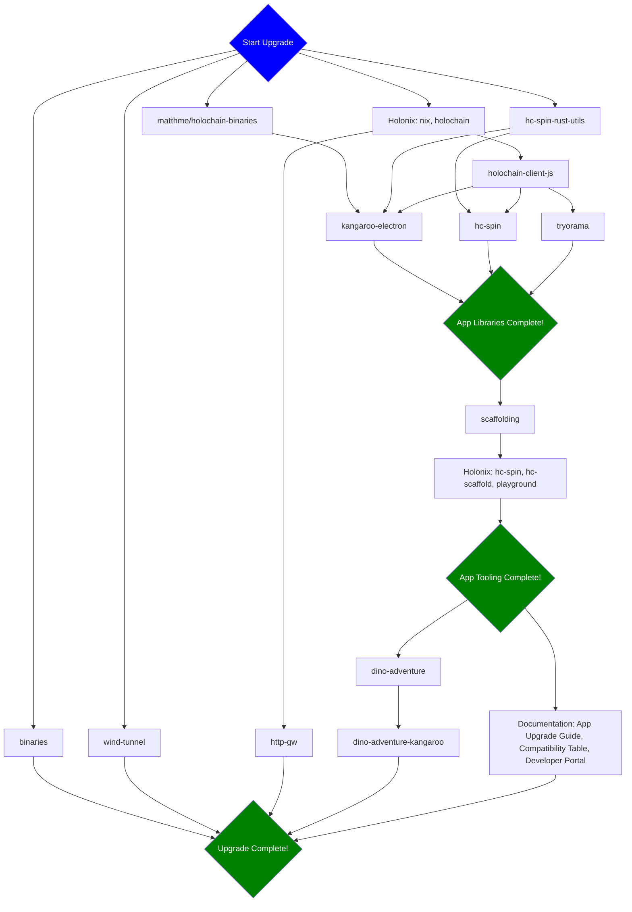

## Task Assignments

Assign people to be responsible for each stage in the release flow by replacing `@` with GitHub handles.

Assign one person to be responsible for the process overall, by assigning them to the ticket.

### Stage 1

Assigned to @

- [ ] `binaries`
    - Update to the new holochain version X.
    - Run the `Build` workflow with the option "Upload the build artifacts to the release" enabled.

- [ ] `wind-tunnel`
    - Update to use new holochain version X.
    - Create new branch `main-X` for the new holochain version X.

- [ ] `matthme/holochain-binaries`
    - Wait for hourly cronjob to run and confirm that it successfully published binaries.
- [ ] Holonix
    - Update nix.
    - Bump `holochain`.
    - Create new branch `main-X` for the new holochain version X.

- [ ] `hc-spin-rust-utils`
    - Update to use new holochain version X.
    - Bump version to `X00` mirroring holochain version `X`.
    - Create new branch `holochain-X` for the new holochain version X.

### Stage 2

Assigned to @

- [ ] `holochain-client-js`
    - Update nix flake.
    - Update to use new holochain version X.
    - Bump version and update README with compatability info.
    - Create new branch `main-X` for the new holochain version X.
    - Manually publish to npm.
    - Manually create github release with changelog description.

### Stage 3

Assigned to @

- [ ] `hc-spin`
    - Update nix flake.
    - Update to use new holochain version X.
    - Bump version to `0.Y00.0` mirroring holochain version `0.Y.0`.
    - Create new branch `main-X` for the new holochain version X.
    - Add tag `v0.Y00.0` matching bumped version.
    - Manually create github release at new tag with changelog description.
    - Manually publish to npm.

- [ ] `tryorama`
    - Update nix flake.
    - Update to use new holochain version X.
    - Bump version and update README with compatability info.
    - Create new branch `main-X` for the new holochain version X.
    - Add tag `vY` for newly bumped version Y.
    - Manually create github release at new tag with changelog description.
    - Manually publish to npm.

- [ ] `kangaroo-electron`
    - Update to use new holochain version X.
    - Create new branch `main-X` for the new holochain version X.

**App Libraries Complete**

### Stage 4

Assigned to @

- [ ] `scaffolding`
    - Update crates to use new holochain version.
    - Update app templates to use new hdk & hdi versions.
    - Update project nix flake and app template nix flakes to use `holochain/holonix?ref=main-X` where `main-X` is the newly created holonix version branch.

### Stage 5

Assigned to @

- [ ] `holonix`
    - Pin `hc-scaffold` to new release tag.
    - Pin `playground` to new release tag.

**App Tooling Complete**

### Stage 6

Assigned to @

- [ ] `dino-adventure`
    - Update nix flake.
    - Update to use new holochain version X.
    - Bump version.
    - Create new branch `main-X` for the new holochain version X.
    - Add tag `vY` for new version Y.
    - Manually create a github release at tag with changelog.

- [ ] Documentation
    - Write App Upgrade Guide for new holochain version X.
    - Update Compatibility Table to add new tool versions compatible with new holochain version X.
    - Update Developer Portal to use code examples and explanations for new holochain version X.

### Stage 7

Assigned to @

- [ ] `dino-adventure-kangaroo`
    - Selectively merge changes from upstream repo, to use version compatible with holochain version X.
    - Create new branch `main-X` for the new holochain version X.
    - Add tag `vY` for new version Y.

**Upgrade Complete**
