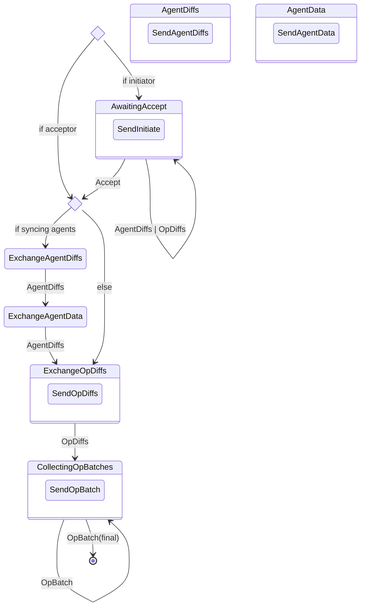

<!-- ## recent
*TODO* -->

## historical

```mermaid
stateDiagram-v2

state start_choice <<choice>>
state agents_choice <<choice>>

start_choice --> AwaitingAccept: if initiator
start_choice --> agents_choice : if acceptor


AwaitingAccept --> agents_choice: Accept
AwaitingAccept --> AwaitingAccept: AgentDiffs | OpDiffs

agents_choice --> ExchangeAgentDiffs: if syncing agents
agents_choice --> ExchangeOpDiffs: else

ExchangeAgentDiffs --> ExchangeAgentData: AgentDiffs
ExchangeAgentData --> ExchangeOpDiffs: AgentDiffs


ExchangeOpDiffs --> CollectingOpBatches: OpDiffs

CollectingOpBatches --> CollectingOpBatches: OpBatch
CollectingOpBatches --> [*]: OpBatch(final)

state AwaitingAccept {
    SendInitiate
}


state CollectingOpBatches {
    SendOpBatch
}

state ExchangeOpDiffs {
    SendOpDiffs
}

state AgentDiffs {
    SendAgentDiffs
}

state AgentData {
    SendAgentData
}


```