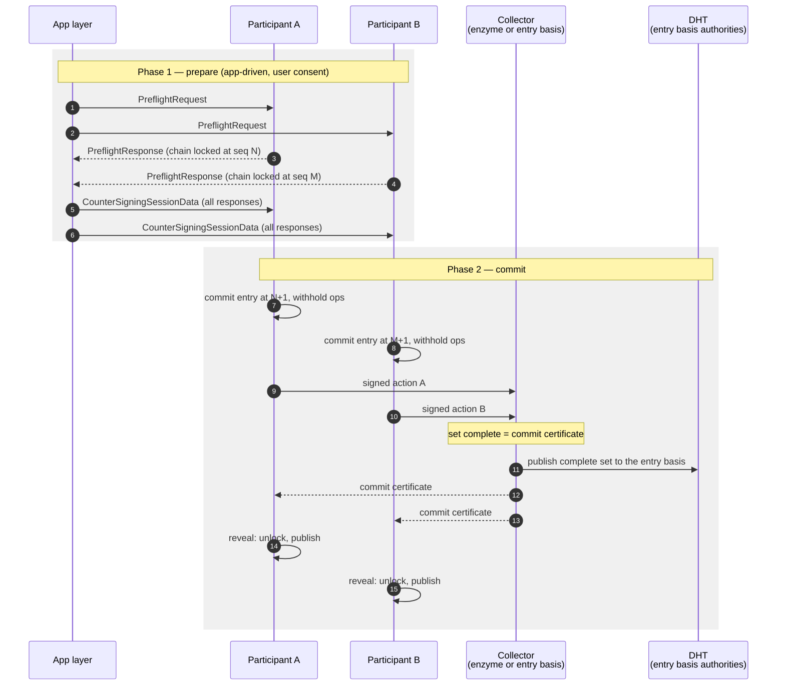
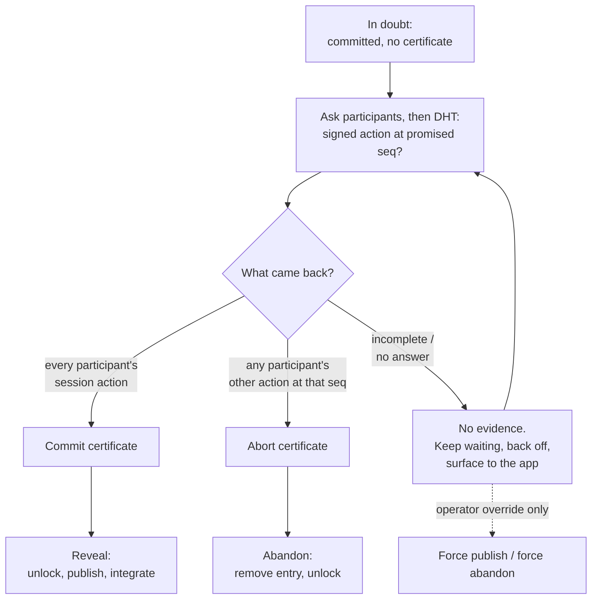

# Countersigning Design

## Status

**Draft / proposed.** This document describes **countersigning**: the mechanism
by which two or more agents write the same entry to their own source chains as a
single atomic act, so that the entry appears on every participant's chain or on
none of them.

Countersigning already exists in Holochain behind the `unstable-countersigning`
feature. This document is the first design record for it. It therefore serves two
purposes:

1. Describe the mechanism as a whole, for a reader who does not know the code.
2. Describe the changes needed to make it correct.

It is written as a single coherent design of the **intended** state. Where the
current implementation differs, that is called out explicitly in
[Current implementation](#current-implementation) and in the per-change sections,
so the document can also be read as a work plan.

The changes are not a rewrite. The existing protocol is already a two-phase
commit; it is missing the durability and the decision rules that make two-phase
commit safe, and it lets participants decide session outcomes from no evidence,
which manufactures the failures it then tries to recover from.

## Terminology

- A **countersigning session** is one attempt by a fixed set of agents to write
  one shared entry to all of their chains at the same time.
- A **participant** is an agent who will write the entry to their own chain and
  sign it. Every participant is named in the session, and every participant's
  signature is required.
- The **preflight request** is the description of the session: the app entry
  hash, the participants, the session times, the shared action fields, and
  app-supplied bytes. It is created once and is identical for every participant.
  Its BLAKE2b hash is the session's **fingerprint**.
- A **preflight response** is a participant's signed statement that it has frozen
  its chain at a stated head and sequence number, and will write the session
  entry at the next sequence number. Returning one is the act of joining a
  session.
- The **session data** (`CounterSigningSessionData`) is the preflight request
  plus every participant's preflight response. It is the content of the
  countersigned entry, so **the entry embeds every participant's signed promise**.
- The **action set** is the set of actions the session data implies: one per
  participant, each fully determined by the session data. Every participant can
  compute every other participant's action hash without talking to anyone.
- A **collector** is the agent or agents that gather participants' signed actions
  and hand the assembled set back. Two modes exist:
  - **Enzymatic**: a single named participant (index 0 of the participant list),
    called the **enzyme**, collects.
  - **Non-enzymatic**: the DHT authorities for the session entry's basis collect.
    This is a neighbourhood, not a named list, and it is deliberately so.
  This document uses *collector* when the distinction does not matter, and
  *witness* interchangeably with the non-enzymatic collector, matching the code
  (`witnessing_workflow`).
- The **chain lock** is a per-agent record that freezes the agent's source chain
  for one session fingerprint. While it is held, nothing but the session entry may
  be written.
- A **commit certificate** and an **abort certificate** are the two pieces of
  evidence that decide a session's outcome. They are defined in
  [The two certificates](#the-two-certificates) and are the core of this design.

## Motivation

Holochain is an eventually consistent system. There is no global ordering, no
quorum, no view of "the network" that any agent can rely on. Agents learn what
is true by asking peers, and a peer that does not answer has told them nothing.

Countersigning is the one place in Holochain that needs a stronger property:
**atomicity across several agents' chains**. A mutual credit transfer, a
two-party agreement, a swap — these are only meaningful if it is impossible for
one side's chain to record the deal while the other side's does not.

The existing implementation reaches for that property but does not achieve it. In
real use it fails often, and under load — where session timeouts bind — it fails
most of the time. The failures are not all benign: a session can end with one
participant having committed and published while another has abandoned, which is
exactly the outcome the mechanism exists to prevent.

The root cause is a category error. The current protocol asks each participant to
*infer* the session outcome, largely from what DHT authorities do or do not say,
and to *decide* for itself when a timer expires. Neither inference nor timers can
establish agreement. Reading from authorities is not consensus; the absence of a
response is not evidence.

The fix is not to add consensus. It is to notice that **the participants already
hold all the evidence that is needed**, because everything that matters is
signed, and to make the protocol collect and serve that evidence rather than
guess at it.

## What countersigning guarantees

**Guaranteed.**

- **No participant's chain records the session unless every participant signed
  it.** A participant only reveals its committed entry once it holds every other
  participant's signature over their own action.
- **No partial session is visible in the DHT.** System validation of a
  countersigned entry op requires *every* action in the action set to be present
  locally before the op progresses. All participants' entry ops share one basis,
  so an authority never integrates a partial set. This holds today and is load
  bearing for the design.
- **A participant cannot be committed twice.** The chain lock reserves exactly
  one sequence number for one fingerprint.
- **Divergence requires a provable fault.** If two participants reach different
  outcomes, some participant provably contradicted itself. See
  [Fork safety](#fork-safety).

**Not guaranteed.**

- **Liveness.** A participant that has committed and whose peers vanish is
  blocked until evidence arrives, an operator intervenes, or forever. This is
  inherent to two-phase commit and is accepted deliberately; see
  [Why blocking is the right trade](#why-blocking-is-the-right-trade).
- **Bounded latency.** A session may complete long after `session_times.end`.
  Session times bound one thing only, described in
  [The one deadline](#the-one-deadline).
- **Protection from a peer who simply never joins.** Countersigning makes
  agreement atomic; it cannot make an unwilling agent agree.

## Protocol

### Phase 1 — prepare

Phase 1 is driven by the **application**, not the conductor. One agent composes a
`PreflightRequest` and distributes it to the other participants by whatever means
the app uses — usually remote signals or zome calls. Each participant decides
whether to join.

This is deliberate and is not changed by this design. Joining a session freezes
the agent's chain and commits them to content, so it is a decision a *user*
makes, not one the conductor makes on their behalf because validation happened to
pass. Headless agents can automate it; the general case cannot.

A participant joins by calling `accept_countersigning_preflight_request`, which:

1. Takes the chain lock, with `subject = fingerprint(preflight_request)`.
2. Records the frozen chain head and sequence number as a
   `CounterSigningAgentState`.
3. Signs `(request, agent_state)` and returns it as a `PreflightResponse`.

Returning that response is **the prepare vote**. From that moment the agent has
told the world it will write the session entry at sequence `N+1`, and other
participants may build on that promise.

The initiator gathers all responses, assembles the `CounterSigningSessionData`,
and distributes it back — again at the app layer.

Because every participant's response is required, and because a participant's
frozen chain state cannot change while the lock is held, **the session data is
uniquely determined by the preflight request**. There is exactly one possible
countersigned entry per fingerprint. (This is only true once M-of-N optional
signers are removed; see [change 6](#6-drop-m-of-n-optional-signers).)

### Phase 2 — commit

Each participant calls a zome function that creates the entry with the session
data. Inside the call zome workflow this:

1. Builds the participant's action — fully determined by the session data, with
   timestamp `session_times.start + SESSION_ACTION_TIME_OFFSET`, `prev_action` and
   `action_seq` from the participant's own frozen state.
2. Runs system and app validation inline.
3. Writes the record to the chain and marks its ops **withheld from publish**.
4. Sends the entry op to the collector.

The participant is now **committed**: the entry is on its chain, its signature has
left the machine, and its ops are held back. It is waiting for a certificate.

The collector gathers actions until it holds the complete action set, then pushes
the assembled set back to every participant.

On receiving a complete, valid set, a participant **reveals**: releases the chain
lock, clears the withhold flag, triggers integration and publish.



### The two certificates

A session ends when a participant holds one of exactly two artefacts. Both are
**self-certifying**: they can be verified from signatures alone, by anyone,
without trusting whoever handed them over.

**Commit certificate** — the complete set of participants' signed actions for the
session.

- Unforgeable: it contains every participant's signature over their own action.
- Non-equivocal: the action set is a function of the session data, which is a
  function of the fingerprint. There is one possible commit certificate.
- Nobody outside the participant set contributes to it. The collector's signature
  is not part of it and is not wanted.

**Abort certificate** — any single participant's signed action at the sequence
number that participant promised, which is *not* that participant's session
action.

- Unforgeable: it is signed by that participant.
- Conclusive: a source chain is a total order. If participant `X` has a different
  action at seq `N+1`, `X` can never also place the session action there without
  forking its own chain. So no commit certificate can exist unless `X` is
  provably faulty.
- **One is enough.** A single participant declining ends the session for everyone.

The essential property is the **asymmetry**: a commit needs every participant, an
abort needs one. And the essential consequence is that **no third party is ever
trusted**. A collector, a DHT authority, and a random peer are all equally
untrusted; they are transports for evidence that verifies itself.

This is why no quorum is required. There is nothing for a quorum to decide.
Quorums exist to make a *decision* singular when the deciders could disagree.
Here, the decision is not made by anyone — it is a fact about which signatures
exist, and both possible facts are self-proving. See
[Rejected alternatives](#rejected-alternatives) for the quorum design that was
considered and why it turned out to be unnecessary.

### Recovery

A participant that has committed and has not received a certificate is *in
doubt*. It does not guess. It goes looking for one of the two certificates, and
it only ever acts on positive evidence.

The single question it asks is the same in every case: **"what is the signed
action at the sequence number you promised?"** The answer is a certificate
fragment either way — the session action contributes to a commit certificate, and
anything else *is* an abort certificate.

Sources, cheapest first:

1. **The other participants.** They are named in the session data. Ask each
   directly. A committed participant returns its signed action; an abandoned one
   returns whatever it wrote instead.
2. **The DHT, for a commit certificate.** `get_details` on the session entry hash
   returns every action recorded against that entry. Once the collector has
   published the complete set, this is a durable, replicated commit certificate.
3. **The DHT, for an abort certificate.** `get_agent_activity` for a specific
   participant at the promised sequence number.
4. **The collector**, which may hold a partial set. A partial set is not
   evidence of anything and is used only as a shortcut to a complete one.



Absence is never an input. "No answer", "authority returned nothing", and "the
peer is offline" all mean the same thing: keep waiting.

### The one deadline

`session_times.end` retains exactly one meaning:

> It is the deadline by which a participant that has **prepared but not
> committed** is released from its promise.

Such a participant has frozen its chain and returned a signed response, but has
never received the assembled session data, so it holds nothing it could commit.
After `session_times.end` it releases the lock and is free. When it next writes
anything at the promised sequence number, that action becomes the abort
certificate for everyone else.

It is **not**:

- a deadline for a committed participant — that participant waits for a
  certificate, with no time limit;
- a deadline for the collector's decision — the collector makes no decisions;
- a validity constraint at validation time. Nothing in system validation compares
  session times against the wall clock, so a session may legitimately complete
  long after it "ended". This is already true today and the design depends on it.

Clock skew is therefore harmless. A participant that has not committed cannot
appear in a commit certificate, so no amount of skew can produce two conflicting
certificates.

## Why this is two-phase commit

Mapping the protocol onto textbook 2PC:

| 2PC | Countersigning |
| --- | --- |
| Prepare / vote-yes | `accept_countersigning_preflight_request`: chain locked, signed `PreflightResponse` returned |
| Prepared state | Chain locked at seq `N+1`, entry committed, ops withheld |
| Coordinator | Collector — but *only as a transport*, holding no authority |
| Commit decision | Commit certificate: the complete signed action set |
| Abort decision | Abort certificate: one participant's other action at its promised seq |
| Decision durability | The DHT (entry basis for commit, agent activity for abort) plus the participants themselves |
| Prepared participant must not decide alone | Enforced: committed participants never act on a timer |

The one meaningful departure from textbook 2PC is that **the coordinator is not
trusted and not required**. In a database, the coordinator's decision *is* the
outcome, which is why coordinator failure is 2PC's classic weakness. Here the
outcome is a fact about signatures that the participants collectively hold, so
the coordinator can be Byzantine, absent, or replaced mid-session without
affecting safety. It only affects how quickly participants find out.

### Why blocking is the right trade

Two-phase commit blocks: a prepared participant that cannot learn the decision
must wait. That is normally a serious cost, because in a database a prepared
transaction holds locks that block *everyone*.

Here, the only thing held is **that one agent's own source chain**. No other
agent's progress depends on it. The chain lock is already the semantics of
joining a session. So 2PC's canonical weakness is largely priced in already, and
buying non-blocking behaviour — which is what a real consensus protocol would
sell — would be paying a very high price for very little.

The residual cost is real and must be handled honestly: a blocked chain is an
unusable cell for that app. That is why blocking is a **first-class,
app-visible state** with an operator escape hatch, rather than something the
conductor hides behind a retry counter.

## Current implementation

What exists today, and where it departs from the above. Code references are to
`crates/holochain/src/core/workflow/`.

**What already works and is kept:**

- Phase 1, exactly as described (`countersigning_workflow/accept.rs`).
- The chain lock reserving one sequence number per fingerprint.
- Withholding ops until reveal.
- Both collector modes: `countersigning_publish` sends to the named enzyme, or
  publishes to the entry basis (`countersigning_workflow.rs`).
- The collector assembling a complete action set and pushing it back
  (`witnessing_workflow.rs`), and participants verifying it against the action set
  they compute themselves (`countersigning_workflow/complete.rs`).
- System validation refusing to integrate a partial action set.
- Recovery *by positive evidence*: `countersigning_workflow/incomplete.rs`
  already treats "participant `X` has the session entry at the promised seq" as a
  commit fragment and "participant `X` has something else there" as abandonment.
  This is the right idea and survives.

**Defects.**

1. **The collector's state is not durable.** `WitnessingWorkspace` is an
   in-memory `HashMap` (`witnessing_workflow.rs`). A restart loses every pending
   session. Complete sessions are dropped once `session_times.end` passes.

2. **Committed participants decide on a timer.** `apply_timeout` moves a
   committed session to `Unknown`; `try_recover_failed_session` retries recovery a
   configured number of times and then calls `force_abandon_session`
   (`countersigning_workflow.rs`). Abandoning because a counter ran out is a
   decision made from no evidence. This is the central unsound step, and it is
   what turns an ordinary lost message into a chain fork: the abandoning
   participant's signed session action has already been published to its agent
   activity authority by a peer that revealed, so writing something else at that
   sequence number leaves two actions at one sequence. The publishing is not the
   defect — deciding without evidence is. See
   [Rejected alternatives](#rejected-alternatives).

3. **Abort requires unanimity, so it is nearly unreachable.**
   `incomplete.rs` only abandons when *all* other participants are seen to have
   abandoned. One participant declining is already conclusive, so this is far
   stricter than necessary; in sessions of more than two it collapses almost
   everything into `Indeterminate`, which then feeds defect 2.

4. **Participants never ask each other.** Recovery only queries agent activity
   authorities, never the participants themselves, even though the participants
   are named in the session data and are the actual holders of the evidence.

5. **The collector never publishes the complete set.** It pushes the bundle to
   participants and, for non-enzymatic sessions, feeds its own validation
   pipeline — but it does not put the assembled set where a participant that
   missed the push could later find it.

6. **The chain lock expires.** `ChainLock` carries `expires_at_timestamp`, and
   `acquire_chain_lock` will steal an expired lock for a different subject.
   A lock that can expire cannot support indefinite waiting. (`get_chain_lock`
   currently reads with `Timestamp::MIN`, so the read path already ignores expiry;
   the field is inconsistently honoured.)

7. **M-of-N optional signers break the "one session per fingerprint" property.**
   With `optional_signing_agents` and `minimum_optional_signing_agents`, the
   initiator can assemble different subsets from the same request, producing
   different entry hashes that both embed the same participant's promise.

8. **Workspace state is not derivable from the database.**
   `CountersigningSessionState::SignaturesCollected` and `::Unknown` carry
   retry counters and collected bundles that exist only in memory, so
   `refresh.rs` has to reconcile them against the database after a restart, with
   several genuinely ambiguous cases.

## Design changes

Ordered by value against cost. Changes 1–4 are small and independently
useful; each of 1, 2 and 3 can land on its own and each removes real failures.
Change 1 is the one that must land: everything else is either evidence
plumbing or cleanup.

### 1. Committed participants never decide on a timer

- Remove the `Accepted → Unknown` and `SignaturesCollected → Unknown`
  transitions driven by `session_times.end` for **committed** sessions.
- Remove `countersigning_resolution_retry_limit` as a trigger for
  `force_abandon_session`. Retry limits may still govern *backoff*; they must not
  govern outcomes.
- Keep the existing `Accepted` + not-committed timeout. That branch is correct as
  written and becomes [the one deadline](#the-one-deadline).

### 2. One abort certificate is enough

In `incomplete.rs`, replace the "all other participants abandoned" condition with
"**any** participant has a non-session action at its promised sequence number".
Delete `SessionCompletionDecision::Indeterminate` as an input to any decision —
it becomes simply "keep waiting".

Also delete the `NUM_AUTHORITIES_TO_QUERY` agreement logic. Asking three
authorities and requiring them to agree is an attempt to make an unreliable
signal reliable. The signal is not needed: a single self-certifying action from
a single source is conclusive, and no number of non-answers ever is.

This is a net **deletion** of logic. `incomplete.rs` shrinks from decision
inference to certificate collection.

### 3. Participants serve each other's actions

Add one network request, participant to participant:

> For session fingerprint `F`, return your signed action at the sequence number
> you promised in your preflight response.

Three possible replies: the session action, some other action, or "not yet
decided". The first two are certificate fragments; the third is not evidence and
is treated as no answer.

This is the change that makes the collector non-essential. If every participant
committed but the collector died holding a partial set, the participants can
assemble the certificate among themselves.

### 4. The collector publishes the complete set

When a collector assembles a complete action set, it publishes every
participant's entry-basis op to the session entry's basis, in addition to pushing
the bundle to participants. The enzyme does this too, even though it is not
normally an authority.

Once integrated, the entry basis holds a complete, replicated, durable commit
certificate that any participant can pull with `get_details`. This is what makes
the certificate outlive the collector without requiring the collector to
persist anything.

Note that this makes the entry public as soon as the set is complete, before
participants reveal. That is not a change in exposure: the set cannot be complete
unless every participant has already signed, and signing is consent.

### 5. Chain lock has no expiry

Replace `ChainLock.expires_at_timestamp` with `acquired_at_timestamp`. The
timestamp is diagnostic — it tells an operator and the app how long a session has
been blocking — and is never a release condition.

A lock is released by exactly three things:

1. Revealing on a commit certificate.
2. Abandoning on an abort certificate, or on the prepare deadline while not
   committed.
3. An explicit operator override.

`acquire_chain_lock` no longer steals expired locks; re-acquisition remains
possible only for the same subject. `prune_expired_chain_locks` is removed.

### 6. Drop M-of-N optional signers

Remove `optional_signing_agents`, `minimum_optional_signing_agents`, and the
`check_enzyme` rules that tie them to the enzyme. `enzymatic` stays — it selects
the collector, and both collector modes are retained.

The feature was added speculatively and is not known to be in use. It is
incompatible with the property this design leans on hardest: that a fingerprint
determines exactly one session, one entry hash, and one action set. With subsets
allowed, the same signed promise can appear in two different sessions, each
needing a different set to complete, and a participant can only satisfy one.

Dropping it is a breaking change to `PreflightRequest` behind an unstable
feature.

### 7. Collector durability (optional)

Persisting the collector's partial sets across a restart is worthwhile but is now
an **optimisation**, not a safety requirement — safety comes from changes 2–4.
It shortens recovery in the common "collector restarted mid-session" case.

If implemented, see [Storage](#storage).

### 8. Session state becomes derivable from the database

With bundles no longer accumulated in memory and retry counters no longer
affecting outcomes, the session state is a function of persisted state alone:

| Chain lock | Chain head | State |
| --- | --- | --- |
| none | — | no session |
| held | not the session entry | `Accepted` |
| held | the session entry | `Committed` |

`CountersigningSessionState` collapses to those two variants plus the
information an app needs about progress. `Unknown` disappears — there is no
longer a state in which the conductor does not know what to do; there is only
"waiting for a certificate". `refresh_workspace_state` reduces to reading the
lock and the head, and restart becomes free.

## Fork safety

The design's safety claim is:

> Two participants reach different outcomes only if some participant provably
> contradicted itself.

Argument. A participant reveals only on a commit certificate, which contains
every participant's signed session action. A participant abandons only on an
abort certificate, which is some participant `X`'s signed non-session action at
`X`'s promised sequence number. For both to exist, `X` must have signed two
different actions at the same sequence number — a chain fork by `X`, which is
exactly the fault Holochain already detects and warrants.

Note what the argument does *not* need. It does not need participants to
withhold each other's ops, and it does not need any special handling of
countersigning actions by fork detection. It needs only that no participant
decides an outcome without a certificate.

Two consequences worth stating.

**A committed participant's signed action escapes before the outcome is known.**
A participant sends its action to the collector at commit time, and a revealing
peer publishes it onward. So an abandoning participant's session action may
already be in the DHT while its own chain carries something else at that
sequence number.

In an honest run this cannot happen. A participant only abandons on an abort
certificate, an abort certificate means no commit certificate exists, and no
commit certificate means no peer ever revealed and published that action. The
action reaches only collectors, where it is session state, not a chain claim.
The two conflicting claims never coexist.

**When they do coexist, a participant is genuinely at fault — and it may not be
the one who looks it.** If participant `X` signs both its session action and
something else at its promised sequence number, `X` has forked its chain and is
warrantable on `X`'s own two actions. But `X`'s fork can also strand an honest
participant `B`: `B` abandons on `X`'s abort certificate while a third
participant reveals on a commit certificate containing `B`'s action, leaving
`B`'s chain conflicting with published data through no fault of its own.

That outcome is accepted rather than prevented. `B` holds `X`'s abort
certificate as exculpatory evidence, but the protocol has no way to present it,
and `B`'s chain still needs repair. Both are open questions:

- whether an agent can present a countersigning abort certificate as a defence
  against a fork warrant;
- what repair path a stranded participant has.

Preventing it instead would mean forbidding abandonment after commit, which
turns every abort into an indefinite block. The design takes attributable
damage caused by a provably faulty peer over guaranteed deadlock caused by an
honest one.

## Session state and app-facing API

The app must be able to see that a cell is blocked, and why. Blocking is not
hidden.

`AppRequest::GetCountersigningSessionState` returns:

- `Accepted { preflight_request, deadline }` — prepared, not committed, will be
  released at the deadline if the session data does not arrive.
- `Committed { preflight_request, committed_at, participants_confirmed,
  participants_total, last_attempt_at }` — committed, waiting for a certificate,
  no deadline. `participants_confirmed` reports how many participants' actions
  are held so far, which is the honest answer to "how stuck am I".

System signals `SuccessfulCountersigning` and `AbandonedCountersigning` are
unchanged. A signal on entering `Committed` is added so a UI can tell the user
their chain is blocked without polling.

`AbandonCountersigningSession` and `PublishCountersigningSession` are kept as
**operator escape hatches**. Their precondition changes from "at least one
automatic resolution attempt has been made" to "the session is `Committed` and no
certificate has been obtained". Their documentation must say plainly that they
override the safety property: force-abandon can fork the caller's chain against a
session that completed, and force-publish can leave an entry that never
integrates. They exist for the case where the peers are gone for good.

## Storage

**Which database.** The `Dht` per-DNA database (`crates/holochain_data`,
`DbKind::Dht`), as a new table. Not a new database kind: `ChainLock` and the
countersigning session removal path already live there, a new kind would add a
migration set and connection pool for a handful of rows, and — decisively —
collector state must be written in the same transaction as op and limbo writes.
Cross-database atomicity is not available.

The table is only needed for [change 7](#7-collector-durability-optional).
Sketch, following the conventions in the existing DHT schema:

```sql
-- A countersigning session this conductor is collecting actions for, either as
-- the named enzyme or as an authority for the session entry's basis.
CREATE TABLE CollectedSession (
    session_entry_hash  BLOB    PRIMARY KEY,
    fingerprint         BLOB    NOT NULL,  -- preflight request fingerprint
    entry_blob          BLOB    NOT NULL,  -- Entry::CounterSign (the session data)
    participant_count   INTEGER NOT NULL,
    session_end         INTEGER NOT NULL,  -- session_times.end
    retain_until        INTEGER NOT NULL
) STRICT, WITHOUT ROWID;

-- One participant's signed action for a session being collected.
CREATE TABLE CollectedSessionAction (
    session_entry_hash  BLOB    NOT NULL,
    author              BLOB    NOT NULL,
    action_hash         BLOB    NOT NULL,
    action_blob         BLOB    NOT NULL,  -- SignedAction
    received_at         INTEGER NOT NULL,
    PRIMARY KEY (session_entry_hash, author),
    FOREIGN KEY (session_entry_hash) REFERENCES CollectedSession(session_entry_hash)
) STRICT, WITHOUT ROWID;
```

Primitive access goes in `holochain_data`; a store-style API over it goes in
`holochain_state`, per the crate layering.

**Admission rules**, because this is state a stranger can ask us to keep:

- Accept only for a session whose entry basis is within our storage arc, or where
  we are the named enzyme.
- Verify before storing: the session data's preflight response signatures are
  valid, the author is a listed participant, and the action matches the action
  set computed from the session data.
- Reject sessions whose `session_times` have already ended.
- Cap rows per author.

An attacker must therefore produce a fully signed, self-consistent session before
we store a single row.

**Retention.** `retain_until = session_end + tail`. Rows may be dropped as soon as
the set is complete and its ops have integrated, because the entry basis then
holds the certificate. The tail exists only to serve participants who have not yet
pulled.

## Offline friendliness

Nothing in this design requires the network to make progress locally.

- A participant that already holds a commit certificate reveals, unlocks, and
  publishes without asking anyone; publish is retried by the normal publish
  workflow whenever connectivity returns.
- A participant in doubt waits. It is not forced into an outcome because it
  cannot reach peers — which is a real improvement over the current retry-limit
  behaviour, where a partitioned agent eventually abandons a session that in fact
  completed.
- Recovery treats "no answer" identically to "not asked". A partitioned agent
  simply stays blocked, visibly, with an operator override available.

The trade is explicit: **offline agents block rather than diverge.**

## Failure modes and expected effect

Honest accounting of what changes.

| Failure class | Today | After |
| --- | --- | --- |
| Bundle push lost, peer briefly offline | Session times out, recovery guesses, may abandon a completed session | Certificate pulled from a participant or the DHT; session completes late |
| Conductor restart mid-session | Collector state lost; participant state partially reconstructed | Collector state irrelevant to safety; participant state derived from lock + head |
| Collector dies holding a partial set | Session lost | Participants assemble the certificate among themselves |
| One participant never joins | Times out; other participants may diverge | Prepare deadline releases them; their next action is the abort certificate |
| One participant vanishes after committing | Retry limit expires, force abandon, possible fork | Blocks. Visible to the app; operator override available |
| Load / timeout pressure | Sessions fail | Sessions complete **late**; chains stay locked longer |
| Byzantine collector | Can strand a session | Cannot forge or equivocate; can only delay |
| Participant forks its own chain at the promised seq | Indistinguishable from ordinary failure | Warrantable on its own two actions; may still strand an honest participant — see [Fork safety](#fork-safety) |

Two expectations to set before anyone runs the performance suite:

- **Forks should go to approximately zero**, given changes 1 and 2 together.
- **Throughput-oriented numbers will not improve, and may look worse.** Sessions
  that used to fail at the timeout now complete late, so tail latency rises and
  chains stay locked longer. That is the trade being made deliberately:
  availability failures become latency, and correctness failures stop happening.
  Measuring this change with a metric that counts a fast failure as better than a
  slow success will report a regression.

## Rejected alternatives

**Optimistic countersigning — no collector, no withholding.** Participants commit
and publish immediately; the DHT's existing rule that a partial action set never
integrates provides atomicity of the *shared* view. This removes every failure
mode in this document.

Rejected because it removes the actual guarantee. The point of countersigning is
"do not put this on my chain unless the others agree". Optimistic commit puts it
on the chain first and finds out afterwards, leaving entries that are locally
real but globally invisible, which local app validation cannot distinguish from
committed ones. It also has no clean way to declare a session dead: a straggler
committing much later would turn a long-dormant entry real.

**One-shot quorum among collectors.** Fix a witness set in the signed preflight
request, set `Q = floor(N/2) + 1`, and require a quorum attestation on *both*
decisions so that quorum intersection prevents conflicting certificates, with
equivocation provable and warrantable. The enzyme is then the degenerate `N = 1`
case.

Rejected as unnecessary rather than wrong. A quorum makes a *decision* singular
when the deciders could disagree. Once abort is defined as a participant's own
signed chain action, both outcomes are facts about participant signatures, no
third party decides anything, and there is nothing for a quorum to be quorate
about. It would also require replacing the entry-basis neighbourhood with a named
witness set, which is a deliberate property of the current design.

**Named witness set instead of the entry-basis neighbourhood.** Considered as
part of the quorum design and dropped with it. The neighbourhood is intentional
and, once the collector holds no authority, its churning and view-dependent
membership costs nothing: it affects who might relay evidence, never what is
true.

**Suppressing publication of other participants' agent activity ops.** On
reveal, a participant publishes every other participant's ops, including the
`ChainOp::AgentActivity` op that lands at that participant's own activity
authority. Removing the agent activity part was considered, on the grounds that
it is the step which delivers both halves of a conflicting-sequence-number claim
to the one authority whose job is to detect forks.

Rejected. It treats a symptom of deciding without evidence, and it costs
something real. Whoever relays an op is irrelevant in Holochain — ops are signed
by their author and verify on their own — so suppressing one op type for one
entry type would be a special case needing strong justification, and it would be
inconsistent with continuing to publish the same participants' entry-basis ops.
More importantly, countersigned data is exactly the data third parties most need
to verify, and publishing it makes a participant's session action available from
its activity authority without that participant having to be online. Once no
participant abandons without a certificate, an honest run never produces the
conflict this would have hidden; see [Fork safety](#fork-safety).

**A dedicated `AbandonSession` system action.** An explicit on-chain abandonment
record as the abort certificate. Rejected: any action at the promised sequence
number already proves the same thing, since the sequence number can hold only one
action. A new action variant would add integrity types, validation paths, HDI
surface and TypeScript bindings to restate a fact the chain already states.

**Three-phase commit.** Buys non-blocking termination only under fail-stop
failures and synchronous timing. Neither assumption holds on a peer-to-peer
network with partitions and potentially Byzantine peers.

**Consensus (Raft, Paxos, or Paxos Commit) among witnesses.** Correct and
non-blocking, at the cost of leader election, log replication, membership
reconfiguration and a global-ordering assumption Holochain deliberately rejects.
Enormously more machinery than a single one-shot decision needs, and the one-shot
decision turns out not to be needed either.

**App-level escrow — conditional intents plus a settlement action.** No protocol
change at all: two rounds of ordinary writes, no locks, no collectors, no
timeouts, with atomicity defined by the app. Genuinely better for many apps, and
worth documenting as the recommended pattern where it fits. It cannot replace
countersigning because it cannot reserve a sequence number: nothing stops a
participant from committing two conflicting settlements. **The chain lock is
countersigning's unique value**, and this design exists to make the decision
protocol around it sound.

## Non-goals

- **Making countersigning non-blocking.** Explicitly out of scope; see
  [Why blocking is the right trade](#why-blocking-is-the-right-trade).
- **Moving phase 1 into the conductor.** Joining a session is a user decision.
  Conductor-driven collection would remove that consent, and the certificate
  rules do not need it.
- **Guaranteeing session completion within `session_times`.** Session times bound
  the prepare phase only.
- **Protecting against a participant that never joins.** Not a failure of the
  protocol.
- **Stabilising the feature.** This design is a prerequisite for lifting
  `unstable-countersigning`, not the whole of it.
