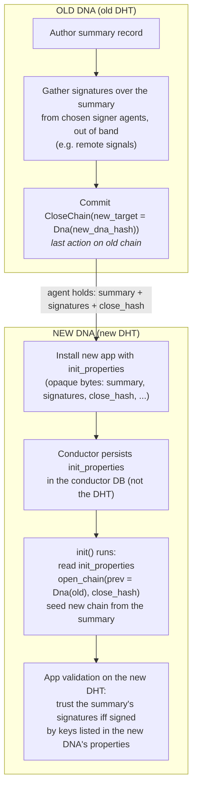

# DNA Migration Design: Chain Switch

## Status

**Draft / proposed.** This document describes the **chain switch** DNA migration
path: an agent closes their source chain under one DNA and opens a new chain
under a different DNA, optionally carrying a signed summary of their old state
forward.

Chain switch is a path that is intended to be retained indefinitely. Even
alongside a future migration path that behaves differently, chain switch remains
useful because it permits migrations **across incompatible conductor versions** —
the old and new DNAs need not run on the same conductor build, since the carried
state moves as opaque, agent-held bytes rather than through a live cross-cell or
cross-network link.

## Motivation

An application sometimes needs to evolve its DNA in a way that changes the DNA
hash: new entry types, changed validation rules. A changed DNA hash means a
different network and a different DHT.

There is no forcing factor that compels an agent to migrate. An agent who stays
on the old DNA simply finds the network quieter over time, with fewer peers to
interact with. Migration is therefore something an agent chooses to do, and the
design must put that choice — and the timing of it — in the agent's hands.

Two properties matter:

1. **Agent control.** The migrating agent decides *when* to migrate. What state
   is carried forward is governed by the application's own validation rules, but
   the act of migrating, and its timing, belongs to the agent. Migration must
   not depend on a third party reaching into the new network on the agent's
   behalf.
2. **Offline friendliness.** Once an agent holds the data they want to carry
   forward, installing and seeding the new DNA must not require the old network
   to be reachable.

## Background: open and closed chains

A source chain can be _closed_ to mark the end of authorship under one DNA, and
a new chain can be _opened_ to declare where it migrated from. These are
represented by two system actions.

### `CloseChain`

```rust
pub struct CloseChain {
    pub author: AgentPubKey,
    pub timestamp: Timestamp,
    pub action_seq: u32,
    pub prev_action: ActionHash,

    pub new_target: Option<MigrationTarget>,
}
```

`CloseChain` is committed as the **last** action on the old chain. Its
`new_target` optionally declares the forward migration path. A `CloseChain` with
`new_target == None` simply retires a chain with no forward reference.

System validation enforces that nothing may follow a `CloseChain`: any action
whose previous action is a `CloseChain` is rejected.

### `OpenChain`

```rust
pub struct OpenChain {
    pub author: AgentPubKey,
    pub timestamp: Timestamp,
    pub action_seq: u32,
    pub prev_action: ActionHash,

    pub prev_target: MigrationTarget,
    /// The hash of the `CloseChain` action on the old chain.
    pub close_hash: ActionHash,
}
```

`OpenChain` is expected to be committed during `init` on the new chain. It
declares `prev_target` — where the chain came from — and `close_hash`, the hash
of the matching `CloseChain` action.

The intent of `close_hash` is to bind the new chain to a single `CloseChain` on
the old chain, so that one old chain cannot fork into multiple migrated
successors. This binding cannot be enforced within Holochain's validation
framework today. Verifying it requires visibility of the old network, which the
new network's validators do not have, so enforcement would need a future
solution that grants such visibility. In the meantime, only an outside observer
with visibility of both networks can detect such a fault.

### `MigrationTarget`

```rust
pub enum MigrationTarget {
    /// The new or previous DNA hash.
    Dna(DnaHash),
}
```

`MigrationTarget` names the DNA the chain is migrating to (in `CloseChain`) or
from (in `OpenChain`). Of the two components of a `CellId`, the agent key stays
fixed across a chain switch and the DNA hash changes.

### HDK surface

```rust
pub fn close_chain(new_target: Option<MigrationTarget>) -> ExternResult<ActionHash>;
pub fn open_chain(prev_target: MigrationTarget, close_hash: ActionHash) -> ExternResult<ActionHash>;
```

Both append the corresponding action to the source chain with strict chain-top
ordering.

## The chain switch flow



The design adds four things on top of the open/closed-chain machinery:

1. An `init_properties` install-app parameter: opaque bytes, per role.
2. Persistence of `init_properties` in the conductor database, keyed by app and
   role — not in the DHT.
3. A host function to read `init_properties`, callable only from `init`.
4. A validation convention: the new DNA lists trusted signer public keys in its
   DNA properties, so app validation can trust signatures on carried content
   that originated on the old network.

## Design

### 1. Producing the signed summary

Producing the summary is an application responsibility.

- The old coordinator authors a summary record that distils whatever state the
  app expects agents to carry forward, or the agent's own chosen state. The
  app's validation rules govern what a well-formed summary may contain.
- To make the summary trustworthy on the new network, the app gathers
  signatures over the summary bytes from a set of chosen signer agents. This
  **must be done out of band by the app** — for example via remote signals or
  another app-defined request/response mechanism.
  - Signature gathering cannot be driven through the validation framework: the
    set of validation authorities asked to act on any given piece of data is
    bounded, so the agents whose keys the new network trusts may never be asked,
    and may not respond. Treating signature collection as an explicit app-level
    protocol avoids depending on validator selection.
- The agent commits `close_chain(Some(MigrationTarget::Dna(new_dna_hash)))`,
  which yields the `close_hash` the new chain will need.

The agent then locally holds everything required to seed the new DNA: the
summary, the signatures, and the `close_hash`. Holding this material locally
means seeding the new DNA does not *depend* on the old network being reachable.

Once `CloseChain` is committed the old chain cannot be extended, so the closing
summary is the only carried record of the old chain's state. Making summary
production robust is therefore an application responsibility. The app should
either keep the summary reconstructible from what it commits — for example, by
gathering signatures before committing the summary so the committed record is
self-contained — or persist the migration data before closing the chain so it
can retry producing the summary if something fails partway. Holochain does not
provide a way to re-derive this material from a chain that is already closed.

### 2. The `init_properties` install parameter

`install_app` gains a way to pass opaque, app-defined bytes to a freshly
installed cell. Following the existing per-role model used for membrane proofs
and DNA modifiers, these live on the `RoleSettings::Provisioned` variant:

```rust
pub enum RoleSettings {
    UseExisting { cell_id: CellId },
    Provisioned {
        membrane_proof: Option<MembraneProof>,
        modifiers: Option<DnaModifiersOpt<YamlProperties>>,
        /// Opaque, app-defined bytes made available to the cell during `init`.
        /// Not interpreted by the conductor and never written to the DHT.
        init_properties: Option<InitProperties>,
    },
}
```

`InitProperties` is a newtype wrapping bytes. The bytes are opaque to the install
process. The app alone decides how to decode them.

`init_properties` is per role because `init` runs per cell and each role is a
single DNA — the carried state is specific to the DNA being migrated into. They
must be supplied at install time if they are wanted; there is no path to provide
them later.

This is a distinct channel from the two existing ones, deliberately:

- **DNA properties** are part of the DNA hash. The carried summary is per-agent,
  per-migration content; it must not change the DNA hash, so it cannot live in
  DNA properties. (DNA properties are instead the home for the trusted signer
  keys described in [section 5](#5-validating-carried-content-on-the-new-dna).)
- **Membrane proof** is written into the source chain and so is shared to the
  DHT. The summary stays private to the conductor unless and until the app
  chooses to author derived data from it.

### 3. Persisting `init_properties` in the conductor database

`init_properties` is stored in the conductor database, not in any cell or DHT
database. It is conductor-local seed material; keeping it out of the DHT avoids
polluting shared state with per-agent migration payloads.

A dedicated table holds the opaque blob, keyed by `(installed_app_id,
role_name)`. The entry is written when the app is installed.

The entry is cleared on a successful `init`, and on app uninstall. Once `init`
has succeeded the seed material has served its purpose, and removing it keeps
per-agent payloads from lingering at rest in the conductor.

### 4. Reading `init_properties` from `init`

A host function exposes the persisted bytes to the running zome:

```rust
/// Look up the opaque init properties supplied to `install_app` for this cell,
/// if any. Returns `None` if none were provided.
///
/// Callable only from `init`. The bytes are app-defined. The caller is
/// responsible for decoding them.
pub fn get_init_properties() -> ExternResult<Option<InitProperties>>;
```

Reads are restricted to the `init` callback. Because the stored properties are
cleared once `init` succeeds, allowing reads elsewhere would be a footgun:
callers would find the properties present before the first successful `init` and
absent afterwards. Restricting to `init` makes the single point of use explicit.

During `init` the app reads the properties, decodes them, commits `open_chain`
with the carried `close_hash`, and seeds the new chain by authoring records
derived from the summary. This path is fully local: the old cell need not be
installed or running and the old network need not be reachable.

`init` is not restricted to local data, however. It may make network calls, so
an app can also seed the new chain from content authored by other agents,
including content on the previous network. Because the agent key does not change
across a chain switch, content carrying a valid signature made by the agent's
own key on a previous network can always be trusted — even where another agent
copied it across and re-authored it. The conductor-held `init_properties` are
therefore one source of seed material, not the only one.

### 5. Validating carried content on the new DNA

The new DNA must be able to decide whether to trust the carried summary, since
the summary was constructed and signed on the old network — a network the new
DNA's validators are not part of. How an app establishes that trust is left to
the app. What follows is one workable approach, which the implementation intends
to exercise with integration tests; it is not the only one, and it is not
privileged by the design.

In this approach the new DNA lists the public keys whose signatures it trusts in
its DNA properties (readable in validation via `dna_info()`). These are the keys
of the signer agents the app asked to sign migration summaries.

When an agent authors records derived from a carried summary, the integrity
zome's `validate` callback:

1. Reads the trusted signer keys from DNA properties.
2. Verifies the summary's signatures over the summary bytes using
   `verify_signature`.
3. Accepts the derived records only if the signatures are valid and the signers
   are in the trusted set.

Trust is thus baked into the DNA hash: every agent on the new network agrees, by
running the same DNA, on which keys are authoritative for migration summaries.

Two constraints follow from this particular approach:

- The records are trusted because the listed signers vouched for the summary,
  not because the new network re-derived it from the old DHT (which it cannot
  see).
- The trusted signer keys are fixed in the DNA hash. Retiring a signer key
  requires a further DNA migration.

## Non-goals

- This document designs only the chain switch path. It does not attempt to
  design any other migration path.
- It does not attempt to re-validate the carried summary against the old DHT
  from the new network; trust is delegated to the listed signer keys.
