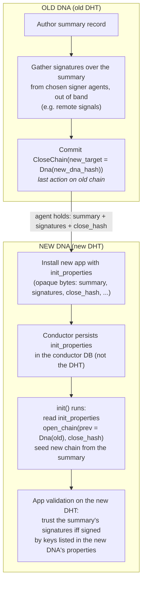

# DNA Migration Design: Chain Switch

## Status

**Draft / proposed.** This document describes the **chain switch** DNA migration
path: an agent closes their source chain under one DNA and opens a new chain
under a different DNA, optionally carrying state from the old chain forward.

Chain switch is a path that is intended to be retained indefinitely. Even
alongside a future migration path that behaves differently, chain switch remains
useful because it permits migrations **across incompatible conductor versions** —
the old and new DNAs need not run on the same conductor build, since the carried
state moves as opaque, agent-held bytes rather than through a live cross-cell or
cross-network link.

## Motivation

An application sometimes needs to evolve its DNA in a way that changes the DNA
hash: new entry types, changed validation rules. A changed DNA hash means a
different network and a different DHT.

There is no forcing factor that compels an agent to migrate. An agent who stays
on the old DNA simply finds the network quieter over time, with fewer peers to
interact with. Migration is therefore something an agent chooses to do, and the
design must put that choice — and the timing of it — in the agent's hands.

Two properties matter:

1. **Agent control.** The migrating agent decides *when* to migrate. What state
   is carried forward is governed by the application's own validation rules, but
   the act of migrating, and its timing, belongs to the agent. Migration must
   not depend on a third party reaching into the new network on the agent's
   behalf.
2. **Offline friendliness.** Once an agent holds the data they want to carry
   forward, installing and seeding the new DNA must not require the old network
   to be reachable.

## Background: open and closed chains

A source chain can be _closed_ to mark the end of authorship under one DNA, and
a new chain can be _opened_ to declare where it migrated from. These are
represented by two system actions.

### `CloseChain`

```rust
pub struct CloseChain {
    pub author: AgentPubKey,
    pub timestamp: Timestamp,
    pub action_seq: u32,
    pub prev_action: ActionHash,

    pub new_target: Option<MigrationTarget>,
}
```

`CloseChain` is committed as the **last** action on the old chain. Its
`new_target` optionally declares the forward migration path. A `CloseChain` with
`new_target == None` simply retires a chain with no forward reference.

System validation enforces that nothing may follow a `CloseChain`: any action
whose previous action is a `CloseChain` is rejected.

### `OpenChain`

```rust
pub struct OpenChain {
    pub author: AgentPubKey,
    pub timestamp: Timestamp,
    pub action_seq: u32,
    pub prev_action: ActionHash,

    pub prev_target: MigrationTarget,
    /// The hash of the `CloseChain` action on the old chain.
    pub close_hash: ActionHash,
}
```

`OpenChain` is expected to be committed during `init` on the new chain. It
declares `prev_target` — where the chain came from — and `close_hash`, the hash
of the matching `CloseChain` action.

The intent of `close_hash` is to bind the new chain to a single `CloseChain` on
the old chain, so that one old chain cannot fork into multiple migrated
successors. This binding cannot be enforced within Holochain's validation
framework today. Verifying it requires visibility of the old network, which the
new network's validators do not have, so enforcement would need a future
solution that grants such visibility. In the meantime, only an outside observer
with visibility of both networks can detect such a fault.

### `MigrationTarget`

```rust
pub enum MigrationTarget {
    /// The new or previous DNA hash.
    Dna(DnaHash),
}
```

`MigrationTarget` names the DNA the chain is migrating to (in `CloseChain`) or
from (in `OpenChain`). Of the two components of a `CellId`, the agent key stays
fixed across a chain switch and the DNA hash changes.

### HDK surface

```rust
pub fn close_chain(new_target: Option<MigrationTarget>) -> ExternResult<ActionHash>;
pub fn open_chain(prev_target: MigrationTarget, close_hash: ActionHash) -> ExternResult<ActionHash>;
```

Both append the corresponding action to the source chain with strict chain-top
ordering.

## An example chain switch flow

The flow below is **one possible app-level flow**, not a fixed procedure. It
shows how an application can combine the Holochain primitives in
[Background](#background-open-and-closed-chains) and [Design](#design) to carry
signed state across a migration. What an app brings forward, how it establishes
trust in it, and what (if anything) it signs are all app decisions; other flows
are equally valid.



Walking the example:

1. **On the old DNA**, the app authors a summary record distilling whatever
   state it wants to carry forward, then gathers signatures over the summary
   bytes from a set of chosen signer agents. Signing is done **out of band** —
   for example via remote signals or another app-defined request/response
   mechanism. It cannot be driven through the validation framework: the set of
   validation authorities asked to act on any piece of data is bounded, so the
   agents whose keys the new network will trust may never be asked, and may not
   respond.
2. The agent commits `close_chain(Some(MigrationTarget::Dna(new_dna_hash)))`,
   which yields the `close_hash`, and now holds the summary, the signatures, and
   the `close_hash` locally.
3. The agent **installs the new app**, passing the summary, signatures, and
   `close_hash` as `init_properties`.
4. **During `init` on the new DNA**, the app reads `init_properties`, commits
   `open_chain` with the carried `close_hash`, and seeds the new chain by
   authoring records derived from the summary.
5. **Validation on the new DNA** decides whether to trust the carried records.
   Here the new DNA lists the trusted signer public keys in its DNA properties
   (readable via `dna_info()`); the integrity zome's `validate` callback reads
   those keys, verifies the summary's signatures with `verify_signature`, and
   accepts the derived records only if the signatures are valid and the signers
   are trusted. Trust is thus baked into the DNA hash: every agent on the new
   network agrees, by running the same DNA, on which keys are authoritative. The
   cost is that retiring a signer key requires a further DNA migration.

## Design

Chain switch adds three things to Holochain on top of the open/closed-chain
machinery already described:

1. An `init_properties` install-app parameter: opaque, app-defined bytes, per
   role.
2. Persistence of those bytes in the conductor database, keyed by app and role —
   never in the DHT.
3. A host function to read them, callable only from `init`.

Everything else in a chain switch — what is carried forward, how it is signed,
and how the new DNA decides to trust it — is application behavior. The
[example flow](#an-example-chain-switch-flow) shows one way to assemble these
pieces.

### 1. Closing the old chain

Closing the chain is the one Holochain-supported step on the old DNA: the agent
commits `close_chain` (see [`CloseChain`](#closechain)), declaring the new DNA
as its `new_target`. What state the agent gathers to carry forward, and how, is
app-defined.

One consequence matters for app design: once `CloseChain` is committed the old
chain cannot be extended, so whatever the app intends to carry forward must be
captured before or at the close. Holochain provides no way to re-derive material
from a chain that is already closed, so the app should either keep the carried
state reconstructible from what it commits, or persist it before closing so it
can retry if something fails partway.

### 2. The `init_properties` install parameter

`install_app` gains a way to pass opaque, app-defined bytes to a freshly
installed cell. Following the existing per-role model used for membrane proofs
and DNA modifiers, these live on the `RoleSettings::Provisioned` variant:

```rust
pub enum RoleSettings {
    UseExisting { cell_id: CellId },
    Provisioned {
        membrane_proof: Option<MembraneProof>,
        modifiers: Option<DnaModifiersOpt<YamlProperties>>,
        /// Opaque, app-defined bytes made available to the cell during `init`.
        /// Not interpreted by the conductor and never written to the DHT.
        init_properties: Option<InitProperties>,
    },
}
```

`InitProperties` is a newtype wrapping bytes. The bytes are opaque to the install
process. The app alone decides how to decode them.

`init_properties` is per role because `init` runs per cell and each role is a
single DNA — the carried state is specific to the DNA being migrated into. They
must be supplied at install time if they are wanted; there is no path to provide
them later.

This is a distinct channel from the two existing ones, deliberately:

- **DNA properties** are part of the DNA hash. The carried bytes are per-agent,
  per-migration content; they must not change the DNA hash, so they cannot live
  in DNA properties. (DNA properties remain available for per-DNA configuration
  — the [example flow](#an-example-chain-switch-flow) uses them to hold trusted
  signer keys.)
- **Membrane proof** is written into the source chain and so is shared to the
  DHT. The carried bytes stay private to the conductor unless and until the app
  chooses to author derived data from them.

### 3. Persisting `init_properties` in the conductor database

`init_properties` is stored in the conductor database, not in any cell or DHT
database. It is conductor-local seed material; keeping it out of the DHT avoids
polluting shared state with per-agent migration payloads.

A dedicated table holds the opaque blob, keyed by `(installed_app_id,
role_name)`. The entry is written when the app is installed.

The entry is cleared on a successful `init`, and on app uninstall. Once `init`
has succeeded the seed material has served its purpose, and removing it keeps
per-agent payloads from lingering at rest in the conductor.

### 4. Reading `init_properties` from `init`

A host function exposes the persisted bytes to the running zome:

```rust
/// Look up the opaque init properties supplied to `install_app` for this cell,
/// if any. Returns `None` if none were provided.
///
/// Callable only from `init`. The bytes are app-defined. The caller is
/// responsible for decoding them.
pub fn get_init_properties() -> ExternResult<Option<InitProperties>>;
```

Reads are restricted to the `init` callback. Because the stored properties are
cleared once `init` succeeds, allowing reads elsewhere would be a footgun:
callers would find the properties present before the first successful `init` and
absent afterwards. Restricting to `init` makes the single point of use explicit.

What the bytes contain is up to the app. They might carry a full summary plus
signatures, ready for `init` to seed from directly. They might instead be only a
*hint* that a migration is intended — for example a flag telling `init` to wait
for specific network data to become available, then seed from that rather than
from local bytes. Holochain neither requires nor interprets a particular shape.

`init` is not restricted to local data. It may make network calls, so an app can
seed the new chain from content authored by other agents, including content on
the previous network. Because the agent key does not change across a chain
switch, content carrying a valid signature made by the agent's own key on a
previous network can always be trusted — even where another agent copied it
across and re-authored it. The conductor-held `init_properties` are therefore
one source of seed material, not the only one.

### 5. Validating carried content on the new DNA

Deciding whether to trust carried content is an application design concern, not
something Holochain dictates. The content was constructed on a network the new
DNA's validators are not part of, so the app's integrity zome must define
whatever rule makes that content trustworthy on the new DNA. The
[example flow](#an-example-chain-switch-flow) gives one approach — listing
trusted signer keys in DNA properties and verifying signatures in validation —
which the implementation intends to exercise with integration tests.

## Non-goals

- This document designs only the chain switch path. It does not attempt to
  design any other migration path.
- It does not attempt to re-validate carried content against the old DHT from
  the new network. How carried content is trusted on the new DNA is left to the
  app.
