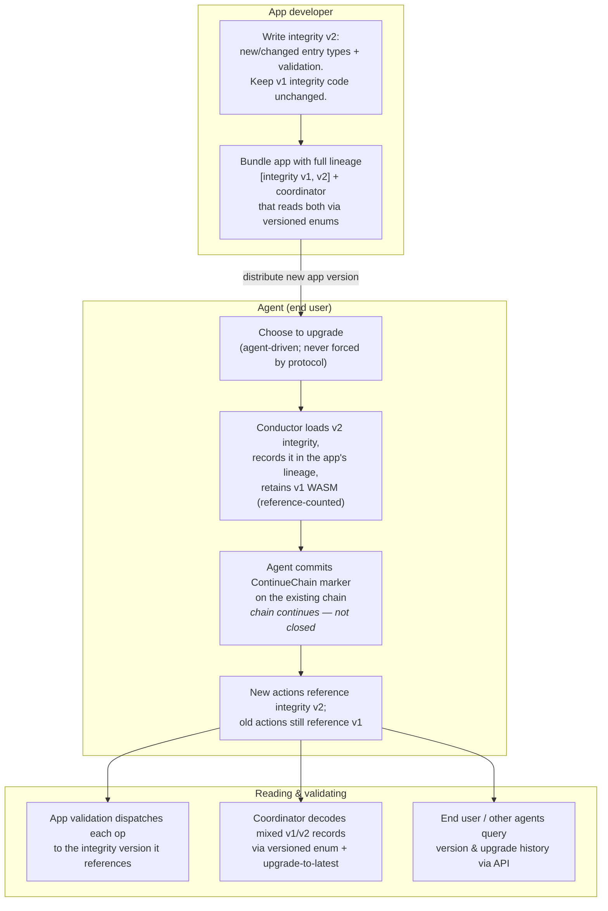

# DNA Migration Design: Chain Continuation

## Status

**Draft / proposed.** This document describes the **chain continuation** DNA
migration path: an agent keeps their existing source chain and declares that
they are now authoring under a new version of the DNA's integrity rules.

This is the complement to the [chain switch](./dna_migration.md) path. Chain
switch closes one chain and opens a new chain on a new network, carrying
forward a signed summary of state. Chain continuation instead evolves
the rules *underneath a single, continuous chain*, so the agent's identity,
history, and network membership are preserved across the migration.

Both paths are intended to be retained indefinitely. They solve different
problems and neither subsumes the other (see
[Relationship to chain switch](#relationship-to-chain-switch)).

## Terminology

This path is called **chain continuation**. To *continue* a chain means the
agent's existing source chain is extended without interruption: no `CloseChain`,
no new chain, no re-genesis. The agent commits a marker action declaring that
they have adopted a new integrity version, and then keeps authoring on the same
chain under the new rules.

Throughout this document:

- An **integrity version** is one immutable set of integrity zomes (with the
  validation rules and entry/link type definitions they contain) plus the DNA
  properties in force. It is identified by its `IntegrityHash` (see
  [Core model](#core-model)); today it has no identity separate from the DNA hash.
- The **lineage** is the ordered history of integrity versions an app moves
  through — a sequence of `IntegrityHash`es — rooted at the app's **initial
  version**, whose DNA hash also fixes the network. The root is a property of the
  app, not of any one agent: a given agent may first install at a later version
  and never hold the initial one, but the lineage still anchors to it.

## Motivation

Applications need to change their integrity rules over time: add an entry type,
tighten a validation rule, fix a bug in validation. Today any such change
produces a different DNA hash, which means a different network and a different
DHT. The only supported way forward currently is chain switch: close the old
chain, open a new one on the new network, and carry a summary across.

Chain switch is powerful and operationally lightweight — each agent compacts their
own chain to a summary, and only active agents carry that little data onto the new
network. But
it is *disruptive to continuity*: it severs the chain and stands up a fresh
network peers may or may not follow, and history survives only as far as it
summarises. A running balance reduces neatly to one value; a history of published
blog posts has no faithful summary. For the common case — "the app shipped a new
version and I want to keep using it with the people I already interact with" —
severing the chain is far more disruption than the change warrants.

Chain continuation targets that common case. The agent stays on the same
network, keeps their chain and history, and simply begins authoring under newer
rules. Old content remains valid under the rules it was authored with; new
content is validated under the new rules.

Two principles carry over from the chain switch design and remain central:

1. **Agent control.** Migration is something an agent *chooses*. There is no
   forcing factor in the protocol: an app developer ships a new version, but the
   decision to upgrade, and its timing, belongs to the agent. The design must
   not assume an app developer can compel an upgrade. (Whether higher layers —
   e.g. a desktop app's own update policy — choose to prompt or require upgrades
   is out of scope and orthogonal to the protocol.)
2. **Offline friendliness.** Upgrading, installing, and continuing to author
   must work from locally available data. An agent must be able to upgrade and
   keep working without the network being reachable, and content authored under
   a version a peer does not yet understand must be handled gracefully rather
   than treated as a fault.

## Relationship to chain switch

| | Chain switch | Chain continuation |
|---|---|---|
| Source chain | Closed; a new chain is opened | Continues unbroken |
| Network / DHT | New network (new DNA hash) | **Same network** |
| Agent key | Preserved | Preserved |
| History | Left behind; a summary is carried | Fully retained on-chain |
| Trust in old state | App re-establishes via signed summary + trusted signers | Old content validated by the *actual* old rules |
| Cross conductor-version migration | Supported (carried state is opaque bytes) | Not a goal; assumes a compatible conductor series |
| Best for | "Shed the skin": drop accumulated cruft, vulnerable rules, or move across incompatible Holochain versions | Routine app upgrades where continuity matters |

The two are designed to coexist. An app can use chain continuation for ordinary
version upgrades and fall back to chain switch when it wants a clean break.

## Core model

Chain continuation requires a conceptual separation that does not exist today,
where a DNA hash conflates two things: **which network the chain lives on** and
**which integrity rules validate its content**. Continuation needs these to move
independently — the network stays fixed while the integrity rules advance.

### Network identity is pinned to the lineage root

Today the DNA hash — over the modifiers and the integrity zomes — determines the
network, so changing integrity zomes lands the agent on a different network.

For continuation, **network membership is pinned to the lineage root** — the
app's initial DNA hash — fixed by the app's declared lineage, not by where an
agent enters. Later upgrades add integrity versions to the lineage but never
change the network. This is how *everyone ends up on the same network, set by the
first DNA hash*: agents on one app stay together as it evolves.

#### Three hashes, three jobs

The DNA hash does three jobs today. Continuation needs them split into distinct
types, so the intent is explicit and the compiler keeps them apart:

- **`NetworkHash`** — the stable network identity, fixed at the **lineage root**:
  the app's initial integrity version, whose DnaHash includes that version's
  network seed and properties. It maps to the network space and keys everything
  identity- and storage-side: the
  space, the cell identity, the peer store, and the **cell database files** (a
  database plus its write-ahead log and companions). Keying the files on
  `NetworkHash` means an upgrade never has to rename them.
- **`DnaHash`** — unchanged: the hash over integrity zomes **plus modifiers and
  network seed** that identifies an installed or running cell. It is the value
  paired with an `AgentPubKey` in a `CellId`.
- **`IntegrityHash`** — a hash over everything that affects validation: the
  **integrity zomes and the DNA properties**, but **not the network seed**.
  Equivalently, the `DnaHash` minus the network seed. This determines *which
  validation rules apply*; it is what an action carries and what the lineage is a
  sequence of. Properties are included because integrity zomes read them during
  validation; the seed is excluded because it only partitions the network and
  never affects validation.

In short: `NetworkHash` is fixed for the lineage, `DnaHash` names the installed
cell, and `IntegrityHash` advances per version and is what each action carries.
The **network seed** may not change across the lineage — an install that tries to
change it is rejected — while properties and integrity zomes may change from one
version to the next.

A network is therefore no longer guaranteed to share a single set of validation
rules: different members may be authoring and validating under different
integrity versions at the same time. The rest of this section describes the
machinery that makes that tractable.

### Actions reference their integrity version

Today an action identifies an entry's type with a zome index and entry-def
index, and the validator resolves which integrity zome to run from the *currently
loaded* DNA definition. That is sufficient only when there is exactly one set of
integrity rules. Once a network carries multiple integrity versions, a validator
receiving a single op out of chain context cannot know which rules apply.

So an action must carry a reference to the integrity version that produced it.
The entry type alone is not enough — the *validation rules* changed too, not
just the type table — so the reference belongs in the action, where it is
covered by the action hash and the author's signature.

Concretely, the `IntegrityHash` becomes a field on the common **`ActionHeader`**
— the new data model's per-action header (author, timestamp, sequence,
previous-action hash) — so **every action carries it**. A validator uses it to
select the matching integrity code, and because it is a plain header field it is
trivial to find every action authored under a given integrity version (which the
parking mechanism relies on; see
[Unknown integrity versions](#unknown-integrity-versions-and-abandoned-ops)).

The cost is modest and bounded: one hash (39 bytes) per action, plus its effect on
each action's hash. Carrying it uniformly on the header is simpler than
restricting it to only the action types that dispatch to integrity validation, and
the storage saved by doing so would be small.

#### Type indices are only meaningful within one integrity version

An action identifies its entry or link type by *index* (a zome index plus an
entry-def or link-type index), assigned by position within one set of integrity
zomes. Across versions those positions move — adding or removing a zome or a type
shifts every index downstream — so an index is meaningless without knowing which
integrity version assigned it.

The `IntegrityHash` makes it interpretable: `(integrity version, zome index, type
index)` identify a type unambiguously where the index alone cannot. Correlating
"the same" type across versions (that `v1`'s and `v2`'s profile are one logical
thing) is **not** something indices express and is **not** inferred by
Holochain — it is the app's job, in coordinator code, via the versioned-data
pattern (see [Working with versioned data](#working-with-versioned-data)).

### The `ContinueChain` marker action

When an agent upgrades, they commit a dedicated **system action** to their chain
that declares the integrity version they are moving to. This action is named
`ContinueChain`, completing the family alongside `CloseChain` (end this chain) and
`OpenChain` (begin a chain that came from elsewhere): `ContinueChain` carries the
same chain forward under a new integrity version. It records the version being
adopted (an `IntegrityHash`) and, unlike `CloseChain`, does **not**
end the chain — authorship continues directly after it. It may also carry an
**optional membrane proof** for the version being entered, which that version's
validation checks as a per-version admission gate (see
[Membrane proofs](#membrane-proofs-two-independent-admission-gates)).

`ContinueChain` gives system validation a cheap, context-light rule: an agent
may not go back to an old integrity version once they have moved on.

- Before the first `ContinueChain`, the chain is at the lineage-root version.
- After a `ContinueChain`, every subsequent action must reference the version it
  declared, until the next `ContinueChain`.
- So an agent cannot author new content under a *previous* integrity version once
  they have declared an upgrade. (Stated as two rules above, but it is a single
  check: an action's integrity version must equal the version in force at its
  position in the chain.)

The per-action reference and the marker are complementary: the reference lets a
remote validator pick the right code for an op it sees in isolation; the
`ContinueChain` marker lets a chain-walking validator enforce that the agent moved
forward and never backward.

### Lineage

`DnaDef` already carries a `lineage` field — a `HashSet<DnaHash>` — but it is not
what continuation needs, in two ways.

Its **contents** are wrong: full `DnaHash`es, which an action's `IntegrityHash`
cannot be compared against. The continuation lineage must be an **ordered
sequence of `IntegrityHash`es**, matching what actions carry, so app and
validation code can map an action to its version by position.

Its **purpose** is different: the existing field is a remnant of earlier
migration work (it lives behind `unstable-migration`). Its only consumer today is
the `GetCompatibleCells` admin query backing `UseExisting` cell reuse — *not*
chain switch, which does not read it. Continuation is therefore not repurposing a
chain-switch construct; it is defining the version history that earlier field
gestured at.

The ordered `IntegrityHash` lineage is what lets an action's version be mapped to
a human-meaningful version number, and what tells the conductor which integrity
versions it must retain (see [WASM retention](#packaging-and-wasm-retention)). It
must be surfaced through `dna_info` (see
[Working with versioned data](#working-with-versioned-data)).

Because `IntegrityHash` excludes the network seed, this lineage is
**seed-independent**: two separate networks running the same app (different seeds,
hence different `NetworkHash`es) hold byte-identical lineages. That is harmless —
the lineage is an app-scoped version history, not a network identifier. Network
isolation is enforced by `NetworkHash`/`CellId`, which do include the seed; the
lineage only ever answers "which integrity version," which is the same across
seeds.

## Validation

### System validation

Two checks are added, both concerned only with the *progression* of versions,
not their *content*:

1. **No reverting on the local chain.** Enforced via the `ContinueChain` marker
   as above, for locally authored content where the conductor has the full chain
   and the loaded integrity versions available.
2. **Authored version is loaded locally.** For locally authored content, the
   integrity version referenced by an action must correspond to an integrity
   version the conductor actually has loaded. An agent cannot author under a
   version they do not hold.

Neither check can be made remotely in general: a validator on the network may
receive content referencing an integrity version it has never seen (an app
package newer than the one it installed). System validation must treat *unknown
integrity version* as a first-class, non-fault condition.

### App validation

App validation dispatches each op to the `validate` callback of the integrity
version the op's action references — not to the currently loaded version. This
is the key behavioural change from today, where dispatch always targets the
single loaded integrity zome set. Old content is therefore validated by exactly
the code that was written to validate it, which is the central correctness
property of chain continuation: rules are pinned to the content they govern.

For unknown versions the two stages diverge. **System validation still runs** —
its checks are generic and need no integrity WASM. **App validation cannot**,
since it must invoke that version's `validate` code; so an op whose integrity WASM
is unavailable is flagged at ingress and app validation skips it until the version
arrives (see [parking, below](#unknown-integrity-versions-and-abandoned-ops)).

### Membrane proofs: two independent admission gates

Membrane proofs are the mechanism by which an app admits an agent. Chain
continuation introduces a second moment at which admission is meaningful — the
upgrade — so this design separates admission into two independent gates, each
validated by different code and enforced by a different set of peers.

**Network admission — validated at the lineage root.** The membrane proof an
agent supplies at genesis governs entry to the *network*, and the network is the
lineage root. All genesis membrane-proof validation therefore routes to the
**initial integrity version**, regardless of which version the agent installs
under. This is the only integrity version guaranteed to be present on every
participant — it defines the network and every install bundles the lineage from
the root — so it is the only version at which *every* peer can validate *every*
newcomer and reach the same verdict. Pinning network admission to the root keeps
that validation universal and deterministic.

**Version admission — validated at the version being entered.** The
`ContinueChain` marker may **optionally carry its own membrane proof**, validated
by the `validate` callback of the integrity version the agent is upgrading *to*.
This lets an app evolve its admission rules over the life of a network and ensure
that only agents permitted to move to a new version can do so. It is enforced by
the cohort of peers already on that version — they hold its code and reach the
same verdict — while a peer that does not yet have that version simply parks the
op (see [Unknown integrity versions](#unknown-integrity-versions-and-abandoned-ops)),
abstaining rather than forking. Determinism holds within the cohort that the gate
actually concerns.

The two gates are complementary and answer different questions:

- Genesis membrane proof → *may this agent join the network?* Fixed at the root,
  checked by everyone.
- `ContinueChain` membrane proof → *may this agent advance to this version?*
  Set by the version being entered, checked by that version's cohort, optional
  and evolvable.

The version gate does **not** remove anyone: an agent who cannot pass a new
version's admission stays valid on the version they hold, they just cannot
upgrade. Genuine removal would also require bounding how many historical versions
may keep producing new content, so staying behind eventually stops being viable —
deliberately left as a **future problem**. It is deterministic only as a
version-distance floor, not a wall-clock bound; it cannot drop old integrity WASMs
(still needed to validate historical content and adjudicate warrants and forks
against it); and it must not refuse the historical reads new joiners and warrant
verification need. This design provides the upgrade gate, not the removal
mechanism.

### Unknown integrity versions and abandoned ops

Because any agent can, in principle, declare an upgrade to *any* rules, a network
can receive content referencing integrity versions a given conductor cannot
validate — either because the app package it installed is older, or because the
content's author is running rules this app never sanctioned. This raises two
problems: such content cannot be validated, and it must not be allowed to
accumulate as unbounded dead weight in the DHT.

The core handling is **parking**, and it is part of this design.

An op still arrives and is stored and **system-validated** normally — system
validation does not need the integrity WASM, and content that fails it is
rejected outright rather than parked. What waits is only **app validation**,
which does need the version's integrity code. An op whose `IntegrityHash` is one
this conductor does not hold is **flagged as parked** when it arrives in the
incoming-ops workflow, so it never enters the app-validation scan and cannot
pollute the
missing-dependency retry loop (whose backoff otherwise shortens as the count of
awaiting ops grows).

Unparking is cheap because the `IntegrityHash` is a top-level field on the
action: when a version becomes available — typically after the agent upgrades
their own app package — the conductor finds the actions carrying that hash whose
ops are parked and makes them **visible to app validation** again. This is
selective, keyed on the specific version, not a blind rescan. Ops referencing a
version that is not in the app's lineage at all simply stay parked, cheaply,
indefinitely.

(Note this design keeps the full content of parked ops. Dropping content while
retaining only its hash to save space is a possible later optimization, not part
of this design — you cannot system-validate an op you have reduced to a hash.)

### Future options for abandoned ops

These are **not** part of this design. They are recorded as plausible later
additions:

- **An oldest-supported version floor.** The app package could declare the oldest
  integrity version it still accepts *new* content from — rejecting older content
  as out of scope (not warranted, since it is not invalid, merely unsupported)
  while still syncing genuinely historical data. This is the version-distance
  bound referenced under membrane proofs as the lever a removal mechanism would
  need.
- **Suppressing content from vulnerable versions.** Once a version with a known
  vulnerability exists, it exists forever in the lineage; an app might choose to
  refuse new content from, or suppress display of, versions it has marked as
  compromised.

## Packaging and WASM retention

### Bundling previous integrity versions

For old content to be validated by old code, that old code must be present.
Therefore:

- When an app is upgraded with a new integrity version, **all previous integrity
  versions are kept**.
- An app package distributed to *new* installers must bundle the **full set** of
  integrity versions in the lineage, so a fresh install can validate the entire
  history of any chain it encounters, not just content authored after it joined.

To make this routine, the bundling tool should be given the *previous* hApp bundle
when building the new one, so it can carry prior integrity versions forward
automatically for the common cases (unchanged or purely additive lineages). Where
it cannot infer DNA or zome additions, removals, or renames, the developer falls
back to assembling the bundle manually.

Because properties are part of a version's `IntegrityHash` and are read during
validation, each version's **properties travel with it**: a version's definition
is its integrity zomes together with the properties in force for it, so a
validator can reconstruct exactly the rules that version ran under.

Coordinator zomes do not affect integrity version identity and can be replaced
freely; only integrity versions accumulate.

### Reference accounting and garbage collection

WASM is stored once per hash in a single shared table and deduplicated across
DNAs. There is currently no reference counting and no garbage collection: an
uninstall removes app and cell records but leaves WASM rows behind. This is a
**known missing feature in the current system, not a guarantee to build on** —
WASM that is no longer needed should be removed, and this design must not assume
old WASM happens to survive because nothing deletes it. Required WASM must be
kept because something explicitly *references* it.

Chain continuation both depends on this gap being closed and raises the stakes,
since lineages accumulate integrity versions indefinitely and would grow without
bound if never collected.

This design therefore calls for **reference-counted WASM retention**, treating
removal of unreferenced WASM (including on uninstall) as a prerequisite, not a
nicety:

- Index each integrity (and coordinator) WASM hash to the set of installed app
  lineages that require it.
- Retain a WASM while any installed lineage references it — this keeps *required
  previous* versions alive though they are no longer current.
- When its reference set empties (uninstalling an app decrements what its lineage
  held), the now-orphaned WASM is eligible for collection.

"Old" and "unused" are not the same: an old integrity version is still *used* — it
validates old content — and must be kept. Only WASM no installed lineage
references at all is removable.

## Working with versioned data

This is the usability core, and the part most likely to be neglected. An
asymmetry shapes it:

- **Integrity zomes only ever deal with their own version.** Each op is
  validated by the integrity code of the version that authored it, and that code
  is bundled in the app (see *Packaging and WASM retention*), so Holochain can
  load the matching zome and run it. An old integrity zome never has to
  understand a newer data shape.
- **A coordinator must read every version.** A cell runs exactly one coordinator
  set — the latest. That single coordinator (and the UI behind it) has to read
  content authored under every integrity version the chain has ever used.

Validation sees versioned data too — a `validate` function receives the
deserialised type and may match across variants (typically accepting the current
version and rejecting older ones; see
[consistency](#how-version-and-integrity-version-stay-consistent)). The heavier
burden of "many shapes, one reader" is the coordinator's: it must *support*
reading every version, where a validate function usually only has to accept its
own. Either way the design keeps versioning in the app developer's hands
deliberately, because the alternative — Holochain resolving shapes on the app's
behalf — runs into a hard build-ordering problem (below).

### The data must tag its own version

A stored entry is the bare, serialised app type; the bytes carry no version
marker of their own. If the type is a plain struct that changes shape between
versions, old bytes cannot be told apart from new bytes by inspection, and a
naive decode against the newest type either fails or silently mis-parses.

The pattern that solves this is for the app to make any versioned type an
**enum, self-describing from the first version**, one variant per version in
which the type existed:

```rust
// Illustrative — names, tags and shapes are all the app's own.
#[derive(Serialize, Deserialize)]
pub enum Profile {
    V1(ProfileV1),
    V2(ProfileV2),
}
```

Because the enum discriminant is serialised into the entry, the bytes are
self-tagging: a `get` followed by a single deserialise recovers the right
variant across every era, with no lookup into the action or the lineage. This is
what lets a coordinator read historical data without special-casing each record.

Two caveats belong in the app author's mind, and in scaffolded sample code:

- **The serde representation is frozen once chosen.** The enum's tagging style
  (externally tagged, and so on) becomes part of the on-disk format. Changing it
  later breaks reads of existing data, exactly like changing a struct's fields.
- **The pattern must be planned from the start.** If an app developer did not
  build a type as a self-tagging enum from its first version, they will not be
  able to upgrade that type using this pattern: the already-stored bytes are
  untagged and cannot be reinterpreted after the fact.

### Why Holochain does not resolve versions for the app

It is tempting to have the toolchain embed a "this hash means version *N*, decode
it as type *T*" table inside the integrity zome. This cannot work: an integrity
version's identity is a hash of its own contents, so a zome cannot contain its
own version hash. Building integrity zomes first, reading back their hashes,
patching the lineage, then building coordinators is fragile and miserable in
development. Pushing versioning into app-owned enums sidesteps the cycle
entirely — nothing needs to embed its own hash. The app knows it is authoring
the newest variant at build time (it is simply the tip of the lineage), and any
hash↔version resolution that is genuinely needed is done at load time by the
conductor, which holds the ordered lineage.

### How version and integrity version stay consistent

Self-tagging makes a decode *succeed*; it does not by itself stop an agent from
writing `V2`-tagged bytes under an action that declares an older integrity
version. Guaranteeing that a record's data version matches its authoring
integrity version is a separate, enforced property — and it falls out of
validation that is already per-version:

- **System validation** enforces the version-level invariants that are generic
  and need no knowledge of app types: an action's integrity version matches the
  loaded zome for locally authored content, and an agent may not author under an
  earlier integrity version once a `ContinueChain` marker has moved them on.
  System validation cannot reach into app data — it has no way to interpret an
  app's enum — so it cannot check the data tag itself.
- **App validation** closes the gap. An op is validated by its own version's
  integrity code, and that code receives the deserialised versioned type and
  matches on it. A validate function written at version 3 accepts `MyType::V3`
  and maps every earlier variant to `Rejected` while V3 is the latest, so a `V1`
  payload presented under a `v3` action is rejected. The app writes this match;
  Holochain does not infer it.

Composed, the two give **data version ⟺ integrity version**: system validation
ties the action to the integrity code that must run, and that code accepts only
the variant it expects. Once validated, readers trust the self-tag, so a `get`
never has to re-check what it is deserialising.

### The lineage lookup affordance

App developers reason in ordinals (`v1`, `v2`, …); the protocol identifies
integrity versions by `IntegrityHash`. The bridge is lineage **order**: the
*N*-th integrity version in the app's lineage is version *N*. Two consequences:

- The lineage must be **ordered and exposed** as `IntegrityHash`es (see
  [Lineage](#lineage)) and surfaced through `dna_info`. Resolving an action's
  `IntegrityHash` to its ordinal is then a client-side index into that list — no
  new host call, and available in both HDI and HDK since `dna_info` is.
- This lookup is *not* on the hot read path for the self-tagging pattern; that
  path needs nothing external. It exists for reading the lineage itself and for
  answering "what version is this agent on" (see *Install and upgrade history*).

### Left to the app, recommended through scaffolding

There is deliberately **no derive macro** and no `decode-at-version` helper in
the platform. Versioning, and any `into_latest()`-style normalisation an app
wants so its logic can be written once against the newest model, are ordinary
hand-rolled app code. (`into_latest()` means a function the app writes that turns
the versioned enum — `Profile` with `V1(ProfileV1)`, `V2(ProfileV2)`, … — into its
newest concrete type, upgrading older variants so coordinator logic deals with one
shape.) What Holochain owns is narrow: the per-version validation
guarantee and the ordered-lineage lookup. Everything else — the enum, the
serde derives, the forward-migration functions — is generated as **working
sample code by the scaffolding tool**, so the pattern is easy to adopt without
baking policy into the SDK.

### Links follow the same pattern

Link types and link-tag contents have the identical problem and take the
identical solution: version the tag payload as a self-tagging enum, let each
integrity version's validation assert its own variant, and read across versions
by deserialising the enum. Nothing here is entry-specific.

## App developer experience



Walking it:

1. **The developer** writes the new integrity version, leaving previous integrity
   code untouched, and bundles the full lineage plus a coordinator that reads
   every version through versioned enums.
2. **The agent chooses to upgrade.** The conductor loads the new integrity
   version, adds it to the app's lineage, and retains the previous version's
   WASM under reference counting.
3. **The chain continues.** A `ContinueChain` marker is committed to the existing chain;
   nothing is closed or re-genesised. From this point new authorship references
   the new integrity version.
4. **Reading and validating** proceed against mixed-version data: each op is
   validated by the version that produced it, and coordinator code reads across
   versions through the enum and `into_latest()`.

A **migration skill / scaffolding tool** should accompany this to generate the
versioned-enum boilerplate, the lineage declaration, and the `ContinueChain`
plumbing, so the routine path is close to push-button.

### A note on init

`init` runs once at genesis and does not re-run on upgrade, because chain
continuation does not re-genesis. There is therefore no automatic
re-initialisation when an agent moves to a new integrity version. Seeding any
initial content a new version needs is, for now, the app developer's
responsibility — for example, coordinator code that writes it on first use under
the new version. A dedicated upgrade callback is out of scope for this design.

### Encouraging adoption is an app-developer concern

The protocol keeps upgrades agent-driven and never forces them, so an app should
expect a spread of versions to be live at once. How the app *encourages* moving
forward — prompting users, prioritising always-on nodes, and so on — is a
consideration for app developers to weigh, since the value of staying on one
network depends on enough peers actually upgrading. It is deliberately not a
protocol mechanism.

## Install and upgrade history

Today the conductor records only the *current* installed-app state and a single
`installed_at` timestamp; previous versions are overwritten on update, and there
is no history table. There is also no API affordance for an app to show a user
anything about how their install has evolved. Chain continuation makes this gap
visible, because an app's whole point is now that it has a history of versions.

This design adds two complementary sources of history and an API over them.

### On-chain history (authoritative, per agent)

The `ContinueChain` markers on a chain *are* the agent's migration history: each
records a move to a new integrity version, with the author, timestamp, and prior
action. This history is authoritative and verifiable, and it is already reachable
through agent-activity queries. Filtering an agent's activity for `ContinueChain`
markers yields their full version history; the most recent marker yields their
**currently declared version**. This directly satisfies the long-standing request for "a way
to query another agent's declared version" — it falls out of the marker plus the
existing activity query, with no new network primitive.

The chain status vocabulary, which already distinguishes a `Closed` chain,
should gain a corresponding notion for a continued chain so that observers can
cheaply tell a closed chain (chain switch) from one that continued (chain
continuation).

### Conductor-recorded history (local, per install)

Some history is local and not on-chain: *when this conductor loaded each
integrity version*, and which app-package versions were installed. The conductor
should retain an append-only **install/upgrade log** per app — at minimum the
sequence of integrity versions loaded and when — rather than overwriting on
update as it does today.

### API

- **Admin / app API:** list the integrity versions in an installed app's
  lineage, the current version, and the local upgrade log (what changed and
  when).
- **HDK:** first and most generally, an affordance for a running cell to read
  its own **lineage** — the ordered integrity versions the app recognises — since
  that is what coordinator code needs to make sense of mixed-version data. On top
  of that, a cell can learn its own current version and upgrade history (so a
  coordinator can drive UI), and query another agent's declared version and
  history via agent activity.

Querying the lineage is the everyday need; the upgrade *history* — which upgrades
a given user actually performed and when — is the richer, more occasional case.
The goal is that an app developer can, with a straightforward API call, show an
end user: "you are on version N; here is when you upgraded; here is what your
peers are running." None of that is expressible today.

## Offline friendliness

Chain continuation must respect the project's offline-friendly principle:

- Upgrading is a local operation: loading a bundled integrity version, recording
  it in the lineage, and committing a `ContinueChain` marker require no network.
- Locally available content is always readable and validatable, since the code
  for every lineage version is held locally.
- Content referencing an unknown integrity version is parked, not faulted, and
  reconsidered if that version later becomes known — the network being
  unreachable, or a peer being ahead, never blocks local progress.

## Non-goals

- This document designs only the chain continuation path. It does not redesign
  chain switch, which remains the path for clean breaks and cross-incompatible
  migrations.
- It does not attempt to make migration automatic or developer-forced; the agent
  chooses.
- It leaves the network-layer mechanics of a multi-version network to
  implementation; it establishes the model and the validation, packaging,
  data-handling, and history affordances that sit on top of it.
