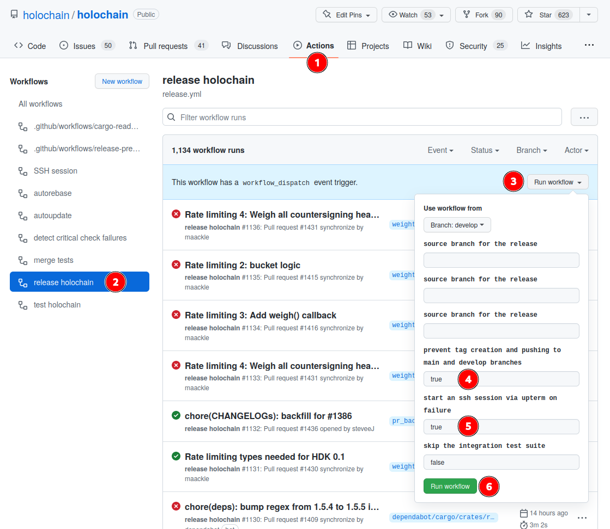

# Release Workflow Guides

## Trigger A Release Manually



This requires you have GitHub credentials with appropriate permissions.

1. Visit https://github.com/holochain/holochain/actions
2. Select the "release holochain" workflow
3. Press the "Run workflow" button
4. Indicate whether this is a dry-run (keep _true_) or a real release (change the field to _false_)
5. Optional: to set up a debug SSH session for debugging failure scenarios change the field to _true_
6. Confirm by clicking on "Run workflow"

## (Permanently) Marking A Crate for Major/Minor/Patch Version Bumps

The _release-automation_ tool parses **each crate**'s _CHANGELOG.md_ file to read these two attributes from the frontmatter:

* `semver_increment_mode`

    This attribute will be removed after each successful release, and can thus be used as a one-time (per-crate) instruction.
* `default_semver_increment_mode`

    This attribute will be retained, and can thus be used to define a permanent (per-crate) configuration.

Both of these can be set to either of _major_, _minor_, _patch_.
If both of them are missing from the frontmatter, [_patch_ is used as the default](https://github.com/holochain/holochain/blob/bc621e3e06e998d35750b2bac6b0e1f0d371c2a2/crates/release-automation/src/lib/common.rs#L150-L154).

### Format
The frontmatter is parsed as YAML and expects a `key: value` attribute format.

Example:

```markdown
---
semver_increment_mode: minor
---

# Changelog

...
```

### Precedence

They interact in the following way:

`semver_increment_mode` | `default_semver_increment_mode` | Version Outcome
--- | --- | ---
not given | not given | fallback to _patch_
not given | given | $default_semver_increment_mode
given | *ignored* | $semver_increment_mode


### Example: hdi 0.1 minor bump

1. Before the next release: [hdi: mark for minor version bump #1550](https://github.com/holochain/holochain/pull/1550/commits)

    A developer proposed a PR for the `develop` branch based upon the decision to bump the hdi's minor version.
    The following shows the diff of the PR.

    1. It adjusts the release-prepare workflow's settings to allow for the resulting versions.
    2. It adds a frontmatter to the hdi's _CHANGELOG.md_ setting the attribute `semver_increment_mode: minor`.

    ```diff
    diff --git a/.github/workflows/release-prepare.yml b/.github/workflows/release-prepare.yml
    index 8c43f29b69..a1693df80e 100644
    --- a/.github/workflows/release-prepare.yml
    +++ b/.github/workflows/release-prepare.yml
    @@ -226,7 +226,7 @@ jobs:
                    --no-verify-pre \
                    --force-tag-creation \
                    --match-filter="^(holochain|holochain_cli|kitsune_p2p_proxy)$" \
    -                --disallowed-version-reqs=">=0.1" \
    +                --disallowed-version-reqs=">=0.2" \
                    --steps=BumpReleaseVersions

                cargo sweep -f
    diff --git a/crates/hdi/CHANGELOG.md b/crates/hdi/CHANGELOG.md
    index 60262e972c..482ccc678e 100644
    --- a/crates/hdi/CHANGELOG.md
    +++ b/crates/hdi/CHANGELOG.md
    @@ -1,8 +1,13 @@
    +---
    +semver_increment_mode: minor
    +---
    +
    # Changelog

    The format is based on [Keep a Changelog](https://keepachangelog.com/en/1.0.0/). This project adheres to [Semantic Versioning](https://semver.org/spec/v2.0.0.html).

    ## Unreleased
    +- Initial minor version bump. This indicates our impression that we have made significant progress towards stabilizing the detereministic integrity layer's API. [\#1550](https://github.com/holochain/holochain/pull/1550)

    ## 0.0.21
    ```

2. The next time a release is triggered on the develop branch (which is the default), the `release-automation` will consider the attribute for the hdi crate.

    In this case, the [following shows a snippet of the version bump commit that was produced](https://github.com/holochain/holochain/pull/1561/commits/1a291fb210f5e9e506339721f3a8a9d5760f3af6):

    ```diff
    diff --git a/crates/hdi/CHANGELOG.md b/crates/hdi/CHANGELOG.md
    index 482ccc678e..475626926e 100644
    --- a/crates/hdi/CHANGELOG.md
    +++ b/crates/hdi/CHANGELOG.md
    @@ -1,13 +1,12 @@
    ----
    -semver_increment_mode: minor
    ----
    -
    # Changelog

    The format is based on [Keep a Changelog](https://keepachangelog.com/en/1.0.0/). This project adheres to [Semantic Versioning](https://semver.org/spec/v2.0.0.html).

    ## Unreleased
    -- Initial minor version bump. This indicates our impression that we have made significant progress towards stabilizing the detereministic integrity layer's API. [\#1550](https://github.com/holochain/holochain/pull/1550)
    +
    +## 0.1.0
    +
    +- Initial minor version bump. This indicates our impression that we have made significant progress towards stabilizing the detereministic integrity layer’s API. [\#1550](https://github.com/holochain/holochain/pull/1550)

    diff --git a/crates/hdi/Cargo.toml b/crates/hdi/Cargo.toml
    index b4bf947dc8..7262cfbb3a 100644
    --- a/crates/hdi/Cargo.toml
    +++ b/crates/hdi/Cargo.toml
    @@ -1,6 +1,6 @@
    [package]
    name = "hdi"
    -version = "0.0.22-dev.0"
    +version = "0.1.0"
    ```

    Note that the release process removed the `semver_increment_mode` attribute so that it doesn't affect the next release.

3. Post-release: [Merge release-20220907.100911 back into develop #1561](https://github.com/holochain/holochain/pull/1561)

    This PR was created automatically by the release process to merge the release changes back into the _develop_ branch.
