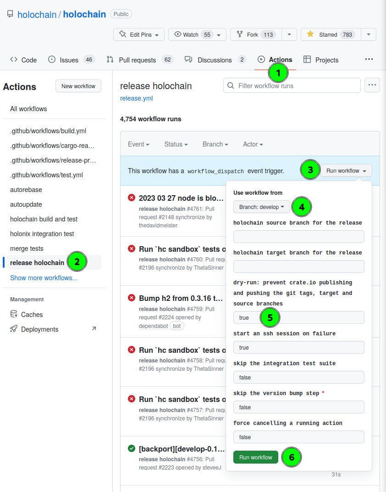

# Release Workflow Guides

## Trigger A Release Manually



This requires your GitHub account to have appropriate permissions.

1. Visit https://github.com/holochain/holochain/actions
2. Select the "release holochain" workflow (pinned workflow)
3. Click the "Run workflow" dropdown
4. (Optional) If creating a release from a maintenance branch, set the source branch to that branch, e.g. _develop-0.6_ to release backported changes for `v0.6.x`.
5. Indicate whether this is a dry-run (keep _true_) or a real release (change the field to _false_)
6. Confirm by clicking on "Run workflow"

## (Permanently) Marking A Crate for Major/Minor/Patch/Pre Version Bumps

The _release-automation_ tool parses **each crate**'s _CHANGELOG.md_ file to read these two attributes from the frontmatter:

* `semver_increment_mode`

    This attribute will be removed after each successful release, and can thus be used as a one-time (per-crate) instruction.
* `default_semver_increment_mode`

    This attribute will be retained, and can thus be used to define a permanent (per-crate) configuration.

If both of them are missing from the frontmatter, [_patch_ is used as the default](https://github.com/holochain/holochain/blob/bc621e3e06e998d35750b2bac6b0e1f0d371c2a2/crates/release-automation/src/lib/common.rs#L150-L154).

For both, this is the complete list of valid variants:
* _minor_ (used to release new latest versions, e.g. 0.6.0-rc.2 -> 0.6.0)
* _patch_ (used to release backports, such as 0.6.1 -> 0.6.2)
* _!pre\_minor \<pre-release-suffix\>_ (e.g. `!pre_minor dev`, used on latest for weekly releases OR e.g. `!pre_minor rc`, used on latest for RC releases before a new minor version bump e.g. 0.6.0-dev.10 -> 0.6.0-rc.0 -> 0.6.0)
* _!pre\_patch \<pre-release-suffix\>_ (e.g. `!pre_patch rc`, used for verifying backports before doing a patch release e.g. 0.6.0 -> 0.6.1-rc.0 -> 0.6.1)

Also, theoretically supported but never yet used:
* _!pre \<pre-release-suffix\>_ (e.g. `!pre dev`)
* _major_
* _!pre\_major \<pre-release-suffix\>_ (e.g. `!pre_major rc`)

**The exclamation mark is required for the values that take a pre-release-suffix**, as the parser relies on [YAML tags for explicit type hints](https://yaml.org/spec/1.2.2/#tags).*

### Syntax
The frontmatter is parsed as YAML and expects a `key: value` attribute format.

Example:

```markdown
---
semver_increment_mode: !pre\_minor "rc"
---

# Changelog

...
```

### Precedence

They interact in the following way:

`semver_increment_mode` | `default_semver_increment_mode` | Version Outcome
--- | --- | ---
not given | not given | fallback to _patch_
not given | given | $default_semver_increment_mode
given | *ignored* | $semver_increment_mode

### Pre-Release-Suffix Handling
For any of the _pre_ modes, if at the time of release a pre-release suffix is found in the version, the outcome depends on the existing suffix:
* if the version **does not already** have a pre-release suffix: bump version according to the requested level, and append `-<pre-release-suffix>.0`
* if the version **does already** have a pre-release suffix:
    * if the **existing suffix is the same** as the requested one:
        * if **it is followed** by a dot and an integer: the integer will be incremented by 1
        * if **it is not followed** by a dot and an integer: ".0" will be added to the suffix
    * if the **existing suffix is different** than the requested one: replace it with `-<pre-release-suffix>.0`

## Changing multiple frontmatters at once

When we plan to change the versions of many or all workspace crates, there's a command that can be used to overwrite the frontmatter of multiple crates' changelogs in one go:

```sh
nix run .#release-automation -- --workspace-path=$PWD --log-level=debug --match-filter=".*" changelog set-frontmatter <(cat <<EOF
(...)
EOF
)
```

The `--match-filter` argument takes a regular expression to select to filter the crate names.
The ellipsis give the position of the new YAML code for the frontmatters.

### Case: Latest `develop` is nearly ready to be released as the next minor version

```sh
nix run .#release-automation -- --workspace-path=$PWD --log-level=debug --match-filter=".*" changelog set-frontmatter <(cat <<EOF
default_semver_increment_mode: !pre_minor rc
EOF
)
```

### Case: The `develop` branch is producing RCs and is ready to be released

```sh
nix run .#release-automation -- --workspace-path=$PWD --log-level=debug --match-filter=".*" changelog set-frontmatter <(cat <<EOF
default_semver_increment_mode: !pre_patch rc
semver_increment_mode: minor
EOF
)
```

### Case: A maintenance branch like `develop-0.6` is ready for a new patch release

```sh
nix run .#release-automation -- --workspace-path=$PWD --log-level=debug --match-filter=".*" changelog set-frontmatter <(cat <<EOF
default_semver_increment_mode: !pre_patch rc
semver_increment_mode: patch
EOF
)
```

### Case: The `develop` branch has been released

Say that 0.6.0 has been released, then `develop` needs to be branched to `develop-0.6` and the `develop` branch needs to
be prepared for `0.7.0-dev.x` development.

```sh
nix run .#release-automation -- --workspace-path=$PWD --log-level=debug --match-filter=".*" changelog set-frontmatter <(cat <<EOF
default_semver_increment_mode: !pre_minor dev
EOF
)
```

Note: the order of branching and changing mode is really important. If the release automation does not see a 0.6.0 release on the branch
then it will try to switch to RC releases for 0.6 and not bump to 0.7.

## Companion change

There is a "safety" feature in `./nix/modules/scripts.nix` with a `--allowed-semver-increment-modes`. This should always be updated
to match the semver increment mode from the frontmatter that you expect to be used.

After using `semver_increment_mode`, which will be automatically removed by the release process, this also needs updating. So for example with:

```yaml
default_semver_increment_mode: !pre_patch rc
semver_increment_mode: patch
```

The `semver_increment_mode` will be removed by the release but the `--allowed-semver-increment-modes` stays as `patch`. So after the release, that flag
needs to be switched back to `!pre_patch rc` or PRs will fail to pass CI.
