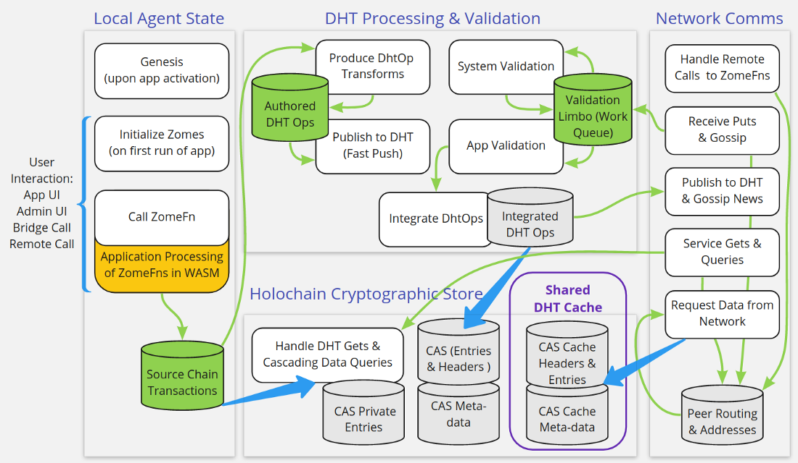

# Holochain Formal Design Elements

Now we turn to a more formal and detailed presentation of the Holochain
system, including assumptions, architecture, integrity guarantees, and
formal state model.

**Purpose of this Section:** To provide an understanding of the functional requirements of Holochain and specify a technical implmentation of the cryptographic state transitions and application processes that enforce Holochain's integrity guarantees. 

## Definition of Foundational Principles
- **Cryptography:** Holochain's integrity guarantees are largely enabled by cryptography. It is used in three main ways.
     - *Hashes:* Data is uniquely identified by its hash which is the key used to retrieve from Content Addressable Stores. 
     - *Signing:* Origination of data (for all storage and network communications) is verified by signing of a hash with a private key.
     - *Encryption:* Data is encrypted at rest and on the wire throughout the system.
- **Agency:** Holochain is agent-centric. Each and every state change is a result of: 1) record of an agent's action 2) signed by the authoring agent, 3) linearly sequenced and timestamped 4) to their local source chain. Each agent is the sole authority for managing its local state (by virtue of controlling their private key required for signing new entries to a hashchain).
- **Accountability:** Holochain is also socio-centric. Each Holochain application defines its set of mutually enforced data integrity rules. Every local state change gets validated by other agents to ensure that it adhered to the rules of that application. Peers also enforce limits on publishing rates, protect against network integrity threats, and can ban rule-breakers by a process we call *warranting*.
- **Data:** Unlike most other decentralized approaches, in Holochain, data does not have first-order, independent, ontological existence. Every record in the shared DHT network space MUST CARRY its provenance from a local source chain as described below. 
- **Provenance:** Each record created in a Holochain application starts as an entry/action pair on someone's local source chain. As such, even when published to the shared DHT, entries must carry the associated action signed by the agent who created it. This means every piece of data carries meta information about where that data came from (who created it in what sequence on the their chain). Note: In other hash-chain based systems Holochain's "actions" are often called entry "headers," which link to the previous headers to create the chain.  In Holochain, while the action contains the provenance and establishes temporal order, their core function is to record an act of agency, that of "speaking" data into existence.
- **State:** State changes in Holochain are local (signed to a local *Source Chain*) and then information about having created a local state change is shared publicly on the DHT. This allows global visibility of local state changes, without a need to manage consensus about a global state, because there is truly no such thing as global state in a system that allows massive, simultaneous, decentralized change.
- **Time:** There is no global time nor absolute sequence of events in Holochain either. No global time is needed for local state changes, and since each local change is stored in a hash chain, we get a clear, immutable, sequence of actions tagged with local timestamps. (Note: For apps that need some kind of time proof to interface with the outside world (e.g. token or certificate expiration timestamps) we plan to provide a timeproof service that replaces the need for centrally trusted timeservers.)

## System Architecture Overview

Unlike monolithic blockchains where every transaction and Dapp run on a single chain, in Holochain every app defines a distinct peer-to-peer encrypted network where one set of rules are mutually enforced by all users.

Holochain operates different sub-systems, each of which function on separate workflows and change models. Even though Holochain functions as a common underlying database on the back-end, the workflows in each sub-system each have different input channels which trigger different transformational processes. Each workflow has distinct structural bottlenecks and security constraints.

Discrete Workflows in separate sub-systems:
1. **Distributed Application:** Apps are compiled and distributed into Web Assembly (WASM) code bundles which we call a DNA. Data integrity is enforced by the structures and validation defined in an app's DNA, which is comprised of data structures, functions, and callbacks packaged in Zomes (short for chromosome) which function like reusable modules.
3. **Local Agent State:** Represented as changes to an agent's state by signing new records, using their private key, to a local hash chain of their action history called a Source Chain. Initial chain genesis happens upon installation/activation, and all following changes result from "zome calls" into the app code.
4. **Global Visibility of Local State Changes:** After data has been signed to a Source Chain it gets published to a Graphing DHT (Distributed Hash Table) where it is validated by the peers who will store and serve it. The DHT is consistently balanced and healed by gossip among the peers.
5. **Network Protocols:** Holochain instantiates the execution of app DNA on each node under the agency identified by the public key, transforming code into a collective networked organism. An agents public key ***is*** their network address, and is used as the to/from target for remote zome calls, signals, publishing, and gossip. Holochain is transport agnostic, and can operate on any network transport protocol which a node has installed for routing, bootstrapping, or proxying connections through NAT and firewalls.

### Some notes on terminology:

#### Biological Language
We have chosen bological language to ground us in the pattern of collective distributed coherence that we observe in biological organisms.  This is a pattern where the agents that comprise an organism (cells), all start with the same ground rules (DNA). Every agent has a copy of the rules that ALL the other agents are playing by and by clearly identify membership in the collective self based on matching DNA. 

This is true of every Holochain DNA which can also be combined together to create a multi-DNA application (with each DNA functioning like distinct micro-service in a more complex application). In a hApp bundle, each DNA file is the complete set of code (WASM) and settings which also become the first genesis entry in the agent's source chain. Therefore, if your first chain entry, does not match my DNA entry, we are not cells of the same network organism. A "zome" is a compositional unit which functions as a code module assembled together as the complete set of an application's DNA.

When a DNA is installed using a public/private keypair, it becomes a "cell" which is identified by the combination of the DNA hash and the public key. Students of biology may recognize ways that our language doesn't fully mesh with their expectations. Please forgive any imprecision with understanding of our intent to build better language for the nature of distributed computing that more closely matches biology than typical mechanistic models.

#### The Conductor
Much of the discussion below is from the perspective of a single DNA, which is the core unit in Holochain that provides a set of integrity guarantees for running an application in a distributed context.  However, Holochain can also be seen as micro-service provider with each DNA providing one micro-service.  From this perspective, a Holochain node is a running process that manages many connections to many DNAs simultaneously, both from user interfaces initiating actions, as well as from other nodes communicating with DNA instances retrieving DHT data.  Thus, we call a Holochain node the **Conductor** as it manages the information flows from "outside" (UI calls) and from "inside" (network interactions) as they flow into and out of the may DNA instances running code.  This terms was chosen as it suggests the feel of musical cordination of a group as well as the conduit of an electrical flow.  Please see the [Holochain Implementation Spec](https://hackmd.io/FINMThETQUmCrNn8uXlr9w#Ribosome-the-Application-%E2%80%9Cvirtual-machine%E2%80%9D) for a more detailed on how a complete Holochain Conductor must be built.

## Integrity Guarantees

Within the context of the Basic Assumptions and the System Architecture both described above, the Holochain system makes the following specific integrity guarantees for a given Holochain DNA and network:
 1. **State:** Agent's actions are unambiguiously ordered from any given action back to genesis, unforgeable, non-repudiable, and immutable (accomplished via local hash chains called a Source Chain - because all data within the network is sourced from these chains.)
 2. **Self-Validating Data:** Because all DHT data is stored at the hash of its content, if the data returned from a request does not hash to the address you requested, you know you've received altered data.
 3. **Self-Validating Keys:** Agents declare their address on the network as their public key. You can confirm any network communication is valid by checking the signature using the from address as the pubkey.
 4. **Termination of Execution:** No node can be hijacked in to infinite loops by non-terminating application code in either remote zome call or validation callbacks. We use WASM metering to guarantee a max execution budget to address the the Halting Problem.
 5. **Deterministic Validation:** Ensure that only deterministic functions (ones that will always get the same result no matter who calls them on what computer) are available in integrity zomes. An interim result of "missing dependency" is also acceptable, but final evaluation of valid/invalid status for each datum, must be consistent across all nodes.
 6. **Strong Eventual Consistency:** Despite network partitions, for any nodes who are an authority (or become one at any point) will arrive at the same state (validation result) for each data element. This is ensured by the DHT functioning as a CRDT.
 8. **"0 of N" Trust Model:** Holochain is immune to "majority attacks" because any node can always validate data for themself independent of what any other nodes say. See this [Levels of Trust Diagram](https://miro.medium.com/max/1248/0*k3o00pQovnOWRwtA)
 9. **Data Model Scalability:** Because of the sharding of DHT storage and valdiation, the computing power and overall throughput for an application scales linearly as more users join the app. Global consensus systems can't utilize the compute power of new nodes to increase throughput / work done.
 10. **Atomic zome calls:** Multiple writes in a single zome call will all be committed in a single sql transaction or all fail together, if they fail the zome call they will report an error, and if the zome call fails the writes will be rolled back
 

## Source Chain: Formal State Model
Data in a Holochain application is created by agents changing their local state. This state is stored as an append-only hash chain. Only state changes originated by that agent are stored to their chain (or state changes that they are party to in a multi-agent action). Source chains are NOT a representation of global state or changes that others are originating, but only a sequential history of local state changes authored by one agent.

The structure of a Source Chain is akin to a hash chain which uses headers to connect a series of entries. Each record in the chain is a triple, containing the new entry, the action (header), and the signature of the hash of the action.

Since the action contains the prior action hash, current entry hash, author agent public key, each record is a tamper-proof atomic data element. Anyone can hash the entry content to make sure it hasn't been tampered with. And they can hash the action data to ensure it matches the signature by the agent's public key. Also, an action's sequence in the chain, as well the timestamp in the action are immutable.

Data in Holochain is kept in Content Addressable Stores which are key-value stores where the key is the hash of the content. This makes all content self-validating, whether served locally or remotely over the DHT. Data can be retrieved by the record hash, or by the entry hash.

The code that comprises a Holochain application is categorized into two different types of zomes: 

1. **Integrity Zomes:** which provide the immutable portion of the app's code that:
  - identifies the types of entries and links able to be committed in the app, 
  - defines the structure of data entries, and 
  - defines the validation code each node runs for each type of entry or link. 
2. **Coordination Zomes:** which can be modified or added to while an app is live, contain various CRUD operations for entries and links, functions related to following graph links and querying collections of data on the DHT, and any auxillary functionality someone wants to bundle in their application.

Each application running on Holochain is uniquely identified by a DNA hash of the integrity zome code compiled to Web Assembly (WASM) and bundled with additional settings and properties required for that app. 

*Application Note: Multiple DNA-level apps can be bundled together like interoperating micro-services in a larger Holochain Application (hApp), but the locus of data integrity and enforcement remains at the single DNA level, so we will stay focused on that within this document.*

There are three main types of Zome functions:
1. ( $z _f$ ) zome functions which do not alter state.
2. ( $Z _f$ ) that can be called to produce state changes, as well as the 
3. Validation Rules ( $V _R$ ) for enforcing data integrity of any such state changes (additions, modifications, or deletions of data). 

$$
\begin{aligned}
 z _{f_1} \dots z _{f_x} &\in \text{Coordinator DNA} \\
 Z _{f_1} \dots Z _{f_x} &\in \text{Coordinator DNA} \\
 V _{R_1} \dots V _{R_x} &\in \text{Integrity DNA} 
\end{aligned}
$$

*Note about Functions: Most zome calls don't need to be in the immutable mutually enforced rules included in the DNA hash (Integrity Zomes) because since there's no way to verify what functions were involved in producing data, other nodes can only look at the outputs produced to ensure data is structured and validated correctly.*

The first entry of each agent's source chain contains the app DNA. The hash of this initial DNA entry is what demonstrates that each agent possessed identical and complete copies of the the rules by which they will manage and mutually enforce all state changes. If a node has a different DNA hash, then it is in a different network playing by a different set of rules.

**Genesis:** The genesis process for each agent creates three initial entries. 

1. The DNA is stored in the first chain entry with action $C _0$ like this:

$$
C _0 = WASM
\begin{Bmatrix}
h {_{DNA}} \\
e _\text{DNA}
\end{Bmatrix}
$$

2. Followed by a "Proof of Membership" which other nodes can use to validate whether the agent is allowed to join the application network. It can be left empty if the application membrane is completely open and it doesn't check or use proofs of membership.

$$
C _1 = 
\begin{Bmatrix}
    h _\text{jp} \\ 
    e _\text{jp}
\end{Bmatrix}
$$

3. And finally the agent's Public Key that they have generated, which also becomes their address on the network and DHT. Keys are the only entry type for which the hash algorithm is equality (meaning the hash of a key is the key itself, so it cannot contain any content other than the public key).

$$
C _2 = 
\begin{Bmatrix}
    h _\text{K}  \\ 
    e _\text{K}
\end{Bmatrix}
$$

**Initialization:** After genesis, DNAs may have also provided initialization functions which are all executed the first time an inbound zome call is received and run. This delay in initialization is to allow time for the application to have joined and been validated into the network, just in case initialization functions may need to retrieve some data settings from the network.

Initialization functions may write entries to the chain, or send messages or any variety of actions, but after each DNA and each zome (according the order they were bundled together) have succesfully completed their initializations, an Init_Complete entry is written to the source chain, so that it will not re-attempt initialization to prevent any redundant side-effects.

**Ongoing Operation via Calls to Zome Functions:** All changes following genesis and initialization occur by Zome call to a function contained in the DNA in the following form:

$$ Z_c = \{Z_f, Params, CapTokenSecret \} $$

Where $Z_f$ is the Zome function being called, $Params$ are the parameters passed to that Zome function and $CapTokenSecret$ references the capabilities token which explicitly grants the calling agent the permission to rights to call that function.

Based on the interface connection and state when the Zome call is received we construct a context which provides additional necessary parameters to validate state transformation:

$$ Context(Z_c) = \{Provenance, C_n \} $$

$Provenance$ contains the public key of the caller along with their cryptographic signature of the call as proof that it originated from the agent controlling the associated private key.

$C_n$ is the source Chain's latest entry at the time we begin processing the zome call. The validation functions will all be called "as at" the state $C_n$. Since multiple simultaneous zome calls might be made, tracking the "as at" enables detection of another call having successfully changed the state of the chain before this call completed its execution, therefore validation may need to be tried again on the new chain state. 

#### Zome Calls & Changing Local State

First, Holochain's "subconscious" security system confirms the $CapTokenSecret$ permits the agent identified by the $Provenance$ to call the targeted function. It returns a failure if not.  Otherwise it proceeds to further check if the function was explicitly permitted by the referenced capability token.

*Note on Permissions: Capabilities tokens function similarly to API keys. Cap token grants are explicitly saved as private entries on the granting agent's source chain and contain a secret used to call them. Cap token claims are saved on the calling agent's chain so they can be used later to make calls that execute the capabilities that have been granted.*

If the Zome call is one which alters local state (distinct from a call that just reads from the chain or DHT state), we must construct a bundle of state changes that will attempt to be appended to the source chain in an atomic/transactional commit:

$$ \Delta C ( C _n, Z _c ) \to C _{n+1} $$

where a Chain is comprised of paired entries, $e^x$, and actions, $h^x$: (actions were formerly called headers and we're still using this *h* in our formal symbols)

$$
 C _{n+1} - C _n = 
\begin{Bmatrix}
    h ^\prime, h ^{\prime\prime} \dots {h ^x}  \\ 
    e ^\prime, e ^{\prime\prime} \dots {e ^x} 
\end{Bmatrix}
$$

*If the validation rules pass* for these state changes **and the current top of chain is still in state $C_n$** then the transaction is committed to the persistent store. and the chain updated as follows:

$$
C _n = 
\begin{Bmatrix}
    h ^\text{DNA} \dots h ^n  \\ 
    e ^\text{DNA} \dots e ^n
\end{Bmatrix}
$$

*If the validation rules fail,* the deltas will be rejected with an error. Also, if the chain state has changed from $C_n$, we can 
 1. return an error (e.g. "Chain head has moved"), 
 2. restart the validation process at a new "as at" $C_n^\prime$ , or 
 3. commit anyway (with only a rewrite of action hashes) if the commit is identified as "stateless" in terms of validation dependencies (e.g. a tweet generally isn't valid or invalid because of prior tweets/state changes). We refer to any application entry types that can be committed this way as allowing "relaxed chain ordering"
 
*Note about Action/Entry Pairs: This paired structure of the source chain holds true for all application data. However, certain action types defined by the system integrate **additional fields inside the action** instead of creating a seperate entry which would add unnecessary gossip on the DHT*.

### Countersigning

So far we have discussed individual agents taking Actions and recording them on their Source Chains.  It is also desireable for subsets of agents to mutually consent to a single Action by atomically recording the Action to their chains.  We acheive this through a process of Countersigning whereby a session is initiated during which the subset of agents builds an Action that all participating agents sign and during which all agents can be assured that no other agent will take some other action in the mean time.  

There are two ways of managing the countersigning process:
1. Assigned completion: where one preselected agent (whom we call the Enzyme) acts as a coordinator for ensuring completion of a signing session.
2. Randomized completion: where any agent in the neighborhood of the Entry+SessionData (which is random) can report completion.

Additionally there are two contexts for making these atomic changes across multiple chains:
1. when the change is about parties who are accountable to the change, i.e. their role is structurally part of the state change, as in spender/receiver of a mutual credit transaction
2. when the change simply requires witnessing by M of N parties, i.e. all that's needed is a "majority" of a group to agree on the atomicity.  This allows a kind of "micro-consensus" to be implemented in parts of an application.  It's an affordance for applications to implement a set of "super-nodes" that manage a small bit of consensus.  Note that in our current implementation M of N countersigning allways uses an Enzyme to manage the session completion

#### Countersigning Constraints

1. All actions must be signed together, one action is not enough to validate an atomic state change across multiple chains.
   - All parties must be able to confirm the validity of each others's participation in that state change (meaning each chain is in a valid state to participate in the role/capacity which they are engaging -- e.g. a spender has the credits they're spending at that point in their chain)
2. The moment the enzyme or random session completer agent holds and broadcasts all the signed and valid actions then everyone is committed
3. It should not be possible for a participant to withhold and/or corrupt data and damage/fork/freeze another participant's source chain 
4. It should not require many network fetches to calculate state changes based on countersignatures (i.e. it should be possible `get` a unified logical unit -- e.g. multiple actions on a single entry hash address on the DHT)
5. Participants can NOT move their chain forward without a provable completion of the process, and there IS a completion of the process in a reasonable time frame
    - The countersigning process should work as close as possible to the standard single-agent "agent-centric network rejection of unwanted realities", anyone who moves forward before the process has timed out or completed, or anyone who tries to submit completion outside of timeouts will be detected as a bad fork

#### Countersigning Flow

Here is a high level summary of how a countersigning flows:

0. alice sends preflight to bob, carol, etc. they accept, freeze their chain, and return current top-hash of chain.
    - The preflight includes all information required to negotiate the session with the entry itself, for example:
        - entry type => feeds into "what kind of countersigning are we doing?"
        - update/delete references => what are we agreeing to modify?
        - session times => is this going to brick my chain if i accept the start time? am i willing to freeze this long?
        - the agents and roles => are these the parties I expected to be signing with?
        - app data => can point to preauths etc. (optional)
    - A callback/remote call is run to approve/deny preflight requests
1. alice builds a session entry that includes start/end times etc. and sends the entry to every other agent to countersign
2. each agent builds unsigned actions for themselves and every other agent and runs full record validation against each action, as though they were authoring as that agent
3. after everything validates, each agent sends their signed actions to the entry DHT neighbourhood
4. the enzyme or random session completer reveal all the signed headers as a complete set
5. each signer can check for themselves that the set is valid simply by comparing against the session entry and preflight info, they do NOT have to rerun validation, they only need to check signatures and integrity of the header set data
6. involved entry neighbours proceed with entry validation and then move to the store and serve phase for themselves

### Natural Architectural Constraints in Source Chain Workflow
[TODO: ACB, should we really have this section here, or should it be in the implementation doc.]

Since we can only have one open write handle to a file or a single write transaction committing to the database, the step where these kinds of final state changes are written serves as a natural bottleneck to concurrency. However, there are other things (such as read access, network connections, UI requests) which can safely happen in paralell / concurrently. We address these patterns of linearity and concurrency here.

**Inputs:** Queue requests with a tokio thread pool to service them. Requests always happen through an authenticated connection with the conductor and may originate from these sources:

1. User interfaces app ports (via localhost)
2. Bridged calls from other DNAs
3. Remote calls and messages sent/received via the network
4. The Conductor's Admin port/UI 
5. Scheduled tasks (which run under the agency of the agent that who parked the task for later execution)

**Outputs:** Zome calls which update state must finalize state changes via the linear process of validating all the commits queued in the scratch space which checks that validation passes and $C_n$ / "as at" constraints are enforced before producing an ACID database transaction of the bundled changes. Zome calls which simply READ information are not bottlenecked by this constraint and return their results without "as at" constraints.

**Concurrency:** For performance, Holochain's linear write queue must not block read-only calls and operations which will return results based on the *Context* in which they executed.

There is no need for a global context where Zome calls being processed should need to know about other Zome calls in process. And the Source Chain authoring workflow should be completely segregated from other workflows such as updating the DHT, network peering data, or ephemeral caching. (i.e. No need for a global state across all these activites.)

[*Note: this diagram shows separate databases where tables may be used.*](/GUQFez2MQSaHB-t4knDH1w)

## Graphing DHT: Formal State Model

The Holochain DHT performs a topological transform on the set of the various agents' source chains into a content-addressable graph database (GDHT) sharded across many nodes who each function as authoritative sources for retrieving certain data. 

**Fundamental write constraint:** The DHT can never be "written" to directly. All data enters the DHT **only** by having been committed to an agent's source chain and then gets **transformed** from validated local chain state into the elements required for GDHT representation and lookup.

**Structure of GDHT Entries:** The DHT is a content-addressable space where each entry is found at the address which is the hash of its content. In addition, any address in the DHT can have meta data attached to it. This meta-data is not part of the content being hashed. 

*Note about Hashing: Holochain uses 256 bit Blake2b hashes with the exception of one entry type, AgentPubKey, which uses `equal()` as its hash function. In other words, **the content of the AgentPubKey is identical to its hash**. This preserves content-addressibility but also enables agent keys to function as self-proving identifiers for network transport and cryptographic functions like signing or encryption.*

**DHT Addresses:** Actions and Entries from source chains can be retrieved from the DHT by either the ActionHash or EntryHash. The DHT `get()` function returns a full Record with most relevant action/entry pair. Structurally, Actions "contain" their referenced entries so that pairing is obvious. However, Actions are attached as meta-data at an EntryHash, and there could be many Actions which have created the same Entry content. A `get_details()` function returns all of the ActionHashes, whereas the `get()` function returns the oldest undeleted ActionHash in the pair.

**Agent Addresses & Agent Activity:** Technically an AgentPubKey functions as both a content address (which is never really used because performing a `get()` on the key just returns the key you used to get it) and a network address to `send()` communications to that agents. But in addition to the content of the key stored on the DHT is metadata about that agent's chain activity. In other words, a `get_agent_activity()` request retrieves meta-data about their chain records and chain status.
 
Formally, the entire GDHT is represented as:

$$
\begin{aligned}
GDHT &= \{DHT_{e_1}, \dots, DHT_{e_x} \} \\
DHT_e &= \{C, \{m_1, \dots m_x\}\} \\
C &= \text{addressable content}\\ 
m_x &= \text{meta data}
\end{aligned}
$$

There may be arbitrary types of meta data. Some important ones are: 
$$
\begin{aligned}
m_{context} &= \{action, \dots \} \\
m_{link} &= \{type, address(DHT_e) \} \\
m_{linkset} &= \{m_{link_1}, \dots, m_{link_x}\}
\end{aligned}
$$

In this context, we refer to an entry with link meta-data as a **Base** and entries that the link points to as **Targets**.

**Topological Transform Operations:** A source chain is a hashchain of actions with entries, but these are transformed into DHT operations which ask DHT nodes to perform certain validation and storage tasks, because we are transforming from authorship history, to a distributed graph. Chain entries and actions are straightforwardly stored in the DHT, but more sophisticated operations are also perfomred on existing DHT entries. For example, when updating/deleting entries, or adding/removing links, additional meta-data is registered in parts of the DHT to properly weave a graph. 

#### Graph Transformation

While source chain entries and actions contain all the information needed to construct a graphing DHT, the data must be restructured from a linear local chain under single authority and location, to a graph across many nodes with multiple/redundant authorities and locations which can be discovered under any relevant hash. In this section we focus only on the graph transformations. The next section will focus on the transformation of authoritative sources for data.

The linking/graphing aspects must be constructed from the state changes committed to source chains.

Below is a table that formally details the DHT transformation process, where:

 - $E$ is an ENTRY chain record which contains an action as well as a separate **application-defined entry**
 - $e$ is a chain record which performs an operation on prior content without adding a new entry. Such operations can only be performed on $E$ type entries.
 - $E ^\prime$ is the previously existing $E$ type entry which a new entry is operating on (in the case of an update or delete, for example).
 - $K_a$ refers to the DHT entry which is the public key of the author whose chain this entry was published from. *EVERY chain entry involves placing a link to the action of that entry as agent activity meta-data on the author's Key. This enables rapid reconstruction of source chains from the DHT space (and enables detection of spamming, chain forking, and other agent misbehavior).*
 - $h_E$ or $h_e$ refers to the action for the Entry or record being created/gossiped.

The chart below shows how each chain action yields multiple DHT transforms. Remember a transform corresponds with a way that the DHT state needs to be transformed (which is *always* additive) as a result of a Chain Action. Each action results in sending the named transforms to specific DHT basis neighborhoods, instructing those nodes to validate and store their respective portion of the state changes. Because the DHT is a **Graphing** database, what is added is either a node or an edge. A node is the hash (the DHT key). An edge is meta-data stored at a given hash pointing to some other hash and is depicted with a labeled arrow pointing to the target hash (base $\xrightarrow{\text{label}} target$)

Note that there is one action $\mathsf{update\_entry}()$ that creates two additions at the same basis address, and thus it is indicated as a set ($\{\}$) in the chart.  

*Note about Transform Names: The transforms that start with "Store" are storing content addressable data, i.e. added content at a hash. The transforms which start with "Register" are adding meta-data to the specified hash address.*

### DHTOps constructed from Source Chain Data
| Chain Action | Transforms Sent : Data they add to the DHT |
|--------------|-------------------------------|
|$\mathsf{create\_entry}(E)$|  $$\begin{aligned}\mathsf{RegisterAgentActivity} &: K_a \xrightarrow{\text{header}} h_{E}  \\ \mathsf{StoreRecord} &: h_E \\ \mathsf{StoreEntry} &: E \end{aligned}$$ |--------------------------------------------------
|$\mathsf{update\_entry}(h_{E^\prime}, E)$| $$\begin{aligned}\mathsf{RegisterAgentActivity}&: K_a   \xrightarrow{\text{header}} h_E \\ \mathsf{StoreRecord}&:h_E \\ \mathsf{StoreEntry}&:\{E,   E\xrightarrow{\text{updates}} E^\prime \} \\ \mathsf{RegisterEntryUpdate}&:  E ^\prime \xrightarrow{\text{updated to}} E \\ \mathsf{RegisterRecordUpdate}&: h_E ^\prime \xrightarrow{\text{updated to}}E\end{aligned}$$ |--------------------------------------------------
|$\mathsf{delete\_entry}(h_{E^\prime})$| $$\begin{aligned}\mathsf{RegisterAgentActivity}&: K_a \xrightarrow{\text{header}} h_e \\ \mathsf{StoreRecord}&:h_e \\ \mathsf{RegisterEntryDelete}&:  E ^\prime \xrightarrow{\text{deleted by}}h_e \\ \mathsf{RegisterRecordDelete}&: h_{E ^\prime} \xrightarrow{\text{deleted by}}h_e \end{aligned}$$ |---------------------------------------------------------
|$\mathsf{create\_link}(base, target, tag)$| $$\begin{aligned}\mathsf{RegisterAgentActivity}&: K_a \xrightarrow{\text{header}} h_e \\ \mathsf{StoreRecord}&:h_e \\ \mathsf{RegisterCreateLink}&: E ^\prime _{base} \left\{ \xrightarrow{\text{tag}}target \right\} _\text{live} \end{aligned}$$ |--------------------------------------------------
|$\mathsf{delete\_link}(h_{CreateLink})$|  $$\begin{aligned}\mathsf{RegisterAgentActivity}&: K_a  \xrightarrow{\text{header}} h_e \\ \mathsf{StoreRecord}&:h_e \\ \mathsf{RegisterDeleteLink}&:  E ^\prime  _{base} \left\{ h _{CreateLink} \right\}_\text{tombstone} \end{aligned}$$ |

For viable eventual consistency in a gossipped DHT, all actions must be idempotent and additive/monotonic (where the deletion of an entry doesn't actually delete the entry, it marks it deleted, and removal of a link adds the removal to a CRDT style "tombstone set").

#### Authority Transformation

In the case of source chain entries (and actions), it is fairly obvious that the author who created them is the **author**itative source. But part of translating from a series of local chain states to a resilient global data store, involves identifying which nodes in the network become the responsible authorities for holding which DHT content.

Most existing DHT frameworks simply have nodes volunteer to hold specific content, and then use a tracking layer to map between which nodes hold which content. But this allows content to disappear arbitrarily and also creates imbalanced dynamics between people who consume content and people who serve it (leechers & seeders). Since Holochain is designed to function more like a distributed database than a file system, it needs to ensure resilience and permanence of data elements, as well as load balancing and reasonable performance, on a network where nodes are likely coming online and going offline frequently.

As such, Holochain doesn't rely on nodes to volunteer to hold specific entries, but rather to volunteer aggregate capacity (e.g. holding 100MB of data rather then arbitrarily specified entries). Authoring nodes are responsible for publishing entries from their local DHT instance to other nodes on the network who will become responsible for serving that data.

Like most DHT architectures, Holochain uses a "nearness" algorithm to compute the "distance" distance between the SHA-256 hash address of DHT entries and the 256-bit public key (network address) of nodes. Basically, it is the responsibility of the *nearest* nodes to hold entries. 

Holochain's validating, graphing, gossiping DHT implementation is called rrDHT. 

rrDHT is designed with a few performance requirements/characteristics in mind.

 1. Must have a compact and computationally simple representational model for identifying which nodes are responsible for which content, and which nodes actually hold which content. (A **"world model"** of what is where.)
 2. **Lookup speeds** at least as fast as Kademlia's binary trees ( O nlog(n) ). Current testing shows an average of 3 hops/queries to reach an authority with the data.
 3. **Adjustable** to be both resilient and performant across many DHT compositional make-ups (% of reliable/unreliable nodes, different network topologies, high/low usage volumes, etc.)

**World Model:** First, rrDHT converts SHA-256 hashes to smaller 32-bit integers (via XOR of 8 x 32-bit segments). The original address is still kept with the content, so collisions in the smaller space are a non-issue. So each node has an address in this 32-bit space (based on their 256 bit agent key) as well as an indicator of how large an arc from their agent address a node holds. With the introduction of rrDHT's quantized gossip this is stored in 8 bit integers representing the current size of quantum chunks and the number of chunks held. 

The rrDHT storage arc defines the range of entries stored and guarantee rapid resolution of any key to an authoritative source. And the quantizing of the boundaries of arc chunks allows us to XOR hashes within that address range for a compressed comparitor to see if different nodes hold the same data. As an added compression bonus, rrDHT can also quantize across historical segments of time to quickly identify across quantized space-time representations where gaps in mutually held data are between nodes.

#### DHT Communication Protocols

So far we have described the topological transformation between the agentic holding of state on a source chain into the shape of the shared data for making that state visible via the DHT.  Additionally we have described an addressing scheme that makes data deterministically retreivable.  Now we must describe the communication protocols that allow agents to come and go on the network while still maintaining the necessary data redundancy.  The Holochain DHT ...

##### Fast Push vs. Slow Heal
Publish(multicast) --> author collects validation receipts [TODO: ACB]
Gossip(direct) --> ongoing aliveness & resilience based on uptime data [TODO: ACB]

## Security & Safety

There are many contributing factors to what allows systems to live up to the varying saftey and security requirements of their users.  In general, the approach taken in Holochain is to provide affordances that take into account the many types of real-world costs that result from adding security and safety to systems such that application developers can match the trade-offs of those costs to their application context.  The integrity guarantees listed above detail the fundamental data saftey that Holochain applications provide.  Two other important facets of system security and safety come from:

1. Gating access functions that change state, for which Holochain provides a unified and flexible Object Capabilities model
2. Detecting and Blocking participation of bad actors, for which Holochain provides the affordances of validation and warranting.

### Cryptographic Object Capabilities

To use a Holochain application end-users must trigger zome calls that effect local state changes on their Source Chains.  Additionally zome functions can make calls to other zome functions on remote nodes in the same app, or to other DNAs runing on the same conductor.  All of these calls must happen in the context of some kind of permissioning system.  Holochain's security model for calls is based on the [Object-capability](https://en.wikipedia.org/wiki/Object-capability_model) security model, but for a distributed cryptographic context in which we use cryptographic signatures to prove the necessary agency for taking action.

Access is thus mediated by Capability grants of 4 types:

- author: only the agent owning the source change can make the zome call
- assigned: only the named agent(s) can make the zome call
- transferrable: anybody with the given token can make the zome call 
- unrestricted: anybody can make the zome call (no secret nor proof of authorized key needed to use this capability)

All zome calls must be signed and also take a required capabilty claim parameter that MUST be checked by the system for making the call. Agents record capability grants on their source chains and distribute them as necessary according to the applications needs.  Receviers of grants can record them as claims (usually as a private entry) on their chains for later lookup.  The "agent" type grant is just the agent's public key.

### Warrants
[TODO: ACB please review]
We take that by definition, in a fully distributed system, there is no way for a single agent to control the actions of other agents that comprise the system, i.e. what makes an agent an agent is it's ability to act independantly.  This provides the challenge of how agents deal with "bad-actor" agents, as they can not be controlled directly.  In Holochain "bad-action" is primarily defined by attempts by agents to act outside of a DNAs Validation rules.  Because a DNA's network ID is defined by the hash of its integrity zomes (which includes the validation rules) we can assume that every agent has these rules, and thus can deterministicly run these rules to know if any action is a "bad-action".  Note that some of these validation rules that reveal bad actions may not just be about the structure or content of data commitited to chains, but can also be about behavior, for example about the rate of committing entries, which allows protection against denial of service attacks.

Once a bad-action had been identified by validation, it is an app-specific concern about what should be done given that specific bad-action.  In some contexts, warnings with escalating responses may make sense, in others, immediate expulsion may make sense.  The underlying affordance that Holochain provides for this, is the emmission and distribution of Warrants.  A Warrant must include proof-of-behavior, that is the claim about which the warrant is being issued.  This might be, for example, a signed `Action` that fails validation, or it might be two signed `Actions` that are issued for commit with timestamps below the rate-limit.

Some Warrants can be issued automatically by the Holochain system itself, i.e. when DNA reports a validation failure.  Additionally Warrants can be sent programmatically as a result of user action. 

Abstractly, when a Warrant is received there are two fundamental actions to be taken:

1. Gossiping about that warrant to others.  Because warrants are commited to agents source chain (like any other data), there are no extra capabilities to add to Holochain, as gossiping is already a fundamental capability of the system. The most important agents on the DHT to gossip with about a warrant are the ones responspible for storing agent activity information.
2. Taking the context-specific action specified by the warrant.  Such action may be system defined, or application defined, but Holochain necessarily includes the capacity for adding the agent against whom the warrant has been issued to a block-list such that all further interactions with that agent will be ignored.  It is possible to issue warrants that not only block interaction with the specific DNA agent, but also with the underlying transport address for that agent.  Other context-specific actions that may be taken when Warrants are received include user-notification for approval of blocking, or simply as notification. 

## Cross-DNA Composibility
Holochain is designed to be used to build hosts of micro-services that can be assembled into applications.  We expect DNAs to be written that assume the existence of other long-running DNAs and make calls to them via the agency of a user having installed both DNAs on their node.  The Capabilities security model described above makes sure this kind of calling is safe and can only happen when permisions to do so have been explicitly granted in a given context.   The HDK `call` function provides an affordance to allow specification of the DNA by hash when making the call so the Holochain node can make a zome call to that DNA and return the result to the calling node.  

### Holochain Resource Locators
Additionally we define a standard by which to refer to entries in DNAs called the Holochain Resource Locator (HRL) for application developers to use in passing around references to application data.

[DRAFT OF SPEC TO BE MOVED HERE](https://hackmd.io/@hololtd/HyWnqhTnY)
[TODO:ACB/EHB]

## Holochain Implementation

Given the above formal description of our local state model (Source Chain) and shared data model (Graphing DHT) we can now present a high-level implementation specification of different components of the Holochain architecture.  The components include:

- App Virtual Machine (Ribosome)
- State Manager
- P2P Networking (Kitsune)
- Application Interface (Conductor API)
- Secure Private Key Management (lair-keystore)

Please see the [Holochain Implementation Spec](https://hackmd.io/FINMThETQUmCrNn8uXlr9w) for details.