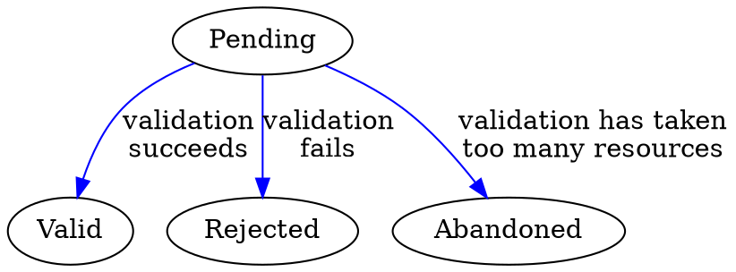
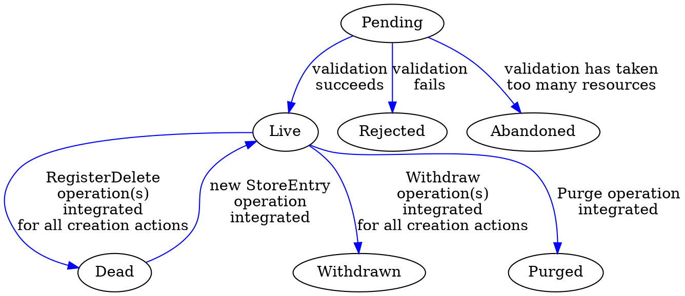

\onecolumngrid
# Appendix A: Holochain Implementation Spec v0.3.0 Beta

So far we have described the necessary components of a scalable coordination and collaboration system. We have built an "industrial strength" implementation of this pattern suitable for real-world deployment, under the name Holochain. Here we describe the technical implementation details that achieve the various requirements described above.

This specification assumes that the reader has understood context and background provided in the [Holochain Formalization](hwp_4_formal.md).

Given the formal description from that document of our local state model (Source Chain) and shared data model (Graph DHT) we can now present a high-level implementation specification of the different components of the Holochain architecture:

* App Virtual Machine (Ribosome)
* Workflows
* P2P Networking (Kitsune)
* The Conductor
* Secure Private Key Management (lair-keystore)

**Note on code fidelity**: The code in this appendix may diverge somewhat from the actual implementation, partially because the implementation may change and partially to make the intent of the following code clearer and simpler. For instance, specialized value types that are merely wrappers around a vector of bytes are frequently replaced with `Vec<u8>`.

## Ribosome: The Application "Virtual Machine"

We use the term **Ribosome** to the name of part of the Holochain system that runs the DNA's application code. Abstractly, a Ribosome could be built for any programming language as long as it's possible to deterministically hash and run the code of the DNA's Integrity Zome such that all agents who possess the same hash can rely on the validation routines and structure desribed by that Integrity Zome operating identically for all. (In our implementation we use WebAssembly (WASM) for DNA code, and [Wasmer](https://wasmer.io/) as the runtime that executes it.)

The Ribosome, as an application host, must expose a minimal set of functions to guest applications to allow them to access Holochain functionality, and it should expect that guest applications implement a minimal set of callbacks that allow the guest to define its entry types, link types, validation functions, and lifecycle hooks for both Integrity and Coordinator Zomes. We will call this set of provisions and expectations the Ribosome Host API.

Additionally, it is advantageous to provide software development kits (SDKs) to facilitate the rapid development of Integrity and Coordinator Zomes that consume the Ribosome's host functions and provide the callbacks it expects.

In our implementaion we provide SDKs for Integrity and Coordinator Zomes written in the [Rust programming language](https://rust-lang.org) as Rust crates: the [Holochain Deterministic Integrity (HDI) crate](https://docs.rs/hdi/) facilitates the development of Integrity Zomes, while the [Holochain Development Kit (HDK) crate](https://docs.rs/hdk/) facilitates the development of Coordinator Zomes.

### Ribosome/Zome Interop ABI

Because WebAssembly code can only interface with its host system via function calls that pass simple numeric scalars, an application binary interface (ABI) must be defined to pass rich data between the Ribosome host and the zome guest.

The host and guest expose their functionality via named functions, and the input and output data of these functions (a single argument and a return value) are passed as a tuple of a shared memory pointer and a length. This tuple is a reference to the serialized data that makes up the actual input or output data.

The caller is responsible for serializing the expected function argument and storing it in a shared memory location in the WebAssembly virtual machine instance, then passing the location and length to the callee.

The callee then accesses the data at the given location, attempts to deserialize it, and operates on the deserialized result.

The same procedure is followed for the function's return value, with the role of the caller and callee reversed.

Because errors may occur when the callee attempts to access and deserialize its argument data, the callee MUST return (or rather, serialize, store, and return the address and length of) a Rust `Result<T, WasmError>` value, where `WasmError` is a struct of this type:

```rust
struct WasmError {
    file: String,
    line: u32,
    error: WasmErrorInner,
}

enum WasmErrorInner {
    PointerMap,
    Deserialize(Vec<u8>),
    Serialize(SerializedBytesError),
    ErrorWhileError,
    Memory,
    Guest(String),
    Host(String),
    HostShortCircuit(Vec<u8>),
    Compile(String),
    CallError(String),
    UninitializedSerializedModuleCache,
}
```

The type `Result<T, WasmError>` is aliased to `ExternResult<T>` for convenience, and will be referred to as such in examples below.

Our implmementation provides a `wasm_error!` macro for the guest that simplifies the construction of an error result with the correct file and line number, along with a `WasmErrorInner::Guest` containing an application-defined error string.

Our implementation also provides various macros to abstract over the mechanics of this process, wrapping host functions and guest callbacks, automatically performing the work of retrieving/deserializing and serializing/storing input and output data, and presenting more ergonomic function signatures (in the case of host functions) or allowing application developers to write more ergonomic function signatures (in the case of guest functions). In particular, the `#[hdk_extern]` procedural macro, when applied to a guest function, handles the conversion of the bytes stored in the memory to a map of arguments, passes those arguments, and handles the conversion of the return value to bytes stored in memory.

Hereafter, our examples of host and guest functions will assume the use of ergonomic function signatures.

### Handling Guest Functions

For any guest function, the Ribosome MUST prepare a context which includes the list of host functions which may be called by the given type of function:

* Guest functions which are only intended to establish valid entry and link types (`entry_defs` and `link_types`) MUST NOT be given access to any host functions.
* Guest functions which are expected to give a repeatable result for the input arguments (`validate`) MUST NOT be given access to host functions whose return values vary by context.
* Guest functions which are expected to not change source chain state (`validate`, `genesis_self_check`, `post_commit`) MUST NOT be given access to host functions which change state.

For any guest functions which are permitted to change source chain state (`init`, `recv_remote_signal`, zome functions, and scheduled functions), the Ribosome MUST:

1. Prepare a context which includes the aforementioned host function access, as well as the current source chain state and a temporary "scratch space" into which to write new source chain state changes.
2. Check the state of the source chain; if it does not contain an `InitZomesComplete` action, run the `init` callback and remember any state changes in the scratch space.
3. If no `init` callbacks fail, proceed to call the guest function, remembering any state changes in the scratch space.
4. Produce DHT transforms from the state changes in the scratch space.
5. Attempt to validate the DHT transforms.
6. If all the DHT transforms are valid, persist the Actions in the scratch space to the source chain.
7. If the called function was a zome function, return the zome function call's return value to the caller.
8. Spawn the `post_commit` callback in the same Coordinator Zome as the called guest function and attempt to publish the DHT transforms to the DHT.

State changes in a scratch space MUST be committed atomically to the source chain; that is, all of them MUST be written or fail as a batch.

### HDI

The Holochain Deterministic Integrity (HDI) component of the Holochain architecture comprises the functions and capacities that are made available to app aevelopers for building their Integrity Zomes.

**Integrity Zomes** provide the immutable portion of the app's code that:

* identifies the types of entries and links able to be committed in the app,
* defines the structure of data entries, and
* defines the validation code each node runs for DHT operations produced by actions to create, update, and delete the aforementioned entry types, as well as for a small number of system types.

The following data structures, functions and callbacks are necessary and sufficient to implement an HDI:

#### Core Holochain Data Types

##### The `Action` Data Type

All actions MUST contain the following data elements (with the exception of the `Dna` action which, because it indicates the creation of the first chain entry, does not include the `action_seq` nor `prev_action` data elements):

```rust
{
    author: AgentHash,
    timestamp: Timestamp,
    action_seq: u32,
    prev_action: ActionHash,
    ...
}
```

Additionally, the HDI MUST provide a signed wrapper data structure that allows integrity checking in validation:

```rust
struct Signed<T>
where T: serde::Serialize {
    signature: Signature,
    data: T,
}
```

Implementation detail: Theoretically all actions could point via a hash to an entry that would contain the "content" of that action. But because many of the different actions entries are system-defined, and they thus have a known structure, we can reduce unnecessary data elements and gossip by embedding the entry data for system-defined entry types right in the action itself. However, for application-defined entry types, because the structure of the entry is not known at compile time for Holochain, the entry data must be in a separate data structure. Additionally there are a few system entry types (see below) that must be independantly retrieveable from the DHT, and thus have their own separate system-defined variant of the `Entry` enum type.

The action types and their additional data fields necessary are:

* `Dna`: indicates the DNA hash of the validation rules by which the data in this source chain agrees to abide.

    ```rust
    struct Dna {
        ...
        hash: DNAHash,
    }
    ```

* `AgentValidationPkg`: indicates the creation of an entry holding the information necessary for nodes to confirm whether an agent is allowed to participate in this DNA. This entry is contained in the action struct.

    ```rust
    struct AgentValidationPkg {
        ...
        membrane_proof: Option<SerializedBytes>
    }
    ```

* `InitZomesComplete`: indicates the creation of the final genesis entry that marks that all zome init functions have successfully completed (see the [HDK section](#hdk) for details), and the chain is ready for commits. Requires no additional data.

* `Create`: indicates the creation of an application-defined entry, or a system-defined entry that needs to exist as content-addressed data.

    ```rust
    struct Create {
        ...
        entry_type: EntryType,
        entry_hash: EntryHash,
    }

    // See the section on Entries for the defintion of `EntryType`.
    ```

* `Update`: Mark an existing entry and its creation action as updated by itself. In addition to referencing the new entyr, the action data points to the old action and its entry. As this is an entry creation action like `Create`, it shares many of the same fields.

    ```rust
    struct Update {
        ...
        original_action_address: ActionHash,
        original_entry_address: EntryHash,
        entry_type: EntryType,
        entry_hash: EntryHash,
    }
    ```

* `Delete`: Marks an existing entry and its creation action as deleted. The entry containing the hashes of the action and entry to be deleted are contained in the action struct.

    ```rust
    struct Delete {
        ...
        deletes_address: ActionHash,
        deletes_entry_address: EntryHash,
    }
    ```

* `CreateLink`: Indicates the creation of a link.

    ```rust
    struct CreateLink {
        ...
        base_address: AnyLinkableHash,
        target_address: AnyLinkableHash,
        zome_index: u8,
        link_type: u8,
        tag: Vec<u8>,
    }
    ```

* `DeleteLink`: Indicates the marking of an existing link creation action as deleted.

    ```rust
    struct DeleteLink {
        ...
        base_address: AnyLinkableHash,
        link_add_address: ActionHash,
    }
    ```

* `CloseChain`: indicates the creation of a final chain entry with data about a new DNA version to migrate to.

    ```rust
    struct CloseChain {
        ...
        new_dna_hash: DnaHash,
    }
    ```

* `OpenChain`: indicates the creation of an entry with data for migrating from a previous DNA version.

    ```rust
    struct OpenChain {
        ...
        prev_dna_hash: DnaHash,
    }
    ```

All of the CRUD actions SHOULD include data to implement rate-limiting so as to prevent malicious network actions. In our implementation, all CRUD actions have a `weight` field of the following type:

```rust
struct RateWeight {
    bucket_id: u8,
    units: u8,
}
```

An application may specify an arbitrary number of rate limiting 'buckets', which can be 'filled' by CRUD actions until they reach their capacity, after which point any further attempts to record an action to the Source Chain will fail until the bucket has drained sufficiently. Each bucket has a specified capacity and drain rate, which the Integrity Zome may specify using a `rate_limits` callback.

The Integrity Zome may also weigh a given CRUD action using a `weigh` callback, which allows both the author and the validating authority to deterministically assign a weight to an action.

**Note:** This feature is not completed in the current implementation.

##### The `Entry` Data Type

There are four main entry types, defined in an `EntryType` enum:

```rust
enum EntryType {
    AgentPubKey,
    App(AppEntryDef),
    CapClaim,
    CapGrant,
}
```

There is also an `Entry` enum that holds the entry data itself, with five variants that correspond to the four entry types:

```rust
enum Entry {
    Agent(AgentHash),
    App(SerializedBytes),
    CounterSign(CounterSigningSessionData, SerializedBytes),
    CapClaim(CapClaim),
    CapGrant(ZomeCallCapGrant),
}
```

(Note that the `App` and `CounterSign` variants are both intended for application-defined entries.)

* `AgentPubKey` is used in the second genesis record of the source chain, a `Create` action that publishes the source chain author's public key to the DHT for identification and verification of authorship.

* `App` indicates that the entry data contains arbitrary application data of a given entry type belonging to a given integrity zome:

    ```rust
    struct AppEntryDef {
        entry_index: u8,
        zome_index: u8,
        visibility: EntryVisibility,
    }

    struct EntryVisibility {
        Public,
        Private,
    }
    ```

    Its entry data can be of either `Entry::App` or `Entry::CounterSign`, where the inner data is an aribtrary vector of bytes (typically a serialized data structure). If the data is `Entry::CounterSign`, the bytes are accompanied by a struct that gives the details of the countersigning session (this struct will be dealt with in the section on countersigning).

    Note that in both these cases the data is stored using a serialization that is declared by the `entry_defs()` function of the HDI.

* `CapClaim` indicates that the entry data contains the details of a granted capability that are necessary to exercise such capability:

    ```rust
    struct CapClaim {
        tag: String,
        grantor: AgentHash,
        secret: CapSecret,
    }
    ```

* `CapGrant` indicates that the entry data contains the details of a capability grant in the following enum and the types upon which it depends:

    ```rust
    struct ZomeCallCapGrant {
        tag: String,
        access: CapAccess,
        functions: GrantedFunctions,
    }

    enum CapAccess {
        Unrestricted,
        Transferable {
            secret: [u8; 64],
        },
        Assigned {
            secret: [u8; 64],
            assignees: BTreeSet<AgentHash>,
        },
    }

    enum GrantedFunctions {
        All,
        Listed(BTreeSet<(ZomeName, FunctionName), Global>),
    }

    struct ZomeName(str);

    struct FunctionName(str);
    ```

##### The `Record` Data Type

A record is just a wrapper for an `Action` and an `Entry`. Because an entry may not be present in all contexts or for all action types, the `RecordEntry` enum wraps the possible entry data in an appropriate status.

```rust
struct Record {
    action: SignedHashed<Action>,
    entry: RecordEntry,
}

enum RecordEntry {
    Present(Entry),
    Hidden,
    NA,
    NotStored,
}
```

##### Links

A `CreateLink` action completely contains the relational graph information, which would be considered the link's entry data if it were to have a separate entry. Note that links are typed for performance purposes, such that when requesting links they can be retrieved by type. Additionally links have tags that can be used as arbitrary labels on-graph as per the application's needs. The `zome_index` is necessary so that the system can find and dispatch the correct validation routines for that link, as a DNA may have multiple integrity zomes.

```rust
struct Link {
    base_address: AnyLinkableHash,
    target_address: AnyLinkableHash,
    zome_index: ZomeIndex,
    link_type: LinkType,
    tag: LinkTag,
}

struct LinkTag(Vec<u8>);
```

Comparing this structure to a Resource Description Framework (RDF) triple:

* The `base_address` is the subject.
* The `target_address` is the object.
* The `zome_index`, `link_type`, and `tag` as a tuple are the predicate.

##### The `Op` Data Type

The `Op` types that hold the chain entry transform data that is published to different portions of the DHT (formally described in [section four](hwp_4_formal.md#graph-transformation)) are listed below. The integrity zome defines a validation callback for the entry and link types it defines, and is called with an `Op` enum variant as its single paramater, which indicates the DHT perspective from which to validate the data. Each variant holds a struct containing the DHT operation payload:

* `StoreRecord`: executed by the record (action) authorities to store data. It contains the record to be validated, including the entry if it is public.

    ```rust
    struct StoreRecord {
        record: Record,
    }
    ```

* `StoreEntry`: executed by the entry authorities to store data for any entry creation action, if the entry is public. It contains both the entry and the action in a struct similar to `Record`, with the exception that the `entry` field is always populated.

    ```rust
    struct StoreEntry {
        action: SignedHashed<EntryCreationAction>,
        entry: Entry,
    }

    // The following variants hold the corresponding Action struct.
    enum EntryCreationAction {
        Create(Create),
        Update(Update),
    }
    ```

* `RegisterUpdate`: executed by both the entry and record authorities for the _old_ data to store metadata pointing to the _new_ data. This op collapses both the `RegisterUpdatedRecord` and `RegisterUpdatedContent` transforms into one for simplicity. It contains the update action as well as the entry, if it is public.

    ```rust
    struct RegisterUpdate {
        update: SignedHashed<Update>,
        new_entry: Option<Entry>,
    }
    ```

* `RegisterDelete`: executed by the entry authorities for the _old_ entry creation and its entry to store metadata that tombstones the data. This opp collapses both the `RegisterDeletedEntryAction` and `RegisterDeletedBy` transforms into one. It contains only the delete action.

    ```rust
    struct RegisterDelete {
        delete: SignedHashed<Delete>,
    }
    ```

* `RegisterAgentActivity`: executed by agent activity authorities (the peers responsible for the author's AgentID entry) to validate the action in context of the author's entire source chain. At the application developer's discretion, this operation can also contain the entry data.

    ```rust
    struct RegisterAgentActivity {
        action: SignedHashed<Action>,
        cached_entry: Option<Entry>,
    }
    ```

* `RegisterCreateLink`: executed by the authorities for the link's base address to store link metadata.

    ```rust
    struct RegisterCreateLink {
        create_link: SignedHashed<CreateLink>,
    }
    ```

* `RegisterDeleteLink`: executed by the authorities for the link's base address to store metadata that tombstones the link.

    ```rust
    struct RegisterDeleteLink {
        delete_link: SignedHashed<DeleteLink>,
        create_link: CreateLink,
    }
    ```

#### Hash Data Structures

Holochain relies on being able to distinguish and use hashes of the various Holochain fundamental data types. The following hash types must exist:

* `ActionHash`: The Blake2b-256 hash of a serialized `Action` variant, used for DHT addressing.
* `AgentHash`: The Ed25519 public key of an agent, used for referencing the agent.
* `DhtOpHash`: The Blake2b-256 hash of a serialized `DhtOp` variant, used for comparing lists of held operations during syncing between authorities.
* `DnaHash`: The hash of all the integrity zomes and associated modifiers, when serialized in a consistent manner.
* `EntryHash`: The hash of the bytes of a `Entry` variant, according to the hashing rules of that variant (the Blake2b-256 hash of the serialized variant in all cases except `Entry::Agent`, which is the public key). Used for DHT addressing.
* `ExternalHash`: This type is used for creating links in the graph DHT to entities that are not actually stored in the DHT. It is simply an arbitrary 32 bytes.
* `WasmHash`: The Blake2b-256 hash of the WebAssembly bytecode of a zome, used by the Ribosome to look up and call zomes.

Furthermore, there are two composite hash types, which are unions of two or more of the preceding hash types:

* `AnyDhtHash`, the enum of `EntryHash` and `ActionHash`, is the union of all 'real' addressable content on the DHT; that is, content that can actually be written.
* `AnyLinkableHash`, the enum of `EntryHash`, `ActionHash`, and `ExternalHash`, is the union of all real and imaginary addressable content on the DHT; that is, it includes external hashes.

All of these hash types are derived from a generic struct, `HoloHash<T>`, which holds the three-byte hash type signifier and the 32 bytes of the hash (the 'core' of the hash), along with the 4-byte network location. For those hash types that are the basis of addressable content (`AnyDhtHash`), the hash alone is sufficient to uniquely identify a DHT basis from which a network location can be computed, while the type signifier ensures type safety in all struct fields and enum variant values that reference the hash. The four-byte network location is computed from the hash core and stored along with the preceding 36 bytes as a matter of convenience.

The three-byte type signifiers are as follows:

| Type           | Hexadecimal | Base64 |
|----------------|-------------|--------|
| `ActionHash`   | `0x842924`  | `hCkk` |
| `AgentHash`    | `0x842024`  | `hCAk` |
| `DhtOpHash`    | `0x842424`  | `hCQk` |
| `DnaHash`      | `0x842d24`  | `hC0k` |
| `EntryHash`    | `0x842124`  | `hCEk` |
| `ExternalHash` | `0x842f24`  | `hC8k` |
| `WasmHash`     | `0x842a24`  | `hCok` |

#### Application Type Definition Callbacks

In order for the Ribosome to successfully dispatch validation to the correct integrity zome, each integrity zome in a DNA should register the entry and link types it is responsible for validating. The HDI MUST allow the integrity zome to implement the following functions:

* `entry_defs(()) -> ExternResult<EntryDefsCallbackResult>`: Called to declare the type and structure of the application's entry types. The return value is:

    ```rust
    enum EntryDefsCallbackResult {
        Defs(EntryDefs),
    }

    struct EntryDefs(Vec<EntryDef>);

    struct EntryDef {
        id: EntryDefId,
        visibility: EntryVisibility,
        required_validations: u8,
        cache_at_agent_activity: bool,
    }

    enum EntryDefId {
        App(str),
        CapClaim,
        CapGrant,
    }
    ```

    This function can be automatically generated using the `#[hdk_entry_types]` procedural macro on an enum of variants that each hold a type that can be serialized and deserialized.

* `link_types(()) -> ExternResult<Vec<u8>>`: called to declare the link types that will be used by the application. This function can be automatically generated using the `#[hdk_link_types]` procedural macro on an enum of all link types.

Note: In our implementation these functions are automatically generated by Rust macros. This gives us the benefit of consistent, strongly typed entry and link types from the point of definition to the point of use. Thus it's very easy to assure that any application data that is being stored adheres to the entry and link type declarations.

#### Functions Necessary for Application Validation

The HDI MUST allow for hApp developers to specify a `validate(Op) -> ExternResult<ValidateCallbackResult>` callback function for each integrity zome. This callback is called by the Ribosome in the correct context for the Op as described above in the graph DHT formalization, so that the data associated with the `Op` will only be stored if it meets the validation criteria.

The HDI MUST also allow for hApp developers to specify a `genesis_self_check(GenesisSelfCheckData) -> ExternResult<ValidateCallbackResult>` callback for each integrity zome. This callback is called by the Ribosome _before_ attempting to join a network, to perform sanity checks on the genesis records. This callback is limited in its ability to validate genesis data, because it MUST NOT be able to make network calls. Nevertheless, it is useful to prevent a class of errors such as incorrect user entry of membrane proofs from inadvertently banning a new agent from the network. The input payload is defined as:

```rust
struct GenesisSelfCheckData {
    membrane_proof: Option<SerializedBytes>,
    agent_key: AgentHash,
}
```

The HDI MUST provide the following functions for application authors to retrieve dependencies in validation:

* `must_get_agent_activity(AgentPubKey, ChainFilter) -> ExternResult<Vec<RegisterAgentActivity>>`: This function allows for deterministic validation of chain activity by making a hash-bounded range of an agent's chain into a dependency for something that is being validated. The second parameter is defined as:

    ```rust
    struct ChainFilter {
        chain_top: ActionHash,
        filters: ChainFilters,
        include_cached_entries: bool
    }

    enum ChainFilters {
        ToGenesis,
        Take(u32),
        Until(HashSet<ActionHash>),
        Both(u32, HashSet<ActionHash>),
    }
    ```

    The vector element type in the return value is defined as:

    ```rust
    struct RegisterAgentActivity {
        action: SignedHashed<Action>,
        cached_entry: Option<Entry>,
    }
    ```

* `must_get_action(ActionHash) -> ExternResult<SignedHashed<Action>`: Get the `Action` at a given action hash, along with its author's signature.

* `must_get_entry(EntryHash) -> ExternResult<HoloHashed<Entry>>`: Get the `Entry` at a given hash.

* `must_get_valid_record(ActionHash) -> ExternResult<Record>`: Attempt to get a _valid_ `Record` at a given action hash; if the record is marked as invalid by any contacted authorities, the function will fail.

The HDI MUST implement two hashing functions that calculate the hashes of `Action`s and `Entry`s so that hash values can be confirmed in validation routines.

* `hash_action(Action) -> ActionHash`
* `hash_entry(Entry) -> EntryHash`

The HDI MUST implement two introspection functions that return data about the DNA's definition and context that may be necessary for validation:

* `dna_info() -> ExternResult<DnaInfo>`: returns information about the DNA:

    ```rust
    struct DnaInfo {
        name: String,
        hash: DnaHash,
        modifiers: DnaModifiers,
        zome_names: Vec<ZomeName>,
    }

    struct DnaModifiers {
        network_seed: String,
        properties: SerializedBytes,
        origin_time: Timestamp,
        quantum_time: Duration,
    }
    ```

* `zome_info() -> ExternResult<ZomeInfo>`: returns information about the integrity zome:

    ```rust
    struct ZomeInfo {
        name: ZomeName,
        id: ZomeIndex,
        properties: SerializedBytes,
        entry_defs: EntryDefs,
        extern_fns: Vec<FunctionName>,
        zome_types: ScopedZomeTypesSet,
    }

    struct ZomeIndex(u8);

    struct ScopedZomeTypesSet {
        entries: Vec<(ZomeIndex, Vec<EntryDefIndex>)>,
        links: Vec<(ZomeIndex, Vec<LinkType>)>,
    }

    struct EntryDefIndex(u8);

    struct LinkType(u8);
    ```

Note: `properties` consists of known application-specified data that is specified at install time (both at the DNA and zome levels) that may be necessary for validation or any other application-defined purpose. Properties are included when hashing the DNA source code, thus allowing parametrized DNAs and zomes.

The HDI MUST implement a function that validation code can use to verify cryptographic signatures:

* `verify_signature<I>(AgentPubKey, Signature, I) -> ExternResult<bool> where I: Serialize`: Checks the validity of a signature (a `Vec<u8>` of bytes) upon the data it signs (any type that implements the `Serialize` trait, allowing it to be reproducibly converted into a vector of bytesa, gainst the public key of the agent that is claimed to have signed it.

### HDK

The HDK contains all the functions and callbacks needed for Holochain application developers to build their Coordination Zomes. Note that the HDK is a superset of the HDI. Thus all of the functions and data types available in the HDI are also available in the HDK.

#### Initialization

The HDK MUST allow application developers to define an `init() -> ExternResult<InitCallbackResult>` callback in each coordinator zome, which

#### Arbitrary API Functions (Zome Functions)

The HDK MUST allow application developers to define and expose functions in their Coordinator Zomes with arbitrary names, input payloads, and return payloads that serve as the application's API. While the content of the return payload of these functions may be arbitrary data, it MUST be wrapped in a `Result<T, WasmError>`, where `T` is the return payload.

As function calls across the host/guest interface only deal with arbitrary bytes stored in memory address ranges, the HDK SHOULD provide an abstraction to allow developers to define functions in a more natural manner, with typed input and return payloads. We have provided a `#[hdk_extern]` prodecural macro that facilitates this abstraction, wrapping the following function definition with the necessary machinery to load and deserialize the input data and serialize and store the return data.

The Conductor MUST also receive calls to these zome functions, enforce capability restrictions, dispatch the call to the correct WASM module, and handle side effects, error conditions, and the called function's return value. These calls MAY come from external clients, other zomes in the same cell, other cells in the same application, or other agents in the same DHT.

#### Post-Commit Callback

The HDK MUST allow application developers to define a `post_commit(Vec<SignedAction>) -> ExternResult<()>` callback in their Coordinator Zomes which receives a sequence of Actions committed to the source chain. The purpose of this callback is to provide a way of triggering follow-up activities when an atomic commit has definitively succeeded in persisting new Actions.

The Conductor MUST call this callback with all the Actions successfully committed in any guest function that is permitted to persist state changes to the source chain. The Conductor MUST NOT permit this callback to make further state changes, but it MAY allow it to access any other host functions, including calling or scheduling other functions which may make state changes in their own call contexts.

#### Chain Operations

The HDK MUST implement the following functions that create source chain entries:

* `create(CreateInput) -> ExternResult<ActionHash>`: Records the creation of a new application entry. The `CreateInput` parameter is defined as:

    ```rust
    struct CreateInput {
        entry_location: EntryDefLocation,
        entry_visibility: EntryVisibility,
        entry: Entry,
        chain_top_ordering: ChainTopOrdering,
    }

    enum EntryDefLocation {
        App(AppEntryDefLocation),
        CapClaim,
        CapGrant,
    }

    struct AppEntryDefLocation {
        zome_index: ZomeIndex,
        entry_def_index: EntryDefIndex,
    }

    enum ChainTopOrdering {
        Relaxed,
        Strict,
    }
    ```

    The `EntryVisibility` parameter specifies whether the entry is private or should be published to the DHT, and the `ChainTopOrdering` parameter specifies whether the call should fail if some other zome call with chain creation actions completes before this one, or whether it's ok to automatically replay the re-write the action on top of any such chain entries.

    In our implementation, the `create` function accepts any value that can be converted to a `CreateInput`, allowing most of these fields to be populated by data that was generated by the `#[hdk_entry_types]` amcro and other helpers. This is accompanied by convenience functions for `create` that accept app entries, capability grants, or capability claims.

* `update(UpdateInput) -> ExternResult<ActionHash>`: Records the marking of an existing entry and its creation action as updated. Requires the `ActionHash` that created the original entry to be provided. The `UpdateInput` parameter is defined as:

    ```rust
    struct UpdateInput {
        original_action_address: ActionHash,
        entry: Entry,
        chain_top_ordering: ChainTopOrdering,
    }
    ```

    Many fields necessary for `create` are unnecessary for `update`, as the new entry is expected to match the entry type and visibility of the original. Similar to `create`, in our implementation there are convenience functions to help with constructing `UpdateInputs` for app entries and capability grants.

* `delete(DeleteInput) -> ExternResult<ActionHash>`: Records the marking of an entry and its creation action as deleted. The `DeleteInput` parameter is defined as:

    ```rust
    struct DeleteInput {
        deletes_action_hash: ActionHash,
        chain_top_ordering: ChainTopOrdering,
    }
    ```

* `create_link(AnyLinkableHash, AnyLinkableHash, ScopedLinkType, LinkTag) -> ExternResult<ActionHash>`: Records the creation of a link of the given `ScopedLinkType` between the hashes supplied in the first and second arguments, treating the first hash as the base and the second as the target. The fourth `LinkTag` parameter is a struct containing a `Vec<u8>` of arbitrary application bytes.

* `delete_link(ActionHash) -> ExternResult<ActionHash>`: Records the marking of a link creation action as deleted, taking the original link creation action's hash as its input.

* `query(ChainQueryFilter) -> ExternResult<Vec<Record>>`: search the agent's local source chain according to a query filter returning the `Record`s that match. The `ChainQueryFilter` parameter is defined as:

    ```rust
    struct ChainQueryFilter {
        sequence_range: ChainQueryFilterRange,
        entry_type: Option<Vec<EntryType>>,
        entry_hashes: Option<HashSet<EntryHash>>,
        action_type: Option<Vec<ActionType>>,
        include_entries: bool,
        order_descending: bool,
    }

    enum ChainQueryFilterRange {
        // Retrieve all chain actions.
        Unbounded,
        // Retrieve all chain actions between two indexes, inclusive.
        ActionSeqRange(u32, u32),
        // Retrieve all chain actions between two hashes, inclusive.
        ActionHashRange(ActionHash, ActionHash),
        // Retrieve the n chain actions up to and including the given hash.
        ActionHashTerminated(ActionHash, u32),
    }
    ```

#### Capabilites Management

The HDK includes convenience functions over `create`, `update`, and `delete` for operating on capability grants and claims:

* `create_cap_grant(ZomeCallCapGrant) -> ExternResult<ActionHash>`
* `create_cap_claim(CapClaim) -> ExternResult<ActionHash>`
* `update_cap_grant(ActionHash, ZomeCallCapGrant) -> ExternResult<ActionHash>`
* `delete_cap_grant(ActionHash) -> ExternResult<ActionHash>`

In addition to these, a function is provided for securely generating capability secrets:

* `generate_cap_secret() -> ExternResult<[u8; 64]>`

It is the application's responsibility to retrieve a stored capability claim using a host function such as `query` and supply it along with a remote call to another agent. As the Conductor at the receiver agent automatically checks and enforces capability claims supplied with remote call payloads, there is no need to retrieve and check a grant against a claim.

#### DHT Data Retrieval

* `get(AnyDhtHash, GetOptions) -> ExternResult<Option<Record>>`: Retrieve a `Record` from the DHT by its `EntryHash` or `ActionHash`. The content of the record return is dependent on the type of hash supplied:
    * If the hash is an `Entry` hash, the authority will return the `entry` content paired with its oldest-timestamped `Action`.
    * If the hash is an `Action` hash, the authority will return the specified action.

    The `GetOptions` parameter is defined as:

    ```rust
    struct GetOptions {
        strategy: GetStrategy,
    }

    enum GetStrategy {
        Network,
        Local,
    }
    ```

    If `strategy` is `GetStrategy::Network`, the request will always go to other DHT authorities, unless the the requestor is an authority for that basis hash themselves. If `strategy` is `GetStrategy::Local`, the request will always favor the requestor's local cache and will return nothing if the data is not cached.

* `get_details(AnyDhtHash, GetOptions) -> ExternResult<Option<Details>>`: Retrieve all of the addressable data and metadata at a basis hash. The return value is a variant of the following enum, depending on the data stored at the hash:

    ```rust
    enum Details {
        Record(RecordDetails),
        Entry(EntryDetails),
    }

    struct RecordDetails {
        record: Record,
        validation_status: ValidationStatus,
        deletes: Vec<SignedHashed<Action>>,
        updates: Vec<SignedHashed<Action>>,
    }

    enum ValidationStatus {
        // The `StoreRecord` operation is valid.
        Valid,
        // The `StoreRecord` operation is invalid.
        Rejected,
        // Could not validate due to missing data or dependencies,
        // or an exhausted WASM execution budget.
        Abandoned,
        // The action has been withdrawn by its author.
        Withdrawn,
    }

    struct EntryDetails {
        entry: Entry,
        actions: Vec<SignedHashed<Action>>,
        rejected_actions: Vec<SignedHashed<Action>>,
        deletes: Vec<SignedHashed<Action>>,
        updates: Vec<SignedHashed<Action>>,
        entry_dht_status: EntryDhtStatus,
    }

    enum EntryDhtStatus {
        // At least one `StoreEntry` operation associated with the entry is valid, and at least one entry creation action associated with it has not been deleted.
        Live,
        // All entry creation actions associated with the entry have been marked as deleted.
        Dead,
        // All `StoreEntry` operations are waiting validation.
        Pending,
        // All `StoreEntry` operations associated with the entry are invalid.
        Rejected,
        // All attempts to validate all `StoreEntry` operations associated with the entry hvae been abandoned.
        Abandoned,
        // All entry creation actions associated with the entry have been withdrawn by their authors.
        Withdrawn,
        // The entry data has been purged.
        Purged,
    }
    ```

* `get_links(GetLinksInput) -> ExternResult<Vec<Link>>`: Retrieve a list of links that have been placed on any base hash on the DHT, optionally filtering by the links' types and/or tags. The returned list contains only live links; that is, it excludes the links that have `DeleteLink` actions associated with them. The `GetLinksInput` parameter is defined as:

    ```rust
    struct GetLinksInput {
        base_address: AnyLinkableHash,
        link_type: LinkTypeFilter,
        get_options: GetOptions,
        tag_prefix: Option<Vec<u8>>,
        after: Option<Timestamp>,
        before: Option<Timestamp>,
        author: Option<AgentHash>,
    }

    enum LinkTypeFilter {
        // One link type
        Types(Vec<(ZomeIndex, Vec<LinkType>)>),
        // All link types from the given integrity zome
        Dependencies(Vec<ZomeIndex>),
    }
    ```

* `get_link_details(AnyLinkableHash, LinkTypeFilter, Option<LinkTag>, GetOptions) -> ExternResult<LinkDetails>`: Retrieve the link creation _and_ deletion actions at a base. The return value is defined as:

    ```rust
    struct LinkDetails(Vec<(SignedActionHashed, Vec<SignedActionHashed>)>);
    ```

    where each element in the vector is a `CreateLink` action paired with a vector of any `DeleteLink` actions that apply to it.

* `count_links(LinkQuery) -> ExternResult<usize>`: Retrieve only the count of live links matching the link query.

* `get_agent_activity(AgentPubKey, ChainQueryFilter, ActivityRequest) -> ExternResult<AgentActivity>`: Retrieve the activity of an agent from the agent's neighbors on the DHT. This functions similar to `query`, but operates on the source chain of an agent _other_ than the requestor. The `ActivityRequest` parameter is defined as:

    ```rust
    enum ActivityRequest {
        Status,
        Full,
    }
    ```

    The `AgentActivity` return value is defined as:

    ```rust
    struct AgentActivity {
        valid_activity: Vec<(u32, ActionHash)>,
        rejected_activity: Vec<(u32, ActionHash)>,
        status: ChainStatus,
        highest_observed: Option<(u32, ActionHash)>,
        warrants: Vec<Warrant>,
    }

    enum ChainStatus {
        Empty,
        Valid(ChainHead),
        Forked(ChainFork),
        Invalid(ChainHead),
    }

    struct ChainHead {
        action_seq: u32,
        hash: ActionHash,
    }

    struct ChainFork {
        fork_seq: u32,
        first_action: ActionHash,
        second_action: ActionHash,
    }
    ```

    Depending on the value of the `ActivityRequest` argument, `status` may be the only populated field.

* `get_validation_receipts(GetValidationReceiptsInput) -> ExternResult<Vec<ValidationReceiptSet>>`: Retrieve information about how 'persisted' the DHT transforms for an Action are. This is meant to provide end-user feedback on whether an agent's authored data can easily be retrieved by other peers. The input argument is defined as:

    ```rust
    struct GetValidationReceiptsInput {
        action_hash: ActionHash,
    }
    ```

    The return value is defined as a vector of:

    ```rust
    struct ValidationReceiptSet {
        // The DHT transform hash that this receipt is for.
        op_hash: DhtOpHash,
        // The type of the op that was validated.
        // This represents the underlying operation type and does not map one-for-one to the `Op` type used in validation.
        op_type: String,
        // Whether this op has received the required number of receipts.
        receipts_complete: bool,
        // The validation receipts for this op.
        receipts: Vec<ValidationReceiptInfo>,
    }
    ```

#### Introspection

* `agent_info() -> ExternResult<AgentInfo>`: Get information about oneself (that is, the agent currently executing the zome function) and one's source chain, where the return value is defined as:

    ```rust
    struct AgentInfo {
        agent_initial_pubkey: AgentHash,
        agent_latest_pubkey: AgentHash,
        chain_head: (ActionHash, u32, Timestamp),
    }
    ```

* `call_info() -> ExternResult<CallInfo>`: Get contextual information about the current zome call, where the return value is defined as:

    ```rust
    struct CallInfo {
        provenance: AgentHash,
        function_name: FunctionName,
        // A snapshot of the source chain state at zome call time.
        as_at: (ActionHash, u32, Timestamp),
        // The capability grant under which the call is permitted.
        cap_grant: CapGrant,
    }
    ```

* `dna_info() -> ExternResult<DnaInfo>` (see HDI)
* `zome_info() -> ExternResult<ZomeInfo>` (see HDI)

#### Modularization and Composition

Zomes are intended to be units of composition for application developers. Thus zome functions MUST be able to make calls to other zome functions, either in the same zome or in other zomes or even DNAs:

* `call<I>(CallTargetCell, ZomeName, FunctionName, Option<CapSecret>, I) -> ZomeCallResponse where I: Serialize`: Call a zome function in a local cell, supplying a capability and a payload containing the argument to the receiver. The `CallTargetCell` parameter is defined as:

    ```rust
    enum CallTargetCell {
        // Call a function in another cell by its unique conductor-local ID,
        // a tuple of DNA hash and agent public key.
        OtherCell(CellId),
        // Call a function in another cell by the role name specified in the app manifest. This role name may be qualified to a specific clone of the DNA that fills the role by appending a dot and the clone's index.
        OtherRole(String),
        // Call a function in the same cell.
        Local,
    }

    struct CellId(DnaHash, AgentPubKey);
    ```

#### Clone Management

The HDK SHOULD implement the ability for cells to modify the running App by adding, enabling, and disabling clones of existing DNA.

* `create_clone_cell(CreateCloneCellInput) -> ExternResult<ClonedCell>`: Create a clone of an existing DNA installed with the App, specifying new modifiers and optionally a membrane proof. The input parameter is defined as:

    ```rust
    struct CreateCloneCellInput {
        // The ID of the cell to clone.
        cell_id: CellId,

        // Modifiers to set for the new cell.
        // At least one of the modifiers must be set to obtain a distinct hash for
        // the clone cell's DNA.
        modifiers: DnaModifiersOpt<YamlProperties>,
        // Optionally set a proof of membership for the clone cell.
        membrane_proof: Option<MembraneProof>,
        // Optionally a name for the DNA clone
        name: Option<String>,
    }

    struct DnaModifiersOpt<P> {
        network_seed: Option<String>,
        properties: Option<P>,
        origin_time: Option<Timestamp>,
        // The smallest size of time regions for historical gossip.
        quantum_time: Option<Duration>,
    }

    type MembraneProof = SerializedBytes;
    ```

    Implementations MUST NOT enable the clone cell until `enable_clone_cell` is subsequently called.

    The return value is defined as:

    ```rust
    struct ClonedCell {
        cell_id: CellId,
        // A conductor-local clone identifier.
        clone_id: CloneId,
        // The hash of the DNA that this cell was instantiated from.
        original_dna_hash: DnaHash,
        // The DNA modifiers that were used to instantiate this clone cell.
        dna_modifiers: DnaModifiers,
        // The name the cell was instantiated with.
        name: String,
        // Whether or not the cell is running.
        enabled: bool,
    }
    ```

* `disable_clone_cell(DisableCloneCellInput) -> ExternResult<()>`: Disable an active clone cell in the current app. The input is defined as:

    ```rust
    struct DisableCloneCellInput {
        clone_cell_id: CloneCellId,
    }

    enum CloneCellId {
        // Clone ID consisting of role name and clone index.
        CloneId(CloneId),
        // Cell id consisting of DNA hash and agent key.
        CellId(CellId),
    }

    // A conductor-local unique identifier for a clone, consisting of the role name from the app manifest and a clone index, delimited by a dot.
    struct CloneID(String);
    ```

* `enable_clone_cell(EnableCloneCellInput) -> ExternResult<ClonedCell>`: Enable a cloned cell in the current app. The input is defined as:

    ```rust
    struct EnableCloneCellInput {
        clone_cell_id: CloneCellId,
    }
    ```

* `delete_clone_cell(DeleteCloneCellInput) -> ExtermResult<()>`: Delete an existing clone cell in the current app. The input is defined as:

    ```rust
    struct DeleteCloneCellInput {
        clone_cell_id: CloneCellId,
    }
    ```

#### Scheduling

The HDK SHOULD implement the ability for zome calls to be scheduled for calling in the future, which allows for important application functionality like automatic retries.

* `schedule(str) -> ExternResult<()>`: Schedule a function for calling on the next iteration of the conductor's scheduler loop, and thereafter on a schedule defined by the called function. To be schedulable, a function must have the signature `(Schedule) -> Option<Schedule>`, receiving the schedule on which it was called and returning the schedule (if any) on which it wishes to continue to be called. A `Schedule` is defined as:

    ```rust
    enum Schedule {
        Persisted(String),
        Ephemeral(Duration),
    }
    ```

    Where the value of `Persisted` is a UNIX crontab entry and the value of `Ephemeral` is a duration until the next time. Persisted schedules survive conductor restarts and unrecoverable errors, while ephemeral schedules will not. If `None` is returned instead of `Some(Schedule)`, the function will be unscheduled.

    A scheduled function MUST also be **infallible**; that is, it must be marked with the macro `#[hdk_extern(infallible)]` and return an `Option<Schedule>` rather than an `ExternResult<Option<Schedule>>`. This is because there is no opportunity for user interaction with the result of a scheduled function.

#### P2P Interaction

Agents MUST be able to communicate directly with other agents. They do so simply by making zome calls to them. Holochain systems MUST make this possible by sending a call requests over the network and awaiting a response. For performance reasons the HDK SHOULD also make possible sending of best-effort in parallel signals for which no return result is awaited.

* `call_remote<I>(AgentPubKey, ZomeName, FunctionName, Option<CapSecret>, I) -> ExternResult<ZomeCallResponse> where I: Serialize`: Call a zome function on a target agent and zome, supplying a capability secret and an arguments payload. The return value is defined as:

    ```rust
    enum ZomeCallResponse {
        Ok(ExternIO),
        Unauthorized(ZomeCallAuthorization, CellId, ZomeName, FunctionName, AgentHash),
        NetworkError(String),
        CountersigningSession(String),
    }

    enum ZomeCallAuthorization {
        Authorized,
        BadSignature,
        BadCapGrant,
        BadNonce(String),
        BlockedProvenance,
    }
    ```

* `send_remote_signal<I>(Vec<AgentPubKey>, I) -> ExternResult<()> where I: Serialize`: Send a best-effort signal to a list of agents. Implementations SHOULD provide this function, SHOULD implement it by convention as a workflow that sends messages to the receivers as a remote call to a zome function with the signature `recv_remote_signal(SerializedBytes) -> ExternResult<()>` in the same coordinator zome as the function that calls this host function, and MUST NOT await responses from the receivers. Implementations MUST spawn a separate thread to send the signals in order to avoid blocking execution of the rest of the zome function call.

#### Countersigning

In order to safely facilitate the peer interaction necessary to complete a countersigning among multiple agents, the Ribosome and HDK MUST implement the following functions:

* `accept_countersigning_preflight_request(PreflightRequest) -> ExternResult<PreflightRequestAcceptance>`: Lock the local chain to commence a countersigning session. The `PreflightRequestAcceptance` MUST be sent back to the session initiator so that the corresponding entry can be built for everyone to sign. This function MUST be called by every signer in the signing session. The details of how are left to the application developer (although concurrent remote calls are probably the simplest mechanism to distribute and accept preflight requests before the session times out). The preflight request is defined as (see discussion above on countersigning):

    ```rust
    struct PreflightRequest {
        // The hash of the app entry, as if it were not countersigned. The final entry hash will include the countersigning session data.
        app_entry_hash: EntryHash,
        // The agents that are participating in this countersignature session.
        signing_agents: Vec<(AgentHash, Vec<Role>)>,
        // The optional additional M of N signers. If there are additional signers then M MUST be the majority of N. If there are additional signers then the enzyme MUST be used and is the first signer in BOTH signing_agents and optional_signing_agents.
        optional_signing_agents: Vec<(AgentHash, Vec<Role>)>,
        // The M in the M of N signers. M MUST be strictly greater than than N / 2 and NOT larger than N.
        minimum_optional_signing_agents: u8,
        // The first signing agent (index 0) is acting as an enzyme. If true AND optional_signing_agents are set then the first agent MUST be the same in both signing_agents and optional_signing_agents.
        enzymatic: bool,
        // The window in which countersigning must complete. Session actions must all have the same timestamp, which is the session offset.
        session_times: CounterSigningSessionTimes,
        // The action information that is shared by all agents. Contents depend on the action type, create, update, etc.
        action_base: ActionBase,
        // Optional arbitrary bytes that can be agreed to.
        preflight_bytes: PreflightBytes,
    }

    struct CounterSigningSessionTimes {
        start: Timestamp,
        end: Timestamp,
    }

    enum ActionBase {
        Create(CreateBase),
        Update(UpdateBase),
    }

    struct CreateBase {
        entry_type: EntryType,
    }

    struct UpdateBase {
        original_action_address: ActionHash,
        original_entry_address: EntryHash,
        entry_type: EntryType,
    }

    // An arbitrary application-defined role in a session.
    struct Role(u8);
    ```

    The return value is defined as:

    ```rust
    enum PreflightRequestAcceptance {
        Accepted(PreflightResponse),
        UnacceptableFutureStart,
        UnacceptableAgentNotFound,
        Invalid(String),
    }

    struct PreflightResponse {
        request: PreflightRequest,
        agent_state: CounterSigningAgentState,
        signature: Signature,
    }

    struct CounterSigningAgentState {
        // The index of the agent in the preflight request agent vector.
        agent_index: u8,
        // The current (frozen) top of the agent's local chain.
        chain_top: ActionHash,
        // The action sequence of the agent's chain top.
        action_seq: u32,
    }
    ```

* `session_times_from_millis(u64) -> ExternResult<CounterSigningSessionTimes>`: Create the session times that are included in the `PreflightRequest` and bound the countersigning session temporally. This function returns a session start timestamp is "now" from the perspective of the system clock of the session initiator calling this function, and a session end timestamp that is "now" plus the given number of milliseconds. The countersigning parties will check these times against their own perspectives of "now" as part of accepting the preflight request, so all system clocks need to be roughly aligned, and the ambient network latency must fit comfortably within the session duration.

#### Cryptography

The HDK MUST provide mechanisms for agents to sign and check the signatures of data. It SHOULD provide mechanisms to encrypt and decrypt data and return pseudo-random data:

* `sign<D>(AgentPubKey, D) -> ExternResult<Signature> where D: Serialize`: Given a public key, request from the key-management system a signature for the given data by the corresponding private key.

* `verify_signature<I>(AgentPubKey, Signature, I) -> ExternResult<bool> where I: Serialize`: (see HDI)

* `x_salsa20_poly1305_shared_secret_create_random(Option<XSalsa20Poly1305KeyRef>) -> ExternResult<XSalsa20Poly1305KeyRef>`: Generate a secure random shared secret suitable for encrypting and decrypting messages using NaCl's [secretbox](https://nacl.cr.yp.to/secretbox.html) encryption algorithm, and store it in the key-management system. An optional key reference ID may be given; if this ID already exists in the key-management system, an error will be returned. If no ID is given, one will be generated and returned. The key reference is defined as:

    ```rust
    struct XSalsa20Poly1305KeyRef(u8);
    ```

* `x_salsa20_poly1305_encrypt(XSalsa20Poly1305KeyRef, Vec<u8>) -> ExternResult<XSalsa20Poly1305EncryptedData>`: Given a reference to a symmetric encryption key stored in the key-management service, request the encryption of the given bytes with the key. The return value is defined as:

    ```rust
    struct XSalsa20Poly1305EncryptedData {
        nonce: [u8; 24],
        encrypted_data: Vec<u8>,
    }
    ```

* `x_salsa20_poly1305_decrypt(XSalsa20Poly1305KeyRef, XSalsa20Poly1305EncryptedData) -> ExternResult<Option<Vec<u8>>`: Given a reference to a symmetric encryption key, request the decryption of the given bytes with the key.

* `create_x25519_keypair() -> ExternResult<X25519PubKey>`: Create an X25519 keypair suitable for encrypting and decryptiong messages using NaCl's [box](https://nacl.cr.yp.to/box.html) algorithm, and store it in the key-management service. The return value is defined as:

    ```rust
    struct X25519PubKey([u8; 32]);
    ```

* `x_25519_x_salsa20_poly1305_encrypt(X25519PubKey, X25519PubKey, Vec<u8>) -> ExternResult<XSalsa20Poly1305EncryptedData>`: Given X25519 public keys for the sender and recipient, attempt to encrypt the given bytes via the box algorithm using the sender's private key stored in the key-management service and the receiver's public key.

* `x_25519_x_salsa20_poly1305_decrypt(X25519PubKey, X25519PubKey, Vec<u8>) -> ExternResult<XSalsa20Poly1305EncryptedData>`: Given X25519 public keys for the recipient and sender, attempt to decrypt the given bytes via the box algorithm using the sender's public key and the receiver's private key stored in the key-management service.

* `ed_25519_x_salsa20_poly1305_encrypt(AgentPubKey, AgentPubKey, XSalsa20Poly1305Data) -> ExternResult<XSalsa20Poly1305EncryptedData>`: Attempt to encrypt a message using the box algorithm, converting the Ed25519 signing keys of the sender and recipient agents into X25519 encryption keys. This procedure is [not recommended](https://doc.libsodium.org/quickstart#how-can-i-sign-and-encrypt-using-the-same-key-pair) by the developers of libsodium, the NaCl implementation used by Holochain.

* `ed_25519_x_salsa20_poly1305_decrypt(AgentHash, AgentHash, XSalsa20Poly1305EncryptedData) -> ExternResult<XSalsa20Poly1305Data>`: Attempt to decrypt a message using the box algorithm, converting the Ed25519 signing keys of the receipient and sender agents into X22519 encryption keys. This procedure is [not recommended](https://doc.libsodium.org/quickstart#how-can-i-sign-and-encrypt-using-the-same-key-pair) by the developers of libsodium, the NaCl implementation used by Holochain.

#### User Notification

The HDK SHOULD provide a way for zome code to notify the application user of events. To start with we have implemented a system where signals can be emitted from a zome:

* `emit_signal<I>(I) -> ExternResult<()> where I: Serialize`: Emit the bytes as a signal to listening clients.

#### Anchors and Paths

A content-addressable store, accessible only by the hashes of stored items, is difficult to search beacuse of the sparse nature of the hashes. Holochain's graph DHT makes it much easier to retrieve related information via the affordance of links that can be retrieved from a given hash address. A powerful pattern that can be built on top of links is what we call anchors and, more generally, paths. These patterns rely on the idea of starting from a known hash value that all parties can compute, and placing links from that hash to relevant entries. So, for example, one could take the hash of the string `#funnycats` and add links on that hash to all posts in a social media app that contain that hashtag. This pattern, the anchor pattern, affords the discovery of arbitray collections or indexes of content-addressed data. The path pattern simply generalizes this to creating an aribrary hierarchical tree of known values off of which to create links in the DHT.

A note about efficiency: Because every attempt to create an entry or link results in another record that needs to be validated and stored, implementations of this pattern SHOULD attempt to be idempotent when creating anchors or tags; that is, they should check for the prior existence of the links and entries that would be created before attempting to create them. It is both semantically and practically appropriate to hash the anchor or path string in-memory and wrap it in an `ExternalHash` for link bases and targets, as this avoids the the overhead of creating an entry, and the hash, which exists only in memory, can truly be said to be external to the DHT.

##### Anchors

The HDK MAY provide functions to compute hashes from, and attach links to, known strings using the anchor pattern, which creates a two-level hierarchy of anchor types and anchors from which to link entries:

* `anchor(ScopedLinkType, String, String) -> ExternResult<EntryHash>`: Create an anchor type and/or anchor, linking from the 'root' anchor to the anchor type, and from the type to the anchor (if given). Return the anchor's hash.

* `list_anchor_type_addresses(ScopedLinkType) -> ExternResult<Vec<AnyLinkableHash>>`: Retrieve the hashes of all anchor types created in the DHT. This permits ad-hoc runtime creation and discovery of anchor types.

* `list_anchor_addresses(LinkType, String) -> ExternResult<Vec<AnyLinkableHash>>`: Retrieve the hashes of all anchors for a given type.

##### Paths

The HDK MAY provide functions to compute hashes from, and attach links to, known strings using the path pattern, which affords an arbitrary hierarchy of known hashes off of which to link entries:

```rust
struct Path(Vec<Component>);

struct Component(Vec<u8>);

struct TypedPath {
    link_type: ScopedLinkType,
    path: Path,
}
```

* `root_hash() -> ExternResult<AnyLinkableHash>`: Compute and return the root hash of the path hierarchy, from which one can search for any previously registered paths; e.g. `path_children(path_root())` will find all top-level paths. The bytes that make up the root node SHOULD be reasonably unique and well-known in order to avoid clashes with application data; our implementation uses the bytes `[0x00, 0x01]`.
* `Path::path_entry_hash() -> ExternResult<EntryHash>`: Return the hash of a given path, which can then be used to search for items linked from that part of the path tree. Note that, in our implementation, entries are generated in memory and hashed but not recorded to the DHT.
* `TypedPath::ensure() -> ExternResult<()>`: Create links for every component of the path, if they do not already exist. This method SHOULD attempt to be idempotent.
* `TypedPath::exists() -> ExternResult<bool>`: Look for the existence in the DHT of all the path's components, and return true if all components exist.
* `TypedPath::children() -> ExternResult<Vec<Link>>`: Retrieve the links to the path's direct descendants. Note that these are _not_ links to app-defined data but to nodes in the path hierarchy. App-defined data is expected to be linked to and retrieved from the path node's hash via the HDK's `create_link` and `get_links` functions.
* `TypedPath::children_details() -> ExternResult<Vec<LinkDetails>>`: Retrieve details about the links to the path's direct descendants. This is equivalent to the HDK's `get_link_details` function.
* `TypedPath::children_paths() -> ExternResult<Vec<TypedPath>>`: Retrieve the path's direct descendant nodes in the hierarchy as `TypedPath` values.

## State Management via Workflows

The previous section describes the functions exposed to, and callable from, DNA code, such that developers can implement the integrity of a DNA (its structure and validation rules) and the functions that can be called on that integrity for authoring source chain entries and coherently retrieving that information from the application's DHT. This section describes the implementation requirements for recording and storing all aspects of Holochain's state. This includes agents' source-chain entries, the portion of the DHT data a node is holding, configuration data, caches, etc.

### Ontology of Workflows

While a properly defined and implemented Holochain system must necessarily be robust enough to handle data from an incorrectly operating peer, it is nevertheless a more productive experience for everyone if all nodes in a network transform their states according to the same process. There are also cases in which an incorrect implementation may result in unrecoverable corruption to state.

Hence, we must define an **ontology of workflows**. A Workflow is defined ontologically as a process which:

1. Accesses and potentially transforms Holochain state,
2. Receives an ephemeral input context necessary to do its job,
3. Optionally triggers other workflows to follow up on the newly transformed state, potentially including another iteration of itself, and
3. Optionally returns a value which can be passed to a waiting receiver.

It is important to note that Workflows are reifications of the inherent physics of Holochain; that is, the concept of a Workflow is demanded by the kinds of state changes a Holochain implementation is expected to make.

The properties which hold for all Workflows are:

* A Workflow MUST operate only on an aspect of local Holochain state, and MUST NOT make assumptions about the value of any aspects of Holochain state it does not operate on, whether local or remote.
* A Workflow MUST NOT leave the state it operates on in a corrupt condition it fails for any reason, whether the failure is expected (such as validation failure) or unexpected (such as hardware malfunction). This means that it MUST either make an atomic and valid state change or make no state change at all.
    * Corollary: a Workflow MUST treat the Holochain state upon which it operates as the ultimate source of truth about itself, which means that any other state it builds up during execution MUST be treated as incidental and disposable; that is, it MUST able to successfully recover from a failure and correctly transform cryptographic state even if incidental state is lost.
* A Workflow MUST have direct access to the state it is manipulating so that it may observe it immediately before transforming it, to avoid race conditions between Workflows that operate on the same state.
* A Workflow MUST operate on only one aspect of Holochain state, an aspect being defined as a portion of state which can be changed independently of other aspects.
* A change to Holochain state MUST be expressed monotonically. (This is merely a restatement of the fact that all changes of Holochain state are by nature monotonic.)
* If a Workflow operates on a contentious aspect of state, it MUST either:
    * Be a singleton (that is, only one instance of the Workflow is permitted to run at any time), or
    * Be permitted to run concurrently with another instance of itself and:
        1. Take a snapshot of the current value of the state when it begins to build a state change to be written,
        2. Check the current value of the state immediately before attempting to write a change, and
        3. Discard its attempted state change if the value of the state is now different from the snapshot.

We intend to publish an addendum which enumerates the necessary workflows, the aspects of Holochain state upon which they operate, and the ways in which they operate. In the meantime, the following diagram is a simplified overview.


## Shared Data (rrDHT)

In this section we detail some important implementation details of Holochain's graph DHT.

### DHT Operation Transforms

#### Structure of DhtOps

You can think of a topological transform operation as having this sort of grammar:

$BasisHash, TransformType, Payload$

Where:

* $BasisHash$ is the address to which a transform is being applied.
* $TransformType$ is the type of transform a node is responsible for performing.
* $Payload$ is the self-proving structure which contains the data needed to perform the transform. In all cases this includes the `Action`; it may also include the `Entry` if such a thing exists for the action type and if it is required to validate and perform the transform.

The technical implementation below of the human-friendly grammar above compresses and drops unnecessary items where possible. There are a couple of $TransformType$ where we can drop the entry (but never the action); in these cases we can reduce all the data down to `Action` + an $TransformType$ enum struct which usually contains the entry.

The basis hash (or hash neighborhood we're sending the transform to) can be derived from the payload using the `dht_basis` function outlined below.

```rust
enum DhtOp {
    ChainOp(ChainOp),
    WarrantOp(WarrantOp),
}

impl DhtOp {
    fn dht_basis(self) -> AnyLinkableHash {
    match self {
        Self::ChainOp(op) => op.dht_basis(),
        Self::WarrantOp(op) => op.dht_basis(),
    }
  }
}

// Ops that start with `Store` store new addressable content at the basis hash.
// Ops starting with `Register` attach metadata to the basis hash.
enum ChainOp {
    StoreRecord(Signature, Record, RecordEntry),
    StoreEntry(Signature, NewEntryAction, Entry),
    RegisterAgentActivity(Signature, Action),
    RegisterUpdatedContent(Signature, action::Update, RecordEntry),
    RegisterUpdatedRecord(Signature, action::Update, RecordEntry),
    RegisterDeletedBy(Signature, action::Delete),
    RegisterDeletedEntryAction(Signature, action::Delete),
    RegisterAddLink(Signature, action::CreateLink),
    RegisterRemoveLink(Signature, action::DeleteLink),
}

impl ChainOp {
    fn dht_basis(self) -> AnyLinkableHash {
        match self {
            StoreRecord(_, action, _) => hash(action),
            StoreEntry(_, action, _) => hash(action.entry),
            RegisterAgentActivity(_, action) => header.author(),
            RegisterUpdatedContent(_, action, _) => action.original_entry_address,
            RegisterUpdatedRecord(_, action, _) => action.original_action_address,
            RegisterDeletedBy(_, action) => action.deletes_address,
            RegisterDeletedEntryAction(_, action) => action.deletes_entry_address,
            RegisterAddLink(_, action) => action.base_address,
            RegisterRemoveLink(_, action) => action.base_address,
        }
    }
}

struct WarrantOp(Signed<Warrant>);

struct Warrant {
    proof: WarrantProof,
    // The author of the warrant.
    author: AgentHash,
    timestamp: Timestamp,
}

enum WarrantProof {
    ChainIntegrity(ChainIntegrityWarrant),
}

impl WarrantProof {
    fn dht_basis(self) -> AnyLinkableHash {
        self.action_author()
    }

    fn action_author(self) -> AgentPubKey {
        match self {
            Self::ChainIntegrity(w) => match w {
                ChainIntegrityWarrant::InvalidChainOp { action_author, .. } => action_author,
                ChainIntegrityWarrant::ChainFork { chain_author, .. } => chain_author,
            },
        }
    }
}

enum ChainIntegrityWarrant {
    InvalidChainOp {
        action_author: AgentHash,
        action: (ActionHash, Signature),
        validation_type: ValidationType,
    },
    ChainFork {
        chain_author: AgentHash,
        action_pair: ((ActionHash, Signature), (ActionHash, Signature)),
    },
}
```

#### Uniquely Hashing Transform Ops

When items are gossiped/published to us, we SHOULD be able to quickly check:

1. Do we consider ourselves an authority for this basis hash?
2. Have we integrated it yet?

and quickly take appropriate action.

To facilitate this, implementations MUST define a reproducible way of hashing DHT transforms. The following code outlines the minimal necessary contents to create the correct transform hash. The basic procedure for all transforms is:

1. Drop all data from the transform except the action.
2. Wrap the action in a variant of a simplified enum representing the minimal data needed to uniquely identify the transform, thus allowing it to be distinguished from other transforms derived from the same action.
3. Serialize and hash the simplified value.

```rust
// Parallels each variant in the `ChainOp` enum, only retaining the minimal data needed to produce a unique operation hash.
enum ChainOpUniqueForm {
    StoreRecord(Action),
    StoreEntry(NewEntryAction),
    RegisterAgentActivity(Action),
    RegisterUpdatedContent(action::Update),
    RegisterUpdatedRecord(action::Update),
    RegisterDeletedBy(action::Delete),
    RegisterDeletedEntryAction(action::Delete),
    RegisterAddLink(action::CreateLink),
    RegisterRemoveLink(action::DeleteLink),
}

// Conversion implementation for all the types involved in a `DhtOp`.

impl ChainOp {
    fn as_unique_form(self) -> ChainOpUniqueForm {
        match self {
        Self::StoreRecord(_, action, _) => ChainOpUniqueForm::StoreRecord(action),
        Self::StoreEntry(_, action, _) => ChainOpUniqueForm::StoreEntry(action),
        Self::RegisterAgentActivity(_, action) => {
            ChainOpUniqueForm::RegisterAgentActivity(action)
        }
        Self::RegisterUpdatedContent(_, action, _) => {
            ChainOpUniqueForm::RegisterUpdatedContent(action)
        }
        Self::RegisterUpdatedRecord(_, action, _) => {
            ChainOpUniqueForm::RegisterUpdatedRecord(action)
        }
        Self::RegisterDeletedBy(_, action) => ChainOpUniqueForm::RegisterDeletedBy(action),
        Self::RegisterDeletedEntryAction(_, action) => {
            ChainOpUniqueForm::RegisterDeletedEntryAction(action)
        }
        Self::RegisterAddLink(_, action) => ChainOpUniqueForm::RegisterAddLink(action),
        Self::RegisterRemoveLink(_, action) => ChainOpUniqueForm::RegisterRemoveLink(action),
        }
    }
}

trait HashableContent {
    type HashType: HashType;

    fn hash_type(self) -> Self::HashType;

    fn hashable_content(self) -> HashableContentBytes;
}

impl HashableContent for DhtOp {
    type HashType = hash_type::DhtOp;

    fn hash_type(self) -> Self::HashType {
        hash_type::DhtOp
    }

    fn hashable_content(self) -> HashableContentBytes {
        match self {
            DhtOp::ChainOp(op) => op.hashable_content(),
            DhtOp::WarrantOp(op) => op.hashable_content(),
        }
    }
}

impl HashableContent for ChainOp {
    type HashType = hash_type::DhtOp;

    fn hash_type(self) -> Self::HashType {
        hash_type::DhtOp
    }

    fn hashable_content(self) -> HashableContentBytes {
        HashableContentBytes::Content(
            self.as_unique_form().try_into()
        )
    }
}

impl HashableContent for WarrantOp {
    type HashType = hash_type::DhtOp;

    fn hash_type(&self) -> Self::HashType {
        hash_type::DhtOp
    }

    fn hashable_content(&self) -> HashableContentBytes {
        self.warrant().hashable_content()
    }
}

impl HashableContent for Warrant {
    type HashType = holo_hash::hash_type::Warrant;

    fn hash_type(&self) -> Self::HashType {
        Self::HashType::new()
    }

    fn hashable_content(&self) -> HashableContentBytes {
        HashableContentBytes::Content(self.try_into())
    }
}
```

### Transforming States of DHT Content

A Holochain DHT exhibits a simple monotonicity; it is an accumulation of transform operations over time. However, in order to become a practical graph database with affordances such as mutability, it also exhibits a _logical monotonicity_[^calm-theorem] -- specifically, it is an operation-based conflict-free replicated data type (CRDT) [^op-crdt] which yields a final state consisting of a hash table of basis hashes containing individual meaningful states which together form such a database. The natural consequence of this property is that any two peers who receive the same set of DHT transform operations will arrive at the same database state without need of a coordination protocol.

[^calm-theorem]: [Keeping CALM: When Distributed Consistency is Easy](https://arxiv.org/abs/1901.01930), Joseph M Hellerstein and Peter Alvaro.

[^op-crdt]: [Conflict-free Replicated Data Types](https://inria.hal.science/hal-00932836/file/CRDTs_SSS-2011.pdf), Marc Shapiro, Nuno Preguiça, Carlos Baquero, Marek Zawirski. An operation-based CRDT is not necessarily idempotent, which requires that its communications infrastructure make guarantees about uniqueness of delivery and causal ordering for operations. In Holochain, however, these requirements are satisfied by the data structures themselves: hashing of DHT transform operations guarantees uniqueness, while CRUD operations that are order-dependent list their causal dependencies explicitly by hash, which allows the Conductor's integration workflow to integrate operations in the correct order.

#### Validation and Liveness on the DHT

The first task before transforming the DHT to include a new piece of data is to validate the transform according to both system-level and application-specific rules. Additionally, a transform MUST be accompanied by a valid provenance signature that matches the public key of its author.

DHT transforms whose validation process has been abandoned are not gossiped. There are two reasons to abandon validation. Both have to do with consuming too much resources.

1. It has stayed in our validation queue too long without being able to resolve dependencies.
2. The app validation code used more resources (CPU, memory, bandwidth) than we allocate for validation. This lets us address the halting problem of validation with infinite loops.



#### Entry Liveness Status

The 'liveness' status of an Entry at its DHT basis is transformed in the following ways:



An Entry is considered `Dead` when ALL of the valid creation Actions which created it have been marked as deleted by valid deletion Actions; that is, `Live` entails a non-empty result of a set difference between the creation Action hashes and the `deletes_address` field of the deletion Action hashes stored at the entry's basis.

`Withdrawn` and `Purged` are placeholders for possible future features:

* `Withdrawn`: The record has been marked by its author as such, usually to correct an error (such as accidental forking of their chain after an incomplete restoration from a backup). The same set difference rules apply to `Live`/`Withdrawn` as to `Live`/`Dead`.
* `Purged`: The addressable content has been erased from the CAS database, possibly by collective agreement to drop it -- e.g., for things that may be illegal or unacceptable to hold (e.g., child pornography).

The process of changing data to these two states is unimplemented.

#### Action Liveness Status

An Action is considered `Dead` only after a `RegisterDeletedBy` operation which references the Action's has has been integrated at the Action's basis.

#### Link Liveness Status

A link is considered `Dead` only after at least one `RegisterDeleteLink` operation which references the `CreateLink` action has been integrated at the link base's basis.

#### Agent Status

An Agent's status, which can be retrieved from the Agent ID basis (that is, the Agent's public key), is a composite of:

* Liveness of `AgentID` Entry, according to the above rules defined in Entry Liveness Status
* Validity of every Source Chain action (that is, whether all `RegisterAgentActivity` transforms are valid)
* Linearity of Source Chain (that is, whether there are any branches in the Source chain, also determined during integration of `RegisterAgentActivity` transforms)
* Presence of valid Warrants received from other authorities via `WarrantOp` DHT transforms

## P2P Networking

A robust networking implementation for Holochain involves three layers:

1. The Holochain P2P networking layer, which is designed around the peer-to-peer communication needs of agents in a DNA and the building of the DNA's graph DHT,
2. An underlying P2P layer that handles the fact that a Holochain node will be managing communication on behalf of potentially multiple agents in multiple networks, and will be connecting with other nodes, any of which may be running non-overlapping sets of DNAs, and
3. A transport-level layer that supplies and interprets transport.

Thus, from a networking perspective, there is the view of a single DNA (which is its own network), in which more than one local agent may be participating, but there is also the view of an agent belonging to many DNAs at the same time.

Because the same DHT patterns that work at the level of a Holochain DNA sharing storage of application data also work to solve the problem of a shared database holding updates to a routing table of peer addresses, we have implemented a generalized P2P DHT solution and built the higher-level Holochain P2P networking needs on top of that lower level. Below we describe the high-level requirements and network messages for Holochain, followed by the lower-level requirements and network messages that carry the higher-level ones.

### High-Level Networking (Holochain P2P)

There is a number of network messages that are sent and handled as a direct result of HDK functions or callbacks being executed in a zome call. These calls are all directed at specific agents in a DNA, either because they are explicitly targeted in the call (e.g., `CallRemote`) or because the agent has been determined to be responsible for holding data on the DHT. And in most cases, these message types expect a response. Hence, all Holochain message types are implemented as the lower-level `Call` and `CallResp` message pairs, with the exception of `ValidationReceipts`, which is implemented as a lower-level `Broadcast` message.

Note that the `ValidationReceipts` message is sent back to an authoring agent as a result of a node validating a `DhtOp`, and `Publish` messages are sent by an author node as a result of committing any chain action and transforming it into `DhtOp`s.

The following messages types MUST be implemented. In our implementation, they are all defined as variants of a `WireMessage` enum which are wrapped in lower-level Kitsune messages before being serialized and sent via the network transport implementation.

* <!-- -->

    ```rust
    CallRemote {
        zome_name: ZomeName,
        fn_name: FunctionName,
        from_agent: AgentPubKey,
        signature: Signature,
        to_agent: AgentPubKey,
        cap_secret: Option<CapSecret>,
        data: Vec<u8>,
        nonce: [u8; 32],
        expires_at: Timestamp,
    }
    ```

    Call a zome function in a remote cell in the same DHT network, supllying a valid capability secret if required. The zome function payload is serialized into a `Vec<u8>`. The signature is generated by copying the above fields into the following struct, serializing it, and signing the hash of the serialized bytes.

    ```rust
    struct ZomeCallUnsigned {
        provenance: AgentPubKey,
        cell_id: CellId,
        zome_name: ZomeName,
        fn_name: FunctionName,
        cap_secret: Option<CapSecret>,
        payload: ExternIO,
        nonce: Nonce256Bits,
        expires_at: Timestamp,
    }
    ```

    On the remote side, implementations MUST enforce permissions:

    * They MUST check all the active capability grants for the function being called against the capability claim being exercised.
    * They MUST check the `nonce` and `expires_at` field in order to detect replay attacks and MUST reject the call if the nonce has been seen for the same agent and/or the `expires_at` timestamp has passed.
    * They MUST also check that the signature is valid for the supplied `from_agent` public key and the call data.

    On the sending side, implementations MUST generate a nonce that is sufficiently unguessable, and an expiry time that is sufficiently short, to effectively thwart replay attacks while also avoiding spurious timeout failures.

    As a performance optimization, implementations MUST also implement a `CallRemoteMulti` message type which provide a workflow to send the same `CallRemote` message to multiple remote cells in parallel. This message type differs in these ways:

    * The `signature` field is removed.
    * The `to_agent` field is replaced with a `to_agents: Vec<(Signature, AgentPubKey)>`, wherein each signature is valid for a serialized `ZomeCallUnsigned` struct with the given `AgentPubKe` in the `to_agent` field.

    Implementations MUST respond with the function call's return value, if the function call was allowed and successful, or an error.

    Implementations SHOULD terminate function execution on the remote node if it has exhausted an execution cost limit, to prevent denial-of-service attacks against the receiver.

* <!-- -->

    ```rust
    ValidationReceipts {
        receipts: Vec<SignedValidationReceipt>,
    }
    ```

    Send validation receipts to the node that authored the DHT operations to which the receipts apply, as a result of integrating published operations. The receipt is defined as:

    ```rust
    struct SignedValidationReceipt {
        receipt: ValidationReceipt,
        // Because multiple agents on the remote node
        // may claim authority for the same DHT basis hash,
        // this field MUST be plural.
        validators_signatures: Vec<Signature>,
    }

    struct ValidationReceipt {
        // The hash of the DHT operation to which this receipt applies.
        dht_op_hash: DhtOpHash,
        // The result of validating the operation.
        validation_status: ValidationStatus,
        // The remote agents who have validated the operation.
        // As with `validators_signatures` above,
        // this field MUST be plural.
        validators: Vec<AgentPubKey>,
        // The time when the operation was integrated.
        when_integrated: Timestamp,
    }
    ```

* <!-- -->

    ```rust
    Get {
        dht_hash: AnyDhtHash,
        options: GetOptions,
    }
    ```

    Request addressable content and/or metadata stored at the basis hash. At the receiver side, implementations MUST return only integrated data unless pending data has been requested. The `options` field is defined as:

    ```rust
    struct GetOptions {
        request_type: GetRequest,
    }

    enum GetRequest {
        // Get integrated content and metadata.
        All,
        // Get only addressable content.
        Content,
        // Get only metadata.
        Metadata,
        // Get content even if it hasn't been integrated.
        Pending,
    }
    ```

* <!-- -->

    ```rust
    GetMeta {
        dht_hash: AnyDhtHash,
    }
    ```

    Request all metadata stored at the given basis hash.

* <!-- -->

    ```rust
    GetLinks {
        query: WireLinkQuery,
    }
    ```

    Request link creation and deletion actions stored at the basis hash, optionally filtered by a query predicate defined as:

    ```rust
    struct WireLinkQuery {
        base: AnyLinkableHash,
        link_type: LinkTypeFilter,
        tag_prefix: Option<LinkTag>,
        before: Option<Timestamp>,
        after: Option<Timestamp>,
        author: Option<AgentPubKey>,
    }

    enum LinkTypeFilter {
        Types(Vec<(ZomeIndex, Vec<LinkType>)>),
        Dependencies(Vec<ZomeIndex>),
    }
    ```

* <!-- -->

    ```rust
    CountLinks {
        query: WireLinkQuery,
    }
    ```

    Request only the count of _live_ link creation actions, optionally filtered by the query predicate.

* <!-- -->

    ```rust
    GetAgentActivity {
        agent: AgentPubKey,
        query: ChainQueryFilter,
        options: GetActivityOptions,
    }
    ```

    Request information about the given agent's activity, optionally filtered by the given predicate, which is defined above in the HDK section, and including or excluding data specified by the options defined as:

    ```rust
    struct GetActivityOptions {
        // Include the agent activity actions in the response.
        include_valid_activity: bool,
        // Also include any rejected actions in the response.
        include_rejected_activity: bool,
        // Include warrants in the response.
        include_warrants: bool,
        // Include the full signed actions and hashes in the response
        // instead of just the hashes.
        include_full_actions: bool,
    }
    ```

* <!-- -->

    ```rust
    MustGetAgentActivity {
        agent: AgentPubKey,
        filter: ChainFilter,
    }
    ```

    Request a contiguous sequence of agent activity actions for the given agent, bounded by the specified filter, which is defined above in the HDK section.

* <!-- -->

    ```rust
    CountersigningSessionNegotiation {
        message: CountersigningSessionNegotiationMessage,
    }
    ```

    Negotiate a step in the countersigning process. The message payload is defined as:

    ```rust
    enum CountersigningSessionNegotiationMessage {
        // Sent by a `StoreEntry` authority or enzyme after they have collected signed actions from all counterparties; the author (the receiver of the message) may now safely proceed to commit their own countersigning entry creation action.
        AuthorityResponse(Vec<SignedAction>),
        // Sent by a counterparty to the designated enzyme when they have determined that the countersigned entry creation action is valid from the perspective of all counterparties and they intend to commit their own entry creation action once they have received all signatures from the enzyme. The DhtOp payload is a `StoreEntry`.
        EnzymePush(DhtOp),
    }
    ```

* <!-- -->

    ```rust
    PublishCountersign {
        is_action_author: bool,
        op: DhtOp,
    }
    ```

    Publish a countersigned DHT operation to a DHT authority. This happens in two steps:

    1. When a counterparty has received preflight acceptances from all participating counterparties, and the countersigning session is not being managed by an enzyme, they proceed to register their intent to commit the countersigned entry creation action by publishing the `StoreEntry` operation with the `is_action_author` flag set to `true`. In this scenario, the authority is acting as a reliable witness to all counterparties' signatures and MUST send a `CountersigningSessionNegotiation(CountersigningSessionNegotiationMessage::AuthorityResponse)` message to all counterparties if, from their perspective, all operations have been received within the session time window.
    2. When a counterparty has received all signed actions from all other participating counterparties, they publish a `RegisterAgentActivity` operation for each of their counterparties' signed actions with the `is_action_author` flag set to `false`. Note that the DHT operation is signed by the counterparty sending the message, while the enclosed action is signed by the counterparty that authored the action. Also note that this MUST also be accompanied by regular `Publish` messages for the DHT operations produced from this counterparty's entry creation action.

### Low-Level Networking (Kitsune P2P)

Kitsune is a P2P library for implementing distributed application messaging needs that delivers dynamic peer address discovery and message routing. It also delivers the necessary affordances for distributed applications to implement sharded DHTs as a content-addressible store, as it groups its messages into `KitsuneSpace`s (which correspond to Holochain's DNA addresses) and `KitsuneAgent`s which are, as in Holochain, the public keys of the agents participating in the space. Kitsune handles the mapping of the `KitsuneAgent` address space to network transport addresses.

Kitsune assumes an "implementor" that defines its own higher-level custom message types, and manages persistent storage, and handles key management and message signing. Kitsune sends events to the implementor to retrieve data, and receives messages from the implementor to be delivered to other kitsune nodes.

Thus, Holochain implements both its node-to-node messaging and its graph DHT on top of the capabilities provided by Kitsune.

#### Message Classes and Types

Kitsune has two message classes:

* **Notify**: Optimistically send a message without listening for a response.
* **Request**: Send a message with a nonce, and expect a response with a matching nonce.

Messages of both of these classes are sent asynchronously; Request is simply a pattern of pairing two messages by means of a nonce.

These are the message types that MUST be implemented. They are all defined as variants of a `Wire` enum, which are serialized and sent via the network transport layer.

* <!-- -->

    ```rust
    Failure {
        reason: String,
    }
    ```

    Notify a peer of failure, as a response to a received message that couldn't be handled.

* <!-- -->

    ```rust
    Call {
        space: KitsuneSpace,
        to_agent: KitsuneAgent,
        data: Vec<u8>,
    }
    ```

    Make a remote procedure call (RPC) to a remote peer. The `space` and `to_agent` arguments hold space and agent IDs, which are mapped at the Holochain layer to DNA hash and agent public key, and are defined as:

    ```rust
        // Represents a space ID.
    struct KitsuneSpace(Vec<u8>);

    // Represents an agent public key.
    struct KitsuneAgent(Vec<u8>);
    ```

    The `data` argument holds the input that will be passed to the remote function.

* <!-- -->

    ```rust
    CallResp {
        data: Vec<u8>,
    }
    ```

    Respond to a `Call` message with the output of the called function.

* <!-- -->

    ```rust
    Broadcast {
        space: KitsuneSpace,
        to_agent: KitsuneAgent,
        data: BroadcastData,
    }
    ```

    Broadcast a message using Notify. The `data` argument is defined as:

    ```rust
    enum BroadcastData {
        // Broadcast arbitrary data.
        User(Vec<u8>),
        // Broadcast one's own agent info.
        AgentInfo(AgentInfoSigned),
        // Announce that one or more DHT transforms have been published for
        // which the receiver is believed to be an authority; it is expected
        // that they will follow up by sending `FetchOp` messages to request the
        // transforms.
        // Because the remote node may claim authority for a range of basis hashes, multiple operations MUST be permitted to be announced in one message.
        Publish {
            source: KitsuneAgent,
            op_hash_list: Vec<RoughSized<KitsuneOpHash>>,
            context: FetchContext,
        },
    }

    struct AgentInfoSigned {
        space: KitsuneSpace,
        agent: KitsuneAgent,
        storage_arq: Arq,
        url_list: Vec<url2::Url2>,
        signed_at_ms: u64,
        expires_at_ms: u64,
        signature: KitsuneSignature,
        encoded_bytes: [u8],
    }

    // Description of a network location arc over which an agent claims authority.
    struct Arq {
        start: DhtLocation,
        // The size of chunks for this arc, as 2^power * 4096.
        power: u8,
        // The number of chunks in this arc.
        // Hence, the arc size in terms of is power * count.
        count: u32,
    }

    // Network locations wrap at the bounds of u32.
    struct DhtLocation(Wrapping<u32>);

    // Represents a public key signature.
    struct KitsuneSignature(Vec<u8>);

    // Convey the rough size of the data behind a hash.
    struct RoughSized<T> {
        // The hash of the data to be rough-sized.
        data: T,
        // The approximate size of the data.
        size: Option<RoughInt>,
    }

    // Positive numbers are an exact size; negative numbers represent a
    // size of roughly -x * 4096.
    struct RoughInt(i16);

    // Represents a DHT transform hash.
    struct KitsuneOpHash(Vec<u8>);

    // Arbitrary context identifier.
    struct FetchContext(u32);
    ```

* <!-- -->

    ```rust
    DelegateBroadcast {
        space: KitsuneSpace,
        basis: KitsuneBasis,
        to_agent: KitsuneAgent,
        mod_idx: u32,
        mod_cnt: u32,
        data: BroadcastData,
    }
    ```

    Broadcast a message to peers covering a basis hash, requesting receivers broadcast to peers in the same neighborhood. The `mod_cnt` and `mod_idx` fields fields define the scope of the broadcast. Receivers MUST modulo the network locations of candidate authorities in their own peer tables by `mod_cnt`, only re-broadcasting to a peer if the modulo matches `mod_idx`. This avoids two nodes sending the same broadcast message to the same peer. The `basis` argument represents the basis hash to target, and is defined as:

    ```rust
    struct KitsuneBasis(Vec<u8>);
    ```

    The `data` argument is the data to be psased on to the neighborhood, and is defined above.

* <!-- -->

    ```rust
    Gossip {
        space: KitsuneSpace,
        data: Vec<u8>,
        module: GossipModuleType,
    }
    ```

    Negotiate gossiping of DHT transforms, with an opaque data block to be interpreted by a gossip implementation. Uses Notify. Kitsune handles gossip per Space (which maps to a DNA at the higher Holochain layer) rather than a cell. The `module` argument specifies the gossip implementation being used. The currently implemented modules are:

    ```rust
    enum GossipModuleType {
        // Recent gossip deals with DHT data with a recent timestamp.
        ShardedRecent,
        // Historical gossip deals with data whose timestamp is older than the recent gossip threshold.
        ShardedHistorical,
    }
    ```

    The message types that appear in the `data` argument are documented in the following section on [Gossip](#gossip).

* <!-- -->

    ```rust
    PeerGet {
        space: KitsuneSpace,
        agent: KitsuneAgent,
    }
    ```

    Ask a remote node if they know about a specific agent.

* <!-- -->

    ```rust
    PeerGetResp {
        agent_info_signed: AgentInfoSigned,
    }
    ```

    Respond to a `PeerGet` with information about the requested agent. The `agent_info_signed` field is defined above under `Broadcast`.

* <!-- -->

    ```rust
    PeerQuery {
        space: KitsuneSpace,
        basis_loc: DhtLocation,
    }
    ```

    Query a remote node for peers holding or nearest to holding a `u32` network location.

* <!-- -->

    ```rust
    PeerQueryResp {
        peer_list: Vec<AgentInfoSigned>,
    }
    ```

    Respond to a `PeerQuery`.

* <!-- -->

    ```rust
    PeerUnsolicited {
        peer_list: Vec<AgentInfoSigned>,
    }
    ```

    Send peer information without being asked to. Notably, a node may want to send their own peer info to prevent being inadvertantly blocked.

* <!-- -->

    ```rust
    FetchOp {
        fetch_list: Vec<(KitsuneSpace, Vec<FetchKey>)>,
    }
    ```

    Request DHT transform data which a node claims to hold. This and its counterpart response `PushOpData` transfer the actual data which is validated and integrated at basis hashes for which a node is an authority. As an optimization, a node can request data for multiple Spaces which they believe the remote node has in common with them. The `FetchKey` type is defined as:

    ```rust
    enum FetchKey {
        Op(KitsuneOpHash),
    }
    ```

* <!-- -->

    ```rust
    PushOpData {
        op_data_list: Vec<(KitsuneSpace, Vec<PushOpItem>)>,
    }
    ```

    Send requested DHT operation data in response to `FetchOp`. The `PushOpItem` type is defined as:

    ```rust
    struct PushOpItem {
        op_data: Vec<u8>,
        region: Option<(RegionCoords, bool)>,
    }

    struct RegionCoords {
        space: Segment,
        time: Segment,
    }

    struct Segment {
        power: u8,
        offset: u32,
    }
    ```

* <!-- -->

    ```rust
    MetricExchange {
        space: KitsuneSpace,
        msgs: Vec<MetricExchangeMsg>,
    }
    ```

    Exchange availability information about one or more peers. Implementations SHOULD use this data to rebalance the arc of DHT basis hashes for which they claim authority, in order to ensure adequate availability for all basis hashes. The `MetricExchangeMsg` type is defined as:

    ```rust
    enum MetricExchangeMsg {
        V1UniBlast {
            extrap_cov_f32_le: Vec<u8>,
        },
        UnknownMessage,
    }
    ```

#### Gossip

Kitsune MUST provide a way for the DHT data to be gossiped among peers in a space. We assume that there will be many gossip implementations that are added over time.

Any gossip algorithm to be used in the Holochain context MUST be able to handle the following constraints:

1. A new node coming on to the network, or one returning to the network after a significant changes have occured on the DHT, SHOULD be able to quickly but incrementally synchronize to a state of holding the correct data that it is deemed to be an authority for, while balancing bandwidth limitations of the network it is part of. This requires that the system be resilient to asymmetric upload and download speeds that will vary accross peers, and indicates that nodes that believe they are out of sync with their peers release their authority, and incrementally and conservatively increase it.
2. Gossiping SHOULD minimize total consumed resources; e.g., by re-transmitting as little data as possible, dynamically adjusting gossip round frequency to levels of activity in the network, or backing off gossip when a peer exhibits backpressure.
3. Gossip SHOULD prioritize the synchronization of data that is more likely to be in demand; for many common application scenarios, this means that more recently published data should be synchronized sooner and more frequently.
4. Gossip SHOULD dynamically adapt to changing realities of authority coverage for all basis hashes by communicating individual peer coverage regularly, allowing nodes with sufficient excess capacity to assume greater coverage to compensate for regions with poor coverage, either because peers go offline or their excess capacity is limited.

We have developed a hybrid gossip implementation that separates DHT transforms into "recent" and "historical", with recent gossip using a Bloom filter and historical gossip using a novel "quantized gossip" algorithm that effeciently shards and redistributes data as nodes come and go on the network. While the full description of that implementation is beyond the scope of this document, we will document the messages that nodes pass:

* <!-- -->

    ```rust
    Initiate {
        intervals: Vec<Arq>,
        id: u32,
        agent_list: Vec<AgentInfoSigned>,
    }
    ```

    Propose a gossip round, specifying one or more arcs of the location space for which the initiator is an authority. A gossip round can cover more than one agent within a given Space on the initiator's device. The `id` field disambiguates gossip rounds initiated in parallel.

* <!-- -->

    ```rust
    Accept {
        intervals: Vec<Arq>,
        agent_list: Vec<AgentInfoSigned>,
    }
    ```

    Respond to an `Initiate`, specifying the arcs for which the agents on the acceptor's are authorities. Note that the gossip round, as it goes forward, will concern network locations that are the _set intersection_ of all the network locations covered by all the arcs of both the initiator and the acceptor.

* <!-- -->

    ```rust
    Agents {
        filter: Option<(usize, Vec<u8>)>,
    }
    ```

    Send a Bloom filter of the public keys of all the agents for which a peer is storing `AgentInfo` data. The recipient is expected to compare this value against the Bloom filter value for their own held `AgentInfo` data, and respond with a `MissingAgents` message.

    As this uses a Bloom filter, peers may require a few rounds of exchanges before they converge on identical values and are finished synchronizing `AgentInfo` data. Implementations MAY retry on a loop until this condition is satisfied.

* <!-- -->

    ```rust
    MissingAgents {
        agents: Vec<AgentInfoSigned>,
    }
    ```

    Respond to `Agents`, supplying the `AgentInfo`s for all the agents that did not appear to be included in the Bloom filter.

* <!-- -->

    ```rust
    OpBloom {
        // The Bloom filter value.
        missing_hashes: EncodedTimedBloomFilter,
        // Is this the last Bloom message to be sent?
        finished: 1,
    }
    ```

    Send a Bloom filter of the hashes of all the _recent_ DHT operations which a peer is holding. As with **Agents**, the recipient compares this value with their own held recent DHT operations and responds with a **MissingOpHashes** message, and the exchange MAY be repeated until peers are synchronized.

    The value of the `missing_hashes` field is defined as:

    ```rust
    enum EncodedTimedBloomFilter {
        // I have no overlap with your agents
        // Please don't send any ops.
        NoOverlap,
        // I have overlap and I have no hashes.
        // Please send all your ops.
        MissingAllHashes {
            // The time window that we are missing hashes for.
            time_window: Range<Timestamp>,
        },
        // I have overlap and I have some hashes.
        // Please send any missing ops.
        HaveHashes {
            // The encoded bloom filter.
            filter: Vec<u8>,
            // The time window these hashes are for.
            time_window: Range<Timestamp>,
        },
    }
    ```

* <!-- -->

    ```rust
    OpRegions {
        region_set: RegionSetLtcs
    }
    ```

    Send a map of quantized region coordinates to XOR fingerprints of the set of DHT operations the sender is holding for that region. Its purpose is to quickly communicate information about the infrequently changing set of _historical_ DHT operations which the sender holds for comparison and synchronization. The recipient is expected to send the DHT operation hashes for all mismatched regions via **MissingOpHashes**.

    The value of the `region_set` field is defined as:

    ```rust
    struct RegionSetLtcs {
        // The generator for the coordinates
        coords: RegionCoordSetLtcs,
        // The outermost vec corresponds to arqs in the ArqSet;
        // the middle vecs correspond to the spatial segments per arq;
        // the innermost vecs are the time segments per arq.
        data: Vec<Vec<Vec<RegionData>>>,
    }

    struct RegionCoordSetLtcs {
        times: TelescopingTimes,
        arq_set: ArqSet,
    }

    struct TelescopingTimes {
        time: TimeQuantum,
        // MUST be equal to or more recent than the DNA's `origin_time` property.
        limit: Option<u32>,
    }

    struct TimeQuantum(u32);

    struct RegionData {
        // The XOR of the hashes of all operations found in this region.
        hash: Hash32,
        // The total size of operation data contained in this region.
        size: u32,
        // The number of operations in this region.
        count: u32,
    }
    ```

* <!-- -->

    ```rust
    MissingOpHashes {
        ops: Vec<HashSized>,
        finished: bool;
    }
    ```

    Respond to an `OpBloom` or `OpRegions` message with a list of DHT operation hashes which don't match the sender's Bloom filter. If the list is large, it can be chunked into multiple messages, and the `finished` property in each message indicates whether more chunks will be sent. (Implementations SHOULD automatically send the next chunk without being asked to.) After this, the recipient of this message is expected to retrieve DHT operation data from the sender, not via gossip but via the `FetchOp` notify message.

* <!-- -->

    ```rust
    Error { message: String, }
    Busy
    NoAgents
    AlreadyInProgress
    ```

    Sent by the receiver of a gossip message if they're unable to satisfy the sender's request for the specified reason.

## The Conductor

A Holochain Conductor manages runing Holochain applications, which consist of logically related DNAs operating under a single agency. Thus a conductor MUST be able to interpret an application bundle format and instantiate Cells from that format. The bundle format SHOULD store its manifests in a readable format such as YAML, and SHOULD be capable of storing arbitrary resources as streams of bytes. Additionally a Conductor SHOULD cache DNA definitions and WASMs provided (along with WASM instructions compiled to machine instructions, if supported by the architecture) so as to decrease installation time of other instances of the same DNA and not store multiple copies of the same DNA.

### Bundle Formats

Holochain implementations must be able to load Holochain applications that have been serialized, either to disk or for transmission over a network. Holochain uses a bundling format that allows for specification of properties along with other resources in a manifest that can include recursively bundled elements of the same general bundling format but adapted for different component types. The bundling format can also store the resources themselves within the same file; any of the sub-bundles can be specified by "location", which may be specified to be in the same bundle, in a separate file, or at a network address. Thus we have Zomes, DNAs, Apps, UIs, and WebApps that can all be wrapped up in a single bundle, or can reference components stored elsewhere. The "meta bundle" format can be seen here: https://github.com/holochain/holochain/tree/develop/crates/mr_bundle. The manifests for each of the type of bundles that MUST be implemented are specified as follows:

#### DNA Bundle Manifest

A DNA bundle manifest specifies the components that are critical to the operation of the DNA and affect its hash (the `IntegrityManifest` property) as well as the components that are supplied to facilitate the operation of a cell (the `CoordinatorManifest` property).

```rust
struct DnaManifestV1 {
    // A user-facing label for the DNA.
    name: String,
    integrity: IntegrityManifest,
    coordinator: CoordinatorManifest,
    // A list of ancestors of this DNA, used for satisfying
    // dependencies on prior versions of this DNA.
    // The application's Coordinator interface is expected to be
    // compatible across the list of ancestors.
    lineage: Vec<DnaHashB64>,
}

struct IntegrityManifest {
    // A network seed for uniquifying this DNA.
    network_seed: Option<Vec<u8>>,

    // Any arbitrary application properties can be included in this object.
    // They may be accessed by DNA code to affect runtime behavior.
    properties: Option<YamlProperties>,

    // The time used to denote the origin of the network, used to calculate time windows during gossip.
    // All Action timestamps must come after this time.
    origin_time: HumanTimestamp,

    // An array of integrity zome manifests associated with the DNA.
    // The order is significant: it determines initialization order
    // and affects the DNA hash.
    zomes: Vec<ZomeManifest>,
}

struct CoordinatorManifest {
    // Coordinator zomes to install with this DNA.
    zomes: Vec<ZomeManifest>,
}

struct ZomeManifest {
    // A user-facing label for the zome.
    name: ZomeName,

    // The hash of the WebAssembly bytecode which defines this zome.
    hash: Option<WasmHashB64>,

    // The location of the wasm for this zome.
    location: Location,

    // The integrity zomes this zome depends on.
    // The order of these must match the order the types are used in the zome.
    dependencies: Option<Vec<ZomeName>>,
}

enum Location {
    // The file is a part of this bundle.
    Bundled(PathBuf),

    // Get the file from the local filesystem (not bundled).
    Path(PathBuf),

    // Get the file from a URL.
    Url(String),
}
```

#### App Bundle Manifest

An `AppBundle` combines together a set of DNAs paired with "Role" identifiers and instructions for how/when the Conductor should instantiate DNAs to make cells in the bundle. The "role" of DNA is useful for application developers to be able to specify a DNA by a semantically accessible name rather than just its hash. This also allows for "late-binding" as DNAs may be used in different ways in applications, and thus we can think of the DNA's name by the role it plays in a given application.

There is a number of ways that application developers MUST be able to specify conditions under which DNAs are instantiated into Cells in the Conductor:

* The basic use case is simply that a DNA is expected to be instantiated as a Cell. There MUST be an option to defer instantiation of the installed DNA until a later time, thus implementing a "lazy loading" strategy.
* There is a number of use cases where a Holochain application will also expect a Cell of a given DNA to already have instantiated and relies on this behavior, and fail otherwise. Thus, there MUST be a provisioning option to specify this use case. There also SHOULD be a way of signalling to the conductor that the dependency SHOULD NOT be disabled or uninstalled until the dependent app is uninstalled.
* Holochain Conductors MUST also implement a "cloning" mechanism to allow applications to dynamically create new Cells from an existing DNA via the App interface (see Conductor API below).   Cloned cells are intended to be used for such use cases as adding private workspaces to apps where only a specific set of agents are allowed to join the DHT of that DNA, such as private channels; or for creating DHTs that have temporary life-spans in app, like logs that get rotated. DNAs that are expected to be cloned MUST be specified as such in the DNA Bundle so that the Conductor can have cached and readied the WASM code for that DNA.
* Finally, Conductors MUST provide a way for an App to be installed without supplying membrane proofs and instantiating Cells, in cases where membrane proof values are dependent on the agent's public key which is generated at application installation time. This MUST be accompanied by a method of supplying those membrane proofs when they become available. (Note that this method of deferred instantiation is distinct from the deferred option for the preceding strategies in two ways: first, its purpose is to enable an instantiation process which requires information that isn't available until after installation rather than to enable lazy loading, and second, the Cells are instantiated but not active.)

```rust
struct AppManifestV1 {
    // User-facing name of the App. This may be used as the installed_app_id
    // in the Admin API.
    name: String,

    // User-facing description of the app.
    description: Option<String>,

    // The roles that need to be filled (by DNAs) for this app.
    roles: Vec<AppRoleManifest>,

    // If true, the app should be installed without needing to specify
    // membrane proofs. The app's cells will be in an incompletely
    // instantiated state until membrane proofs are supplied for each.
    membrane_proofs_deferred: bool,
}

struct AppRoleManifest {
    // The ID which will be used to refer to:
    // - this role,
    // - the DNA which fills it,
    // - and the cell(s) created from that DNA
    name: Rolename,

    // Determines if, how, and when a Cell will be provisioned.
    provisioning: Option<CellProvisioning>,

    // The location of the DNA bundle resource, and options to modify it
    // before instantiating in a Cell.
    dna: AppRoleDnaManifest,
}

type RoleName = String;

enum CellProvisioning {
    // Always create a new Cell when installing this App.
    Create { deferred: bool },

    // Require that a Cell be already installed which matches the DNA
    // installed_hash spec, and which has an Agent that's associated with
    // this App's agent via DPKI. If no such Cell exists, *app installation MUST fail*.
    // The `protected` flag indicates that the Conductor
    // SHOULD NOT allow the dependency to be disabled
    // or uninstalled until all cells using this DNA
    // are uninstalled.
    UseExisting { protected: bool },

    // Install or locate the DNA, but do not instantiate a Cell for it.
    // Clones may be instantiated later. This requires that
    // clone_limit > 0.
    CloneOnly,
}

struct AppRoleDnaManifest {
    // Where to find this DNA.
    location: Option<Location>,

    // Optional default modifier values, which override those found
    // in the DNA manifest and may be overridden during installation.
    modifiers: DnaModifiersOpt<YamlProperties>,

    // The expected hash of the DNA's integrity manifest. If specified,
    // installation MUST fail if the hash does not match this.
    // Also allows this DNA to be targeted as a dependency in AppRoleManifests
    // that specify `UseExisting` or `CreateIfNotExists` provisioning strategies.
    installed_hash: Option<DnaHashB64>,

    // Allow up to this many "clones" to be created at runtime.
    clone_limit: u32,
}
```

#### WebApp Bundle

A `WebAppBundle` combines together a specific user interface together with an `AppBundle` as follows:

```rust
struct WebAppManifestV1 {
    // Name of the App. This may be used as the installed_app_id.
    name: String,

    // Web UI used for this app, packaged in a .zip file.
    ui: Location,

    // The AppBundle location.
    happ_manifest: Location,
}
```

### API

A Holochain Conductor MUST provide access for user action through an Admin API to manage Apps and DNAs (install/uninstall, enable/disable, etc) and through an App API to make zome calls to specific DNAs in specific Apps, create cloned DNAs, supply deferred membrane proofs, and introspect the App. In our implementation, these API is defined as a library so that these calls can be made in-process, but they are also implemented over a WebSocket interface so they can be called by external processes.

In the WebSocket implementation of this API, requests and responses are wrapped in an "envelope" format that contains a nonce to match requests with response, then serialized and sent as WebSocket messages. The request message types are defined as variants of an `AdminRequest` or `AppRequest` enum, as are their corresponding responses (`AdminResponse` and `AppResponse` respectively). Hence, in the API definitions below, the enum name of the function name or return value type is implied.

Both response enums MUST define an `Error(e)` variant to communicate error conditions, where `e` is a variant of the enum:

```rust
enum ExternalApiWireError {
    // Any internal error.
    InternalError(String),
    // The input to the API failed to deseralize.
    Deserialization(String),
    // The DNA path provided was invalid.
    DnaReadError(String),
    // There was an error in the ribosome.
    RibosomeError(String),
    // Error activating app.
    ActivateApp(String),
    // The zome call is unauthorized.
    ZomeCallUnauthorized(String),
    // A countersigning session has failed.
    CountersigningSessionError(String),
}
```

#### Admin API

Below is a list of the Admin API functions that MUST be implemented along with any details of function arguments and return values, as well as any contextual notes on functional constraints or other necessary implementation details.

For error conditions, the `AppResponse::Error(e)` variant MUST be used, where `e` is a variant of the `ExternalApiWireError` enum.

* `AddAdminInterfaces(Vec<AdminInterfaceConfig>) -> AdminInterfacesAdded`: Set up and register one or more new admin interfaces as specified by a list of configurations.
    * **Arguments**: The `AdminInterfaceConfig` SHOULD be a generalized data structure to allow creation of an interface of whatever types are contextually appropriate for the system on which the conductor runs:

        ```rust
        struct AdminInterfaceConfig {
            driver: InterfaceDriver,
        }

        enum InterfaceDriver {
            Websocket {
                port: u16,
                // The allowed values of the `Origin` HTTP header.
                allowed_origins: AllowedOrigins,
            }
        }

        enum AllowedOrigins {
            Any,
            Origins(HashSet<String>),
        }
        ```

* `RegisterDna(RegisterDnaPayload) -> DnaRegistered(DnaHash)` : Install a DNA for later use in an App.
    * **Notes**: This call MUST store the given DNA into the Holochain DNA database. This call exists separately from `InstallApp` to support the use case of adding a DNA into a conductor's DNA database once, such that the transpilation of WASM to machine code happens only once and gets cached in the conductor's WASM store.
    * **Arguments**: A struct of the following type:

        ```rust
        struct RegisterDnaPayload {
            // Override the DNA modifiers specified in the app and/or
            // DNA bundle manifest(s).
            modifiers: DnaModifiersOpt<YamlProperties>,
            source: DnaSource,
        }

        enum DnaSource {
            Path(PathBuf),
            Bundle(DnaBundle),
            // Register the DNA from an existing DNA registered via
            // a prior `RegisterDna` call or an `InstallApp` call.
            Hash(DnaHash),
        }
        ```
    * **Return value**: If the DNA cannot be located at the specified path, `AdminResponse::Error(ExternalApiWireError::DnaReadError(s))` MUST be returned, where `s` is an error message to be used for troubleshooting.

* `GetDnaDefinition(DnaHash) -> DnaDefinitionReturned(DnaHash)`: Get the definition of a DNA.
    * **Return Value**: This function MUST return all of the data that specifies a DNA as installed as follows:

        ```rust
        struct DnaDef {
            name: String,
            modifiers: DnaModifiers,
            integrity_zomes: Vec<ZomeName>,
            coordinator_zomes: Vec<ZomeName>,
            lineage: HashSet<DnaHash>,
        }
        ```

* `UpdateCoordinators(UpdateCoordinatorsPayload) -> CoordinatorsUpdated`: Update coordinator zomes for an already installed DNA.
    * **Notes**: This call MUST replace any installed coordinator zomes with the same zome name. If the zome name doesn't exist then the coordinator zome MUST be appended to the current list of coordinator zomes.
    * **Arguments**: A struct defined as:

        ```rust
        struct UpdateCoordinatorsPayload {
            dna_hash: DnaHash,
            source: CoordinatorSource,
        }

        enum CoordinatorSource {
            // Load coordinators from a bundle file.
            Path(PathBuf),
            Bundle(Bundle<Vec<ZomeManifest>>),
        }
        ```

* `InstallApp(InstallAppPayload) -> AppInstalled(AppInfo)`: Install an app using an `AppBundle`.
    * **Notes**: An app is intended for use by one and only one Agent, and for that reason it takes an `AgentPubKey` and instantiates all the DNAs bound to that `AgentPubKey` as new Cells. The new app should not be enabled automatically after installation, and instead must explicitly be enabled by calling `EnableApp`.
    * **Arguments**: `InstallAppPayload` is defined as:

        ```rust
        struct InstallAppPayload {
            source: AppBundleSource,

            // The agent to use when creating Cells for this App.
            agent_key: AgentPubKey,

            // The unique identifier for an installed app in this conductor.
            // If not specified, it will be derived from the app name in the bundle manifest.
            installed_app_id: Option<String>,

            // Optional proof-of-membrane-membership data for any cells that require it,
            // keyed by the RoleName specified in the app bundle manifest.
            membrane_proofs: HashMap<RoleName, MembraneProof>,

            // Optional: overwrites all network seeds for all DNAs of Cells created by this app. This does not affect cells provisioned by the `UseExisting strategy`.
            network_seed: Option<Vec<u8>>,

            // If app installation fails due to genesis failure, normally
            // the app will be immediately uninstalled. When this flag is set,
            // the app is left installed with empty cells intact. This can
            // be useful for using `GraftRecordsOntoSourceChain` or diagnostics.
            ignore_genesis_failure: bool,
        }
        ```
    * **Return Value**: The returned value MUST contain the `AppInfo` data structure (which is also retreivable after installation via the `GetAppInfo` API), and is defined as:

        ```rust
        struct AppInfo {
            installed_app_id: String,
            cell_info: HashMap<RoleName, Vec<CellInfo>>,
            status: AppInfoStatus,
        }

        enum CellInfo {
            // Cell provisioned at app installation as defined in the bundle.
            Provisioned(ProvisionedCell),
            // Cell created at runtime by cloning a DNA.
            Cloned(ClonedCell),
            // Potential cell with deferred installation as defined in the bundle.
            Stem(StemCell),
        }

        struct ProvisionedCell {
            cell_id: CellId,
            dna_modifiers: DnaModifiers,
            name: String,
        }

        struct StemCell {
            // The hash of the DNA that this cell will be instantiated from.
            original_dna_hash: DnaHash,
            // The DNA modifiers that will be used when instantiating the cell.
            dna_modifiers: DnaModifiers,
            // An optional name to override the cell's bundle name when instantiating.
            name: Option<String>,
        }

        enum AppInfoStatus {
            // The app is paused due to a recoverable error.
            // There is no way to manually pause an app.
            Paused { reason: PausedAppReason },
            // The app is disabled, and may be restartable depending
            // on the reason.
            Disabled { reason: DisabledAppReason },
            Running,
            AwaitingMemproofs,
        }

        enum PausedAppReason {
            Error(String);
        }

        enum DisabledAppReason {
            // The app is freshly installed, and has not been started yet.
            NeverStarted,
            // The app is fully installed and deferred memproofs have been
            // provided by the UI, but the app has not been started yet.
            NotStartedAfterProvidingMemproofs,
            // The app has been disabled manually by the user via an admin interface.
            User,
            // The app has been disabled due to an unrecoverable error.
            Error(String),
        }
        ```

* `UninstallApp { installed_app_id: InstalledAppId } -> AppUninstalled` : Uninstall the app specified by the argument `installed_app_id` from the conductor.
    * **Notes**: The app MUST be removed from the list of installed apps, and any cells which were referenced only by this app MUST be disabled and removed, clearing up any persisted data. Cells which are still referenced by other installed apps MUST NOT be removed.

* `ListDnas -> DnasListed(Vec<DnaHash>)` : List the hashes of all installed DNAs.

* `GenerateAgentPubKey -> AgentPubKeyGenerated(AgentPubKey)` : Generate a new Ed25519 key pair.
    * **Notes**: This call MUST cause a new key pair to be added to the key store and return the public part of that key to the caller. This public key is intended to be used later when installing an App, as a Cell represents the agency of an agent within the space created by a DNA, and that agency comes from the power to sign data with a private key.

* `ListCellIds -> CellIdsListed<Vec<CellId>>`: List all the cell IDs in the conductor.

* `ListApps { status_filter: Option<AppStatusFilter> } -> AppsListed(Vec<AppInfo>)`: List the apps and their information that are installed in the conductor.
    * **Notes**: If `status_filter` is `Some(_)`, it MUST return only the apps with the specified status.
    * **Arguments**: The value of `status_filter` is defined as:

        ```rust
        enum AppStatusFilter {
            // Filter on apps which are Enabled, which can include both Running and Paused apps.
            Enabled,
            // Filter only on apps which are Disabled.
            Disabled,
            // Filter on apps which are currently Running (meaning they are also Enabled).
            Running,
            // Filter on apps which are Stopped, i.e. not Running.
            // This includes apps in the Disabled status, as well as the Paused status.
            Stopped,
            // Filter only on Paused apps.
            Paused,
        }
        ```

* `EnableApp { installed_app_id: InstalledAppId } -> AppEnabled { app: AppInfo, errors: Vec<(CellId, String)> }`: Change the specified app from a disabled to an enabled state in the conductor.
    * **Notes**: Once an app is enabled, zome functions of all the Cells associated with the App that have a `Create` or `CreateIfNotExists` provisioning strategy MUST immediately be callable. Previously enabled Applications MUST also be loaded and enabled automatically on any reboot of the conductor.
    * **Return value**: If the attempt to enable the app was successful, `AdminResponse::Error(ExternalApiWireError::ActivateApp(s))` MUST be returned, where `s` is an error message to be used for troubleshooting purposes.

* `DisableApp { installed_app_id: InstalledAppId } -> AppDisabled`: Changes the specified app from an enabled to a disabled state in the conductor.
    * **Notes**: When an app is disabled, calls to zome functions of all the Cells associated with the App MUST fail, and the app MUST not be loaded on a reboot of the conductor. Note if cells are associated with more than one app, they MUST not be disabled unless all of the other apps using the same cells have also been disabled.

* `AttachAppInterface { port: Option<u16>, allowed_origins: AllowedOrigins, installed_app_id: Option<InstalledAppID> } -> AppInterfaceAttached { port: u16 }`: Open up a new WebSocket interface for processing `AppRequest`s.
    * **Notes**: All active apps, or the app specified by `installed_app_id`, if active, MUST be callable via the attached app interface. If an app is specified, all other apps MUST NOT be callable via the attached app interface. If the `allowed_origins` argument is not `Any`, the Conductor MUST reject any connection attempts supplying an HTTP `Origin` header value not in the list. Optionally a `port` parameter MAY be passed to this request. If it is `None`, a free port SHOULD be chosen by the conductor. The response MUST contain the port chosen by the conductor if `None` was passed.
    * **Arguments**: The `allowed_origins` field is a value of the type:

        ```rust
        enum AllowedOrigins {
            Any,
            Origins(HashSet<String>),
        }
        ```

* `ListAppInterfaces -> AppInterfacesListed(Vec<AppInterfaceInfo>)`: List all the app interfaces currently attached with `AttachAppInterface`, which is a list of WebSocket ports that can process `AppRequest()`s.
    * **Return value**: The app interface info is defined as:

        ```rust
        struct AppInterfaceInfo {
            port: u16,
            allowed_origins: AllowedOrigins,
            installed_app_id: Option<InstalledAppId>,
        }
        ```
* **Debugging and introspection dumps**: The following functions are for dumping data about the state of the Conductor. Implementations MAY implement these functions; there is no standard for what they return, other than that they SHOULD be self-describing JSON blobs of useful information that can be parsed by diagnostic tools.

    * `DumpState { cell_id: CellId } -> StateDumped(String)`: Dump the state of the cell specified by the argument `cell_id`, including its chain.

    * `DumpConductorState -> ConductorStateDumped(String)`: Dump the configured state of the Conductor, including the in-memory representation and the persisted state, as JSON. State to include MAY include status of Applications and Cells, networking configuration, and app interfaces.

    * `DumpFullState { cell_id: CellId, dht_ops_cursor: Option<u64> } -> FullStateDumped(FullStateDump)`: Dump the full state of the specified Cell, including its chain, the list of known peers, and the contents of the DHT shard for which it has claimed authority.
        * **Notes**: The full state including the DHT shard can be quite large.
        * **Arguments**: The database cursor of the last-seen DHT operation row can be supplied in the `dht_ops_cursor` field to dump only unseen state. If specified, the call MUST NOT return DHT operation data from this row and earlier.
        * **Return value**: Unlike other dump functions, this one has some explicit structure defined by Rust types, taking the form:

            ```rust
            struct FullStateDump {
                // Information from the Kitsune networking layer about the agent, the DHT space, and their known peers.
                peer_dump: P2pAgentsDump,
                // The cell's source chain.
                source_chain_dump: SourceChainDump,
                // The dump of the DHT shard for which the agent is responsible.
                integration_dump: FullIntegrationStateDump,
            }

            struct P2pAgentsDump {
                // Information about this agent's cell.
                this_agent_info: Option<AgentInfoDump>,
                // Information about this DNA itself at the level of Kitsune networking.
                this_dna: Option<(DnaHash, KitsuneSpace)>,
                // Information about this agent at the level of Kitsune networking.
                this_agent: Option<(AgentPubKey, KitsuneAgent)>,
                // Information about the agent's known peers.
                peers: Vec<AgentInfoDump>,
            }

            // Agent info dump with the agent,
            // space, signed timestamp and expiry of last self-announced info, printed in a pretty way.
            struct AgentInfoDump {
                kitsune_agent: KitsuneAgent,
                kitsune_space: KitsuneSpace,
                dump: String,
            }

            struct SourceChainDump {
                records: Vec<SourceChainDumpRecord>,
                published_ops_count: usize,
            }

            struct SourceChainDumpRecord {
                signature: Signature,
                action_address: ActionHash,
                action: Action,
                entry: Option<Entry>,
            }

            struct FullIntegrationStateDump {
                // Ops in validation limbo awaiting sys
                // or app validation.
                validation_limbo: Vec<DhtOp>,
                // Ops waiting to be integrated.
                integration_limbo: Vec<DhtOp>,
                // Ops that are integrated.
                // This includes rejected.
                integrated: Vec<DhtOp>,
                // Database row ID for the latest DhtOp that we have seen.
                // Useful for subsequent calls to `FullStateDump`
                // to return only what they haven't seen.
                dht_ops_cursor: u64,
            }
            ```

    * `DumpNetworkMetrics { dna_hash: Option<DnaHash> } -> NetworkMetricsDumped(String)`: Dump the network metrics tracked by Kitsune.
        * **Arguments**: If the `dna_hash` argument is supplied, the call MUST limit the metrics dumped to a single DNA hash space.

    * `DumpNetworkStats -> NetwokrStatsDumped(String)`: Dump network statistics from the back-end networking library. This library operates on a lower level than Kitsune and Holochain P2P, translating the P2P messages into protocol communications in a form appropriate for the physical layer. Our implementation currently includes a WebRTC library.

* `AddAgentInfo { agent_infos: Vec<AgentInfoSigned> } -> AgentInfoAdded`: Add a list of agents to this conductor's peer store.
    * **Notes**: Implementations MAY implement this function. It is intended as a way of shortcutting peer discovery and is useful for testing. It is altoso intended for use cases in which it is important for agent existence to be transmitted out-of-band.

* `GetAgentInfo { dna_hash: Option<DnaHash> } -> AgentInfoReturned(Vec<AgentInfoSigned>)`: Request information about the agents in this Conductor's peer store; that is, the peers that this Conductor knows about.
    * **Notes**: Implementations MAY implement this function. It is useful for testing across networks. It is also intended for use cases in which it is important for peer info to be transmitted out-of-band.
    * **Arguments**: If supplied, the `dna_hash` argument MUST constrain the results to the peers of the specified DNA.

* `GraftRecords { cell_id: CellId, validate: bool, records: Vec<Record> } -> RecordsGrafted`: "Graft" `Record`s onto the source chain of the specified `CellId`.
    * **Notes**: Implementations MAY implement this function. This admin call is provided for the purposes of restoring chains from backup. All records must be authored and signed by the same agent; if they are not, the call MUST fail. Caution must be exercised to avoid creating source chain forks, which will occur if the chains in the Conductor store and the new records supplied in this call diverge and have had their `RegisterAgentActivity` transforms already published.
    * **Arguments**:
        * If `validate` is `true`, then the records MUST be validated before insertion. If `validate` is `false`, then records MUST be inserted as-is.
        * Records provided are expected to form a valid chain segment (ascending sequence numbers and valid `prev_action` references). If the first record contains a `prev_action` which matches an existing record, then the new records MUST be "grafted" onto the existing chain at that point, and any other records following that point which do not match the new records MUST be discarded. See the note above about the risk of source chain forks when using this call.
        * If the DNA whose hash is referenced in the `cell_id` argument is not already installed on this conductor, the call MUST fail.

* `GrantZomeCallCapability(GrantZomeCallCapabilityPayload) -> ZomeCallCapabilityGranted`: Attempt to store a capability grant on the source chain of the specified cell, so that a client may make zome calls to that cell.
    * **Notes**: Callers SHOULD construct a grant that uses the strongest security compatible with the use case; if a client is able to construct and store an Ed25519 key pair and use it to sign zome call payloads, a grant using `CapAccess::Assigned` with the client's public key SHOULD be favored.
    * **Arguments**: The payload is defined as:

        ```rust
        struct GrantZomeCallCapabilityPayload {
            // Cell for which to authorize the capability.
            cell_id: CellId,
            // Specifies the capability, consisting of zomes and functions to allow
            // signing for as well as access level, secret and assignees.
            cap_grant: ZomeCallCapGrant,
        }
        ```

* `DeleteCloneCell(DeleteCloneCellPayload) -> CloneCellDeleted`: Delete a disabled cloned cell.
    * **Notes**: The conductor MUST return an error if the specified cell cannot be disabled.
    * **Arguments**: The payload is defined as:

        ```rust
        struct DeleteCloneCellPayload {
            app_id: InstalledAppId,
            clone_cell_id: CloneCellID,
        }
        ```

* `GetStorageInfo -> StorageInfoReturned(StorageInfo)`: Request storage space consumed by the Conductor.
    * **Notes**: Implementations MAY implement this function to allow resource consumption to be displayed. If implemented, all runtime resources consumption MUST be reported.
    * **Return Value**: Storage consumption info, defined as:

        ```rust
        struct StorageInfo {
            blobs: Vec<StorageBlob>,
        }

        enum StorageBlob {
            Dna(DnaStorageInfo),
        }

        // All sizes are in bytes.
        // Fields ending with `_on_disk` contain the actual file size,
        // inclusive of allocated but empty space in the file.
        // All other fields contain the space taken up by actual data.
        struct DnaStorageInfo {
            // The size of the source chain data.
            authored_data_size: usize,
            authored_data_size_on_disk: usize,
            // The size of the DHT shard data for which all local cells are authorities.
            dht_data_size: usize,
            dht_data_size_on_disk: usize,
            // The size of retrieved DHT data for which local cells are not authorities.
            cache_data_size: usize,
            cache_data_size_on_disk: usize,
            // The ID of the app to which the above data applies.
            used_by: Vec<InstalledAppId>,
        }
        ```

* `IssueAppAuthenticationToken(IssueAppAuthenticationTokenPayload) -> AppAuthenticationTokenIssued(AppAuthenticationTokenIssued)`: Request an authentication token for use by a client that wishes to connect to the app WebSocket.
    * **Notes**: Implementations MUST expect a client to supply a valid token in the initial HTTP request that establishes the WebSocket connection, and MUST reject connection attempts that do not supply a valid token. An invalid token is defined as either one that was never issued or one that is no longer usable. The latter happens in four different cases:

        * The token had an expiry set and the expiry timeout hsa passed,
        * The token was single-use and has been used once,
        * The token was revoked,
        * The conductor has been restarted since the token was issued (implementations MAY implement this case).

    Implementations MUST bind the WebSocket connection to the app for which the token was issued, excluding the possibility of a client accessing the functionality, status, and data of an app other than the one the token is bound to. Implementations SHOULD NOT terminate an established WebSocket connection once the token has expired; the expiry is to be enforced at connection establishment time.
    * **Arguments**: The payload is defined as:

        ```rust
        struct IssueAppAuthenticationTokenPayload {
            // The app to bind the token to.
            installed_app_id: InstalledAppID,
            // MAY be set to a reasonable default such as 30 seconds if not specified; MUST NOT expire if set to 0.
            expiry_seconds: u64,
            // MAY default to true.
            single_use: bool,
        }
        ```
    * **Return type**: The payload is defined as:

        ```rust
        struct AppAuthenticationTokenIssued {
            token: Vec<u8>,
            expires_at: Option<Timestamp>,
        }
        ```

        The generated token MUST be unguessable; that is, it MUST be sufficiently strong to thwart brute-force attempts and sufficiently random to thwart educated guesses.

* `RevokeAppAuthenticationToken(AppAuthenticationToken) -> AppAuthenticationTokenRevoked`: Revoke a previously issued app interface authentication token.
    * **Notes**: Implementations MUST reject all WebSocket connection attempts using this token after the call has completed.

* `GetCompatibleCells(DnaHash) -> CompatibleCellsReturned(BTreeSet<(InstalledAppId, BTreeSet<CellId>)>)`: Find installed cells which use a DNA that is forward-compatible with the given DNA hash, as defined in the contents of the `lineage` field in the DNA manifest.
    * **Notes**: Implementations SHOULD search DNAs installed by all applications, as well as DNAs installed ad-hoc via `RegisterDna`.

#### App API

An App interface MUST expose the following API for all the apps to which it is bound. However, it MUST also enforce the use of valid `Origin` headers and authentication tokens for each WebSocket connection establishment attempt, and MUST bind the connection to the app for which the token was issued.

As with the Admin API, the following are expressed as variants of an `AppRequest` enum and a corresponding `AppResponse` enum.

For error conditions, the `AppResponse::Error(e)` variant MUST be used, where `e` is a variant of the following enum:

```rust
enum ExternalApiWireError {
    // Any internal error
    InternalError(String),
    // The input to the API failed to deseralize.
    Deserialization(String),
    // The DNA path provided was invalid.
    DnaReadError(String),
    // There was an error in the ribosome.
    RibosomeError(String),
    // Error activating app.
    ActivateApp(String),
    // The zome call is unauthorized.
    ZomeCallUnauthorized(String),
    // A countersigning session has failed.
    CountersigningSessionError(String),
}
```

* `GetAppInfo -> AppInfoReturned(Option<AppInfo>)`: Get info about the app, including info about each cell instantiated by this app. See above for the defintion of `AppInfo`.

* `CallZome(ZomeCall) -> ZomeCalled(ExternIO)`: Call a zome function.
    * **Notes**: Implementations MUST enforce a valid capability for the function being called. This means that if the function is covered by a transferrable or assigned grant, the secret MUST be provided and valid; and if the function is covered by an assigned grant, the provenance MUST be valid. Regardless of the grant's access type, implementations MUST enforce that the provided signature matches the provided provenance. Implementations also MUST prevent replay attacks by rejecting a call that supplies a nonce that has been seen before or an expiry timestamp that has passed.
    * **Arguments**: The payload is defined as:

        ```rust
        struct ZomeCall {
            // The ID of the cell containing the zome to be called.
            cell_id: CellId,
            // The zome containing the function to be called.
            zome_name: ZomeName,
            // The name of the zome function to call.
            fn_name: FunctionName,
            // The serialized data to pass as an argument to the zome function call.
            payload: ExternIO,
            // The secret necessary for exercising a claim against the granted capability, if the capability is `CapAccess::Transerable` or `CapAccess::Assigned`.
            cap_secret: Option<CapSecret>,
            // The provenance (source) of the call
            // MUST match the signature.
            provenance: AgentPubKey,
            // The signature on a serialized `ZomeCallUnsigned` struct with the same field values as this struct instance, but without the `signature` field. See below.
            signature: Signature,
            // Implementations MUST reject a zome call made with a nonce that has been seen already.
            nonce: Nonce256Bits,
            // Implementations MUST reject a zome call made with a timestamp that
            expires_at: Timestamp,
        }
        ```

        The `payload` property is a MsgPack-encoded data structure provided to the zome function. This structure MUST be matched against the parameter defined by the zome function, and the zome function MUST return a serialization error if it fails.

    * **Return Value**: The payload MUST be `AppResponse::ZomeCalled` containing a MsgPack serialization of the zome function's return value if successful, or `AppResponse::Error` containing one of the following errors:
        * For unauthorized zome calls, `ExternalApiWireError::ZomeCallUnauthorized(s)`, where `s` is a message that describes why the call was unauthorized.
        * For zome calls that attempt to initiate, process, or commit a countersigned entry, `ExternalApiWireError::CountersigningSessionError(s)`, where `s` is a message that describes the nature of the failure.
        * For all other errors, including errors returned by the zome function itself, `ExternalApiWireError::InternalError(s)`, where `s` describes the nature of the error.

* `CreateCloneCell(CreateCloneCellPayload) -> CloneCellCreated(ClonedCell)`: Clone a DNA, thus creating a new `Cell`.
    * **Notes:** This call specifies a DNA to clone by its `role_id` as specified in the app bundle manifest. The function MUST register a new DNA with a unique ID and the specified modifiers, create a new cell from this cloned DNA, and add the cell to the specified app. If at least one modifier is not distinct from the original DNA, or the act of cloning would result in a clone with the same DNA hash as an existing cell in the app, the call MUST fail.
    * **Arguments**: The payload is defined as:

        ```rust
        struct CreateCloneCellPayload {
            // The DNA to clone, by role name.
            role_name: RoleName,
            // Modifiers to set for the new cell.
            // At least one of the modifiers must be set to obtain a distinct hash for
            // the clone cell's DNA.
            modifiers: DnaModifiersOpt<YamlProperties>,
            // Optionally set a proof of membership for the clone cell.
            membrane_proof: Option<MembraneProof>,
            // Optionally set a human-readable name for the DNA clone.
            name: Option<String>,
        }
        ```
    * **Return value**: The payload is defined as:

        ```rust
        struct ClonedCell {
            cell_id: CellId,
            // A conductor-local clone identifier.
            clone_id: CloneId,
            original_dna_hash: DnaHash,
            // The DNA modifiers that were used to instantiate this clone cell.
            dna_modifiers: DnaModifiers,
            // The name the cell was instantiated with.
            name: String,
            // Whether or not the cell is running.
            enabled: bool,
        }
        ```

* `DisableCloneCell(DisableCloneCellPayload) -> CloneCellDisabled`: Disable a clone cell.
    * **Notes:** When the clone cell exists, it is disabled, after which any zome calls made to the cell MUST fail and functions scheduled by the cell MUST be descheduled. Additionally, any API calls that return `AppInfo` should show a disabled status for the given cell. If the cell doesn't exist or is already disabled, the call MUST be treated as a no-op. Deleting a cloned cell can only be done from the Admin API, and cells MUST be disabled before they can be deleted.
    * **Arguments**: The payload is defined as:

        ```rust
        struct DisableCloneCellPayload {
            clone_cell_id: CloneCellId,
        }
        ```

* `EnableCloneCell(EnableCloneCellPayload) -> CloneCellEnamed(ClonedCell)`: Enabled a clone cell that was previously disabled or not yet enabled.
    * **Notes:** When the clone cell exists, it MUST be enabled, after which any zome calls made to the cell MUST be attempted. Additionally any API functions that return `AppInfo` should show an enabled status for the given cell. If the cell doesn't exist, the call MUST be treated as a no-op.
    * **Arguments:** The payload is defined as:

        ```rust
        struct EnableCloneCellPayload {
            clone_cell_id: CloneCellId,
        }
        ```

* `GetNetworkInfo(NetworkInfoRequestPayload) -> NetworkInfoReturned(Vec<NetworkInfo>)`: Get information about networking processes.
    * **Arguments**: The payload is defined as:

        ```rust
        struct NetworkInfoRequestPayload {
            // Get gossip info for these DNAs.
            // Implementations MUST restrict results to DNAs that are part of the app.
            dnas: Vec<DnaHash>,
            // Timestamp in milliseconds since which received amount of bytes from peers will
            // be returned. Defaults to UNIX_EPOCH.
            last_time_queried: Option<Timestamp>,
        }
        ```
    * **Return value**: The payload is defined as:

        ```rust
        struct NetworkInfo {
            fetch_pool_info: FetchPoolInfo,
            current_number_of_peers: u32,
            arc_size: f64,
            total_network_peers: u32,
            bytes_since_last_time_queried: u64,
            completed_rounds_since_last_time_queried: u32,
        }

        struct FetchPoolInfo {
            // Total number of bytes expected to be received through fetches
            op_bytes_to_fetch: usize,
            // Total number of ops expected to be received through fetches
            num_ops_to_fetch: usize,
        }
        ```

* `ListWasmHostFunctions -> ListWasmHostFunctions(Vec<String>)`: List all the host functions supported by this conductor and callable by WASM guests.

* `ProvideMembraneProofs(HashMap<Rolename, MembraneProof) -> Ok`: Provide the deferred membrane proofs that the app is awaiting.
    * **Arguments**: The input is supplied as a mapping of role names to the corresponding membrane proofs.
    * **Return value**: Implementations MUST return `AppResponse::Error` with an informative message if the application is already enabled.

* `EnableApp -> Ok`: Enable an app which has been awaiting, and has received, deferred membrane proofs.
    * **Notes**: If the app is awaiting deferred membrane proofs, implementations MUST NOT allow an app to be enabled until the membrane proofs has been provided.
    * **Return value**: If this call is attempted on an already running app or an app that is still awaiting membrane proofs, implementations MUST return `AppResponse::Error` with an informative message.