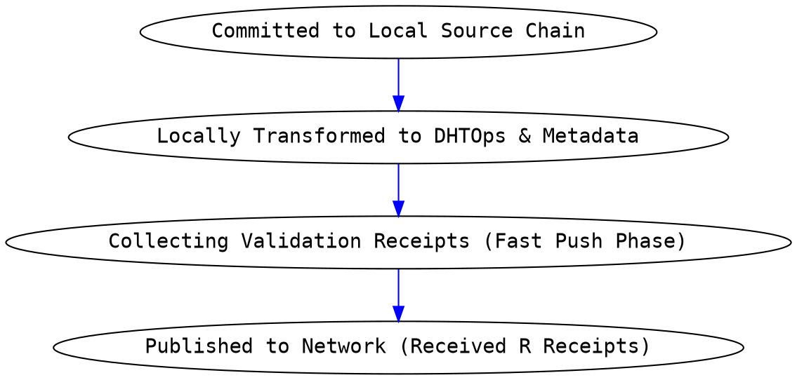
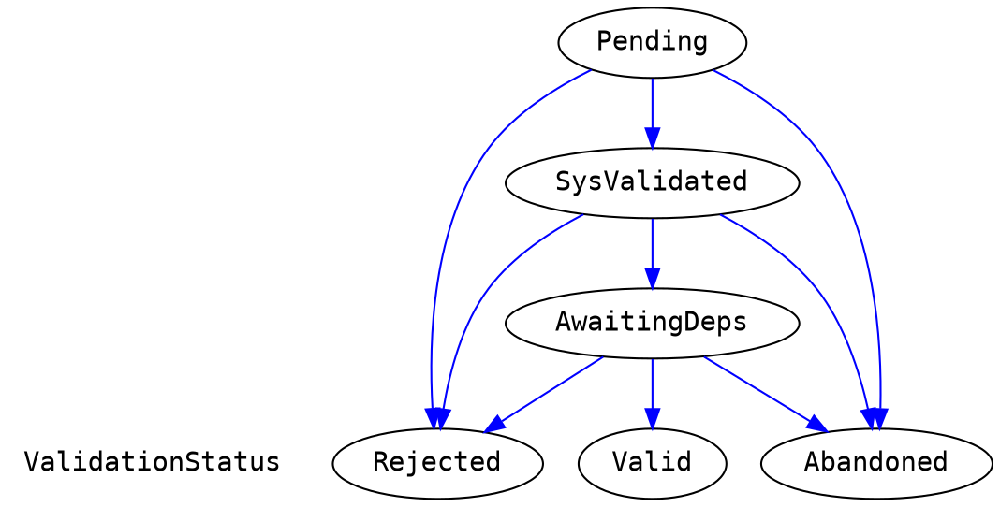
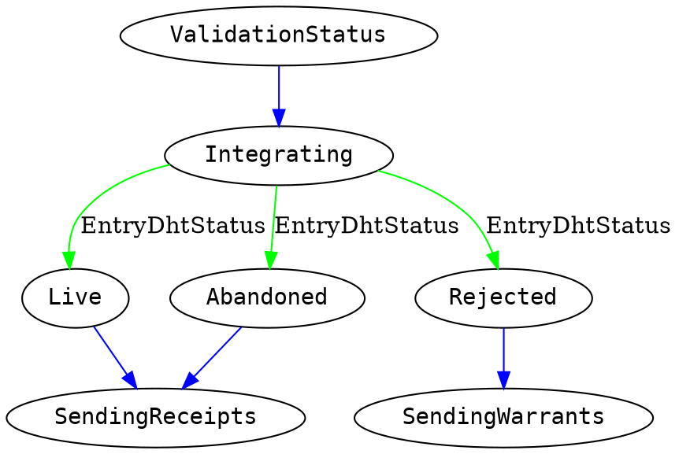
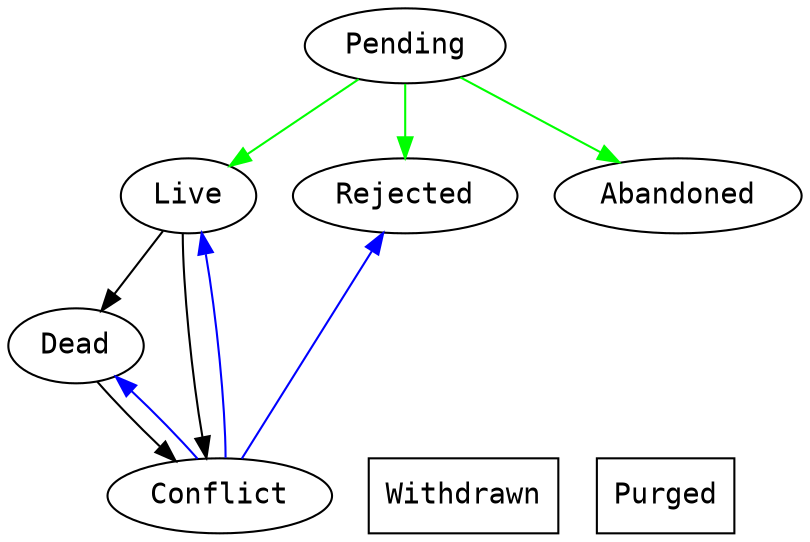

\onecolumngrid
# Appendix A: Holochain Implementation Spec v0.3.0 Beta

So far we have described the necessary components of a scalable coordination and collaboration system. We have built an "industrial strength" implementation of this pattern suitable for real-world deployment, under the name Holochain. Here we describe the technical implementation details that achieve the various requirements described above.

This specification assumes that the reader has understood context and background provided in the [Holochain Formalization](hwp_4_formal.md).

Given the formal description from that document of our local state model (Source Chain) and shared data model (Graph DHT) we can now present a high-level implementation specification of the different components of the Holochain architecture:

* App Virtual Machine (Ribosome)
* State Manager
* P2P Networking (Kitsune)
* The Conductor
* Secure Private Key Management (lair-keystore)

**Note on code fidelity**: The code in this appendix may diverge somewhat from the actual implementation, partially because the implementation may change and partially to make the intent of the following code clearer and simpler. For instance, specialized types that are merely wrappers around a vector of bytes are replaced with `Vec<u8>`.

## Ribosome: The Application "Virtual Machine"

We use the term **Ribosome** to the name of part of the Holochain system that runs the DNA's application code. Abstractly, a Ribosome could be built for any programming language as long as it's possible to deterministically hash and run the code of the DNA's Integrity Zome such that all agents who possess the same hash can rely on the validation routines and structure desribed by that Integrity Zome operating identically for all. (In our implementation we use WebAssembly (WASM) for DNA code, and [Wasmer](https://wasmer.io/) as the runtime that executes it.)

The Ribosome, as an application host, must expose a minimal set of functions to guest applications to allow them to access Holochain functionality, and it should expect that guest applications implement a minimal set of callbacks that allow the guest to define its entry types, link types, validation functions, and lifecycle hooks for both Integrity and Coordinator Zomes. We will call this set of provisions and expectations the Ribosome Host API.

[WP-TODO: Is there an actually official name for this rather than 'Ribosome Host API?]

Additionally, it is advantageous to provide software development kits (SDKs) to facilitate the rapid development of Integrity and Coordinator Zomes that consume the Ribosome's host functions and provide the callbacks it expects.

In our implementaion we provide SDKs for Integrity and Coordinator Zomes written in the [Rust programming language](https://rust-lang.org) as Rust crates: the [Holochain Deterministic Integrity (HDI) crate](https://docs.rs/hdi/) facilitates the development of Integrity Zomes, while the [Holochain Development Kit (HDK) crate](https://docs.rs/hdk/) facilitates the development of Coordinator Zomes.

### Ribosome/Zome Interop ABI

Because WebAssembly code can only interface with its host system via function calls that pass simple numeric scalars, an application binary interface (ABI) must be defined to pass rich data between the Ribosome host and the zome guest.

The host and guest expose their functionality via named functions, and the input and output data of these functions (a single argument and a return value) are passed as a tuple of a shared memory pointer and a length. This tuple is a reference to the serialized data that makes up the actual input or output data.

The caller is responsible for serializing the expected function argument and storing it in a shared memory location in the WebAssembly virtual machine instance, then passing the location and length to the callee.

The callee then accesses the data at the given location, attempts to deserialize it, and operates on the deserialized result.

The same procedure is followed for the function's return value, with the role of the caller and callee reversed.

Because errors may occur when the callee attempts to access and deserialize its argument data, the callee MUST return (or rather, serialize, store, and return the address and length of) a Rust `Result<T, WasmError>` value, where `WasmError` is a struct of this type:

```rust
struct WasmError {
    file: String,
    line: u32,
    error: WasmErrorInner,
}

enum WasmErrorInner {
    PointerMap,
    Deserialize(Vec<u8>),
    Serialize(SerializedBytesError),
    ErrorWhileError,
    Memory,
    Guest(String),
    Host(String),
    HostShortCircuit(Vec<u8>),
    Compile(String),
    CallError(String),
    UninitializedSerializedModuleCache,
}
```

The type `Result<T, WasmError>` is aliased to `ExternResult<T>` for convenience, and will be referred to as such in examples below.

Our implmementation provides a `wasm_error!` macro for the guest that simplifies the construction of an error result with the correct file and line number, along with a `WasmErrorInner::Guest` containing an application-defined error string. It also provides various macros to 'shadow' host functions and guest callbacks, automatically performing the work of retrieving/deserializing and serializing/storing input and output data and presenting more ergonomic function signatures.

Hereafter, our examples of host and guest functions will assume the use of the ergonomic function signatures provided by the HDI and HDK.

### HDI

The Holochain Deterministic Integrity (HDI) component of the Holochain architecture comprises the functions and capacities that are made available to app aevelopers for building their Integrity Zomes.

**Integrity Zomes** provide the immutable portion of the app's code that:

* identifies the types of entries and links able to be committed in the app,
* defines the structure of data entries, and
* defines the validation code each node runs for DHT operations produced by actions to create, update, and delete the aforementioned entry types, as well as for a small number of system types.

The following data structures, functions and callbacks are necessary and sufficient to implement an HDI:

#### Core Holochain Data Types

##### The `Action` Data Type

All actions must contain the following data elements (with the exception of the `Dna` action which, because it indicates the creation of the first chain entry, does not include the `action_seq` nor `prev_action` data elements):

[WP-TODO: These two structs don't exist anywhere. We've got an `ActionBuilderCommon` that matches the following `Action`...]

```rust
struct Action {
    author: AgentHash,
    timestamp: Timestamp,
    action_seq: u32,
    prev_action: ActionHash,
    ...
}
```

Additionally, the HDI MUST provide a signed `Action` data structure that allows integrity checking in validation:

[WP-TODO: And the closest to this is `Signed<Action>`.]

```rust
struct SignedActionEnvelope {
    signature: Signature,
    action: Action,
}
```

Implementation detail: Theoretically all actions could point via a hash to an entry that would contain the "content" of that action. But because many of the different actions entries are system-defined, and they thus have a known structure, we can reduce unnecessary data elements and gossip by embedding the entry data for system-defined entry types right in the action itself. However, for application-defined entry types, because the structure of the entry is not known at compile time for Holochain, the entry data must be in a separate data structure. Additionally there are a few system entry types (see below) that must be independantly retrieveable from the DHT, and thus have their own separate system-defined variant of the `Entry` enum type.

The action types and their additional data fields necessary are:

* `Dna`: indicates the DNA hash of the validation rules by which the data in this source chain agrees to abide.

    ```rust
    struct Dna {
        ...
        hash: DNAHash,
    }
    ```

* `AgentValidationPkg`: indicates the creation of an entry holding the information necessary for nodes to confirm whether an agent is allowed to participate in this DNA. This entry is contained in the action struct.

    ```rust
    struct AgentValidationPkg {
        ...
        membrane_proof: Option<SerializedBytes>
    }
    ```

* `InitZomesComplete`: indicates the creation of the final genesis entry that marks that all zome init functions have successfully completed, and the chain is ready for commits. Requires no additional data.

* `Create`: indicates the creation of an application-defined entry, or a system-defined entry that needs to exist as content-addressed data.

    ```rust
    struct Create {
        ...
        entry_type: EntryType,
        entry_hash: EntryHash,
    }

    // See the section on Entries for the defintion of `EntryType`.
    ```

* `Update`: Indicates a change to a previously existing entry creation action. In addition to specifying the new entry type and pointing to the new entry hash, the action data points to the old action and its entry. As this is an entry creation action like `Create`, it shares many of the same fields.

    [WP-TODO: I'm focusing here on CRUD operating on _entry creation actions_, not entries. Is this the correct frame for something formal?]

    ```rust
    struct Update {
        ...
        original_action_address: ActionHash,
        original_entry_address: EntryHash,
        entry_type: EntryType,
        entry_hash: EntryHash,
    }
    ```

* `Delete`: indicates a deletion of a previously existing entry creation action. The entry containing the hashes of the action and entry to be deleted are contained in the action struct.

    ```rust
    struct Delete {
        ...
        deletes_address: ActionHash,
        deletes_entry_address: EntryHash,
    }
    ```

* `CreateLink`: indicates the creation of a link.

    ```rust
    struct CreateLink {
        ...
        base_address: AnyLinkableHash,
        target_address: AnyLinkableHash,
        zome_index: u8,
        link_type: u8,
        tag: Vec<u8>,
    }
    ```

* `DeleteLink`: indicates the creation of a deletion record for a previously created link.

    ```rust
    struct DeleteLink {
        ...
        base_address: AnyLinkableHash,
        link_add_address: ActionHash,
    }
    ```

* `CloseChain`: indicates the creation of a final chain entry with data about a new DNA version to migrate to.

    ```rust
    struct CloseChain {
        ...
        new_dna_hash: DnaHash,
    }
    ```

* `OpenChain`: indicates the creation of an entry with data for migrating from a previous DNA version.

    ```rust
    struct OpenChain {
        ...
        prev_dna_hash: DnaHash,
    }
    ```

All of the CRUD actions SHOULD include data to implement rate-limiting so as to prevent malicious network actions. In our implementation, all CRUD actions have a `weight` field of the following type:

```rust
struct RateWeight {
    bucket_id: u8,
    units: u8,
}
```

An application may specify an arbitrary number of rate limiting 'buckets', which can be 'filled' by CRUD actions until they reach their capacity, after which point any further attempts to record an action to the Source Chain will fail until the bucket has drained sufficiently. Each bucket has a specified capacity and drain rate, which the Integrity Zome may specify using a `rate_limits` callback.

The Integrity Zome may also weigh a given CRUD action using a `weigh` callback, which allows both the author and the validating authority to deterministically assign a weight to an action.

**Note:** This feature is not completed in the current implementation.

##### The `Entry` Data Type

There are four main entry types, defined in an `EntryType` enum:

```rust
enum EntryType {
    AgentPubKey,
    App(AppEntryDef),
    CapClaim,
    CapGrant,
}
```

There is also an `Entry` enum that holds the entry data itself, with five variants that correspond to the four entry types:

```rust
enum Entry {
    Agent(AgentHash),
    App(SerializedBytes),
    CounterSign(CounterSigningSessionData, SerializedBytes),
    CapClaim(CapClaim),
    CapGrant(ZomeCallCapGrant),
}
```

(Note that the `App` and `CounterSign` variants are both intended for application-defined entries.)

* `AgentPubKey` is used in the second genesis record of the source chain, a `Create` action that publishes the source chain author's public key to the DHT for identification and verification of authorship.

* `App` indicates that the entry data contains arbitrary application data of a given entry type belonging to a given integrity zome:

    ```rust
    struct AppEntryDef {
        entry_index: u8,
        zome_index: u8,
        visibility: EntryVisibility,
    }

    struct EntryVisibility {
        Public,
        Private,
    }
    ```

    Its entry data can be of either `Entry::App` or `Entry::CounterSign`, where the inner data is an aribtrary vector of bytes (typically a serialized data structure). If the data is `Entry::CounterSign`, the bytes are accompanied by a struct that gives the details of the countersigning session (this struct will be dealt with in the section on countersigning).

    Note that in both these cases the data is stored using a serialization that is declared by the `entry_defs()` function of the HDI.

* `CapClaim` indicates that the entry data contains the details of a granted capability that are necessary to exercise such capability:

    ```rust
    struct CapClaim {
        tag: String,
        grantor: AgentHash,
        secret: CapSecret,
    }
    ```

* `CapGrant` indicates that the entry data contains the details of a capability grant in the following enum and the types upon which it depends:

    ```rust
    struct ZomeCallCapGrant {
        tag: String,
        access: CapAccess,
        functions: GrantedFunctions,
    }

    enum CapAccess {
        Unrestricted,
        Transferable {
            secret: [u8; 64],
        },
        Assigned {
            secret: [u8; 64],
            assignees: BTreeSet<AgentHash>,
        },
    }

    enum GrantedFunctions {
        All,
        Listed(BTreeSet<(ZomeName, FunctionName), Global>),
    }

    struct ZomeName(str);

    struct FunctionName(str);
    ```

##### The `Record` Data Type

A record is just a wrapper for an `Action` and an `Entry`. Because an entry may not be present in all contexts or for all action types, the `RecordEntry` enum wraps the possible entry data in an appropriate status.

```rust
struct Record {
    action: SignedHashed<Action>,
    entry: RecordEntry,
}

enum RecordEntry {
    Present(Entry),
    Hidden,
    NA,
    NotStored,
}
```

##### Links

A `CreateLink` action completely contains the relational graph information, which would be considered the link's entry data if it were to have a separate entry. Note that links are typed for performance purposes, such that when requesting links they can be retrieved by type. Additionally links have tags that can be used as arbitrary labels on-graph as per the application's needs. The `zome_index` is necessary so that the system can find and dispatch the correct validation routines for that link, as a DNA may have multiple integrity zomes.

```rust
struct Link {
    base_address: AnyLinkableHash,
    target_address: AnyLinkableHash,
    zome_index: ZomeIndex,
    link_type: LinkType,
    tag: LinkTag,
}

struct LinkTag(Vec<u8>);
```

Comparing this structure to a Resource Description Framework (RDF) triple:

* The `base_address` is the subject.
* The `target_address` is the object.
* The `zome_index`, `link_type`, and `tag` as a tuple are the predicate.

##### The `Op` Data Type

The `Op` types that hold the chain entry transform data that is published to different portions of the DHT (formally described in [section four](hwp_4_formal.md#graph-transformation)) are listed below. The integrity zome defines a validation callback for the entry and link types it defines, and is called with an `Op` enum variant as its single paramater, which indicates the DHT perspective from which to validate the data. Each variant holds a struct containing the DHT operation payload:

* `StoreRecord`: executed by the record (action) authorities to store data. It contains the record to be validated, including the entry if it is public.

    ```rust
    struct StoreRecord {
        record: Record,
    }
    ```

* `StoreEntry`: executed by the entry authorities to store data for any entry creation action, if the entry is public. It contains both the entry and the action in a struct similar to `Record`, with the exception that the `entry` field is always populated.

    ```rust
    struct StoreEntry {
        action: SignedHashed<EntryCreationAction>,
        entry: Entry,
    }

    // The following variants hold the corresponding Action struct.
    enum EntryCreationAction {
        Create(Create),
        Update(Update),
    }
    ```

* `RegisterUpdate`: executed by both the entry and record authorities for the _old_ data to store metadata pointing to the _new_ data. This op collapses both the `RegisterUpdatedRecord` and `RegisterUpdatedContent` transforms into one for simplicity. It contains the update action as well as the entry, if it is public.

    ```rust
    struct RegisterUpdate {
        update: SignedHashed<Update>,
        new_entry: Option<Entry>,
    }
    ```

* `RegisterDelete`: executed by the entry authorities for the _old_ entry creation and its entry to store metadata that tombstones the data. This opp collapses both the `RegisterDeletedEntryAction` and `RegisterDeletedBy` transforms into one. It contains only the delete action.

    ```rust
    struct RegisterDelete {
        delete: SignedHashed<Delete>,
    }
    ```

* `RegisterAgentActivity`: executed by agent activity authorities (the peers responsible for the author's AgentID entry) to validate the action in context of the author's entire source chain. At the application developer's discretion, this operation can also contain the entry data.

    ```rust
    struct RegisterAgentActivity {
        action: SignedHashed<Action>,
        cached_entry: Option<Entry>,
    }
    ```

* `RegisterCreateLink`: executed by the authorities for the link's base address to store link metadata.

    ```rust
    struct RegisterCreateLink {
        create_link: SignedHashed<CreateLink>,
    }
    ```

* `RegisterDeleteLink`: executed by the authorities for the link's base address to store metadata that tombstones the link.

    ```rust
    struct RegisterDeleteLink {
        delete_link: SignedHashed<DeleteLink>,
        create_link: CreateLink,
    }
    ```

#### Hash Data Structures

Holochain relies on being able to distinguish and use hashes of the various Holochain fundamental data types. The following hash types must exist:

* `ActionHash`: The Blake2b-256 hash of a serialized `Action` variant, used for DHT addressing.
* `AgentHash`: The Ed25519 public key of an agent, used for referencing the agent.
* `DhtOpHash`: The Blake2b-256 hash of a serialized `DhtOp` variant, used for comparing lists of held operations during syncing between authorities.
* `DnaHash`: The hash of all the integrity zomes and associated modifiers, when serialized in a consistent manner.
* `EntryHash`: The hash of the bytes of a `Entry` variant, according to the hashing rules of that variant (the Blake2b-256 hash of the serialized variant in all cases except `Entry::Agent`, which is the public key). Used for DHT addressing.
* `ExternalHash`: This type is used for creating links in the graph DHT to entities that are not actually stored in the DHT. It is simply an arbitrary 32 bytes.
* `WasmHash`: The Blake2b-256 hash of the WebAssembly bytecode of a zome, used by the Ribosome to look up and call zomes.

Furthermore, there are two composite hash types, which are unions of two or more of the preceding hash types:

* `AnyDhtHash`, the enum of `EntryHash` and `ActionHash`, is the union of all 'real' addressable content on the DHT; that is, content that can actually be written.
* `AnyLinkableHash`, the enum of `EntryHash`, `ActionHash`, and `ExternalHash`, is the union of all real and imaginary addressable content on the DHT; that is, it includes external hashes.

All of these hash types are derived from a generic struct, `HoloHash<T>`, which holds the three-byte hash type signifier and the 32 bytes of the hash (the 'core' of the hash), along with the 4-byte network location. For those hash types that are the basis of addressable content (`AnyDhtHash`), the hash alone is sufficient to uniquely identify a DHT basis from which a network location can be computed, while the type signifier ensures type safety in all struct fields and enum variant values that reference the hash. The four-byte network location is computed from the hash core and stored along with the preceding 36 bytes as a matter of convenience.

The three-byte type signifiers are as follows:

| Type           | Hexadecimal | Base64 |
|----------------|-------------|--------|
| `ActionHash`   | `0x842924`  | `hCkk` |
| `AgentHash`    | `0x842024`  | `hCAk` |
| `DhtOpHash`    | `0x842424`  | `hCQk` |
| `DnaHash`      | `0x842d24`  | `hC0k` |
| `EntryHash`    | `0x842124`  | `hCEk` |
| `ExternalHash` | `0x842f24`  | `hC8k` |
| `WasmHash`     | `0x842a24`  | `hCok` |

#### Application Type Definition Callbacks

In order for the Ribosome to successfully dispatch validation to the correct integrity zome, each integrity zome in a DNA should register the entry and link types it is responsible for validating. The HDI MUST allow the integrity zome to implement the following functions:

* `entry_defs(()) -> ExternResult<EntryDefsCallbackResult>`: Called to declare the type and structure of the application's entry types. The return value is:

    ```rust
    enum EntryDefsCallbackResult {
        Defs(EntryDefs),
    }

    struct EntryDefs(Vec<EntryDef>);

    struct EntryDef {
        id: EntryDefId,
        visibility: EntryVisibility,
        required_validations: u8,
        cache_at_agent_activity: bool,
    }

    enum EntryDefId {
        App(str),
        CapClaim,
        CapGrant,
    }
    ```

    This function can be automatically generated using the `#[hdk_entry_types]` procedural macro on an enum of variants that each hold a type that can be serialized and deserialized.

* `link_types(()) -> ExternResult<Vec<u8>>`: called to declare the link types that will be used by the application. This function can be automatically generated using the `#[hdk_link_types]` procedural macro on an enum of all link types.

Note: In our implementation these functions are automatically generated by Rust macros. This gives us the benefit of consistent, strongly typed entry and link types from the point of definition to the point of use. Thus it's very easy to assure that any application data that is being stored adheres to the entry and link type declarations.

#### Functions Necessary for Application Validation

The HDI MUST allow for happ developers to specify a `validate(Op) -> ExternResult<ValidateCallbackResult>` callback function for each integrity zome. This callback is called by the Ribosome in the correct context for the Op as described above in the graph DHT formalization, so that the data associated with the `Op` will only be stored if it meets the validation criteria.

The HDI MUST provide the following functions for application authors to retrieve dependencies in validation:

* `must_get_agent_activity(AgentPubKey, ChainFilter) -> ExternResult<Vec<RegisterAgentActivity>>`: This function allows for deterministic validation of chain activity by making a hash-bounded range of an agent's chain into a dependency for something that is being validated. The second parameter is defined as:

    ```rust
    struct ChainFilter {
        chain_top: ActionHash,
        filters: ChainFilters,
        include_cached_entries: bool
    }

    enum ChainFilters {
        ToGenesis,
        Take(u32),
        Until(HashSet<ActionHash>),
        Both(u32, HashSet<ActionHash>),
    }
    ```

    The vector element type in the return value is defined as:

    ```rust
    struct RegisterAgentActivity {
        action: SignedHashed<Action>,
        cached_entry: Option<Entry>,
    }
    ```

* `must_get_action(ActionHash) -> ExternResult<SignedHashed<Action>`: Get the `Action` at a given action hash, along with its author's signature.

* `must_get_entry(EntryHash) -> ExternResult<HoloHashed<Entry>>`: Get the `Entry` at a given hash.

* `must_get_valid_record(ActionHash) -> ExternResult<Record>`: Attempt to get a _valid_ `Record` at a given action hash; if the record is marked as invalid by any contacted authorities, the function will fail.

The HDI MUST implement two hashing functions that calculate the hashes of `Action`s and `Entry`s so that hash values can be confirmed in validation routines.

* `hash_action(Action) -> ActionHash`
* `hash_entry(Entry) -> EntryHash`

The HDI MUST implement two introspection functions that return data about the DNA's definition and context that may be necessary for validation:

* `dna_info() -> ExternResult<DnaInfo>`: returns information about the DNA:

    ```rust
    struct DnaInfo {
        name: String,
        hash: DnaHash,
        modifiers: DnaModifiers,
        zome_names: Vec<ZomeName>,
    }

    struct DnaModifiers {
        network_seed: String,
        properties: SerializedBytes,
        origin_time: Timestamp,
        quantum_time: Duration,
    }
    ```

* `zome_info() -> ExternResult<ZomeInfo>`: returns information about the integrity zome:

    ```rust
    struct ZomeInfo {
        name: ZomeName,
        id: ZomeIndex,
        properties: SerializedBytes,
        entry_defs: EntryDefs,
        extern_fns: Vec<FunctionName>,
        zome_types: ScopedZomeTypesSet,
    }

    struct ZomeIndex(u8);

    struct ScopedZomeTypesSet {
        entries: Vec<(ZomeIndex, Vec<EntryDefIndex>)>,
        links: Vec<(ZomeIndex, Vec<LinkType>)>,
    }

    struct EntryDefIndex(u8);

    struct LinkType(u8);
    ```

Note: `properties` consists of known application-specified data that is specified at install time (both at the DNA and zome levels) that may be necessary for validation or any other application-defined purpose. Properties are included when hashing the DNA source code, thus allowing parametrized DNAs and zomes.

The HDI MUST implement a function that validation code can use to verify cryptographic signatures:

* `verify_signature<I>(AgentPubKey, Signature, I) -> ExternResult<bool> where I: Serialize`: Checks the validity of a signature (a `Vec<u8>` of bytes) upon the data it signs (any type that implements the `Serialize` trait, allowing it to be reproducibly converted into a vector of bytesa, gainst the public key of the agent that is claimed to have signed it.

### HDK

The HDK contains all the functions and callbacks needed for Holochain application developers to build their Coordination Zomes. Note that the HDK is a superset of the HDI. Thus all of the functions and data types available in the HDI are also available in the HDK.

#### Chain Operations

The HDK MUST implement the following functions that create source chain entries:

[WP-TODO: This language centres CRUD on _entries_ rather than a choice to interpret CRUD as applying to entries vs actions. There's also a growing opinion that, in 90% of cases, treating actions as the object of CRUD operations is the most appropriate.]

* `create(CreateInput) -> ExternResult<ActionHash>`: Records a new application entry. The `CreateInput` parameter is defined as:

    ```rust
    struct CreateInput {
        entry_location: EntryDefLocation,
        entry_visibility: EntryVisibility,
        entry: Entry,
        chain_top_ordering: ChainTopOrdering,
    }

    enum EntryDefLocation {
        App(AppEntryDefLocation),
        CapClaim,
        CapGrant,
    }

    struct AppEntryDefLocation {
        zome_index: ZomeIndex,
        entry_def_index: EntryDefIndex,
    }

    enum ChainTopOrdering {
        Relaxed,
        Strict,
    }
    ```

    The `EntryVisibility` parameter specifies whether the entry is private or should be published to the DHT, and the `ChainTopOrdering` parameter specifies whether the call should fail if some other zome call with chain creation actions completes before this one, or whether it's ok to automatically replay the re-write the action on top of any such chain entries.

    In our implementation, the `create` function accepts any value that can be converted to a `CreateInput`, allowing most of these fields to be populated by data that was generated by the `#[hdk_entry_types]` amcro and other helpers. This is accompanied by convenience functions for `create` that accept app entries, capability grants, or capability claims.

* `update(UpdateInput) -> ExternResult<ActionHash>`: Records the updating of a chain entry. Requires the `ActionHash` that created the original entry to be provided. The `UpdateInput` parameter is defined as:

    ```rust
    struct UpdateInput {
        original_action_address: ActionHash,
        entry: Entry,
        chain_top_ordering: ChainTopOrdering,
    }
    ```

    Many fields necessary for `create` are unnecessary for `update`, as the new entry is expected to match the entry type and visibility of the original. Similar to `create`, in our implementation there are convenience functions to help with constructing `UpdateInputs` for app entries and capability grants.

* `delete(DeleteInput) -> ExternResult<ActionHash>`: Records the deletion of an entry specified by the `ActionHash`. The `DeleteInput` parameter is defined as:

    ```rust
    struct DeleteInput {
        deletes_action_hash: ActionHash,
        chain_top_ordering: ChainTopOrdering,
    }
    ```

* `create_link(AnyLinkableHash, AnyLinkableHash, ScopedLinkType, LinkTag) -> ExternResult<ActionHash>`: Records the creation of a link of the given `ScopedLinkType` between the hashes supplied in the first and second arguments, treating the first hash as the base and the second as the target. The fourth `LinkTag` parameter is a struct containing a `Vec<u8>` of arbitrary application bytes.

* `delete_link(ActionHash) -> ExternResult<ActionHash>`: Records the deletion of a link, taking the original link creation action's hash as its input.

* `query(ChainQueryFilter) -> ExternResult<Vec<Record>>`: search the agent's local source chain according to a query filter returning the `Record`s that match. The `ChainQueryFilter` parameter is defined as:

    ```rust
    struct ChainQueryFilter {
        sequence_range: ChainQueryFilterRange,
        entry_type: Option<Vec<EntryType>>,
        entry_hashes: Option<HashSet<EntryHash>>,
        action_type: Option<Vec<ActionType>>,
        include_entries: bool,
        order_descending: bool,
    }

    enum ChainQueryFilterRange {
        // Retrieve all chain actions.
        Unbounded,
        // Retrieve all chain actions between two indexes, inclusive.
        ActionSeqRange(u32, u32),
        // Retrieve all chain actions between two hashes, inclusive.
        ActionHashRange(ActionHash, ActionHash),
        // Retrieve the n chain actions up to and including the given hash.
        ActionHashTerminated(ActionHash, u32),
    }
    ```

#### Capabilites Management

The HDK includes convenience functions over `create`, `update`, and `delete` for operating on capability grants and claims:

* `create_cap_grant(ZomeCallCapGrant) -> ExternResult<ActionHash>`
* `create_cap_claim(CapClaim) -> ExternResult<ActionHash>`
* `update_cap_grant(ActionHash, ZomeCallCapGrant) -> ExternResult<ActionHash>`
* `delete_cap_grant(ActionHash) -> ExternResult<ActionHash>`

In addition to these, a function is provided for securely generating capability secrets:

* `generate_cap_secret() -> ExternResult<[u8; 64]>`

It is the application's responsibility to retrieve a stored capability claim using a host function such as `query` and supply it along with a remote call to another agent. As the Conductor at the receiver agent automatically checks and enforces capability claims supplied with remote call payloads, there is no need to retrieve and check a grant against a claim.

#### DHT Data Retrieval

* `get(AnyDhtHash, GetOptions) -> ExternResult<Option<Record>>`: Retrieve a `Record` from the DHT by its `EntryHash` or `ActionHash`. The content of the record return is dependent on the type of hash supplied:
    * If the hash is an `Entry` hash, the authority will return the `entry` content paired with its oldest-timestamped `Action`.
    * If the hash is an `Action` hash, the authority will return the specified action.

    The `GetOptions` parameter is defined as:

    ```rust
    struct GetOptions {
        strategy: GetStrategy,
    }

    enum GetStrategy {
        Network,
        Local,
    }
    ```

    If `strategy` is `GetStrategy::Network`, the request will always go to other DHT authorities, unless the the requestor is an authority for that basis hash themselves. If `strategy` is `GetStrategy::Local`, the request will always favor the requestor's local cache and will return nothing if the data is not cached.

* `get_details(AnyDhtHash, GetOptions) -> ExternResult<Option<Details>>`: Retrieve all of the addressable data and metadata at a basis hash. The return value is a variant of the following enum, depending on the data stored at the hash:

    ```rust
    enum Details {
        Record(RecordDetails),
        Entry(EntryDetails),
    }

    struct RecordDetails {
        record: Record,
        validation_status: ValidationStatus,
        deletes: Vec<SignedHashed<Action>>,
        updates: Vec<SignedHashed<Action>>,
    }

    enum ValidationStatus {
        Valid,
        Rejected,
        // Could not validate due to missing data or dependencies,
        // or an exhausted WASM execution budget.
        Abandoned
    }

    struct EntryDetails {
        entry: Entry,
        actions: Vec<SignedHashed<Action>>,
        rejected_actions: Vec<SignedHashed<Action>>,
        deletes: Vec<SignedHashed<Action>>,
        updates: Vec<SignedHashed<Action>>,
        entry_dht_status: EntryDhtStatus,
    }

    enum EntryDhtStatus {
        Live,
        // All entry creation actions associated with the entry have been marked as deleted.
        Dead,
        // Awaiting validation.
        Pending,
        Rejected,
        Abandoned,
        // The following are placeholders for unimplemented DHT operations.
        Conflict,
        Withdrawn,
        Purged,
    }
    ```

* `get_links(GetLinksInput) -> ExternResult<Vec<Link>>`: Retrieve a list of links that have been placed on any base hash on the DHT, optionally filtering by the links' types and/or tags. The returned list contains only live links; that is, it excludes the links that have `DeleteLink` actions associated with them. The `GetLinksInput` parameter is defined as:

    ```rust
    struct GetLinksInput {
        base_address: AnyLinkableHash,
        link_type: LinkTypeFilter,
        get_options: GetOptions,
        tag_prefix: Option<Vec<u8>>,
        after: Option<Timestamp>,
        before: Option<Timestamp>,
        author: Option<AgentHash>,
    }

    enum LinkTypeFilter {
        // One link type
        Types(Vec<(ZomeIndex, Vec<LinkType>)>),
        // All link types from the given integrity zome
        Dependencies(Vec<ZomeIndex>),
    }
    ```

* `get_link_details(AnyLinkableHash, LinkTypeFilter, Option<LinkTag>, GetOptions) -> ExternResult<LinkDetails>`: Retrieve the link creation _and_ deletion actions at a base. The return value is defined as:

    ```rust
    struct LinkDetails(Vec<(SignedActionHashed, Vec<SignedActionHashed>)>);
    ```

    where each element in the vector is a `CreateLink` action paired with a vector of any `DeleteLink` actions that apply to it.

* `count_links(LinkQuery) -> ExternResult<usize>`: Retrieve only the count of live links matching the link query.

* `get_agent_activity(AgentPubKey, ChainQueryFilter, ActivityRequest) -> ExternResult<AgentActivity>`: Retrieve the activity of an agent from the agent's neighbors on the DHT. This functions similar to `query`, but operates on the source chain of an agent _other_ than the requestor. The `ActivityRequest` parameter is defined as:

    ```rust
    enum ActivityRequest {
        Status,
        Full,
    }
    ```

    The `AgentActivity` return value is defined as:

    ```rust
    struct AgentActivity {
        valid_activity: Vec<(u32, ActionHash)>,
        rejected_activity: Vec<(u32, ActionHash)>,
        status: ChainStatus,
        highest_observed: Option<(u32, ActionHash)>,
        warrants: Vec<Warrant>,
    }

    enum ChainStatus {
        Empty,
        Valid(ChainHead),
        Forked(ChainFork),
        Invalid(ChainHead),
    }

    struct ChainHead {
        action_seq: u32,
        hash: ActionHash,
    }

    struct ChainFork {
        fork_seq: u32,
        first_action: ActionHash,
        second_action: ActionHash,
    }
    ```

    Depending on the value of the `ActivityRequest` argument, `status` may be the only populated field.

[WP-TODO: should I include https://docs.rs/hdk/latest/hdk/validation_receipt/fn.get_validation_receipts.html ?]

#### Introspection

* `agent_info() -> ExternResult<AgentInfo>`: Get information about oneself (that is, the agent currently executing the zome function) and one's source chain, where the return value is defined as:

    ```rust
    struct AgentInfo {
        agent_initial_pubkey: AgentHash,
        agent_latest_pubkey: AgentHash,
        chain_head: (ActionHash, u32, Timestamp),
    }
    ```

* `call_info() -> ExternResult<CallInfo>`: Get contextual information about the current zome call, where the return value is defined as:

    ```rust
    struct CallInfo {
        provenance: AgentHash,
        function_name: FunctionName,
        // A snapshot of the source chain state at zome call time.
        as_at: (ActionHash, u32, Timestamp),
        // The capability grant under which the call is permitted.
        cap_grant: CapGrant,
    }
    ```

* `dna_info() -> ExternResult<DnaInfo>` (see HDI)
* `zome_info() -> ExternResult<ZomeInfo>` (see HDI)

#### Modularization and Composition

Zomes are intended to be units of composition for application developers. Thus zome functions MUST be able to make calls to other zome functions, either in the same zome or in other zomes or even DNAs:

* `call<I>(CallTargetCell, ZomeName, FunctionName, Option<CapSecret>, I) -> ZomeCallResponse where I: Serialize`: Call a zome function in a target DNA and zome, supplying a capability and a payload containing the argument to the receiver. The `CallTargetCell` parameter is defined as:

    ```rust
    enum CallTargetCell {
        OtherCell(CellId),
        OtherRole(String),
        Local,
    }

    struct CellId(DnaHash, AgentPubKey);
    ```

#### Scheduling

The HDK SHOULD implement the ability for zome calls to be scheduled for calling in the future, which allows for important application functionality like automatic retries.

* `schedule(str) -> ExternResult<()>`: Schedule a function for calling on the next iteration of the conductor's scheduler loop, and thereafter on a schedule defined by the called function. To be schedulable, a function must have the signature `(Schedule) -> Option<Schedule>`, receiving the schedule on which it was called and returning the schedule (if any) on which it wishes to continue to be called. A `Schedule` is defined as:

    ```rust
    enum Schedule {
        Persisted(String),
        Ephemeral(Duration),
    }
    ```

    Where the value of `Persisted` is a UNIX crontab entry and the value of `Ephemeral` is a duration until the next time. Persisted schedules survive conductor restarts and unrecoverable errors, while ephemeral schedules will not. If `None` is returned instead of `Some(Schedule)`, the function will be unscheduled.

    A scheduled function MUST also be **infallible**; that is, it must be marked with the macro `#[hdk_extern(infallible)]` and return an `Option<Schedule>` rather than an `ExternResult<Option<Schedule>>`. This is because there is no opportunity for user interaction with the result of a scheduled function.

#### P2P Interaction

Agents MUST be able to communicate directly with other agents. They do so simply by making zome calls to them. Holochain systems MUST make this possible by sending a call requests over the network and awaiting a response. For performance reasons the HDK SHOULD also make possible sending of best-effort in parallel signals for which no return result is awaited.

* `call_remote<I>(AgentPubKey, ZomeName, FunctionName, Option<CapSecret>, I) -> ExternResult<ZomeCallResponse> where I: Serialize`: Call a zome function on a target agent and zome, supplying a capability secret and an arguments payload. The return value is defined as:

    ```rust
    enum ZomeCallResponse {
        Ok(ExternIO),
        Unauthorized(ZomeCallAuthorization, CellId, ZomeName, FunctionName, AgentHash),
        NetworkError(String),
        CountersigningSession(String),
    }

    enum ZomeCallAuthorization {
        Authorized,
        BadSignature,
        BadCapGrant,
        BadNonce(String),
        BlockedProvenance,
    }
    ```

* `send_remote_signal<I>(Vec<AgentPubKey>, I) -> ExternResult<()> where I: Serialize`: Send a best-effort signal to a list of agents. Signals are received by implementing the `recv_remote_signal(SerializedBytes) -> ExternResult<()>` callback which the Holochain system MUST attempt to call when signals are received.

#### Countersigning

In order to safely facilitate the peer interaction necessary to complete a countersigning among multiple agents, the Ribosome and HDK MUST implement the following functions:

* `accept_countersigning_preflight_request(PreflightRequest) -> ExternResult<PreflightRequestAcceptance>`: Lock the local chain to commence a countersigning session. The `PreflightRequestAcceptance` MUST be sent back to the session initiator so that the corresponding entry can be built for everyone to sign. This function MUST be called by every signer in the signing session. The details of how are left to the application developer (although concurrent remote calls are probably the simplest mechanism to distribute and accept preflight requests before the session times out). The preflight request is defined as (see discussion above on countersigning):

    ```rust
    struct PreflightRequest {
        // The hash of the app entry, as if it were not countersigned. The final entry hash will include the countersigning session data.
        app_entry_hash: EntryHash,
        // The agents that are participating in this countersignature session.
        signing_agents: Vec<(AgentHash, Vec<Role>)>,
        // The optional additional M of N signers. If there are additional signers then M MUST be the majority of N. If there are additional signers then the enzyme MUST be used and is the first signer in BOTH signing_agents and optional_signing_agents.
        optional_signing_agents: Vec<(AgentHash, Vec<Role>)>,
        // The M in the M of N signers. M MUST be strictly greater than than N / 2 and NOT larger than N.
        minimum_optional_signing_agents: u8,
        // The first signing agent (index 0) is acting as an enzyme. If true AND optional_signing_agents are set then the first agent MUST be the same in both signing_agents and optional_signing_agents.
        enzymatic: bool,
        // The window in which countersigning must complete. Session actions must all have the same timestamp, which is the session offset.
        session_times: CounterSigningSessionTimes,
        // The action information that is shared by all agents. Contents depend on the action type, create, update, etc.
        action_base: ActionBase,
        // Optional arbitrary bytes that can be agreed to.
        preflight_bytes: PreflightBytes,
    }

    struct CounterSigningSessionTimes {
        start: Timestamp,
        end: Timestamp,
    }

    enum ActionBase {
        Create(CreateBase),
        Update(UpdateBase),
    }

    // An arbitrary application-defined role in a session.
    struct Role(u8);
    ```

    The return value is defined as:

    ```rust
    enum PreflightRequestAcceptance {
        Accepted(PreflightResponse),
        UnacceptableFutureStart,
        UnacceptableAgentNotFound,
        Invalid(String),
    }

    struct PreflightResponse {
        request: PreflightRequest,
        agent_state: CounterSigningAgentState,
        signature: Signature,
    }

    struct CounterSigningAgentState {
        // The index of the agent in the preflight request agent vector.
        agent_index: u8,
        // The current (frozen) top of the agent's local chain.
        chain_top: ActionHash,
        // The action sequence of the agent's chain top.
        action_seq: u32,
    }
    ```

* `session_times_from_millis(u64) -> ExternResult<CounterSigningSessionTimes>`: Create the session times that are included in the `PreflightRequest` and bound the countersigning session temporally. This function returns a session start timestamp is "now" from the perspective of the system clock of the session initiator calling this function, and a session end timestamp that is "now" plus the given number of milliseconds. The countersigning parties will check these times against their own perspectives of "now" as part of accepting the preflight request, so all system clocks need to be roughly aligned, and the ambient network latency must fit comfortably within the session duration.

#### Cryptography

The HDK MUST provide mechanisms for agents to sign and check the signatures of data. It SHOULD provide mechanisms to encrypt and decrypt data and return pseudo-random data:

* `sign<D>(AgentPubKey, D) -> ExternResult<Signature> where D: Serialize`: Given a public key, request from the key-management system a signature for the given data by the corresponding private key.

* `verify_signature<I>(AgentPubKey, Signature, I) -> ExternResult<bool> where I: Serialize`: (see HDI)

* `x_salsa20_poly1305_shared_secret_create_random(Option<XSalsa20Poly1305KeyRef>) -> ExternResult<XSalsa20Poly1305KeyRef>`: Generate a secure random shared secret suitable for encrypting and decrypting messages using NaCl's [secretbox](https://nacl.cr.yp.to/secretbox.html) encryption algorithm, and store it in the key-management system. An optional key reference ID may be given; if this ID already exists in the key-management system, an error will be returned. If no ID is given, one will be generated and returned. The key reference is defined as:

    ```rust
    struct XSalsa20Poly1305KeyRef(u8);
    ```

* `x_salsa20_poly1305_encrypt(XSalsa20Poly1305KeyRef, Vec<u8>) -> ExternResult<XSalsa20Poly1305EncryptedData>`: Given a reference to a symmetric encryption key stored in the key-management service, request the encryption of the given bytes with the key. The return value is defined as:

    ```rust
    struct XSalsa20Poly1305EncryptedData {
        nonce: [u8; 24],
        encrypted_data: Vec<u8>,
    }
    ```

* `x_salsa20_poly1305_decrypt(XSalsa20Poly1305KeyRef, XSalsa20Poly1305EncryptedData) -> ExternResult<Option<Vec<u8>>`: Given a reference to a symmetric encryption key, request the decryption of the given bytes with the key.

* `create_x25519_keypair() -> ExternResult<X25519PubKey>`: Create an X25519 keypair suitable for encrypting and decryptiong messages using NaCl's [box](https://nacl.cr.yp.to/box.html) algorithm, and store it in the key-management service. The return value is defined as:

    ```rust
    struct X25519PubKey([u8; 32]);
    ```

* `x_25519_x_salsa20_poly1305_encrypt(X25519PubKey, X25519PubKey, Vec<u8>) -> ExternResult<XSalsa20Poly1305EncryptedData>`: Given X25519 public keys for the sender and recipient, attempt to encrypt the given bytes via the box algorithm using the sender's private key stored in the key-management service and the receiver's public key.

* `x_25519_x_salsa20_poly1305_decrypt(X25519PubKey, X25519PubKey, Vec<u8>) -> ExternResult<XSalsa20Poly1305EncryptedData>`: Given X25519 public keys for the recipient and sender, attempt to decrypt the given bytes via the box algorithm using the sender's public key and the receiver's private key stored in the key-management service.

* `ed_25519_x_salsa20_poly1305_encrypt(AgentPubKey, AgentPubKey, XSalsa20Poly1305Data) -> ExternResult<XSalsa20Poly1305EncryptedData>`: Attempt to encrypt a message using the box algorithm, converting the Ed25519 signing keys of the sender and recipient agents into X25519 encryption keys. This procedure is [not recommended](https://doc.libsodium.org/quickstart#how-can-i-sign-and-encrypt-using-the-same-key-pair) by the developers of libsodium, the NaCl implementation used by Holochain.

* `ed_25519_x_salsa20_poly1305_decrypt(AgentHash, AgentHash, XSalsa20Poly1305EncryptedData) -> ExternResult<XSalsa20Poly1305Data>`: Attempt to decrypt a message using the box algorithm, converting the Ed25519 signing keys of the receipient and sender agents into X22519 encryption keys. This procedure is [not recommended](https://doc.libsodium.org/quickstart#how-can-i-sign-and-encrypt-using-the-same-key-pair) by the developers of libsodium, the NaCl implementation used by Holochain.

#### User Notification

The HDK SHOULD provide a way for zome code to notify the application user of events. To start with we have implemented a system where signals can be emitted from a zome:

* `emit_signal<I>(I) -> ExternResult<()> where I: Serialize`: Emit the bytes as a signal to listening clients.

#### Anchors and Paths

A content-addressable store, accessible only by the hashes of stored items, is difficult to search beacuse of the sparse nature of the hashes. Holochain's graph DHT makes it much easier to retrieve related information via the affordance of links that can be retrieved from a given hash address. A powerful pattern that can be built on top of links is what we call anchors and, more generally, paths. These patterns rely on the idea of starting from a known hash value that all parties can compute, and placing links from that hash to relevant entries. So, for example, one could take the hash of the string `#funnycats` and add links on that hash to all posts in a social media app that contain that hashtag. This pattern, the anchor pattern, affords the discovery of arbitray collections or indexes of content-addressed data. The path pattern simply generalizes this to creating an aribrary hierarchical tree of known values off of which to create links in the DHT.

A note about efficiency: Because every attempt to create an entry or link results in another record that needs to be validated and stored, implementations of this pattern SHOULD attempt to be idempotent when creating anchors or tags; that is, they should check for the prior existence of the links and entries that would be created before attempting to create them. It is both semantically and practically appropriate to hash the anchor or path string in-memory and wrap it in an `ExternalHash` for link bases and targets, as this avoids the the overhead of creating an entry, and the hash, which exists only in memory, can truly be said to be external to the DHT.

##### Anchors

The HDK MAY provide functions to compute hashes from, and attach links to, known strings using the anchor pattern, which creates a two-level hierarchy of anchor types and anchors from which to link entries:

* `anchor(ScopedLinkType, String, String) -> ExternResult<EntryHash>`: Create an anchor type and/or anchor, linking from the 'root' anchor to the anchor type, and from the type to the anchor (if given). Return the anchor's hash.

* `list_anchor_type_addresses(ScopedLinkType) -> ExternResult<Vec<AnyLinkableHash>>`: Retrieve the hashes of all anchor types created in the DHT. This permits ad-hoc runtime creation and discovery of anchor types.

* `list_anchor_addresses(LinkType, String) -> ExternResult<Vec<AnyLinkableHash>>`: Retrieve the hashes of all anchors for a given type.

##### Paths

The HDK MAY provide functions to compute hashes from, and attach links to, known strings using the path pattern, which affords an arbitrary hierarchy of known hashes off of which to link entries:

```rust
struct Path(Vec<Component>);

struct Component(Vec<u8>);

struct TypedPath {
    link_type: ScopedLinkType,
    path: Path,
}
```

* `root_hash() -> ExternResult<AnyLinkableHash>`: Compute and return the root hash of the path hierarchy, from which one can search for any previously registered paths; e.g. `path_children(path_root())` will find all top-level paths. The bytes that make up the root node SHOULD be reasonably unique and well-known in order to avoid clashes with application data; our implementation uses the bytes `[0x00, 0x01]`.
* `Path::path_entry_hash() -> ExternResult<EntryHash>`: Return the hash of a given path, which can then be used to search for items linked from that part of the path tree. Note that, in our implementation, entries are not created, so the underlying links forming the path hierarchy will use `ExternalHash` in their bases and targets. Practically, though, this does not matter, as `get_links` does not need a correctly typed basis hash in order to retrieve links. [WP-TODO: Is this actually true?]
* `TypedPath::ensure() -> ExternResult<()>`: Create links for every component of the path, if they do not already exist. This method SHOULD attempt to be idempotent, and, if it uses `ExernalHash` for nodes rather than creating entries, MAY create a link from the root hash to itself in order to mark the root component as created. [WP-TODO: Is this true? Also, is it necessary? ideally `ensure` should be a no-op for the root hash, because it implicitly always exists]
* `TypedPath::exists() -> ExternResult<bool>`: Look for the existence in the DHT of all the path's components, and return true if all components exist.
* `TypedPath::children() -> ExternResult<Vec<Link>>`: Retrieve the links to the path's direct descendants. Note that these are _not_ links to app-defined data but to nodes in the path hierarchy. App-defined data is expected to be linked to and retrieved from the path node's hash via the HDK's `create_link` and `get_links` functions.
* `TypedPath::children_details() -> ExternResult<Vec<LinkDetails>>`: Retrieve details about the links to the path's direct descendants. This is equivalent to the HDK's `get_link_details` function.
* `TypedPath::children_paths() -> ExternResult<Vec<TypedPath>>`: Retrieve the path's direct descendant nodes in the hierarchy as `TypedPath` values.

## Holochain State Manager

The previous section describes the functions exposed to, and callable from, DNA code, such that developers can implement the integrity of a DNA (its structure and validation rules) and the functions that can be called on that integrity for authoring source chain entries and coherently retrieving that information from the application's DHT. This section describes the implementation requirements for recording and storing all aspects of Holochain's state. This includes agents' source-chain entries, the portion of the DHT data a node is holding, configuration data, caches, etc.

### Requirements

1. The State Manager MUST store the entries created during coordinator zome calls to a local database using ACID transactions such that all entries created in the zome call are committed to the database at once, or none are committed in the case of failures. Failures may include the usual failures of power-loss, or error conditions returned in the code itself (including validation errors discovered once the zome call has completed and passed control to the validation functions for the written data), but more importantly the condition in which a different zome call running in parallel has completed its commits before the given zome call completes, advancing the head of the local source chain.
1. The State Manager MUST be able to retrieve queries on the source chain from the point of view of the calling context. For example, assume a zome call is in progress in which some entries have been added to the chain. Calling `query()` or `get()` should return those commited entries despite the fact that they many not yet have actually been committed to the "real" chain, as the zome call has not finished and all of those entries may yet be discarded if another zome call compeletes first.
1. The State Manager MUST be able to manage the state of many DNAs simultaneously.

### Storage Types

The State Manager MUST be able to manage the peristence of the following data elements:

* `DhtOp` : a DhtOp and its hash, dependencies (entries, actions, and contiguous source chain records referenced by hash), validation status and stage, integration, and last published timestamps
* `Record`: an Action and Entry pair
* `SignedValidationReceipt`: a proof-of-validation receipt from another node regarding a Record
* `DnaWasm` : the WASM code of a DNA
* `DnaDef` : the modifiers that get hashed along with a DNA to create the hash of a specific application instance
* `Schedule`: a scheduled function request such that scheduled zome-calls can be implemented.
* `ConductorState`: the state of all installed DNAs and their status


### State Manager Subsystems [WP-TODO: ACB (name and sketch out missing subsystems)]

#### Validation Queue [WP-TODO: ACB]
#### [WP-TODO: ACB]

## Shared Data (rrDHT)

In this section we detail some important implementation details of Holochain's graph DHT.

### DHT Op Transforms

#### Structure of DhtOps

You can think of a topological transform operation as having this sort of grammar:

$BasisHash, TransformType, Payload$

Where:

* $BasisHash$ is the address to which a transform is being applied.
* $TransformType$ is the type of transform a node is responsible for performing.
* $Payload$ is the self-proving structure which contains the data needed to perform the transform. In all cases this includes the `Action`; it may also include the `Entry` if such a thing exists for the action type and is required to validate and perform the transform.

The technical implementation below of the human-friendly grammar above compresses and drops unnecessary items where possible. There are a couple of $TransformType$ where we can drop the entry (but never the action); in these cases we can reduce all the data down to `Action` + an $TransformType$ enum struct which usually contains the entry.

The basis hash (or hash neighborhood we're sending the transform to) can be derived from the payload using the `dht_basis` function outlined below.

```rust
enum DhtOp {
    ChainOp(ChainOp),
    WarrantOp(WarrantOp),
}

impl DhtOp {
    fn dht_basis(self) -> AnyLinkableHash {
    match self {
        Self::ChainOp(op) => op.dht_basis(),
        Self::WarrantOp(op) => op.dht_basis(),
    }
  }
}

// Ops that start with `Store` store new addressable content at the basis hash.
// Ops starting with `Register` attach metadata to the basis hash.
enum ChainOp {
    StoreRecord(Signature, Record, RecordEntry),
    StoreEntry(Signature, NewEntryAction, Entry),
    RegisterAgentActivity(Signature, Action),
    RegisterUpdatedContent(Signature, action::Update, RecordEntry),
    RegisterUpdatedRecord(Signature, action::Update, RecordEntry),
    RegisterDeletedBy(Signature, action::Delete),
    RegisterDeletedEntryAction(Signature, action::Delete),
    RegisterAddLink(Signature, action::CreateLink),
    RegisterRemoveLink(Signature, action::DeleteLink),
}

impl ChainOp {
    fn dht_basis(self) -> AnyLinkableHash {
        match self {
            StoreRecord(_, action, _) => hash(action),
            StoreEntry(_, action, _) => hash(action.entry),
            RegisterAgentActivity(_, action) => header.author(),
            RegisterUpdatedContent(_, action, _) => action.original_entry_address,
            RegisterUpdatedRecord(_, action, _) => action.original_action_address,
            RegisterDeletedBy(_, action) => action.deletes_address,
            RegisterDeletedEntryAction(_, action) => action.deletes_entry_address,
            RegisterAddLink(_, action) => action.base_address,
            RegisterRemoveLink(_, action) => action.base_address,
        }
    }
}

struct WarrantOp(Signed<Warrant>);

struct Warrant {
    proof: WarrantProof,
    // The author of the warrant.
    author: AgentHash,
    timestamp: Timestamp,
}

enum WarrantProof {
    ChainIntegrity(ChainIntegrityWarrant),
}

impl WarrantProof {
    fn dht_basis(self) -> AnyLinkableHash {
        self.action_author()
    }

    fn action_author(self) -> AgentPubKey {
        match self {
            Self::ChainIntegrity(w) => match w {
                ChainIntegrityWarrant::InvalidChainOp { action_author, .. } => action_author,
                ChainIntegrityWarrant::ChainFork { chain_author, .. } => chain_author,
            },
        }
    }
}

enum ChainIntegrityWarrant {
    InvalidChainOp {
        action_author: AgentHash,
        action: (ActionHash, Signature),
        validation_type: ValidationType,
    },
    ChainFork {
        chain_author: AgentHash,
        action_pair: ((ActionHash, Signature), (ActionHash, Signature)),
    },
}
```

#### Uniquely Hashing Transform Ops [WP-TODO: ACB (convert to MAY or SHOULD)]

We then use a carefully crafted hash to uniquely identify the DHT transform itself, so peers can avoid exchanging redundant transforms for a given basis hash. There are a few important requirements in producing this hash. These hashes are keys in the Integrated DHT Ops database, which includes all authored or held entries that have gone through validation and are stored in the Content-Addressable Store (CAS) database. (Note: We don't need to store the entries/headers in this DB since it contains the addresses for pulling them from the CAS.)

When items are gossiped/published to us, we can quickly check:

1. Do we consider ourselves an authority for this basis hash?
2. Have we integrated it yet?

and quickly take appropriate action.

[WP-TODO: I'm pretty sure the following paragraph is incorrect now that some entries are squished into headers, and I don't think it could even be made correct because it talks about how various basis hashes are transformed, and certain transforms (e.g., for deletes) no longer exist.]

The content hashed into each of these identifiers is designed to include only the necessary and sufficient inputs to produce unique hashes for performing a _new_ transform -- only when there's a new hash. It is intentionally possible for new actions from different agents to produce an Op_transform_hash that has already been integrated. This would indicate there are no changes for that the node to perform. (e.g. RegisterDeletedBy uses only hashes the deletion entry, because if Agent A holds the entry being deleted, it only needs to register a link to "Deleted by" that deletion entry hash. If Agents B and C come along and also delete that same entry, no new data needs to be integrated for this transform on Agent A, because they produce the same deletion entry hash and there's already a pointer to it. However, Agents holding the deletion entry itself will need to store all three headers as provenances of the deletion action, so StoreEntry hashes the header to identify if you need to perform the transform.)

The following code outlines the minimal necessary contents to create the correct transform hash. The basic procedure for all transforms is:

1. Drop all data from the transform except the action.
2. Wrap the action in a variant of a simplified enum representing the minimal data needed to uniquely identify the transform, thus allowing it to be distinguished from other transforms derived from the same action.
3. Serialize and hash the simplified value.

```rust
enum ChainOpUniqueForm {
    StoreRecord(Action),
    StoreEntry(NewEntryAction),
    RegisterAgentActivity(Action),
    RegisterUpdatedContent(action::Update),
    RegisterUpdatedRecord(action::Update),
    RegisterDeletedBy(action::Delete),
    RegisterDeletedEntryAction(action::Delete),
    RegisterAddLink(action::CreateLink),
    RegisterRemoveLink(action::DeleteLink),
}

impl ChainOp {
    fn as_unique_form(self) -> ChainOpUniqueForm {
        match self {
        Self::StoreRecord(_, action, _) => ChainOpUniqueForm::StoreRecord(action),
        Self::StoreEntry(_, action, _) => ChainOpUniqueForm::StoreEntry(action),
        Self::RegisterAgentActivity(_, action) => {
            ChainOpUniqueForm::RegisterAgentActivity(action)
        }
        Self::RegisterUpdatedContent(_, action, _) => {
            ChainOpUniqueForm::RegisterUpdatedContent(action)
        }
        Self::RegisterUpdatedRecord(_, action, _) => {
            ChainOpUniqueForm::RegisterUpdatedRecord(action)
        }
        Self::RegisterDeletedBy(_, action) => ChainOpUniqueForm::RegisterDeletedBy(action),
        Self::RegisterDeletedEntryAction(_, action) => {
            ChainOpUniqueForm::RegisterDeletedEntryAction(action)
        }
        Self::RegisterAddLink(_, action) => ChainOpUniqueForm::RegisterAddLink(action),
        Self::RegisterRemoveLink(_, action) => ChainOpUniqueForm::RegisterRemoveLink(action),
        }
    }
}

trait HashableContent {
    type HashType: HashType;

    fn hash_type(self) -> Self::HashType;

    fn hashable_content(self) -> HashableContentBytes;
}

impl HashableContent for DhtOp {
    type HashType = hash_type::DhtOp;

    fn hash_type(self) -> Self::HashType {
        hash_type::DhtOp
    }

    fn hashable_content(self) -> HashableContentBytes {
        match self {
            DhtOp::ChainOp(op) => op.hashable_content(),
            DhtOp::WarrantOp(op) => op.hashable_content(),
        }
    }
}

impl HashableContent for ChainOp {
    type HashType = hash_type::DhtOp;

    fn hash_type(self) -> Self::HashType {
        hash_type::DhtOp
    }

    fn hashable_content(self) -> HashableContentBytes {
        HashableContentBytes::Content(
            self.as_unique_form().try_into()
        )
    }
}

impl HashableContent for WarrantOp {
    type HashType = hash_type::DhtOp;

    fn hash_type(&self) -> Self::HashType {
        hash_type::DhtOp
    }

    fn hashable_content(&self) -> HashableContentBytes {
        self.warrant().hashable_content()
    }
}

impl HashableContent for Warrant {
    type HashType = holo_hash::hash_type::Warrant;

    fn hash_type(&self) -> Self::HashType {
        Self::HashType::new()
    }

    fn hashable_content(&self) -> HashableContentBytes {
        HashableContentBytes::Content(self.try_into())
    }
}
```

### Fast Push vs. Slow Heal

[WP-TODO: ACB any implementation details here? The main idea was described above]
Publish(multicast) --> author collects validation receipts
Gossip(direct) --> ongoing aliveness & resilience based on uptime data


### DHT-Transform-Status Worklow:

See workflows with state data across multiple LMDB tables. [WP-TODO: ACB fixme no more LMDB]




### Validation Queue State Graph

These are the state changes in the validation workflow.

**"Subconscious" Validation Rules:** Certain types of validation must be universally enforced by Holochain core rather than application logic. For example, valid state transitions from the graph above...

#### Validation State Diagram

Transforms whose provenance cannot be validated (in other words, they don't have valid signatures or authors) are dropped early in the validation process as counterfeit/garbage/spam data.

[WP-TODO: I don't know what sorts of things this graph is supposed to represent. Most of these identifiers don't appear in the codebase.]



**Abandoned Status:** DHT transforms whose validation process has been abandoned are not gossiped. There are two reasons to abandon validation. Both have to do with consuming too much resources.

 1. It has stayed in our validation queue too long without being able to resolve dependencies. That means we've been creating network traffic every few minutes for some long period of time trying to resolve dependencies, and we are no longer going to waste our compute time and generate network noise for this.
 2. The app validation code used more resources (CPU, memory, bandwidth) than we allocate for validation. This lets us address the halting problem of validation with infinite loops.

#### Integration State Diagram [WP-TODO: ACB ( here in implementation or up in formalization?)]

All elements that complete the validation process need to be integrated into the data store with their associated validation result. Note: We do not store or gossip the Entries** which were Abandoned (only the Actions).

[WP-TODO: This enum doesn't exist anywhere in the codebase. That, or the values `Integrating`, `SendingReceipts`, and `SendingWarrants` don't appear, and it's not clear what `ValidationStatus` is doing there.]



#### Tracking Liveness of Data

You can see these `EntryDhtStatus`es generated from the validation states above.

An Entry is considered deleted/not live when ALL of the Actions which created the Entry have been deleted.

[WP-TODO: Is this what `Conflict` is for? I'm guessing it actually has something to do with an as-yet non-existent `Redirect` action. I'm also not clear what's going on in this diagram -- it looks like a state diagram; is it customary to include the things that trigger state changes in diagrams like this? looking at examples online; it does seem like graph edges are labelled with trigger conditions]



`Conflict`, `Withdrawn`, and `Purged` are placeholders for possible future features:

* `Conflict`: Two operations that expected to transform state in an exclusive way (such as a theoretical `RegisterRedirect` operation which unambiguously points an old entry to a new one) conflicted with each other when attempting to apply their transform.
* `Withdrawn`: The record has been marked by its author as such, usually to correct an error (such as accidental forking of their chain after an incomplete restoration from a backup).
* `Purged`: The adressable content has been erased from the CAS database, possibly by collective agreement to drop it -- e.g., for things that may be illegal or unacceptable to hold (e.g., child pornography).

The process of changing data to these states is TBD.

## P2P Networking

[WP-TODO: Transplant the formal spec section here?]

A robust networking implementation for Holochain involves two layers:

1. The Holochain P2P networking layer, which is designed around the peer-to-peer communication needs of agents in a DNA and the building of the DNA's graph DHT
2. An underlying P2P layer that handles the fact that a Holochain node will be managing communication on behalf of potentially multiple agents in multiple networks, and will be connecting with other nodes, any of which may be running non-overlapping sets of DNAs.

Thus, from a networking perspective, there is the view of a single DNA (which is its own network), in which more than one local agent may be participating, but there is also the view of an agent belonging to many DNAs at the same time.

Because the same DHT patterns that work at the level of a Holochain DNA sharing storage of application data also work to solve the problem of a shared database holding updates to a routing table of peer addresses, we have implemented a generalized P2P DHT solution and built the higher-level Holochain P2P networking needs on top of that lower level. Below we describe the high-level requirements and network messages for Holochain, followed by the lower-level requirements and network messages that carry the higher-level ones.

### High-Level Networking (Holochain P2P)

There are a number of network messages that are sent and handled as a direct result of HDK functions or callbacks being executed in a zome call. These calls are all directed at specific agents in a DNA, either because they are explicitly targeted in the call (e.g., `send_remote_signal`) or because the agent has been determined to be responsible for holding data on the DHT.

Note that the `ValidationReceipt` message is sent back to an authoring agent as a result of a node validating a `DhtOp`, and `Publish` messages are sent by the author authority nodes as a result of taking any chain action and transforming it into `DhtOp`s.

The following messages types MUST be implemented:

[WP-TODO: Make this into a nice bullet list like some of the sections above, with each bullet introducing the types it deals in]

```rust
enum WireMessage {
    CallRemote {
        zome_name: ZomeName,
        fn_name: FunctionName,
        from_agent: AgentPubKey,
        signature: Signature,
        to_agent: AgentPubKey,
        cap_secret: Option<CapSecret>,
        data: Vec<u8>,
        nonce: [u8; 32],
        expires_at: Timestamp,
    },
    CallRemoteMulti {
        zome_name: ZomeName,
        fn_name: FunctionName,
        from_agent: AgentPubKey,
        to_agents: Vec<(Signature, AgentPubKey)>,
        cap_secret: Option<CapSecret>,
        data: Vec<u8>,
        nonce: [u8; 32],
        expires_at: Timestamp,
    },
    ValidationReceipts {
        receipts: Vec<SignedValidationReceipt>,
    },
    Get {
        dht_hash: AnyDhtHash,
        options: GetOptions,
    },
    GetMeta {
        dht_hash: AnyDhtHash,
        options: GetMetaOptions,
    },
    GetLinks {
        link_key: WireLinkKey,
        options: GetLinksOptions,
    },
    CountLinks {
        query: WireLinkQuery,
    },
    GetAgentActivity {
        agent: AgentPubKey,
        query: ChainQueryFilter,
        options: GetActivityOptions,
    },
    MustGetAgentActivity {
        agent: AgentPubKey,
        filter: ChainFilter,
    },
    CountersigningSessionNegotiation {
        message: CountersigningSessionNegotiationMessage,
    },
    PublishCountersign {
        flag: bool,
        op: DhtOp,
    },
}

struct GetOptions {
    // Unimplemented
    follow_redirects: bool,
    // Unimplemented
    all_live_actions_with_metadata: bool,
    request_type: GetRequest,
}

enum GetRequest {
    // Get integrated content and metadata
    All,
    Content,
    Metadata,
    // Get content even if it hasn't been integrated
    Pending,
}

struct GetMetaOptions {}

// [WP-TODO: One of the following structs obviously shouldn't exist. Can we simplify to the spec that _should_ be?]

// Query terms for GetLinks.
struct WireLinkKey {
    base: AnyLinkableHash,
    type_query: LinkTypeFilter,
    tag: Option<LinkTag>,
    after: Option<Timestamp>,
    before: Option<Timestamp>,
    author: Option<AgentPubKey>,
}

struct WireLinkQuery {
    base: AnyLinkableHash,
    link_type: LinkTypeFilter,
    tag_prefix: Option<LinkTag>,
    before: Option<Timestamp>,
    after: Option<Timestamp>,
    author: Option<AgentPubKey>,
}

enum LinkTypeFilter {
    Types(Vec<(ZomeIndex, Vec<LinkType>)>),
    Dependencies(Vec<ZomeIndex>),
}

struct GetLinksOptions {}

enum CountersigningSessionNegotiationMessage {
    AuthorityResponse(Vec<SignedAction>),
    EnzymePush(DhtOp),
}
```

### Low Level Networking (Kitsune P2P)

Kitsune is a P2P library for implementing distributed application messaging needs that delivers dynamic peer address discovery and message routing. It also delivers the necessary affordances for distributed applications to implement sharded DHTs as a content-addressible store, as it natively [WP-TODO: Should this be naively?] groups its messages into `KitsuneSpace`s (which correspond to Holochain's DNA addresses) and `KitsuneAgent`s which are, as in Holochain, the public keys of the agents participating in the space. Kitsune handles the mapping of the `KitsuneAgent` address space to network transport addresses.

Kitsune assumes an "implementor" that defines its own higher-level custom message types, and manages persistent storage, and handles key management and message signing. Kitsune sends events to the implementor to retrieve data, and receives messages from the implementor to be delivered to other kitsune nodes.

Thus, Holochain implements both its node-to-node messaging and its graph DHT on top of the capabilities provided by Kitsune.

#### Architecture

Kitsune runs as a set of actor channels that receive network events and delegate them to local handlers or "implementor" handlers. Additionally Kitusune provides the implementor with an API for sending messages and getting information about agents that exist in a given space.

[WP-TODO:? some sort of Kitsune high level system diagram?]

#### Message Classes and Types

Kitsune has two message classes:

* **Notify**: Optimistically send a message without listening for a response.
* **Request**: Send a message with a nonce, and expect a response with a matching nonce.

Messages of both of these classes are sent asynchronously; Request is simply a pattern of pairing two messages by means of a nonce.

These are the message types that Kitsune uses:

[WP-TODO: Make this into a nice bullet list like some of the sections above, with each bullet introducing the types it deals in]

```rust
enum Wire {
    // Notify a peer of failure, as a response to a received message that couldn't be handled.
    Failure {
        reason: String,
    },

    // Call a function on a remote peer.
    Call {
        space: KitsuneSpace,
        to_agent: KitsuneAgent,
        data: Vec<u8>,
    },

    // Respond to a `Call` message.
    CallResp {
        data: Vec<u8>,
    },

    // Broadcast a message using Notify.
    Broadcast {
        space: KitsuneSpace,
        to_agent: KitsuneAgent,
        data: BroadcastData,
    },

    // Broadcast a message to peers covering a basis hash,
    // requesting receivers broadcast to peers in the same neighborhood.
    DelegateBroadcast {
        space: KitsuneSpace,
        basis: KitsuneBasis,
        to_agent: KitsuneAgent,
        // The following fields define the scope of the broadcast.
        // Receivers modulo the network locations of candidate
        // authorities in their peer tables by `mod_cnt`, only
        // re-broadcasting if the modulo matches `mod_idx`.
        // This avoids two nodes sending the same broadcast message
        // to the same authority.
        mod_idx: u32,
        mod_cnt: u32,
        data: BroadcastData,
    }

    // Negotiate gossip, with an opaque data block to be interpreted
    // by a gossip implementation. Uses Notify.
    Gossip {
        space: KitsuneSpace,
        data: Vec<u8>,
        module: GossipModuleType,
    },

    // Ask a remote node if they know about a specific agent.
    PeerGet {
        space: KitsuneSpace,
        agent: KitsuneAgent,
    },

    // Respond to a `PeerGet` with information about the agent.
    PeerGetResp {
        agent_info_signed: AgentInfoSigned,
    },

    // Query a remote node for peers holding
    // or nearest to holding a u32 network location.
    PeerQuery {
        space: KitsuneSpace,
        basis_loc: DhtLocation,
    },

    // Respond to a `PeerQuery`.
    PeerQueryResp {
        peer_list: Vec<AgentInfoSigned>,
    },

    // Nodes can just send peer info without prompting.
    // Notably, they may want to send their own peer info to prevent being
    // inadvertantly blocked.
    PeerUnsolicited {
        peer_list.0: Vec<AgentInfoSigned>,
    },

    // Request the data for one or more DHT operations for one or
    // more network spaces.
    // While a response in the form of `PushOpData` is expected,
    // this uses Notify rather than Request.
    FetchOp {
        fetch_list: Vec<(KitsuneSpace, Vec<FetchKey>)>,
    },

    // Send requested DHT operation data in response to `FetchOp`.
    PushOpData {
        op_data_list: Vec<(KitsuneSpace, Vec<PushOpItem>)>,
    },

    // Exchange availability information about one or more peers.
    MetricExchange {
        space: KitsuneSpace,
        msgs: Vec<MetricExchangeMsg>,
    },
}

// Represents a space ID.
struct KitsuneSpace(Vec<u8>);

// Represents an agent public key.
struct KitsuneAgent(Vec<u8>);

enum BroadcastData {
    // Broadcast arbitrary data.
    User(Vec<u8>),
    AgentInfo(AgentInfoSigned),
    Publish {
        source: KitsuneAgent,
        op_hash_list: Vec<RoughSized<KitsuneOpHash>>,
        context: FetchContext,
    },
}

struct AgentInfoSigned {
    space: KitsuneSpace,
    agent: KitsuneAgent,
    storage_arq: Arq,
    url_list: Vec<url2::Url2>,
    signed_at_ms: u64,
    expires_at_ms: u64,
    signature: KitsuneSignature,
    encoded_bytes: [u8],
}

// Description of a network location arc over which an agent claims authority.
struct Arq {
    start: DhtLocation,
    // The size of chunks for this arc, as 2^power * 4096.
    power: u8,
    // The number of chunks in this arc.
    // Hence, the arc size in terms of is power * count.
    count: u32,
}

// Network locations wrap at the bounds of u32.
struct DhtLocation(Wrapping<u32>);

// Represents a public key signature.
struct KitsuneSignature(Vec<u8>);

// Represents a DHT operation hash.
struct KitsuneOpHash(Vec<u8>);

// Arbitrary context identifier.
struct FetchContext(u32);

// Convey the rough size of the data behind a hash.
struct RoughSized<T> {
    // The hash of the data to be rough-sized.
    data: T,
    // The approximate size of the data.
    size: Option<RoughInt>,
}

// Positive numbers are an exact size; negative numbers represent a
// size of roughly -x * 4096.
struct RoughInt(i16);

// Represents a basis hash.
struct KitsuneBasis(Vec<u8>);

enum GossipModuleType {
    // Recent gossip deals with DHT data with a recent timestamp.
    ShardedRecent,
    // Historical gossip deals with data whose timestamp is older than the recent gossip threshold.
    ShardedHistorical,
}

enum FetchKey {
    Op(KitsuneOpHash),
}

struct PushOpItem {
    op_data: Vec<u8>,
    region: Option<(RegionCoords, bool)>,
}

struct RegionCoords {
    space: Segment,
    time: Segment,
}

struct Segment {
    power: u8,
    offset: u32,
}

enum MetricExchangeMsg {
    V1UniBlast {
        extrap_cov_f32_le: Vec<u8>,
    },
    UnknownMessage,
}
```

#### Gossip

Kitsune MUST provide a way for the DHT data to be gossiped among peers in a space. We assume that there will be many gossip implementations that are added over time. We have implemented a novel "quantized gossip" algorithm that effeciently shards and redistributes data as nodes come and go on the network. The full description of that gossip algorithm is beyond the scope of this document and details on this algorithim can be found here: [WP-TODO: ACB link?].

Any gossip algorithm to be used in the Holochain context MUST be able to handle the following constraints:

1. A new node coming on to the network, or one returning to the network after a significant changes have occured on the DHT, SHOULD be able synchronize to it's state of holding the correct data that it is deemed to be an authority for, quickly while balancing bandwidth limitations of the network it's part of. This requires that the system be resilient to asymetric upload and download realities that will vary accross peers.
2. Gossiping SHOULD minimize total consumed bandwith, i.e. by not re-transmitting data as much as possible.
3. ...


## The Conductor

A Holochain Conductor manages runing Holochain applications, which consist of logically related DNAs operating under a single agency. Thus a conductor MUST be able to interpret an application bundle format and instantiate Cells from that format. Additionally a Conductor SHOULD cache DNA definitions and WASMs provided so as to decrease installation time of other instances of the same DNA as well as not store multiple copies of the same DNA.

### Bundle Formats

Holochain implementations must be able to load Holochain applications that have be serialized either to disk or for transmission over a network. Holochain uses a bundling format that allows for specification of properties along with other resources in a manifest that can include recursively bundled elements of the same general bundling format but using a different manifest. Any of the sub-bundles can be specificed by "location" which may be specified to be in the same bundle, in a separate file, or at a network address. Thus we have Zomes, Dnas, Apps, and WebApps that can all be wrapped up in a single bundle, or where parts are referred to as existing elsewhere. The "meta bundle" format can be seen here: https://github.com/holochain/holochain/tree/develop/crates/mr_bundle. The manifests for each of the type of bundles that MUST be implemented are specified as follows:

#### DNA Bundle
```rust
struct DnaManifestV1 {
    name: String,
    integrity: IntegrityManifest,
    coordinator: CoordinatorManifest,
}
struct IntegrityManifest {
    /// A network seed for uniquifying this DNA. See [`DnaDef`].
    network_seed: Option<Vec<u8>>,

    /// Any arbitrary application properties can be included in this object.
    properties: Option<YamlProperties>,

    /// The time used to denote the origin of the network, used to calculate time windows during gossip.
    /// All Action timestamps must come after this time.
    origin_time: HumanTimestamp,

    /// An array of zomes associated with your DNA.
    /// The order is significant: it determines initialization order.
    /// The integrity zome manifests.
    zomes: Vec<ZomeManifest>,
}
struct CoordinatorManifest {
    /// Coordinator zomes to install with this dna.
    zomes: Vec<ZomeManifest>,
}
struct ZomeManifest {
    /// Just a friendly name, no semantic meaning.
    name: ZomeName,

    /// The hash of the wasm which defines this zome
    hash: Option<WasmHashB64>,

    /// The location of the wasm for this zome
    location: mr_bundle::Location,

    /// The integrity zomes this zome depends on.
    /// The order of these must match the order the types are used in the zome.
    dependencies: Option<Vec<ZomeName>>,
}
```
#### App Bundle

An `AppBundle` combines together a set of DNAs paired with "Role" identifiers and instructions for how/when the Conductor should install DNAs to make cells in the bundle. The "role" of DNA is useful for application developers to be able to specify a DNA by semantically accisible name rather than just its hash. This also allows for "late-binding" as DNAs can be used in different ways in applications, and thus we can think of the DNAs name by the role it plays in a given application.

A note on Cell "provisioning". There are a number of ways that Application developers MUST be able to specify conditions under which DNAs are instantiated into Cells in the Conductor. The baseline usecase is simply that all DNAs are expected to be installed from the bundle. There are a number of use-cases where a Holochain application will expect a Cell of a given DNA to already have installed and relies on this behavior. Thus, there MUST be a provisioning option to specify this usecase. Also Holochain Conductors MUST implement a cloning mechanism to allow applications to create new Cells dynamically via the App interface (see Conductor API below). DNAs that are expected to be cloned MUST be specified in the DNA Bundle so that the Conductor can have cached and readied the WASM code for that DNA.


```rust
struct AppManifestV1 {
    /// Name of the App. This may be used as the installed_app_id.
    name: String,

    /// Description of the app, just for context.
    description: Option<String>,

    /// The roles that need to be filled (by DNAs) for this app.
    roles: Vec<AppRoleManifest>,
}
struct AppRoleManifest {
    /// The name which will be used to refer to:
    /// - this role,
    /// - the DNA which fills it,
    /// - and the cell(s) created from that DNA
    name: AppRoleName,

    /// Determines if, how, and when a Cell will be provisioned.
    provisioning: Option<CellProvisioning>,

    /// Specifies where membrane-proofs must be requested from
    membraneProofService: Option<MembraneProofService>

    /// the DnaBundle
    dna: mr_bundle::Location,
}
enum MembraneProofService {
    /// The membrane proof is expected to have recevied the proof out-of-ban (i.e. by an e-mail)
    ManualText,

    /// The membrane proof is self-signing by an ETH/Bitcoin/etc wallet
    /// according to the MembraneProofService API
    UserSECP256K1SignedV1(KeySource),

    /// The service lives at an http(s) URL and the proof will be returned by the http Get
    /// according to the MembraneProofService API
    HttpGetV1(Url),

    /// The service lives behind an arbitrary web-service that will return a result
    /// according to the MembraneProofService API
    IframeV1(Url),

    /// The membrane proof is self-signing by the user's holochain agency in a given DNA.
    CrossDnaAgentV1(DnaHash),

    /// The membrane proof is self-signing by an arbitrary key in Lair (UI must present a list of
    /// keys)
    CrossDnaAgentV1(DnaHash),

}
enum CellProvisioning {
    /// Always create a new Cell when installing this App
    Create { deferred: bool },
    /// Always create a new Cell when installing the App,
    /// and use a unique network seed to ensure a distinct DHT network
    CreateClone { deferred: bool },
    /// Require that a Cell is already installed which matches the DNA version
    /// spec, and which has an Agent that's associated with this App's agent
    /// via DPKI. If no such Cell exists, *app installation MUST fail*.
    UseExisting { deferred: bool },
    /// Try `UseExisting`, and if that fails, fallback to `Create`
    CreateIfNotExists { deferred: bool },
    /// Disallow provisioning altogether. In this case, we expect
    /// `clone_limit > 0`: otherwise, no Cells will ever be created.
    Disabled,
}
struct AppRoleDnaManifest {
    /// Where to find this Dna. To specify a DNA included in a hApp Bundle,
    /// use a local relative path that corresponds with the bundle structure.
    ///
    /// Note that since this is flattened,
    /// there is no actual "location" key in the manifest.
    location: Option<mr_bundle::Location>,

    /// Optional default modifier values. May be overridden during installation.
    modifiers: DnaModifiersOpt<YamlProperties>,

    /// The versioning constraints for the DNA. Ensures that only a DNA that matches the version spec will be used.
    version: Option<Vec<DnaHashB64>>,

    /// Allow up to this many "clones" to be created at runtime.
    /// Each runtime clone is created by the `CreateClone` strategy,
    /// regardless of the provisioning strategy set in the manifest.
    /// Default: 0
    clone_limit: u32,
}
```

Note that the API that is used to comunicate with different types of MembraneProofServices MUST be able to pass in the agent key for the Cell that is being installed to be signed by the service, additionally it should provide a "user payload" that may be aribtrary data.


#### WebApp Bundle

A `WebAppBundle` combines together a specific user interface together with an `AppBundle` as follows:

```rust
struct WebAppManifestV1 {
    /// Name of the App. This may be used as the installed_app_id.
    name: String,

    /// Web UI used for this app, packaged in a .zip file
    ui: mr_bundle::Location,

    /// The AppBundles
    happ_manifest: mr_bundle::Location,
}
```


### API

A Holochain conductor MUST provide access for user action through an Admin API to manage DNAs (install/uninstall, enable/disable, etc) and through an App API to make zome calls to specific happs to specific DNAs, as well as to create cloned DNAs. In our implementation this API is defined as a library so that these calls can be made in-process, but are also implemented over a Websocket interface so they can be made by external processes.

#### Admin API

Below is a list of the Admin API functions that MUST be implemented along with any details of function arguments and return values, as well as any contextual notes on functional constraints or other necessary implementation details:
* `AddAdminInterfaces(Vec<AdminInterfaceConfig>)->u16`: Set up and register one or more new admin interfaces as specified by a list of configurations.
  **Arguments**: The `AdminInterfaceConfig` SHOULD be a generalized data structure to allow creation of an interface of what ever types are contextually appropriate for the system on which the conductor runs. In our implementation the only option is a `u16` port number on which to establish a websocket listener.
  **Return Value**: SHOULD be a generalized data structure regarding information of the added interface. In our implementation this is just the Websocket port that was created.

* `RegisterDna(modifiers: DnaModifiersOpt<YamlProperties>, source: DnaSource>)->DnaHash` : Register a DNA for later app installation.
    **Notes**: This call MUST store the given DNA into the Holochain DNA database. This call exists separately from `InstallApp` to support the use case of adding a DNA into a conductor's DNA database once such that wasmer's transpiling of WASM to machine code happens only once and gets cached in the conductor's WASM store.
    **Arguments**: The `modifiers` argument to this call MUST accept a YAML encoded version of the `DnaModifiers` data structure defined below where each of the properties may be specified optionally:
```rust
struct DnaModifiers {
    /// The network seed of a DNA is included in the computation of the DNA hash.
    /// The DNA hash in turn determines the network peers and the DHT, meaning
    /// that only peers with the same DNA hash of a shared DNA participate in the
    /// same network and co-create the DHT. To create a separate DHT for the DNA,
    /// a unique network seed can be specified.
    network_seed: Vec<u8>,

    /// Any arbitrary application properties can be included in this object.
    properties: SerializedBytes,

    /// The time used to denote the origin of the network, used to calculate time windows during gossip.
    /// The Conductor MUST treat any Action timestamps as invalid if they are before this time.
    origin_time: Timestamp,

    /// The smallest unit of time used for gossip time windows.
    quantum_time: Duration,
}
```
* `GetDnaDefinition(DnaHash) -> DnaDef`: Get the definition of a DNA.

    **Return Value**: This function MUST return all of the data that specifies a DNA as installed as follows:

```rust
struct DnaDef {
    /// The friendly "name" of a Holochain DNA (MUST not affect the `DnaHash`)
    name: String,

    /// Modifiers of this DNA - the network seed, properties and origin time - as
    /// opposed to the actual DNA code. The modifiers are included in the DNA hash
    /// computation.
    modifiers: DnaModifiers,

    /// A vector of integrity zomes associated with the DNA.
    integrity_zomes: IntegrityZomes,

    /// A vector of zomes that do not affect the `DnaHash`.
    coordinator_zomes: CoordinatorZomes,
}

```
* `UpdateCoordinators(dna_hash: DnaHash, source: CoordinatorSource)`: Update coordinator zomes for an already installed DNA.

  **Notes**: This call MUST replace any installed coordinator zomes with the same zome name. If the zome name doesn't exist then the coordinator zome MUST be appended to the current list of coordinator zomes.

  - `InstallApp(InstallAppPayload)->AppInfo`: Install an app using an `AppBundle`.

  **Notes**: An app is intended for use by one and only one Agent and for that reason it takes an `AgentPubKey` and installs all the DNAs bound to that `AgentPubKey` as new Cells. The new app should not be enabled automatically after installation and instead must explicitly be enabled by calling `EnableApp`.
  **Arguments**: `InstallAppPayload` is defined as:

```rust
struct InstallAppPayload {
    /// The unique identifier for an installed app in this conductor.
    source: AppBundleSource,

    /// The agent to use when creating Cells for this App.
    agent_key: AgentPubKey,

    /// The unique identifier for an installed app in this conductor.
    /// If not specified, it will be derived from the app name in the bundle manifest.
    installed_app_id: Option<InstalledAppId>,

    /// Optional proof-of-membrane-membership data for any cells that require it,
    /// keyed by the RoleName specified in the app bundle manifest.
    membrane_proofs: HashMap<RoleName, MembraneProof>,

    /// Optional: overwrites all network seeds for all DNAs of Cells created by this app.
    /// The app can still use existing Cells, i.e. this does not require that
    /// all Cells have DNAs with the same overridden DNA.
    network_seed: Option<Vec<u8>>,
}
```
  **Return Value**: The returned value MUST be the `AppInfo` data structure (which is also retreivable after installation via the `GetAppInfo` API), and is defined as:
```rust
struct AppInfo {
    /// The unique identifier for an installed app in this conductor
    installed_app_id: InstalledAppId,
    /// Info about the cells installed in this app
    cell_info: HashMap<RoleName, Vec<CellInfo>>,
    /// The app's current status, in an API-friendly format
    status: AppInfoStatus,
}
enum CellInfo {
    // cells provisioned at app installation as defined in the bundle
    Provisioned(Cell),
    // cells created by cloning
    Cloned(Cell),
    // potential cells with deferred installation as defined in the bundle
    Stem(StemCell),
}
struct Cell {
    /// The cell's identifying data
    cell_id: CellId,
    /// If this is a cloned cell, a conductor-local identifier for that clone
    clone_id: Option<CloneId>,
    /// The Dna modifiers that were used to instantiate the cell
    dna_modifiers: DnaModifiers,
    /// The name the cell was instantiated with
    name: String,
    /// Whether or not the cell is running
    enabled: bool,
}
struct StemCell {
    /// The Dna that this cell would be instantiated from
    dna: DnaHash,
    /// An optional name to override the cell's bundle name when instantiating
    name: Option<String>,
    /// The Dna modifiers that will be used when instantiate the cell
    dna_modifiers: DnaModifiers,
}

enum AppInfoStatus {
    Paused { reason: PausedAppReason },
    Disabled { reason: DisabledAppReason },
    Running,
}
```

* `UninstallApp(installed_app_id: InstalledAppId)` : Uninstalls the app specified by argument `installed_app_id` from the conductor.

  **Notes**: The app MUST be removed from the list of installed apps, and any cells which were referenced only by this app MUST be disabled and removed, clearing up any persisted data.
     Cells which are still referenced by other installed apps MUST not be removed.

* `GenerateAgentPubKey()-> AgentPubKey` : Generate a new `AgentPubKey`.
  **Notes**: This call MUST cause a new key-pair to be added to the key store and return the public part of that key to the caller. This public key is intended to be used later when installing a DNA to create a Cell, as the conductor in expected to request all signing of data from the key-store.

* `ListDnas()-> Vec<DnaHash>` : List the hashes of all installed DNAs.

* `ListCellIds()->Vec<CellId>`: List all the cell IDs in the conductor.

* `ListEnabledApps()-> Vec<InstalledAppId>`: List the IDs of all enabled apps in the conductor.

* `ListApps(status_filter: Option<AppStatusFilter>)-> Vec<AppInfo>`: List the apps and their information that are installed in the conductor.
  **Notes**: If `status_filter` is `Some(_)`, it MUST return only the apps with the specified status.

* `EnableApp(installed_app_id: InstalledAppId) -> {app: AppInfo, errors: Vec<(CellId, String)>}`: Changes the specified app from a disabled to an enabled state in the conductor.
  **Notes**: Once an app is enabled, zome functions of all the Cells associated with the App MUST immediately be callable. Applications MUST also be loaded and enabled automatically on any reboot of the conductor.

* `DisableApp(installed_app_id: InstalledAppId)`: Changes the specified app from an enabled to a disabled state in the conductor.
  **Notes**: When an app is disabled, calls to zome functions of all the Cells associated with the App MUST fail, and the app MUST not be loaded on a reboot of the conductor. Note if cells are associated with more than one app, they MUST not be disabled unless all of the other apps using the same cells have also been disabled.

* `StartApp(installed_app_id: InstalledAppId) -> bool` : Starts an app that has been stopped by an error. The return value indicates whether the app was successfully started.

* `AttachAppInterface(port: Option<u16>) -> u16`: Open up a new websocket for processing `AppRequest`s.
  **Notes**: Any active app MUST be callable via the attached app interface.
     Optionally a `port` parameter MAY be passed to this request. If it is `None`, a free port SHOULD be chosen by the conductor.
     The response MUST contain the port chosen by the conductor if `None` was passed.

* `ListAppInterfaces()->Vec<u16>`: List all the app interfaces currently attached with `AttachAppInterface` which is a list of websocket ports that can process `AppRequest()`s.


* `DumpState (cell_id: CellId) -> String`: Dump the state of the cell specified by argument `cell_id`, including its chain, as a string containing JSON.

  **Notes**: Implementations MAY implement this function, it is meant for debuging and introspections tooling and there is no standard for what it returns other that it SHOULD be JSON blob of the state.

* `DumpNetworkMetrics(dna_hash: Option<DnaHash>) -> String` : Dump the network metrics tracked by kitsune.

  **Notes**: Implementations MAY implement this function, it is meant for debuging and introspections tooling and there is no standard for what it returns other that it SHOULD be JSON. If the `DnaHash` parameter is set, the call MUST limit the metrics dumped to a single DNA hash space. The result SHOULD be a JSON blob of metrics results.

* `AddAgentInfo(agent_infos: Vec<AgentInfoSigned>)`: Add a list of agents to this conductor's peer store.

  **Notes**: Implementations MAY implement this function. It is intended as a way of shortcutting peer discovery and is useful for testing.
    It is also intended for use-cases in which it is important for agent existence to be transmitted out-of-band.

* `RequestAgentInfo(cell_id: Option<CellId>) -> Vec<AgentInfoSigned>`: Request the [`AgentInfoSigned`] stored in this conductor's peer store.
  **Notes**: Implementations MAY implement this function. It useful for testing across networks.
    It is also intended for use-cases in which it is important for agent existence to be transmitted out-of-band.

* `GraftRecords(
        cell_id: CellId,
        validate: bool,
        records: Vec<Record>,
    )->RecordsGrafted`: "Graft" `Record`s onto the source chain of the specified `CellId`.

  **Notes**: This admin call is provided for the purposes of restoring chains from backup.
  If `validate` is `true`, then the records MUST be validated before insertion.
  If `validate` is `false`, then records MUST be inserted as is.

  Records provided are expected to form a valid chain segment (ascending sequence numbers, and valid `prev_action` references). If the first record contains a `prev_action` which matches the existing records, then the new records MUST be "grafted" onto the existing chain at that point, and any other records following that point which do not match the new records MUST be ignored.

     All records must be authored and signed by the same agent, if they are not, the call MUST fail.

     If the `DnaFile` (but not necessarily the cell) is not already be installed on this conductor, the call MUST fail.

     If `truncate` is true, the chain head MUST not checked and any new records should be deleted.

* `GrantZomeCallCapability(cell_id: CellId, cap_grant: CapGrantEntry)`: Request capability grant for making zome calls.

* `DeleteCloneCells(app_id: InstalledAppId, clone_cell_id: CloneCellId)`: Delete a disabled cloned cell

  **Notes**: The conductor MUST return an error if the specified cell is not disabled

#### App API
The App API MUST implement the following commands:
  - `GetAppInfo(installed_app_id: InstalledAppId)->Option<AppInfo>`: Get info about the app identified by the given `installed_app_id` argument, including info about each cell installed by this app. See above for the defintion of `AppInfo`

* `CallZome(ZomeCall) -> ExternIO`: Call a zome function.

  **Return Value**: The returned value MUST be a MsgPack serialization of the zome function's return value.

  **Arguments**: The `ZomeCall` paramater is defined as:
```rust
struct ZomeCall {
    /// The ID of the cell containing the zome to be called
    cell_id: CellId,
    /// The zome containing the function to be called
    zome_name: ZomeName,
    /// The name of the zome function to call
    fn_name: FunctionName,
    /// The serialized data to pass as an argument to the zome function call
    payload: ExternIO,
    /// The capability request authorization
    ///
    /// This can be `None` and calls will still succeed in the case where the function
    /// in the zome function being called has been given an `Unrestricted` status
    /// via a `CapGrant`. Otherwise it will be necessary to provide a `CapSecret` for every call.
    cap_secret: Option<CapSecret>,
}
```
Note: `payload` is a MsgPack encoded data structure provided to the zome function. This structure MUST be matched against the parameter defined by the zome function and a serialization error MUST be returned if the matching fails.

* `CreateCloneCell(CreateCloneCellPayload) -> InstalledCell`: Clone a DNA thus creating a new `Cell`.
  **Notes:** This call specifies a DNA to clone by it's `role_id` as specified in the AppBundle. The function MUST register a new DNA with a unique ID and the specified properties, create a new cell from this cloned DNA, and add the cell to the specified app.
  Cloned cells are inteded to be used for such use-cases as adding private channels to chat apps where only a specific set of agents are allowed to join the DHT of that DNA; or for creating DHTs that have temporary life-spans in app, like logs that get rotated.

  **Arguments**: The `CreateCloneCellPayload` is defined as:
```rust
struct CreateCloneCellPayload {
    /// The app id that the DNA to clone belongs to
    app_id: InstalledAppId,
    /// The DNA's role name to clone
    role_name: RoleName,
    /// Modifiers to set for the new cell.
    /// At least one of the modifiers must be set to obtain a distinct hash for
    /// the clone cell's DNA.
    modifiers: DnaModifiersOpt<YamlProperties>,
    /// Optionally set a proof of membership for the clone cell
    membrane_proof: Option<MembraneProof>,
    /// Optionally a name for the DNA clone
    name: Option<String>,
}
```

* `DisableCloneCell(app_id: InstalledAppId, clone_cell_id: CloneCellId)`: Disable a clone cell.
  **Notes:** When the clone cell exists, it is disabled after which any zome calls made to the cell MUST fail. Additionally any API calls that return `AppInfo` should show a disabled status for the given cell. If the cell doesn't exist, the call MUST be treated a no-op.
  Deleting a cloned cell can only be done from the Admin API, and cells MUST be disabled before they can be deleted.

  **Arguments:** The `CloneCellId` argument MUST allow spacifying the cell either by `CloneId` or `CellId`:
```rust
enum CloneCellId {
    /// Clone id consisting of role id and clone index.
    CloneId(CloneId),
    /// Cell id consisting of DNA hash and agent public key.
    CellId(CellId),
}
```

* `EnableCloneCell(app_id: InstalledAppId, clone_cell_id: CloneCellId) -> InstalledCell`: Enabled a clone cell that was previously disabled.
  **Notes:** When the clone cell exists, it MUST be enable, after which any zome calls made to the cell MUST be attempted. Additionally any API functions that return `AppInfo` should show a disabled status for the given cell. If the cell doesn't exist, the call MUST be treated as a no-op.

  **Arguments:** The `CloneCellId` argument MUST allow spacifying the cell either by `CloneId` or `CellId`:


## Secure Private Key Management (lair-keystore)

Holochain implementations MUST provide a secure way to create, manage and use public/private key pairs, as well as store them encrypted at rest. Implementations MAY vary how the Conductor connects to the keystore (i.e. including in the same process or over a secure channel). The full specification of key the key-store API is beyond the scope of this document, see https://github.com/holochain/lair for our full implementation. However we note that the API MUST be sufficient to service the following calls via the HDK and Conductor API:

* `CreateKeyPair() -> PubKey`
* `RegisterKeyPair(PrivKey, PubKey)`
* `Sign(Vec<u8>, PubKey) -> Vec<u8>`
* `VerifySignature(Vec<u8>, PubKey) -> bool`
* `Encrypt(Vec<u8>, PubKey) -> Vec<u8>`
* `Decrypt(Vec<u8>, PubKey) -> Vec<u8>`

[WP-TODO: ACB]
