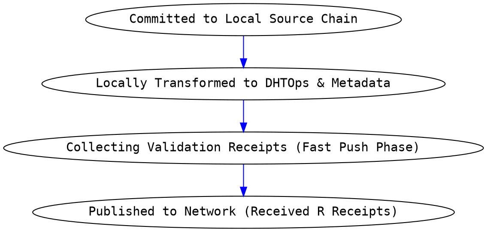
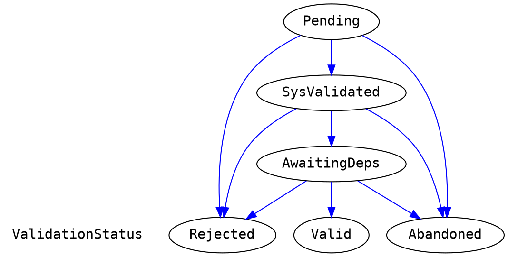
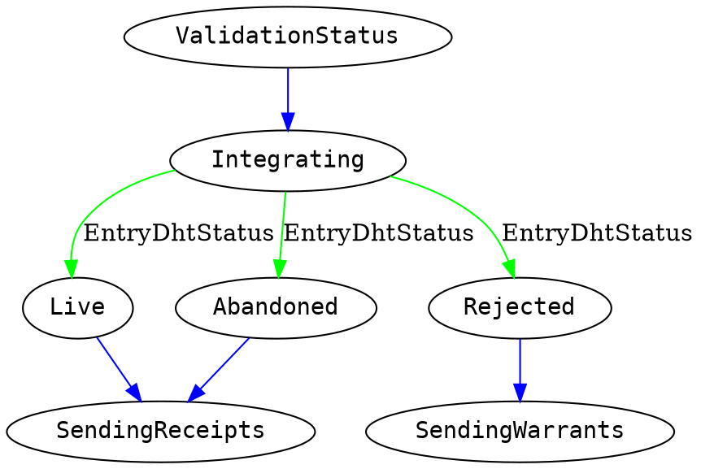
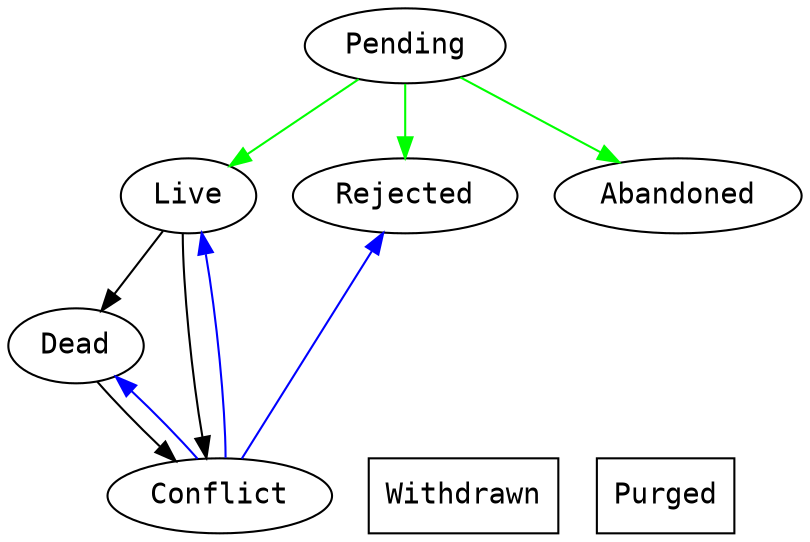

\onecolumngrid
# Appendix A: Holochain Implementation Spec v0.1.0 Beta

So far we have described the necessary components of a scalable
coordination and collaboration system. We have built an "industrial
strength" implementation of this pattern suitable for real-world
deployment, under the name Holochain. Here we describe the technical
implementation details that achieve the various requirements described
above.


This specification assumes that the reader has understood context and background provided in the the [Holochain Formalization](https://hackmd.io/2E2Wx_8FT0iTXk4Eyp12wA)

Given the formal description from that document of our local state model (Source Chain) and shared data model (graph DHT) we can now present a high-level implementation specification of the different components of the Holochain architecture:

- App Virtual Machine (Ribosome)
- State Manager
- P2P Networking (Kitsune)
- The Conductor
- Secure Private Key Management (lair-keystore)

## Ribosome: the Application "virtual machine"

We use the term Ribosome to the name of part of the Holochain system that runs the DNA's application code.  Abstractly, a Ribosome could be built for any programming language as long as it's possible to deterministically hash and run the code of the DNA's Integrity Zome such that all agents can rely on the validation routines and structure desribed by that Integrity Zome. (In our implementation we use WASM for DNA code, and [Wasmer](https://wasmer.io/) as the runtime that executes it.)

There is a set of minimal functions, callbacks and code structuring patterns for defining entry and link types that necessary to make available to hApp developer. We call this set the Holochain Deterministic Integrity component, and in our implementaion we provide it as a [rust crate](https://docs.rs/hdi/) for developers to use when building their Integrity Zomes.  

Additionally there is also a minimal set of functions and callbacks necessary to build out the coordinator zomes that commit source chain entries, and communicate with other nodes in the application network.  We call this set the Holochain Development Kit (HDK) and it is also provided as a [rust crate](https://docs.rs/hdk).  Below is a high level specification of what is needed in an HDI and an HDK.

### HDI
The Holochain Deterministic Integrity (HDI) component of the Holochain architecture comprises the functions and capacities that are made available to app Developers for building their Integrity Zomes. 

**Integrity Zomes** provide the immutable portion of the app's code that:

  - identifies the types of entries and links able to be committed in the app, 
  - defines the structure of data entries, and 
  - defines the validation code each node runs for each type of entry or link. 

The following data structures, functions and callbacks are necessary and sufficient to implement an HDI:

#### Core Holochain data types

##### The `Action` Data Type

All actions must contain the following data elements with the exception of the `Dna` action which, because it indicates the creation of the first chain entry, does not include the `action_seq` nor `prev_action` data elements:
``` rust
struct Action {
    author: AgentHash,
    timestamp: Timestamp,
    action_seq: u32,
    prev_action: ActionHash,
  ...
}
```
Additionally the HDI MUST provide an signed `Action` data structure that allows integrity checking in validation:
``` rust
struct SignedActionEnvelope {
  signature: Signature,
  action: Action,
}
```

Implementation Detail: theoretically all actions could point to entry type via a hash that would contain the "content" of that action.  Because many of the different actions entries are system defined, and they thus have a known structure, we can reduce unnecessary data elements and gossip by embedding the entry data for system-defined entry types right in the action itself. However, for application-defined entry types, because the structure of the entry is not known at compile time for Holochain, the entry data must be in a separate data structure. Additionally there are a few system entry types (see below) that must be independantly retrieveable from the DHT, which thus have their own separate `Entry` data type variant. 

The action types and their additional data fields necessary are:

- `Dna`: indicates the creation of the genesis chain entry holding the DNA
``` rust
struct DnaAction {
  ...
   hash: DnaHash,
}
```
- `AgentValidation`: indicates the creation of the genesis chain entry holding the information used necessary for nodes to confirm whether an agent is allowed to participate in this DNA
``` rust
struct AgentValidationAction {
  ...
  membrane_proof: Option<SerializedBytes>
}
```
- `InitZomesComplete`: indicates the creation of the final genesis chain entry that marks that all zome init functions have successfully completed, and the chain is ready for commits.  Requires no additional data.

- `Create`: indicates the creation of an application defined entry
``` rust
struct CreateAction {
  ...
    entry_type: EntryType,
    entry_hash: EntryHash,
}
```
- `Update`: indicates the creation of a change record for an application defined entry
``` rust
struct UpdateAction {
  ...
    original_action_address: ActionHash,
    original_entry_address: EntryHash,
    entry_type: EntryType,
    entry_hash: EntryHash,
}
```
- `Delete`: indicates the creation of a application defined entry deletion
``` rust
struct DeleteAction {
  ...
    deletes_address: ActionHash,
    deletes_entry_address: EntryHash,
}
```
- `CreateLink`: indicates the creation of a link
``` rust
struct CreateLinkAction {
  ...
    base_address: AnyLinkableHash,
    target_address: AnyLinkableHash,
    zome_id: ZomeId,
    link_type: LinkType,
    tag: LinkTag,
}
```
- `DeleteLink`: indicates the creation of a link deletion
``` rust
struct DeleteLinkAction {
  ...
    deletes_address: ActionHash,
    deletes_entry_address: EntryHash,
}
```
- `OpenChain`: indicates the creation of entry with data for migrating from a previous DNA version
- `CloseChain`: indicates the creation of final chain entry with data about a new DNA version to migrate to

All of the CRUD actions SHOULD include data to implement rate-limiting so as to prevent malicious network action.  In our implementation we provide [TODO: ACB]:

##### The `Entry` Data Type

There are three system `Entry` types:

Agent entries which are the second entry committed during genesis:
``` rust
struct AgentEntry {
  agent: AgentHash
}
```

Capability Grant entries which record in a chain the granting of an access token by access type and function name(s) (see above for a discussion on the Capability security model):
``` rust
struct CapGrantEntry {
  tag: String,
  access: CapAccess,
  functions: BTreeSet<(ZomeName, FunctionName)>,
}

enum CapAccess {
    Unrestricted,
    Transferable {
        secret: CapSecret,
    },
    Assigned {
        secret: CapSecret,
        assignees: BTreeSet<AgentHash>,
    },
}
```

Capability Claim entries which are used by grantees to store grants:
``` rust
struct CapClaimEntry {
  tag: String,
  grantor: AgentHash,
  secret: CapSecret,
}
```

Additionally there are two application defined entry types, the first for storing plain application entries:
``` rust
struct AppEntry {
  entry: SerializedBytes,
}
```
and one for storing countersigned application entries (see above for a discussion on countersigning):
``` rust
struct CoutnersignedAppEntry {
  session: CounterSigningSessionData,
  entry: SerializedBytes,
}

struct CounterSigningSessionData {
    preflight_request: PreflightRequest,
    responses: Vec<(CounterSigningAgentState, Signature)>,
    optional_responses: Vec<(CounterSigningAgentState, Signature)>,
}
```
Note that in both these cases the data is stored using a serialization that is declared by the `entry_defs()` function of the HDI.

##### The `Record` Data Type

A record is just a wrapper for a ActionEnvelope and an Entry:
``` rust
struct Record {
  action: SignedActionEnvelope,
  entry: Entry,
}
```

##### The `Link` Data Type

A link entry holds the relational graph information.  Note that links are typed for performance purposes such that when requesting links they can be retrieved by type.  Additionally links have tags that can be used as arbitrary labels on graph as per the application's needs. The `zome_id` is necessary so that the system can run the correct validation routines for that link as a DNA may have multiple integrity zomes.
``` rust
struct Link {
  base_address: AnyLinkableHash,
  target_address: AnyLinkableHash,
  zome_id: ZomeId,
  link_type: LinkType,
  tag: LinkTag,
}
```

##### The `Op` Data Type

The `Op` types that hold the chain entry transform data that is published to different portions of the DHT (formally described above) are listed below.  The validation callback is called with an `Op` as its single paramater which indicates the DHT perspective from which to validate the data:

- `StoreRecord`: called for each entry authority to store data
- `StoreEntry`: called for each entry authority to store data 
- `RegisterUpdate`: called for each entry authority to store meta data
- `RegisterDelete`: called for each entry authority to store meta data
- `RegisterAgentActivity`: called for agent authorities to confirm action
- `RegisterCreateLink``: called for each entry authority to store link data
- `RegisterDeleteLink`: called for each entry authority to store link meta data

#### Hash Data Structures

Holochain relies on being able to distinguish and use hashes of the various Holochain fundamental data types.  The following hash types must exist:

- `EntryHash`: the hash of an application defined entry
- `ActionHash`: the hash of the `Action` that created a chain entry
- `AgentHash`: the "hash" of an `Agent` which is just the value of the Agent's public key
- `DnaHash`: this type refers to the hash of DNA code
- `ExternalHash`: this type is used for creating links in the graphing DHT to entities that are not actually stored in the DHT.

#### Application Type Definition Functions

- `entry_defs()`: called to declare the type and structure of the application's entry types.
- `link_types()`: called to declare the link types that will be used by the application.

Note: In our implementation these functions are defined as Rust macros and structures created by them are automaticlly enforced by the system because of the properties rust's strong typing being built into serialization and deserialization.  Thus it's very easy to assure that any application entry that is being stored adheres to the entry and link type declarations.  

#### Functions necessary for application Validation

The HDI MUST allow for happ developers to specify a `validate(Op) -> ValidateCallbackResult` callback function for each integrity zome.  This callback gets called by the Holochain system in the correct context for the Op as described above in the graphing DHT formalization so that the data associated with the `Op` will only be stored if it meets the validation criteria.

The HDI MUST provide the following functions for application authors to retrieve dependencies in validation:

- `must_get_agent_activity(hash_bounds)`: This function allows for deterministic validation of chain activity by making a hash bounded range of an agent's chain into a dependency for something that is being validated.
- `must_get_action(ActionHash)`: get a `SignedActionHashed` at a given hash
- `must_get_entry(EntryHash)`: get an `Entry` at a given hash.
- `must_get_valid_record(ActionHash)`: get a VALID `Record` at a given hash.

The HDI MUST implement two hashing functions that calculate the hashes of `Actions` and `Entries` so that hash values can be confirmed in validation routines.

- `hash_action(Action) -> ActionHash`
- `hash_entry(Action) -> EntryHash`

The HDI MUST implement two introspection functions that return data about the DNA's definition and context that may be necessary for validation:

- `dna_info() -> DnaInfo`: returns information about the DNA:
``` rust
struct DnaInfo {
    name: String,
    hash: DnaHash,
    properties: SerializedBytes,
    zome_names: Vec<ZomeName>,
}
```
- `zome_info() -> ZomeInfo`: returns information about the zome:
``` rust
struct ZomeInfo {
    name: ZomeName,
    id: ZomeId,
    properties: SerializedBytes,
    entry_defs: EntryDefs,
    extern_fns: Vec<FunctionName>,
    zome_types: ScopedZomeTypesSet,
}
```
Note: `properties` consists of known application specified data that is specified at install time (both at the DNA and zome levels) that may be necessary for validation or any other application defined purpose.  Properties are included when hashing the DNA source code, thus allowing parametarized DNAs and zomes.  


The HDI MUST implement a function that validation code can use to verify cryptographic signatures:

- `verify_signature(key, signature, data) -> bool`

### HDK

The HDK contains all the functions and callbacks need for Holochain application developers to build their Coordination Zomes.  Note that the HDK is a superset of the HDI. Thus all of the functions and data types available in the HDI are also available in the HDK.

#### Chain Operations

The HDK MUST implement the following functions that create source chain entries:

- `create_entry(Entry, EntryVisibility, ChainTopOrdering) -> ActionHash`: records a new application entry.  The `EntryVisibility` parameter specifies whether the entry is private or should be published to the DHT, and the `ChainTopOrdering` parameter specifies whether the call should fail if some other zome call with chain creation actions completes before this one, or whether it's ok to automatically replay the re-write the action on top of any such chain entries. 
- `update_entry(ActionHash, Entry, EntryVisibility, ChainTopOrdering) -> ActionHash`: records updating of a chain entry.  Requires the ActionHash that created the entry to be provided.  Also takes the same parameters as `create_entry`
- `delete_entry(ActionHash, ChainTopOrdering) -> ActionHash`: records the deletion of an entry specified by the ActionHash.
- `create_link(Link, ChainTopOrdering) -> ActionHash`: records a link.
- `delete_link(ActionHash, ChainTopOrdering) -> ActionHash`:  records the deletion of a link
- `query(ChainQueryFilter) -> Vec<Record>`: search the source chain according a query filter returning the Records that match. 

#### Capabilites Management

- `create_cap_grant(CapGrantEntry) -> ActionHash`: records a capability claim
- `create_cap_claim(CapClaimEntry) -> ActionHash`: records a capability grant
- `update_cap_grant(ActionHash, CapGrantEntry) -> ActionHash`: records updating of a capability grant given its creation ActionHash
- `delete_cap_grant(ActionHash -> ActionHash`: records deltion of a capability grant given its creation ActionHash
- `generate_cap_secret() -> CapSecret`: generates a capability secret for use in creating a grant

#### DHT Data Retrieval
- `get(Hash) -> Option<Record>`: retrieves a Record from the DHT by specifying its Hash
- `get_links(AnyLinkableHash, LinkTypeFilter, Option<LinkTag>) -> Vec<Link>`: retrieve a list of links that have been placed on any hash on the DHT, optionally filtering by the links type or tag.
- `get_agent_activity(AgentHash, ChainQueryFilter, ActivityRequest) -> AgentActivity`: retrieves the activity of an agent from the agent's neighbors on the DHT, where `ActivityResult` is:
``` rust
struct AgentActivity {
    valid_activity: Vec<(u32, ActionHash)>,
    rejected_activity: Vec<(u32, ActionHash)>,
    status: ChainStatus,
    highest_observed: Option<(u32, ActionHash)>,
    warrants: Vec<Warrant>,
}
enum ChainStatus {
    Empty,
    Valid(ChainHead),
    Forked(ChainFork),
    Invalid(ChainHead),
}
```

Note on Performance and ergonomics: In our implementation we have separate `get_details` functions that return not just the content being searched for, but also the actions, and meta-data about entries & links, i.e. deleted/update status as well.

#### Introspection

- `agent_info() -> AgentInfo`: returns information about current agent and source chain:
``` rust
struct AgentInfo {
    agent_initial_pubkey: AgentHash,
    agent_latest_pubkey: AgentHash,
    chain_head: (ActionHash, u32, Timestamp),
}
```
- `call_info()->CallInfo`: returns contextual information about the current zome call:
``` rust
struct CallInfo {
    provenance: AgentHash,
    function_name: FunctionName,
    as_at: (ActionHash, u32, Timestamp),
    cap_grant: CapGrant,
}
```
- `dna_info() -> DnaInfo` (see HDI)
- `zome_info() -> ZomeInfo` (see HDI)

#### Modularization and Composition

Zomes are intended to be units of composition for application developers.  Thus zome functions MUST be able to make calls to other zome functions, either in the same zome or in other zomes or even DNAs:

- `call(TargetDna, ZomeName, FunctionsName, Option<CapSecret>, Payload) -> ZomeCallResponse`: calls a zome function in a target Dna and zome, supplying a CapSecret and a parameter payload.

#### Scheduling

The HDK SHOULD implement the ability for zome calls tbe scheduled for calling in the future which allows for important application functionality like retries:

- `schedule(fn_name: String)`: schedules a zome call for calling at a future time:
zome calls which are schedulable must take a single `Schedule` parameter which indicates the schedule at which the call was made, and they must also return an `Option<Schedule>` that alows re-scheduling of the same call.
The `Schedule` type defines either a persisted or ephemeral schedule for a schedule function. Persisted schedules survive a conductor reboot, ephemeral will not. Persisted schedules continue beyond irrecoverable errors, ephemeral do not:
``` rust
enum Schedule {
    Persisted(String),  // a crontab syntax string
    Ephemeral(Duration),
}
```

#### P2P Interaction
Agents MUST be able to communicate directly with other agents.  They do so simply by making zome calls to them.  Holochain systems MUST make this possible by sending a call requests over the network and awaiting a response.  For performance reasons the HDK SHOULD also make possible sending of best-effort in parallel signals for which no return result is awaited.

- `call_remote(AgentPubKey, ZomeName, FunctionName, Option<CapSecret>, Payload)->ZomeCallResponse`: calls a zome function on a target agent and zome, supplying a CapSecret and a parameter payload.
- `remote_signal(Vec<AgentHash>, Payload)`: sends a best-effort signal to a list of agents.  Signals are received by implementing the `recv_remote_signal(Payload)` callback which the Holochain system MUST attempt to call when signals are received.

#### Countersigning

- `accept_countersigning_preflight_request(PreflightRequest)`: Locks the local chain to commence a countersigning session. The `PreflightRequestAcceptance` MUST be sent back to the session initiator so that the corresponding entry can be built for everyone to sign. This function MUST be called by every signer in the signing session. It doesn’t matter how, although concurrent remote calls are probably the simplest mechanism to distribute and accept preflight requests before the session times out.  The preflight request requires the following data (see discussion above on countersigning):
``` rust
struct PreflightRequest {
    // The hash of the app entry, as if it were not countersigned. The final entry hash will include the countersigning session.
    app_entry_hash: EntryHash,
    // The agents that are participating in this countersignature session.
    signing_agents: Vec<(AgentHash, Vec<Role>)>,
    // The optional additional M of N signers. If there are additional signers then M MUST be the majority of N. If there are additional signers then the enzyme MUST be used and is the first signer in BOTH signing_agents and optional_signing_agents.
    optional_signing_agents: Vec<(AgentHash, Vec<Role>)>, 
    // The M in the M of N signers. M MUST be strictly greater than than N / 2 and NOT larger than N.
    minimum_optional_signing_agents: u8,
    // The first signing agent (index 0) is acting as an enzyme. If true AND optional_signing_agents are set then the first agent MUST be the same in both signing_agents and optional_signing_agents.
    enzymatic: bool, 
    // The session times. Session actions must all have the same timestamp, which is the session offset.
    session_times: CounterSigningSessionTimes,
    // The action information that is shared by all agents. Contents depend on the action type, create, update, etc.
    action_base: ActionBase,
    // optional arbitrary bytes that can be agreed to.
    preflight_bytes: PreflightBytes, 
}
struct CounterSigningSessionTimes {
    start: Timestamp,
    end: Timestamp,
}
enum ActionBase {
    Create(CreateBase),
    Update(UpdateBase),
}
struct Role(u8);
enum PreflightRequestAcceptance {
    Accepted(PreflightResponse),
    UnacceptableFutureStart,
    UnacceptableAgentNotFound,
    Invalid(String),
}
struct PreflightResponse {
    request: PreflightRequest,
    agent_state: CounterSigningAgentState,
    signature: Signature,
}
struct CounterSigningAgentState {
    /// The index of the agent in the preflight request agent vector.
    agent_index: u8,
    /// The current (frozen) top of the agent's local chain.
    chain_top: ActionHash,
    /// The action sequence of the agent's chain top.
    action_seq: u32,
}
```
- `session_times_from_millis(ms: u64)->CountersigningSessionTimes`: a function to create the session times that are included in the `PreflightRequest` and bound the countersigning session temporally. This function starts the session “now” in the opinion of the session initiator and ends it after ms milliseconds relative to “now”. The countersigning parties will check these times as part of accepting the preflight request so all system clocks need to be roughly aligned and the ambient network latency must fit comfortably within the session duration.

#### Cryptography

The HDK MUST provide mechanisms for agents to sign data.  It SHOULD provide mechanisms to encrypt and decrypt data and return pseudo-random data:

- `sign(Key, Data) -> Signature`: give a public key, request from the key-management system the signing of the given data by the private key.
-`verify_signature()` (see HDI)
- `encrypt(Key, Data) -> EncryptedData` : give a public key, request from the key-management system the encryption of the given data by the private key.
- `decrypt(Key, EncryptedData) -> Data` : given a public key and data encrypted with that key's private key, return the decrypted data
- `random_bytes(number_of_bytes: u32) -> Bytes`: Get N cryptographically strong random bytes.

#### User Notification

The HDK SHOULD provide a way for zome code to notify the application user of events.  To start with we have implemented a system where:

- `emit_signal(Signal)` : emits the SIGNAL

#### Anchors and Paths

A content addressable store accessible only by the hash of stored items is difficult to search beacuse of the sparse nature of the hashes.  Holochain's graphing DHT makes it much easier to retrieve related information via the affordance of links that can be retrieved from a give hash address.  A powerful pattern that can be built on top of links, is what we call anchors and, more genrally, paths.  These patterns rely on the idea of starting from a known hash value that all parties can compute, and placing links from that hash to relevant entries.  So, for example, one could take the hash of the string `#funnycats` and add links on that hash to all entries in a social media app that are posts containing that hashtag.  The anchor pattern uses the idea of anchor types and anchors and affords search for registered types and anchors of those types. The path pattern simply generalizes this to creating an aribrary hierarchical tree of known values off of which to create links in the DHT.

##### Anchors

The HDK MAY provide functions to compute hashes from know strings using the anchor pattern, which creates a two level hierarchy of anchor types and anchors off of which to link entries:

- `anchor(link_type: LinkType, anchor_type: String, anchor_text: String) -> EntryHash`: Returns an anchor's hash.
- `list_anchor_type_addresses(
    link_type: LinkType,
    anchor_type: String,
    anchor_text: String
) -> Vec<AnyLinkableHash>` : Returns every entry hash in a vector from the root of an anchor.
- `list_anchor_addresses (
    link_type: LinkType,
    anchor_type: String
) -> Vec<AnyLinkableHash>`: Returns every entry hash in a vector from the second level of an anchor.

##### Paths

The HDK MAY provide functions to compute hashes from know strings using the paths pattern, which affords an arbitrary hierarchy of known hashes off of which to link entries:  
``` rust
struct struct Path(Vec<Component>)
```
- `path_root() -> AnyLinkableHash`: returns the root hash of the path hierarchy off of which one can search for any previously registered paths, e.g. `path_children(path_root())` will find all top-level paths.
- `path_create(Path)`: creates path entries and links for every component of the path
- `path_entry_hash(Path) -> EntryHash`: returns the entry hash of a given path which can then be used to search for items linked off of that part of the path tree
- `path_exists(Path) -> bool`: returns whether a path entry exists at the Path hash
- `path_links(Path) -> Vec<Link>`: returns all the non-path links on a given path
- `path_children(Path) -> Vec<Path>`: returns the path of all the children below this given path

## Holochain State Manager

The previous section describes the functions exposed callable from DNA code such that developers can implement the integrity of a DNA (it's structure and validation rules) and the functions that can be called on that integrity for authoring source chain entries and coherently retrieving that information from the application's DHT.  This section describes in the implementation requirements for recording and storing all aspects of Holochain's state.  This includes agent's source-chain entries, the portion of the DHT data an node is holding, configuration data, caches, etc. 

### Requirements

1. The State Manager MUST store the entries created during zomes calls to a local database using ACID transactions such that all entries created in the zome call are committed to the databse at once, or none are in the case of failures.  Failures may include the usual failures of power-loss, or error conditions returned in the code itself, but more importantly include the condition in which a different zome call running in parallel has completed it's commits before the given zome call completes advancing the head of the local source chain.
1. The State Manager MUST be able to retrieve queries on the source chain from the point of view of the calling context.  For example, assume a zome call in progress in which some entries have been added to the chain.  Calling `query()` or `get()` should return those commited entries despite the fact that they many not yet have actually been committed to the "real" chain as the zome call has not finished and all of those entries may yet be discarded if another zome call compeletes first.  
1. The State Manager MUST be able to manage the state of many DNAs simultaneously.

### Storage Types

The State Manager MUST be able to manage the peristence of the following data elements:

- `DhTOp` : a DhTOp and it's hash, dependencies (Entry/Action Hashes), validation status and stage, integration and last_publish timestamps
- `Record`: an Action and Entry pair
- `SignedValidationReceipt`: a proof-of-validation receipt from another node regarding a Record
- `DnaWasm` : the WASM code of a DNA
- `DnaDef` : the modifiers that get hashed along with a DNA to create the hash of a specific application instance
- `Schedule`: a scheduled function request such that scheduled zome-calls can be implemented.
- `ConductorState`: the state of all installed DNAs and their status


### State Manager Subsystems [TODO: ACB (name and sketch out missing subsystems)]

#### Validation Queue [TODO: ACB]
####  [TODO: ACB]

## Shared Data (rrDHT)

In this section we detail some important implementation details of Holochain's graphing DHT.

### DHT Op Transforms

#### Structure of DHTOps

You can think of an topological transform operation as having this sort of grammar:
$BaseHash, ActionType, Predicate, Payload$ 

Where: 
 - $BaseHash$ is the address to which an action is being applied. 
 - $ActionType$ is the type of action a node is responsible for performing
 - $Predicate$ is the additional data fields needed to determine action, such as link_to action (e.g. $+ \scriptsize \xrightarrow{\text{header}} h_E$)
 - $Payload$ is the self-proving structure of entry_with_action. 


The technical implementation below of the human-friendly grammar above compresses and drops unnecessary items where possible. There are a couple of ActionTypes where we can drop the entry (but never the action), we can crunch all the data down to Action + an ActionType enum struct which usually contains the entry.

The BaseHash (or hash neighborhood we're sending to) can be derived from the payload using the hash_hood function outlined below. And Predicates just kind of disappear because we can pull the required data from either the entry or action.

```rust

// Ops that start with Store, store new base data
//Ops starting with Register, attach metadata to existing base data     
enum DHTOp {
    #[cfg(strict)] // if there is a strict mode where nodes that hold headers also validate entries
    StoreElement(Signature, Header, Option<Entry>),
    StoreEntry(Signature, NewEntryHeader, Entry),
    RegisterAgentActivity(Signature, Header),
    RegisterUpdatedBy(Signature, header::Update, Option<Entry>),
    RegisterUpdatedEntryHeader(Signature, header::Update),
    RegisterDeletedBy(Signature, header::Delete),
    RegisterDeletedEntryHeader(Signature, header::Delete),
    RegisterAddLink(Signature, header::CreateLink),
    RegisterRemoveLink(Signature, header::DeleteLink),
}

impl DHTOp {
    fn neighborhood(self) -> AnyDhtHash {
        match self {
            StoreElement(header) => hash(header),
            StoreEntry(entry) => hash(entry),
            RegisterAgentActivity(header) => header.author(),
            RegisterUpdatedBy(header) => header.original_header_address,
            RegisterUpdatedEntryHeader(Signature, header::Update) => header.original_entry_address,
            RegisterDeletedBy(header) => header.deletes_address,
            RegisterDeletedEntryHeader(header) => header.deletes_entry_address,
            RegisterAddLink(header) => header.base_address,
            RegisterRemoveLink(header) => header.base_address,
        }
    }
    
    from(commit) {
        ... construct DHT Op Transform
    }
}
```

#### Uniquely hashing transform ops when they are redundant [TODO: ACB (convert to MAY or SHOULD)]

We then use a carefully crafted hash to uniquely identify the DHT transform. There are a few important requirements in producing this hash. These hashes are keys in the Integrated DHT Ops database, which includes all authored or held entries that have gone through validation and are stored in the CAS. (Note: We don't need to store the entires/headers in this DB since it contains the addresses for pulling them from the CAS.)

When items are gossiped/published to us, we can quickly check 1. Is the BaseHash in our hold range? 2. Have we integrated it yet? and quickly take appropriate action. 

The content hashed into each of these identifiers is designed to include only the necessary and sufficient inputs to produce unique hashes for performing a NEW transform -- only when there's a new hash. It is intentionally possible for new actions from different agents to produce an Op_transform_hash that has already been integrated. This would indicate there are no changes for that the node to perform. (e.g. RegisterDeletedBy uses only hashes the deletion entry, because if Agent A holds the entry being deleted, it only needs to register a link to "Deleted by" that deletion entry hash. If Agents B and C come along and also delete that same entry, no new data needs to be integrated for this transform on Agent A, because they produce the same deletion entry hash and there's already a pointer to it. However, Agents holding the deletion entry itself will need to store all three headers as provenances of the deletion action, so StoreEntry hashes the header to identify if you need to perform the transform.)

The following code outlines the minimal necessary contents to create the correct transform hash. 


```rust
#[derive(Hash)]
enum HashReadyForm<'a> {
    // optimization: don't hash signature. it is redundant with header and therefore wastes hash time to include
    StoredHeader { header_content: &'a HeaderContent },
    StoredEntry { header_content: &'a HeaderContent },
    RegisteredAgentActivity { header_content: &'a HeaderContent },
    RegisteredUpdatedTo { entry: &'a EntryContent, replaces: &'a Address },
    RegisteredDeletedBy { entry: &'a DeleteEntry },
    RegisteredAddLink { header_content: &'a HeaderContent },
    // ^ future work: encode idempotency in LinkAdd entries themselves
    RegisteredRemoveLink { header_content: &'a HeaderContent },
    // ^ if LinkAdds were idempotent then this could just be entry.
}

fn unique_hash(op: &DHTOp) -> HashReadyForm<'_> {
   let DHTOp {Header(header_content, ..), data} = op;
   match data {
        use OpData::*;
        StoreHeader { .. } => HashReadyForm::StoredHeader { header_content },
        StoreEntry { .. } => HashReadyForm::StoredEntry { header_content },
        RegisterAgentActivity => HashReadyForm::RegisteredAgentActivity { header_content },
        RegisterUpdatedTo { entry } => HashReadyForm::RegisteredUpdatedTo { entry, header.replaces()},
        RegisterDeletedBy { entry } => HashReadyForm::RegisteredDeletedBy { entry },
        RegisterAddLink { .. } => HashReadyForm::RegisteredAddLink { header_content },
        RegisterRemoveLink { .. } => HashReadyForm::RegisteredRemoveLink { header_content },
    }
}
```


### Fast Push vs. Slow Heal
[TODO: ACB  any implementation details here?  The main idea was described above]
Publish(multicast) --> author collects validation receipts
Gossip(direct) --> ongoing aliveness & resilience based on uptime data


### DHT-Transform-Status Worklow:

See workflows with state data across multiple LMDB tables. [TODO: ACB fixme no more LMDB]



### Validation queue state graph
These are the state changes in the validation workflow.

**"Subconscious" Validation Rules:** Certain types of validation must be universally enforced by Holochain core rather than application logic. For example, valid state transitions from the graph above...

#### Validation State Diagram
Elements whose provenance cannot be validated (in other words, their headers don't have valid signatures or authors) are dropped early in the validation process as counterfeit/garbage/spam data.


**Abandoned Status:** DHT transforms whose validation process has been abandoned, are not gossiped. There are TWO reasons to abandon validation. Both have to do with consuming too much resources.
 1. It has stayed in our validation queue too long without being able to resolve dependencies. That means we've been creating network traffic every few minutes for some long period of time (week? month?) trying to resolve dependencies, and we are no longer going to waste our compute time and generate network noise for this.
 2. The app validation code used more resources (CPU, memory, bandwidth) than we allocate for validation. This lets us address the halting problem of validation with infinite loops.

#### Integration State Diagram [TODO: ACB ( here in implementation or up in formalization?)]
All elements that complete the validation process need to be integrated into the data store with their associated validation result. Note: We do not store or gossip the Entries** which were Abandoned (only the Actions).


#### Using EntryDhtStatus to Track Liveness of Data [TODO: ACB ( here in implementation or up in formalization?)]
You can see these EntryDhtStatuses generated from the validation states above. The later states happen when an entry is updated/deleted or when a partition conflict is detected.

Once a header/element has been deleted...

An Entry is considered deleted/not live when ALL of the headers which created the entry have been deleted.

Withdrawn and Purged are placeholders for possible future features. Withdrawn is for an author to void an action or correcting an error (such as accidental forking of their chain, where they withdraw actions down a fork). Purged could be an action by collective agreement to drop entry/content -- e.g. for things that may be illegal to hold (e.g. child pornography). The process of changing data to these states is TBD.


## P2P Networking
A robust networking implementation for Holochain involves two layers: the Holochain P2P networking layer which is designed around the p2p communication needs of agents in a DNA and the building of the DNA's grpahing DHT, as well as an underlying P2P layer that handles the fact that a Holochain node will be managing communication with other nodes all of which will be running non-overalpping sets of DNAs.  Thus, from a networking perspective, there is the view of a single DNA (which is it's own network), but there is the view of a user running Holochain and belonging to many DNAs at the same time.  

Because the same DHT patterns that work at the level of a Holochain DNA sharing storage of application data, also work to solve the problem of a shared database holding updates to a routing table of peer addresses, we have implemented a generalized p2p DHT solution and built the higher level Holochain P2P networking needs on top of that lower level.  Below we describe the high level requirements and network messages for Holochain, and then the lower level requirements and network messages that carry the higher level ones.

### High Level Networking (HolochainP2P)

There are a number of network messages that are sent and handled as a direct result of HDK functions or callbacks being executed in a zome call.  These calls are all directed at specific agents in a DNA either because they explicitly are targeted in the call (i.e. `remote_signal`) or because the agent has been determined to be responsible for holding data on the DHT. Note that the `ValidationReceipt` message is sent back to an authoring agent as a result of a node validatihg a `DhtOp` during a `validate()` callback, and `Pulblish` messageses are sent to all the various nodes as a result of taking any chain action and transforming it into `DhTOp`s.

The following messages types MUST be implemented:

``` rust
enum WireMessage {
    CallRemote {
        zome_name: ZomeName,
        fn_name: FunctionName,
        from_agent: AgentPubKey,
        cap_secret: Option<CapSecret>,
        data: Vec<u8>,
    },
    Get {
        dht_hash: AnyDhtHash,
        options: GetOptions,
    },
    GetLinks {
        link_key: WireLinkKey,
        options: GetLinksOptions,
    },
    GetAgentActivity {
        agent: AgentPubKey,
        query: ChainQueryFilter,
        options: GetActivityOptions,
    },
    MustGetAgentActivity {  //  deterministic get_agent_activity for use during validation
        agent: AgentPubKey,
        filter: ChainFilter,
    },
    CountersigningSessionNegotiation {
        message: CountersigningSessionNegotiationMessage,
    },
    ValidationReceipt {
        receipt: Vec<u8>,
    },
    Publish {
        request_validation_receipt: bool,
        countersigning_session: bool,
        basis_hash: OpBasis,
        ops: Vec<DhtOp>,
    },
}
```

The options data structures for these messages are as follows:

``` rust
/// Get options help control how the get is processed at various levels.
/// Fields tagged with ```[Network]``` are network-level controls.
/// Fields tagged with ```[Remote]``` are controls that will be forwarded to the
/// remote agent processing this `Get` request.
struct GetOptions {
    /// ```[Network]```
    /// How many remote nodes should we make requests of / aggregate.
    /// Set to `None` for a default "best-effort".
    remote_agent_count: Option<u8>,

    /// ```[Network]```
    /// Timeout to await responses for aggregation.
    /// Set to `None` for a default "best-effort".
    /// Note - if all requests time-out you will receive an empty result,
    /// not a timeout error.
    timeout_ms: Option<u64>,

    /// ```[Network]```
    /// We are interested in speed. If `true` and we have any results
    /// when `race_timeout_ms` is expired, those results will be returned.
    /// After `race_timeout_ms` and before `timeout_ms` the first result
    /// received will be returned.
    as_race: bool,

    /// ```[Network]```
    /// See `as_race` for details.
    /// Set to `None` for a default "best-effort" race.
    race_timeout_ms: Option<u64>,

    /// ```[Remote]```
    /// Whether the remote-end should follow redirects or just return the
    /// requested entry.
    follow_redirects: bool,

    /// ```[Remote]```
    /// Return all live actions even if there are deletes.
    /// Useful for metadata calls.
    all_live_actions_with_metadata: bool,

    /// ```[Remote]```
    /// The type of data this get request requires.
    request_type: GetRequest,
}

/// Get links from the DHT.
/// Fields tagged with ```[Network]``` are network-level controls.
/// Fields tagged with ```[Remote]``` are controls that will be forwarded to the
/// remote agent processing this `GetLinks` request.
struct GetLinksOptions {
    /// ```[Network]```
    /// Timeout to await responses for aggregation.
    /// Set to `None` for a default "best-effort".
    /// Note - if all requests time-out you will receive an empty result,
    /// not a timeout error.
    timeout_ms: Option<u64>,
}

/// Get agent activity from the DHT.
/// Fields tagged with ```[Network]``` are network-level controls.
/// Fields tagged with ```[Remote]``` are controls that will be forwarded to the
/// remote agent processing this `GetLinks` request.
struct GetActivityOptions {
    /// ```[Network]```
    /// Timeout to await responses for aggregation.
    /// Set to `None` for a default "best-effort".
    /// Note - if all requests time-out you will receive an empty result,
    /// not a timeout error.
    timeout_ms: Option<u64>,
    /// Number of times to retry getting records in parallel.
    /// For a small dht a large parallel get can overwhelm a single
    /// agent and it can be worth retrying the records that didn't
    /// get found.
    retry_gets: u8,
    /// ```[Remote]```
    /// Include the all valid activity actions in the response.
    /// If this is false the call becomes a lightweight response with
    /// just the chain status and highest observed action.
    /// This is useful when you want to ask an authority about the
    /// status of a chain but do not need all the actions.
    include_valid_activity: bool,
    /// Include any rejected actions in the response.
    include_rejected_activity: bool,
    /// Include the full signed actions and hashes in the response
    /// instead of just the hashes.
    include_full_actions: bool,
}
```

### Low Level Networking (KitsuneP2P)

Kitsune is a P2P library for implementing distributed application messaging needs that delivers dynamic peer address discovery and message routing.  It also delivers the necessary affordances for distributed applications to implement sharded DHTs as a content addressible store as it natively groups its messages into `KitsuneSpaces` (which correspond to Holochain's DNA addresses) and `KitsuneAgents` which are, as in Holochain, the public key of the agents participating in the space.  Kitsune handles the mapping of the `KitsuneAgent` address space to network transport addresses.  

Kitsune assumes an "implementor" with it's own higher level custom message types, and which also manages persistent storage and handles key management and message signing.  Kitsune sends events to the implementor to retrieve data, as well as receives messages from the implementor to be delivered to other kitsune nodes.  

Thus, Holochain implements its both it's node-to-node messaging and it's graphing DHT on top of the capabilities provided by Kitsune.   

#### Architecture
Kitsune runs as a set of actor chanels that receive network events and delegates them to local handlers or "implementor" handlers.  Additionally Kitusune provides the implementor with an Api for sending messages and getting information about agents that exist in a given space.

[TODO:? some sort of Kitsune high level system diagram?]


#### Message Types

These are the message types that Kitsune uses:
``` rust
enum Wire {
        /// Failure
        Failure {
            reason: String,
        },

        /// "Call" to the remote. This message encapsulates
        /// the implementors wire-types, i.e. all of the
        /// Holochain network messages are sent using this message type.
        Call {
            space: KitsuneSpace,
            to_agent: KitsuneAgent,
            data: WireData,
        },

        /// "Call" response from the remote implementor level.
        CallResp {
            data: WireData,
        },


        /// Fire-and-forget broadcast message.
        /// uses low-level notify, not request
        Broadcast {
            space: KitsuneSpace,
            to_agent: KitsuneAgent,
            destination: BroadcastTo,
            data: WireData,
        },

        /// Gossip op with opaque data section,
        /// to be forwarded to gossip module.
        /// uses low-level notify, not request
        Gossip {
            space: KitsuneSpace,
            data: WireData,
            module: GossipModuleType,
        },

        /// Ask a remote node if they know about a specific agent
        PeerGet {
            space: KitsuneSpace,
            agent: KitsuneAgent,
        },

        /// Response to a peer get
        PeerGetResp {
            agent_info_signed: AgentInfoSigned,
        },

        /// Query a remote node for peers holding
        /// or nearest to holding a u32 location.
        PeerQuery {
            space: KitsuneSpace,
            basis_loc: DhtLocation,
        },

        /// Response to a peer query
        PeerQueryResp {
            peer_list: Vec<AgentInfoSigned>,
        },

        /// MetricsExchangeMessage
        MetricExchange) {
            space: KitsuneSpace,
            msgs: Vec<MetricExchangeMsg>,
        },
```

#### Gossip

Kitsune MUST provide a way for the DHT data to be gossiped among peers in a space.  We assume that there will be many gossip implementations that are added over time.  We have implemented full-sync gossip protocol and and a novel "quantized gossip" algorithm that effeciently shards and redistributes data as nodes come and go from the network.  The full description that gossip algorithm is beyond the scope of this document and details on this algorithim can be found here: [TODO: ACB link?]. 

Any gossip algorithm to be used in the Holochain context MUST be able to handle the following constraints:

1. A new node coming on to the network, or one returning to the network after a significant changes have occured on the DHT, SHOULD be able synchronize to it's state of holding the correct data that it is deemed to be an authority for, quickly while balancing bandwidth limitations of the network it's part of.  This requires that the system be resilient to asymetric upload and download realities that will vary accross peers.
2. Gossiping SHOULD minimize total consumed bandwith, i.e. by not re-transmitting data as much as possible.
3. ...


## The Conductor

A Holochain Conductor manages runing Holochain applications, which consist of logically related DNAs operating under a single agency.  Thus a conductor MUST be able to interpret an application bundle format and instantiate Cells from that format.  Additionally a Conductor SHOULD cache DNA definitions and WASMs provided so as to decrease installation time of other instances of the same DNA as well as not store multiple copies of the same DNA.

### Bundle Formats

Holochain implementations must be able to load Holochain applications that have be serialized either to disk or for transmission over a network.  Holochain uses a bundling format that allows for specification of properties along with other resources in a manifest that can include recursively bundled elements of the same general bundling format but using a different manifest. Any of the sub-bundles can be specificed by "location" which may be specified to be in the same bundle, in a separate file, or at a network address. Thus we have Zomes, Dnas, Apps, and WebApps that can all be wrapped up in a single bundle, or where parts are referred to as existing elsewhere.  The "meta bundle" format can be seen here: https://github.com/holochain/holochain/tree/develop/crates/mr_bundle.  The manifests for each of the type of bundles that MUST be implemented are specified as follows: 

#### DNA Bundle
``` rust
struct DnaManifestV1 {
    name: String,
    integrity: IntegrityManifest,
    coordinator: CoordinatorManifest,
}
struct IntegrityManifest {
    /// A network seed for uniquifying this DNA. See [`DnaDef`].
    network_seed: Option<Vec<u8>>,

    /// Any arbitrary application properties can be included in this object.
    properties: Option<YamlProperties>,

    /// The time used to denote the origin of the network, used to calculate time windows during gossip.
    /// All Action timestamps must come after this time.
    origin_time: HumanTimestamp,

    /// An array of zomes associated with your DNA.
    /// The order is significant: it determines initialization order.
    /// The integrity zome manifests.
    zomes: Vec<ZomeManifest>,
}
struct CoordinatorManifest {
    /// Coordinator zomes to install with this dna.
    zomes: Vec<ZomeManifest>,
}
struct ZomeManifest {
    /// Just a friendly name, no semantic meaning.
    name: ZomeName,

    /// The hash of the wasm which defines this zome
    hash: Option<WasmHashB64>,

    /// The location of the wasm for this zome
    location: mr_bundle::Location,

    /// The integrity zomes this zome depends on.
    /// The order of these must match the order the types are used in the zome.
    dependencies: Option<Vec<ZomeName>>,
}
```
#### App Bundle

An `AppBundle`  combines together a set of DNAs paired with "Role" identifiers and instructions for how/when the Conductor should install DNAs to make cells in the bundle.  The "role" of DNA is useful for application developers to be able to specify a DNA by semantically accisible name rather than just its hash.  This also allows for "late-binding" as DNAs can be used in different ways in applications, and thus we can think of the DNAs name by the role it plays in a given application.

A note on Cell "provisioning".  There are a number of ways that Application developers MUST be able to specify conditions under which DNAs are instantiated into Cells in the Conductor.  The baseline usecase is simply that all DNAs are expected to be installed from the bundle.  There are a number of use-cases where a Holochain application will expect a Cell of a given DNA to already have installed and relies on this behavior.  Thus, there MUST be a provisioning option to specify this usecase.  Also Holochain Conductors MUST implement a cloning mechanism to allow applications to create new Cells dynamically via the App interface (see Conductor API below).  DNAs that are expected to be cloned MUST be specified in the DNA Bundle so that the Conductor can have cached and readied the WASM code for that DNA. 


``` rust
struct AppManifestV1 {
    /// Name of the App. This may be used as the installed_app_id.
    name: String,

    /// Description of the app, just for context.
    description: Option<String>,

    /// The roles that need to be filled (by DNAs) for this app.
    roles: Vec<AppRoleManifest>,
}
struct AppRoleManifest {
    /// The name which will be used to refer to:
    /// - this role,
    /// - the DNA which fills it,
    /// - and the cell(s) created from that DNA
    name: AppRoleName,

    /// Determines if, how, and when a Cell will be provisioned.
    provisioning: Option<CellProvisioning>,
  
    /// Specifies where membrane-proofs must be requested from
    membraneProofService: Option<MembraneProofService>

    /// the DnaBundle
    dna: mr_bundle::Location,
}
enum MembraneProofService {
    /// The membrane proof is expected to have recevied the proof out-of-ban (i.e. by an e-mail)
    ManualText,
    
    /// The membrane proof is self-signing by an ETH/Bitcoin/etc wallet
    /// according to the MembraneProofService API
    UserSECP256K1SignedV1(KeySource),

    /// The service lives at an http(s) URL and the proof will be returned by the http Get
    /// according to the MembraneProofService API
    HttpGetV1(Url),

    /// The service lives behind an arbitrary web-service that will return a result
    /// according to the MembraneProofService API
    IframeV1(Url),
  
    /// The membrane proof is self-signing by the user's holochain agency in a given DNA.
    CrossDnaAgentV1(DnaHash),

    /// The membrane proof is self-signing by an arbitrary key in Lair (UI must present a list of 
    /// keys)
    CrossDnaAgentV1(DnaHash),

}
enum CellProvisioning {
    /// Always create a new Cell when installing this App
    Create { deferred: bool },
    /// Always create a new Cell when installing the App,
    /// and use a unique network seed to ensure a distinct DHT network
    CreateClone { deferred: bool },
    /// Require that a Cell is already installed which matches the DNA version
    /// spec, and which has an Agent that's associated with this App's agent
    /// via DPKI. If no such Cell exists, *app installation MUST fail*.
    UseExisting { deferred: bool },
    /// Try `UseExisting`, and if that fails, fallback to `Create`
    CreateIfNotExists { deferred: bool },
    /// Disallow provisioning altogether. In this case, we expect
    /// `clone_limit > 0`: otherwise, no Cells will ever be created.
    Disabled,
}
struct AppRoleDnaManifest {
    /// Where to find this Dna. To specify a DNA included in a hApp Bundle,
    /// use a local relative path that corresponds with the bundle structure.
    ///
    /// Note that since this is flattened,
    /// there is no actual "location" key in the manifest.
    location: Option<mr_bundle::Location>,

    /// Optional default modifier values. May be overridden during installation.
    modifiers: DnaModifiersOpt<YamlProperties>,

    /// The versioning constraints for the DNA. Ensures that only a DNA that matches the version spec will be used.
    version: Option<Vec<DnaHashB64>>,

    /// Allow up to this many "clones" to be created at runtime.
    /// Each runtime clone is created by the `CreateClone` strategy,
    /// regardless of the provisioning strategy set in the manifest.
    /// Default: 0
    clone_limit: u32,
}
```

Note that the API that is used to comunicate with different types of MembraneProofServices MUST be able to pass in the agent key for the Cell that is being installed to be signed by the service, additionally it should provide a "user payload" that may be aribtrary data.


#### WebApp Bundle

A `WebAppBundle`  combines together a specific user interface together with an `AppBundle` as follows:

``` rust
struct WebAppManifestV1 {
    /// Name of the App. This may be used as the installed_app_id.
    name: String,

    /// Web UI used for this app, packaged in a .zip file
    ui: mr_bundle::Location,

    /// The AppBundles
    happ_manifest: mr_bundle::Location,
}
```


### API

A Holochain conductor MUST provide access for user action through an Admin API to manage DNAs (install/uninstall, enable/disable, etc) and through an App API to make zome calls to specific happs to specific DNAs, as well as to create cloned DNAs.  In our implementation this API is defined as a library so that these calls can be made in-process, but are also implemented over a Websocket interface so they can be made by external processes.

#### Admin API

Below is a list of the Admin API functions that MUST be implemented along with any details of function arguments and return values, as well as any contextual notes on functional constraints or other necessary implementation details:
- `AddAdminInterfaces(Vec<AdminInterfaceConfig>)->u16`: Set up and register one or more new admin interfaces as specified by a list of configurations. 
  **Arguments**: The `AdminInterfaceConfig` SHOULD be a generalized data structure to allow creation of an interface of what ever types are contextually appropriate for the system on which the conductor runs.  In our implementation the only option is a `u16` port number on which to establish a websocket listener.
  **Return Value**: SHOULD be a generalized data structure regarding information of the added interface.  In our implementation this is just the Websocket port that was created.
     
- `RegisterDna(modifiers: DnaModifiersOpt<YamlProperties>, source: DnaSource>)->DnaHash` : Register a DNA for later app installation. 
    **Notes**: This call MUST store the given DNA into the Holochain DNA database.  This call exists separately from `InstallApp` to support the use case of adding a DNA into a conductor's DNA database once such that wasmer's transpiling of WASM to machine code happens only once and gets cached in the conductor's WASM store.
    **Arguments**: The `modifiers` argument to this call MUST accept a YAML encoded version of the `DnaModifiers` data structure defined below where each of the properties may be specified optionally:
``` rust
struct DnaModifiers {
    /// The network seed of a DNA is included in the computation of the DNA hash.
    /// The DNA hash in turn determines the network peers and the DHT, meaning
    /// that only peers with the same DNA hash of a shared DNA participate in the
    /// same network and co-create the DHT. To create a separate DHT for the DNA,
    /// a unique network seed can be specified.
    network_seed: Vec<u8>,

    /// Any arbitrary application properties can be included in this object.
    properties: SerializedBytes,

    /// The time used to denote the origin of the network, used to calculate time windows during gossip.
    /// The Conductor MUST treat any Action timestamps as invalid if they are before this time.
    origin_time: Timestamp,

    /// The smallest unit of time used for gossip time windows.
    quantum_time: Duration,
}
```
- `GetDnaDefinition(DnaHash) -> DnaDef`: Get the definition of a DNA.

    **Return Value**: This function MUST return all of the data that specifies a DNA as installed as follows:

``` rust
struct DnaDef {
    /// The friendly "name" of a Holochain DNA (MUST not affect the `DnaHash`)
    name: String,

    /// Modifiers of this DNA - the network seed, properties and origin time - as
    /// opposed to the actual DNA code. The modifiers are included in the DNA hash
    /// computation.
    modifiers: DnaModifiers,

    /// A vector of integrity zomes associated with the DNA.
    integrity_zomes: IntegrityZomes,

    /// A vector of zomes that do not affect the `DnaHash`.
    coordinator_zomes: CoordinatorZomes,
}

```
- `UpdateCoordinators(dna_hash: DnaHash, source: CoordinatorSource)`: Update coordinator zomes for an already installed DNA.
    
  **Notes**: This call MUST replace any installed coordinator zomes with the same zome name. If the zome name doesn't exist then the coordinator zome MUST be appended to the current list of coordinator zomes.

  - `InstallApp(InstallAppPayload)->AppInfo`: Install an app using an `AppBundle`.
    
  **Notes**: An app is intended for use by one and only one Agent and for that reason it takes an `AgentPubKey` and installs all the DNAs bound to that `AgentPubKey` as new Cells. The new app should not be enabled automatically after installation and instead must explicitly be enabled by calling `EnableApp`.
  **Arguments**: `InstallAppPayload` is defined as:

``` rust
struct InstallAppPayload {
    /// The unique identifier for an installed app in this conductor.
    source: AppBundleSource,

    /// The agent to use when creating Cells for this App.
    agent_key: AgentPubKey,

    /// The unique identifier for an installed app in this conductor.
    /// If not specified, it will be derived from the app name in the bundle manifest.
    installed_app_id: Option<InstalledAppId>,

    /// Optional proof-of-membrane-membership data for any cells that require it,
    /// keyed by the RoleName specified in the app bundle manifest.
    membrane_proofs: HashMap<RoleName, MembraneProof>,

    /// Optional: overwrites all network seeds for all DNAs of Cells created by this app.
    /// The app can still use existing Cells, i.e. this does not require that
    /// all Cells have DNAs with the same overridden DNA.
    network_seed: Option<Vec<u8>>,
}
```
  **Return Value**: The returned value MUST be the `AppInfo` data structure (which is also retreivable after installation via the `GetAppInfo` API), and is defined as:
``` rust
struct AppInfo {
    /// The unique identifier for an installed app in this conductor
    installed_app_id: InstalledAppId,
    /// Info about the cells installed in this app
    pub cell_info: HashMap<RoleName, Vec<CellInfo>>,
    /// The app's current status, in an API-friendly format
    status: AppInfoStatus,
}
pub enum CellInfo {
    // cells provisioned at app installation as defined in the bundle
    Provisioned(Cell),
    // cells created by cloning
    Cloned(Cell),
    // potential cells with deferred installation as defined in the bundle
    Stem(StemCell),
}
pub struct Cell {
    /// The cell's identifying data
    pub cell_id: CellId,
    /// If this is a cloned cell, a conductor-local identifier for that clone
    pub clone_id: Option<CloneId>,
    /// The Dna modifiers that were used to instantiate the cell
    pub dna_modifiers: DnaModifiers,
    /// The name the cell was instantiated with
    pub name: String,
    /// Whether or not the cell is running
    pub enabled: bool,
}
pub struct StemCell {
    /// The Dna that this cell would be instantiated from
    pub dna: DnaHash,
    /// An optional name to override the cell's bundle name when instantiating
    pub name: Option<String>,
    /// The Dna modifiers that will be used when instantiate the cell
    pub dna_modifiers: DnaModifiers,
}

enum AppInfoStatus {
    Paused { reason: PausedAppReason },
    Disabled { reason: DisabledAppReason },
    Running,
}
```   
 
- `UninstallApp(installed_app_id: InstalledAppId)` :  Uninstalls the app specified by argument `installed_app_id` from the conductor.
    
  **Notes**: The app MUST be removed from the list of installed apps, and any cells which were referenced only by this app MUST be disabled and removed, clearing up any persisted data.
     Cells which are still referenced by other installed apps MUST not be removed.

- `GenerateAgentPubKey()-> AgentPubKey` : Generate a new `AgentPubKey`.
  **Notes**: This call MUST cause a new key-pair to be added to the key store and return the public part of that key to the caller.  This public key is intended to be used later when installing a DNA to create a Cell, as the conductor in expected to request all signing of data from the key-store.

- `ListDnas()-> Vec<DnaHash>` : List the hashes of all installed DNAs.
  
- `ListCellIds()->Vec<CellId>`: List all the cell IDs in the conductor.

- `ListEnabledApps()-> Vec<InstalledAppId>`: List the IDs of all enabled apps in the conductor.

- `ListApps(status_filter: Option<AppStatusFilter>)-> Vec<AppInfo>`: List the apps and their information that are installed in the conductor.
  **Notes**: If `status_filter` is `Some(_)`, it MUST return only the apps with the specified status.

- `EnableApp(installed_app_id: InstalledAppId) -> {app: AppInfo, errors: Vec<(CellId, String)>}`: Changes the specified app from a disabled to an enabled state in the conductor.
  **Notes**: Once an app is enabled, zome functions of all the Cells associated with the App MUST immediately be callable.  Applications MUST also be loaded and enabled automatically on any reboot of the conductor.
    
- `DisableApp(installed_app_id: InstalledAppId)`: Changes the specified app from an enabled to a disabled state in the conductor.
  **Notes**: When an app is disabled, calls to zome functions of all the Cells associated with the App MUST fail, and the app MUST not be loaded on a reboot of the conductor.  Note if cells are associated with more than one app, they MUST not be disabled unless all of the other apps using the same cells have also been disabled.

- `StartApp(installed_app_id: InstalledAppId) -> bool` : Starts an app that has been stopped by an error.  The return value indicates whether the app was successfully started.

- `AttachAppInterface(port: Option<u16>) -> u16`: Open up a new websocket for processing `AppRequest`s.
  **Notes**: Any active app MUST be callable via the attached app interface.
     Optionally a `port` parameter MAY be passed to this request. If it is `None`, a free port SHOULD be chosen by the conductor.
     The response MUST contain the port chosen by the conductor if `None` was passed.
     
- `ListAppInterfaces()->Vec<u16>`: List all the app interfaces currently attached with `AttachAppInterface` which is a list of websocket ports that can process `AppRequest()`s.


- `DumpState (cell_id: CellId) -> String`: Dump the state of the cell specified by argument `cell_id`, including its chain, as a string containing JSON.

  **Notes**: Implementations MAY implement this function, it is meant for debuging and introspections tooling and there is no standard for what it returns other that it SHOULD be JSON blob of the state.
        
- `DumpNetworkMetrics(dna_hash: Option<DnaHash>) -> String` : Dump the network metrics tracked by kitsune.
    
  **Notes**: Implementations MAY implement this function, it is meant for debuging and introspections tooling and there is no standard for what it returns other that it SHOULD be JSON.  If the `DnaHash` parameter is set, the call MUST limit the metrics dumped to a single DNA hash space.  The result SHOULD be a JSON blob of metrics results.

- `AddAgentInfo(agent_infos: Vec<AgentInfoSigned>)`: Add a list of agents to this conductor's peer store.
    
  **Notes**: Implementations MAY implement this function. It is intended as a way of shortcutting peer discovery and is useful for testing.    
  It is also intended for use-cases in which it is important for agent existence to be transmitted out-of-band.
    
- `RequestAgentInfo(cell_id: Option<CellId>) -> Vec<AgentInfoSigned>`: Request the [`AgentInfoSigned`] stored in this conductor's peer store.
  **Notes**: Implementations MAY implement this function. It useful for testing across networks. 
  It is also intended for use-cases in which it is important for agent existence to be transmitted out-of-band.
    
- `GraftRecords(
        cell_id: CellId,
        validate: bool,
        records: Vec<Record>,
    )->RecordsGrafted`: "Graft" `Record`s onto the source chain of the specified `CellId`.
 
  **Notes**: This admin call is provided for the purposes of restoring chains from backup. 
  If `validate` is `true`, then the records MUST be validated before insertion.
  If `validate` is `false`, then records MUST be inserted as is.

  Records provided are expected to form a valid chain segment (ascending sequence numbers, and valid `prev_action` references). If the first record contains a `prev_action` which matches the existing records, then the new records MUST be "grafted" onto the existing chain at that point, and any other records following that point which do not match the new records MUST be ignored.
        
     All records must be authored and signed by the same agent, if they are not, the call MUST fail.
     
     If the `DnaFile` (but not necessarily the cell) is not already be installed on this conductor, the call MUST fail.
    
     If `truncate` is true, the chain head MUST not checked and any new records should be deleted.

- `GrantZomeCallCapability(cell_id: CellId, cap_grant: CapGrantEntry)`: Request capability grant for making zome calls.

- `DeleteCloneCells(app_id: InstalledAppId, clone_cell_id: CloneCellId)`: Delete a disabled cloned cell

  **Notes**: The conductor MUST return an error if the specified cell is not disabled

#### App API
The App API MUST implement the following commands:
  - `GetAppInfo(installed_app_id: InstalledAppId)->Option<AppInfo>`: Get info about the app identified by the given `installed_app_id` argument, including info about each cell installed by this app.  See above for the defintion of `AppInfo`
 
- `CallZome(ZomeCall) -> ExternIO`: Call a zome function.  

  **Return Value**: The returned value MUST be a MsgPack serialization of the zome function's return value.
    
  **Arguments**: The `ZomeCall` paramater is defined as:
``` rust
struct ZomeCall {
    /// The ID of the cell containing the zome to be called
    cell_id: CellId,
    /// The zome containing the function to be called
    zome_name: ZomeName,
    /// The name of the zome function to call
    fn_name: FunctionName,
    /// The serialized data to pass as an argument to the zome function call
    payload: ExternIO,
    /// The capability request authorization
    ///
    /// This can be `None` and calls will still succeed in the case where the function
    /// in the zome function being called has been given an `Unrestricted` status
    /// via a `CapGrant`. Otherwise it will be necessary to provide a `CapSecret` for every call.
    cap_secret: Option<CapSecret>,
}
```
Note: `payload` is a MsgPack encoded data structure provided to the zome function.  This structure MUST be matched against the parameter defined by the zome function and a serialization error MUST be returned if the matching fails.
    
- `CreateCloneCell(CreateCloneCellPayload) -> InstalledCell`: Clone a DNA thus creating a new `Cell`.
  **Notes:** This call specifies a DNA to clone by it's `role_id` as specified in the AppBundle. The function MUST register a new DNA with a unique ID and the specified properties, create a new cell from this cloned DNA, and add the cell to the specified app.
  Cloned cells are inteded to be used for such use-cases as adding private channels to chat apps where only a specific set of agents are allowed to join the DHT of that DNA; or for creating DHTs that have temporary life-spans in app, like logs that get rotated. 

  **Arguments**: The `CreateCloneCellPayload` is defined as:
``` rust
struct CreateCloneCellPayload {
    /// The app id that the DNA to clone belongs to
    app_id: InstalledAppId,
    /// The DNA's role name to clone
    pub role_name: RoleName,
    /// Modifiers to set for the new cell.
    /// At least one of the modifiers must be set to obtain a distinct hash for
    /// the clone cell's DNA.
    modifiers: DnaModifiersOpt<YamlProperties>,
    /// Optionally set a proof of membership for the clone cell
    membrane_proof: Option<MembraneProof>,
    /// Optionally a name for the DNA clone
    name: Option<String>,
}
```
        
- `DisableCloneCell(app_id: InstalledAppId, clone_cell_id: CloneCellId)`: Disable a clone cell.
  **Notes:** When the clone cell exists, it is disabled after which any zome calls made to the cell MUST fail.  Additionally any API calls that return `AppInfo` should show a disabled status for the given cell.  If the cell doesn't exist, the call MUST be treated a no-op.
  Deleting a cloned cell can only be done from the Admin API, and cells MUST be disabled before they can be deleted.
    
  **Arguments:** The `CloneCellId` argument MUST allow spacifying the cell either by `CloneId` or `CellId`:
``` rust
enum CloneCellId {
    /// Clone id consisting of role id and clone index.
    CloneId(CloneId),
    /// Cell id consisting of DNA hash and agent public key.
    CellId(CellId),
}
```

- `EnableCloneCell(app_id: InstalledAppId, clone_cell_id: CloneCellId) -> InstalledCell`: Enabled a clone cell that was previously disabled.
  **Notes:** When the clone cell exists, it MUST be enable, after which any zome calls made to the cell MUST be attempted.  Additionally any API functions that return `AppInfo` should show a disabled status for the given cell.  If the cell doesn't exist, the call MUST be treated as a no-op.

  **Arguments:** The `CloneCellId` argument MUST allow spacifying the cell either by `CloneId` or `CellId`:


## Secure Private Key Management (lair-keystore)

Holochain implementations MUST provide a secure way to create, manage and use public/private key pairs, as well as store them encrypted at rest.  Implementations MAY vary how the Conductor connects to the keystore (i.e. including in the same process or over a secure channel).  The full specification of key the key-store API is beyond the scope of this document, see https://github.com/holochain/lair for our full implementation.  However we note that the API MUST be sufficient to service the following calls via the HDK and Conductor API:

- `CreateKeyPair() -> PubKey`
- `RegisterKeyPair(PrivKey, PubKey)`
- `Sign(Vec<u8>, PubKey) -> Vec<u8>`
- `VerifySignature(Vec<u8>, PubKey) -> bool`
- `Encrypt(Vec<u8>, PubKey) -> Vec<u8>`
- `Decrypt(Vec<u8>, PubKey) -> Vec<u8>`

[TODO: ACB]
